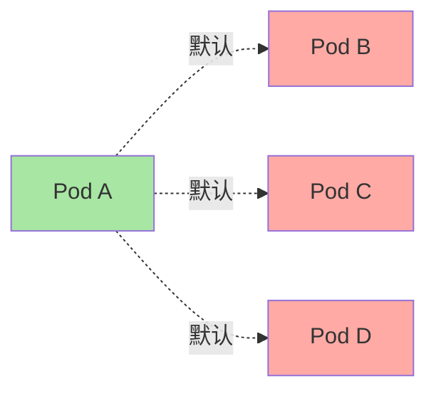
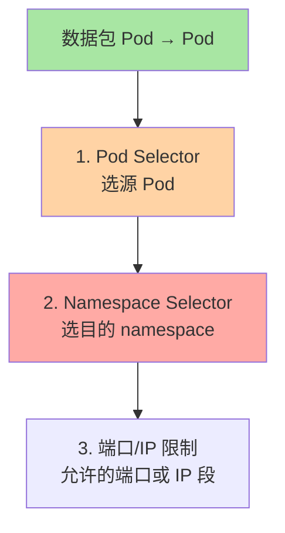
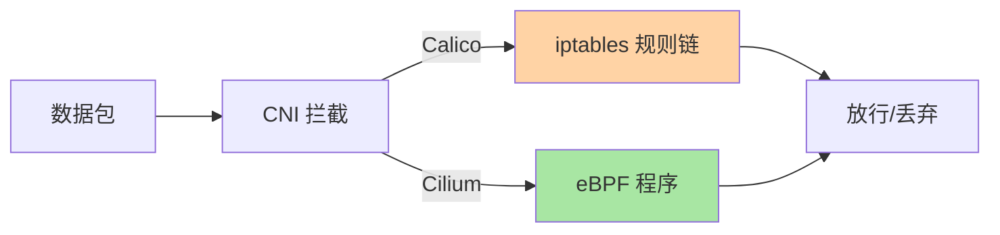
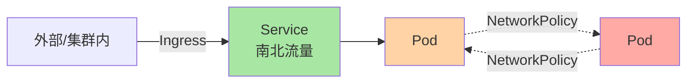
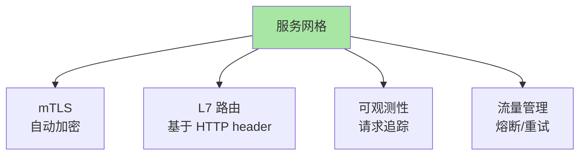
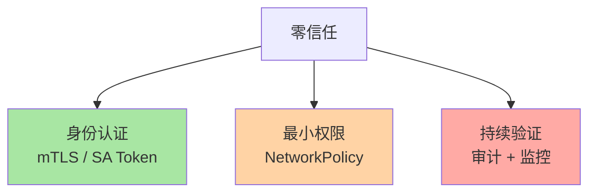

# Network Policy 与零信任网络：东西流量的边界控制

> K8s 默认网络是「平铺」——所有 Pod 能访问所有 Pod。生产环境需要「A 应用能访问 DB，B 应用不能访问」——这就是 NetworkPolicy。本篇讲清 NetworkPolicy 的机制、CNI 实现差异、与服务网格的边界。

## 一句话摘要

NetworkPolicy 通过「Pod Selector + Namespace Selector + 端口/IP 限制」控制东西流量（Pod 间）；需 CNI 插件实现（Calico/Cilium/Weave）；与 Service（服务发现）、Ingress（南北流量）职责分明；零信任网络靠 NetworkPolicy + mTLS + 服务网格协同实现。

## 一、为什么需要 NetworkPolicy

### 1.1 K8s 默认网络



**关键认知**：K8s 默认「所有 Pod 可互通」——这是扁平网络的设计。

### 1.2 真实风险

```
攻击场景：
  - 攻击者控制了一个 Pod
  - 默认可以访问所有 namespace 的所有 Pod
  - 可读 Secret、调 API、横向移动
```

**NetworkPolicy 解决**：在「扁平网络」之上加「逻辑边界」。

## 二、NetworkPolicy 机制

### 2.1 三层过滤



### 2.2 最小示例

```yaml
apiVersion: networking.k8s.io/v1
kind: NetworkPolicy
metadata:
  name: db-isolation
  namespace: app
spec:
  podSelector:
    matchLabels:
      app: db
  policyTypes:
  - Ingress
  - Egress
  ingress:
  - from:
    - podSelector:
        matchLabels:
          app: web
    ports:
    - protocol: TCP
      port: 5432              # 只允许 web Pod 访问 db 的 5432
  egress:
  - to:
    - namespaceSelector:
        matchLabels:
          name: kube-system   # 允许访问 kube-system（DNS）
    ports:
    - protocol: UDP
      port: 53
```

**含义**：
- `app=db` 的 Pod
- 只接受 `app=web` 的 Pod 访问 5432 端口
- 可以访问 kube-system 的 53 端口（DNS）

### 2.3 三种 policyTypes

| policyType | 含义 |
|---|---|
| `Ingress` | 控制入站（谁来访问我） |
| `Egress` | 控制出站（我能访问谁） |
| `Ingress + Egress` | 双向控制 |

**关键认知**：没列出的方向默认**全部允许**——NetworkPolicy 是「白名单」不是「黑名单」。

### 2.4 双向控制：默认拒绝

```yaml
# 默认拒绝所有流量（应用「白名单」原则）
apiVersion: networking.k8s.io/v1
kind: NetworkPolicy
metadata:
  name: default-deny-all
  namespace: app
spec:
  podSelector: {}             # 所有 Pod
  policyTypes:
  - Ingress
  - Egress
  # ingress / egress 为空 = 默认拒绝
```

**生产推荐**：先 default deny，再按需放行。

## 三、CNI 实现差异

### 3.1 不同 CNI 的支持

| CNI | NetworkPolicy 支持 | 实现机制 |
|---|---|---|
| **Calico** | ✅ 完整 | iptables / eBPF |
| **Cilium** | ✅ 完整 + 扩展 | eBPF |
| **Weave Net** | ✅ 基础 | Weave 内核模块 |
| **Flannel** | ❌ 不支持 | VXLAN only |
| **AWS VPC CNI** | ✅ 基础 | 安全组 |

**关键认知**：**Flannel 不支持 NetworkPolicy**——这是 Flannel 的硬伤，生产慎用。

### 3.2 Calico vs Cilium



**Cilium 优势**：
- eBPF 内核态处理（性能高）
- 支持 L7 NetworkPolicy（基于 HTTP path 过滤）
- 内置可观测性（Hubble）

## 四、与 Service 的边界



| 维度 | Service | NetworkPolicy |
|---|---|---|
| **方向** | 南北（外部→Pod） | 东西（Pod↔Pod） |
| **作用** | 服务发现 + 负载均衡 | 流量隔离 + 安全 |
| **实现** | kube-proxy / iptables | CNI 插件 |
| **默认** | 启用 | 不启用（需显式配置） |

**典型架构**：
- Ingress 处理外部请求（南北）
- Service 路由到 Pod（内部负载均衡）
- NetworkPolicy 控制 Pod 间流量（东西隔离）

## 五、与服务网格的边界

### 5.1 服务网格能做什么



### 5.2 与 NetworkPolicy 的对比

| 能力 | NetworkPolicy | 服务网格 |
|---|---|---|
| L3/L4 网络隔离 | ✅ | ✅ |
| L7 HTTP 路由 | ❌ | ✅ |
| mTLS | ❌ | ✅ |
| 流量管理（熔断/重试） | ❌ | ✅ |
| 性能开销 | 低 | 中（sidecar） |
| 复杂度 | 低 | 高 |

**推荐组合**：
- **简单场景**：NetworkPolicy（够用）
- **金融/合规**：NetworkPolicy + 服务网格（mTLS 必须）

## 六、零信任网络架构

### 6.1 零信任三件套



### 6.2 实施步骤

**Step 1: 默认拒绝**

```yaml
# 1.1 集群级默认拒绝
apiVersion: networking.k8s.io/v1
kind: NetworkPolicy
metadata:
  name: default-deny-all
  namespace: kube-system
spec:
  podSelector: {}
  policyTypes: [Ingress, Egress]
```

**Step 2: 按需放行**

```yaml
# 2.1 允许 Prometheus 抓取所有 Pod
apiVersion: networking.k8s.io/v1
kind: NetworkPolicy
metadata:
  name: allow-prometheus
  namespace: monitoring
spec:
  podSelector: {matchLabels: {app: prometheus}}
  policyTypes: [Egress]
  egress:
  - to:
    - namespaceSelector: {}    # 所有 namespace
    ports:
    - port: 9090               # metrics 端口
```

**Step 3: mTLS**

```yaml
# Istio 自动注入 mTLS
apiVersion: security.istio.io/v1beta1
kind: PeerAuthentication
metadata:
  name: default
  namespace: istio-system
spec:
  mtls:
    mode: STRICT                # 强制 mTLS
```

## 七、典型场景

### 7.1 数据库隔离

```yaml
# DB 只接受同 namespace 应用访问
apiVersion: networking.k8s.io/v1
kind: NetworkPolicy
metadata:
  name: postgres-isolation
  namespace: prod
spec:
  podSelector:
    matchLabels: { app: postgres }
  policyTypes: [Ingress]
  ingress:
  - from:
    - podSelector:
        matchLabels: { tier: backend }
    ports:
    - port: 5432
```

### 7.2 多租户隔离

```yaml
# team-a namespace 完全隔离
apiVersion: networking.k8s.io/v1
kind: NetworkPolicy
metadata:
  name: team-a-isolation
  namespace: team-a
spec:
  podSelector: {}
  policyTypes: [Ingress, Egress]
  ingress:
  - from:
    - namespaceSelector:
        matchLabels: { name: team-a }    # 只允许 team-a 内部
    - namespaceSelector:
        matchLabels: { name: ingress }   # 允许 ingress 命名空间
  egress:
  - to:
    - namespaceSelector:
        matchLabels: { name: team-a }
    - namespaceSelector:
        matchLabels: { name: kube-system }  # DNS
```

### 7.3 L7 策略（Cilium）

```yaml
# Cilium 扩展：基于 HTTP path 过滤
apiVersion: cilium.io/v2
kind: CiliumNetworkPolicy
metadata:
  name: l7-policy
spec:
  endpointSelector:
    matchLabels: { app: api }
  ingress:
  - fromEndpoints:
    - matchLabels: { app: web }
    toPorts:
    - ports:
      - port: "80"
        protocol: TCP
      rules:
        http:
        - method: "GET"
          path: "/api/v1/.*"
```

## 八、自测三问

1. **NetworkPolicy 没列出的流量默认怎样？**
   - 默认**允许**——NetworkPolicy 是「白名单」。必须显式禁止才不互通。

2. **Flannel 为什么不能用 NetworkPolicy？**
   - Flannel 只做 VXLAN overlay，没有流量过滤能力。生产推荐用 Calico/Cilium（支持 NetworkPolicy）。

3. **NetworkPolicy 和服务网格能互相替代吗？**
   - 不能完全替代——NetworkPolicy 主管 L3/L4 网络隔离；服务网格主管 mTLS/L7 路由/流量管理。生产常组合使用。

## 📌 数据与事实声明

- 写于 2026-09-07，针对 K8s 1.30+
- NetworkPolicy API GA：K8s 1.8
- Cilium 当前版本：1.15+
- Calico 当前版本：v3.27+
- 行业认知：Cilium 是 K8s CNI 新主流（eBPF 性能优势，公开报道）
- 免责：CNI 插件演进快，具体 NetworkPolicy 支持度以插件版本为准

## 📚 参考资料

| 类型 | 标题 | 来源 |
|---|---|---|
| 官方文档 | Network Policies | kubernetes.io/docs/concepts/services-networking/network-policies/ |
| Cilium 文档 | Network Policy | docs.cilium.io/en/stable/security/policy/ |
| Calico 文档 | Network Policy | docs.tigera.io/calico/latest/network-policy/ |
| 实战 | Zero Trust Networking | kubernetes.io/docs/concepts/security/security-checklist/ |
| 实战 | Pod-to-Pod Encryption | istio.io/latest/docs/concepts/security/ |
