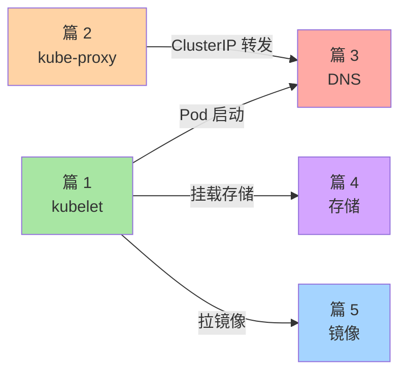

# 核心运行机制子系列导读：kubelet / kube-proxy / DNS / 存储

> L2 特性层子系列 C 导读。讲清 5 篇节点侧运行机制、与子系列 A/B 的关系。

## 一、这个子系列讲什么

调度子系统（A 系列）决定「Pod 落到哪个节点」，抽象层（B 系列）决定「K8s 怎么管状态」，本系列讲**节点侧执行**——Pod 落到节点后真正发生了什么：

```
篇 1  kubelet 与 Pod 启动流程       ← 节点代理：Pod 在节点上的生命周期
篇 2  kube-proxy 与 Service 实现     ← 节点网络：ClusterIP 转发怎么落地
篇 3  DNS（CoreDNS / NodeLocal）     ← 集群 DNS：服务发现怎么解析
篇 4  K8s 存储：PV/PVC/StorageClass  ← 数据持久化：卷怎么挂载
篇 5  镜像仓库与供应链安全           ← 镜像层：从哪拉、怎么验证
```

## 二、5 篇逻辑关系



## 三、与子系列 A/B 的关系

| 子系列 A（调度） | 子系列 C（本系列） |
|---|---|
| 篇 1 Scheduler | → 篇 1 kubelet（调度结果由 kubelet 执行） |
| 篇 4 Pod 生命周期 | → 篇 1 kubelet（深挖每个阶段的执行者） |

| 子系列 B（抽象） | 子系列 C（本系列） |
|---|---|
| 篇 2 API Server | → 篇 1 kubelet（kubelet 通过 API Server watch Pod） |
| 篇 5 NetworkPolicy | → 篇 2 kube-proxy（NetworkPolicy 由 CNI 实现） |

## 四、读完后你能做什么

- ✅ 排障「Pod 卡在 ContainerCreating」
- ✅ 配置 CoreDNS / NodeLocal DNSCache 优化 DNS 性能
- ✅ 理解 PV/PVC 动态供给流程
- ✅ 配置镜像拉取策略 + 私有仓库认证
- ✅ 选型 CSI 驱动（云厂商 vs 自建）

## 📌 数据与事实声明

- 写于 2026-09-07，针对 K8s 1.30+
- kubelet 当前版本：v1.30.x
- CoreDNS 当前版本：v1.11+
- 免责：CSI 驱动支持度因云厂商而异

## 📚 参考资料

| 类型 | 标题 | 来源 |
|---|---|---|
| 官方文档 | kubelet | kubernetes.io/docs/reference/command-line-tools-reference/kubelet/ |
| 系列 index | `docs/devops/kubernetes/特性层/深入理解K8s核心特性系列/` | 本仓库 |
