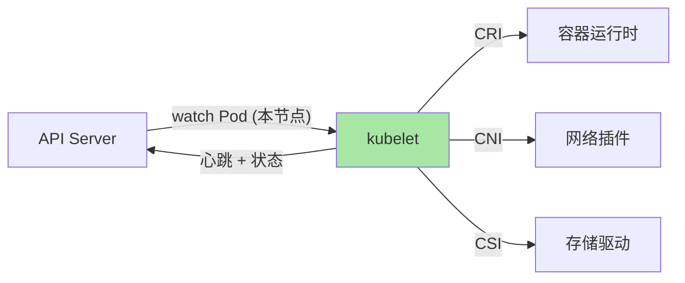
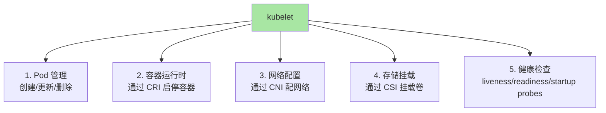
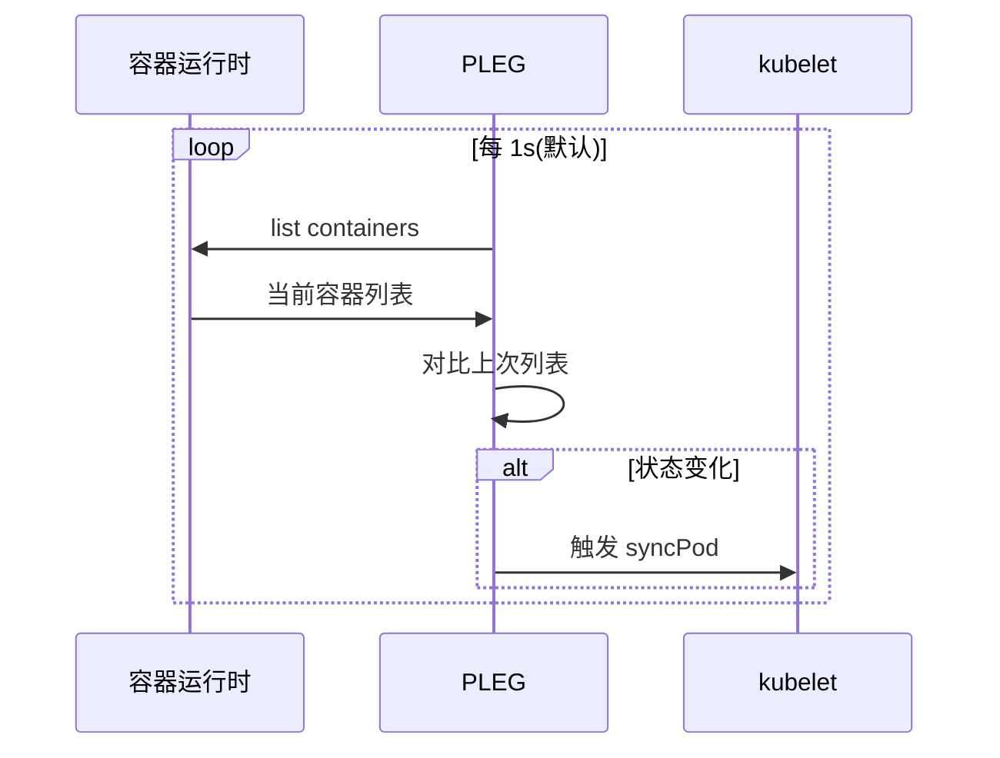
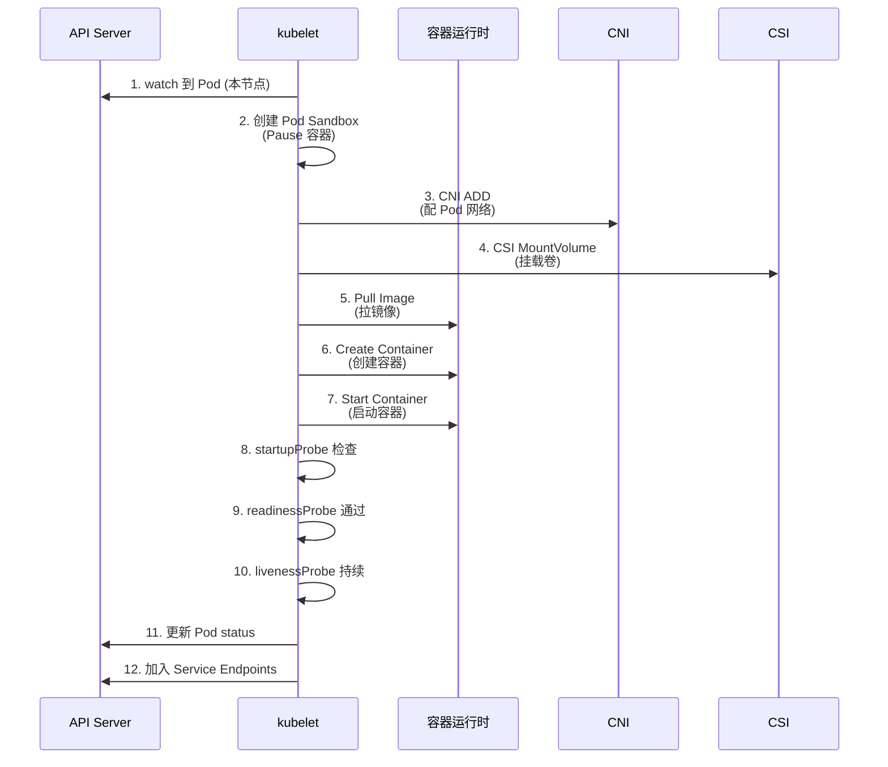
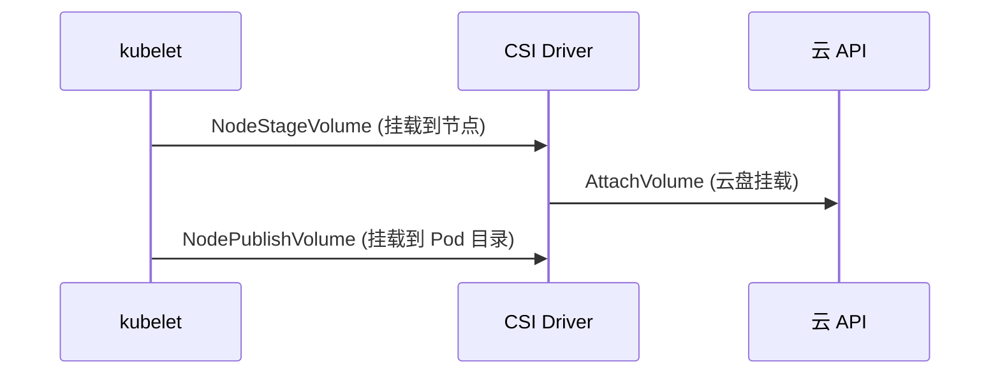

# kubelet 与 Pod 启动流程：节点代理的执行真相

> kubelet 是 K8s 节点的「代理」——它负责 watch 本节点 Pod、调用 CRI 启动容器、回报状态。本篇讲清 kubelet 的工作机制、Pod 启动的 12 个步骤、常见排障路径。

## 一句话摘要

kubelet 是 K8s 节点代理，通过 watch API Server 拿本节点 Pod，调用 CRI 启动容器，调用 CNI 配置网络，调用 CSI 挂载卷；Pod 启动失败最常见原因：镜像拉取失败、卷挂载失败、CNI 配置失败、运行时异常。

## 一、为什么需要理解 kubelet

### 1.1 kubelet 的角色



**关键认知**：kubelet 是 K8s 节点的「全能管家」——管理容器、网络、存储、状态上报。

### 1.2 kubelet 不做的

- ❌ 不调度 Pod（scheduler 干）
- ❌ 不写 etcd（API Server 干）
- ❌ 不跨节点通信（节点间通过 API Server 间接通信）

## 二、kubelet 核心机制

### 2.1 kubelet 的 5 大职责



### 2.2 kubelet 注册与心跳

```bash
# kubelet 启动时
kubelet --kubeconfig=/etc/kubernetes/kubelet.conf \
        --config=/etc/kubernetes/kubelet-config.yaml

# kubelet 第一件事：向 API Server 注册本节点
# Node 对象被创建/更新
kubectl get node node-1 -o yaml
```

**心跳机制**：
- kubelet 默认每 10s 向 API Server 发心跳
- 节点状态 `Ready` 在 40s 内更新（默认 `node-status-update-frequency`）
- 节点控制器（Node Controller）40s 内未收到心跳 → 标记 `NotReady`
- 5min 未收到 → 驱逐 Pod

### 2.3 PLEG（Pod Lifecycle Event Generator）



**PLEG 的作用**：把「容器运行时的轮询」转为「事件驱动」——避免 kubelet 频繁 list 容器。

## 三、Pod 启动的 12 个步骤



### 3.1 步骤 1-2：Pod Sandbox

kubelet 收到 Pod → 创建 Pause 容器（持有 net ns）——这是 Pod 共享网络的「锚点」。

### 3.2 步骤 3：CNI ADD

kubelet 调 CNI 插件（如 Calico/Cilium），告诉它 Pod 的网络配置需求：

```json
{
  "type": "calico",
  "container_id": "...",
  "network": "calico",
  "ifname": "eth0",
  "ip": "10.244.1.5/32",
  "dns": {}
}
```

**常见失败**：CNI 插件未安装、CNI 配置错误、IP 池耗尽。

### 3.3 步骤 4：CSI MountVolume



**常见失败**：CSI Driver 未安装、PVC 未绑定、云盘 IO 错误。

### 3.4 步骤 5-7：镜像拉取与容器启动

```bash
# 镜像拉取策略
imagePullPolicy:
  - Always       # 每次都拉（默认 if tag=latest）
  - IfNotPresent # 本地有就用本地（默认 if tag 是固定版本）
  - Never        # 不拉，只用本地
```

**常见失败**：镜像不存在、registry 认证失败、镜像拉取超时。

## 四、源码关键路径

```
k8s.io/kubernetes/pkg/kubelet/
├── kubelet.go                   # 主入口
├── pod_workers.go               # Pod 同步
├── kuberuntime/                 # CRI 实现（通用）
│   ├── kuberuntime_manager.go   # 容器生命周期
│   └── ...
├── pleg/                        # Pod Lifecycle Event Generator
├── prober/                      # 健康检查
└── volumemanager/               # 卷管理
```

**核心调用栈**：

```
API Server watch → PodWorker.syncPod →
  PodSandbox 创建 →
  CNI ADD →
  CSI MountVolume →
  Image Pull →
  Container Create →
  Container Start →
  Probe Loop
```

## 五、典型场景

### 5.1 Pod 卡在 ContainerCreating

```bash
# 1. 看 Events
kubectl describe pod my-pod | grep -A 10 Events

# 常见错误：
# - Failed to pull image: ...
# - FailedMount: ... volume mount failed
# - network plugin not ready: CNI 异常
```

**按错误类型排查**：

| 错误 | 排查 |
|---|---|
| Failed to pull image | 镜像是否存在 / registry 认证 |
| FailedMount | CSI Driver / PVC 状态 / 云盘 IO |
| network plugin not ready | CNI 插件 / 节点网络 |
| container has runAsNonRoot | securityContext 配置 |

### 5.2 kubelet 日志

```bash
# systemd 服务
journalctl -u kubelet -f

# 容器化部署
kubectl logs -n kube-system kube-proxy-xxx
kubectl logs -n kube-system <node-name>

# 关键日志级别
--v=4    # 调度/Pod 同步级别
--v=6    # 容器运行时级别
```

### 5.3 kubelet 性能调优

```yaml
# kubelet flags
--max-pods=110                  # 单节点最大 Pod 数
--eviction-hard=memory.available<500Mi  # 驱逐阈值
--image-gc-high-threshold=85    # 镜像 GC 高水位
--image-gc-low-threshold=80     # 镜像 GC 低水位
--kube-reserved=cpu=500m,memory=1Gi  # 系统保留
--system-reserved=cpu=500m,memory=1Gi
```

## 六、常见误区

### 6.1 「kubelet 调度 Pod」

不对。kubelet 接收**已经调度的** Pod，不参与调度决策。Scheduler 决定落到哪个节点，kubelet 负责在节点上启动。

### 6.2 「Pod 启动慢是 kubelet 的问题」

不一定。Pod 启动慢可能是：
- 镜像拉取慢（registry 网络）
- 卷挂载慢（CSI Driver）
- CNI 配置慢（IP 分配）
- 容器启动慢（应用 readinessProbe）

### 6.3 「kubelet 删了 Pod 就完事」

不对。kubelet 删 Pod 时按「优雅退出」流程：SIGTERM → 等 30s → SIGKILL。

## 七、自测三问

1. **kubelet 调用的三大接口是什么？**
   - CRI（容器运行时）+ CNI（网络）+ CSI（存储）——kubelet 是 K8s 在节点上的「全能管家」。

2. **PLEG 解决什么问题？**
   - 把「容器运行时的轮询」转为「事件驱动」——kubelet 不再需要频繁 list 容器，PLEG 检测变化后触发 syncPod。

3. **Pod 启动卡在 ContainerCreating 最常见原因？**
   - 镜像拉取失败、卷挂载失败、CNI 配置失败、运行时异常——用 `kubectl describe pod` 看 Events 即可定位。

## 📌 数据与事实声明

- 写于 2026-09-07，针对 K8s 1.30+
- kubelet 默认心跳：10s
- 节点 NotReady 阈值：40s（node-status-update-frequency × 4）
- 节点驱逐阈值：5min
- PLEG relist 周期：1s（默认）
- 行业认知：节点维护时 kubelet 重启是常见操作（公开讨论）
- 免责：kubelet flags 演进中

## 📚 参考资料

| 类型 | 标题 | 来源 |
|---|---|---|
| 官方文档 | kubelet | kubernetes.io/docs/reference/command-line-tools-reference/kubelet/ |
| 官方文档 | Node | kubernetes.io/docs/concepts/architecture/nodes/ |
| 官方源码 | kubelet | github.com/kubernetes/kubernetes/tree/master/pkg/kubelet |
| 实战 | Troubleshooting Nodes | kubernetes.io/docs/tasks/debug/debug-cluster/ |
| 实战 | kubelet Configuration | kubernetes.io/docs/tasks/administer-cluster/kubelet-config-file/ |
