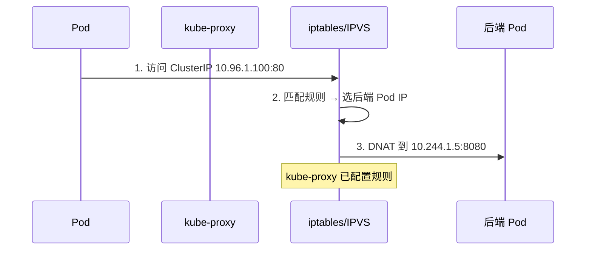
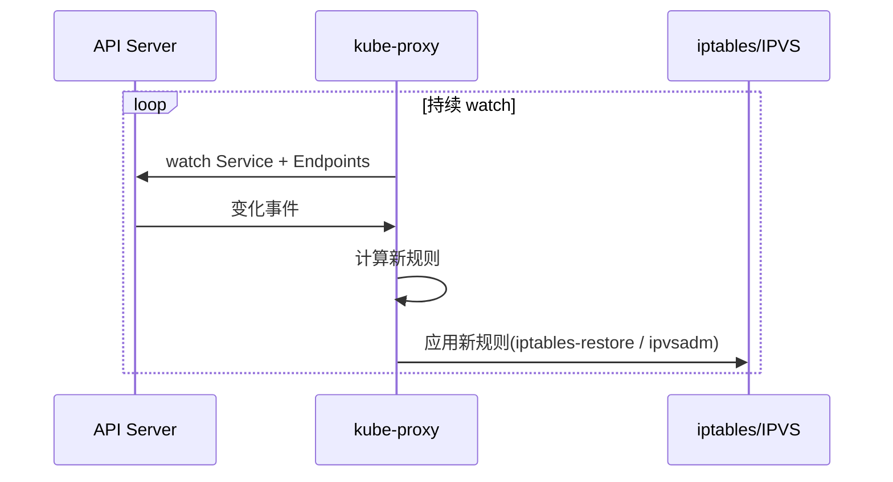
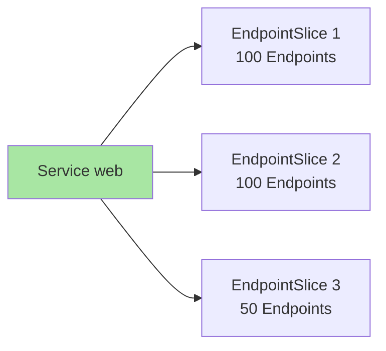

# kube-proxy 与 Service 实现：虚拟 IP 转发的真相

> Service ClusterIP 是「虚拟 IP」——不绑定任何网卡。客户端访问 ClusterIP 时，真正「接管」流量的是每个节点上的 kube-proxy。本篇讲清 ClusterIP 怎么转发到 Pod、两种实现模式（iptables/IPVS）的差异、性能调优。

## 一句话摘要

kube-proxy 在每个节点监听 API Server 的 Service/Endpoints 变化，通过 iptables 规则或 IPVS 规则把 ClusterIP 流量转发到后端 Pod；默认模式 iptables，大集群推荐 IPVS。

## 一、为什么需要 kube-proxy

### 1.1 ClusterIP 的「虚拟」本质

```bash
# Service 的 ClusterIP
kubectl get svc web
# NAME   TYPE        CLUSTER-IP    EXTERNAL-IP   PORT(S)
# web    ClusterIP   10.96.1.100   <none>        80/TCP

# 在节点上检查
ip addr show
# 没有 10.96.1.100 这个 IP —— 它是「虚拟」的
```

**关键认知**：ClusterIP 不绑定任何网卡——它是「逻辑地址」。

### 1.2 流量怎么转发



## 二、两种实现模式

### 2.1 iptables 模式（默认）

```bash
# kube-proxy flags
--proxy-mode=iptables    # 默认
```


**特点**：
- 每个 Service 创建一组 iptables 规则
- 每个 Endpoints 对应一条 KUBE-SEP 链
- 负载均衡用 iptables 的 `--probability` 实现随机选

### 2.2 IPVS 模式（推荐大集群）

```bash
# kube-proxy flags
--proxy-mode=ipvs
--ipvs-scheduler=rr       # 调度算法：rr / lc / dh / sh / sed / nq
```


**特点**：
- 用内核 LVS（IP Virtual Server）实现
- 哈希表查找（O(1)），性能远高于 iptables（O(n)）
- 支持更多调度算法（rr/lc/dh/sh/sed/nq）

### 2.3 性能对比

| Service 数 | iptables | IPVS |
|---|---|---|
| 100 | 几乎无影响 | 几乎无影响 |
| 1000 | 延迟 +0.5ms | 几乎无影响 |
| 10000 | 延迟 +5-10ms | 延迟 +0.1ms |
| 50000 | **不可用**（iptables 规则加载慢） | 延迟 +0.5ms |

**关键认知**：**大集群（> 1000 Service）必须用 IPVS**——iptables 模式会成为性能瓶颈。

## 三、kube-proxy 工作机制

### 3.1 监听 Service 和 Endpoints



### 3.2 Endpoints 与 EndpointSlice

K8s 1.21+ 引入了 **EndpointSlice**——把 Endpoints 拆成多个小对象（每个 100 个 Endpoints），减少 kube-proxy 的处理负担。



**推荐**：K8s 1.21+ 启用 EndpointSlice（默认启用）。

### 3.3 Session Affinity

```yaml
spec:
  sessionAffinity: ClientIP
  sessionAffinityConfig:
    clientIP:
      timeoutSeconds: 10800
```

**实现**：
- iptables：通过 conntrack 记录 client IP
- IPVS：通过持久连接（persistent connection）

## 四、性能调优

### 4.1 切换到 IPVS

```bash
# 1. 节点加载 IPVS 内核模块
modprobe ip_vs
modprobe ip_vs_rr
modprobe ip_vs_wrr
modprobe ip_vs_sh

# 2. kube-proxy 改 mode
--proxy-mode=ipvs
--ipvs-scheduler=rr
--ipvs-min-sync-period=5s
--ipvs-sync-period=30s
```

### 4.2 conntrack 调优

```bash
# kube-proxy flags
--conntrack-max-per-core=32768    # 每 CPU conntrack 表大小
--conntrack-tcp-timeout-established=86400    # 已建立连接超时
```

```bash
# 系统级 conntrack 调优
sysctl -w net.netfilter.nf_conntrack_max=262144
sysctl -w net.netfilter.nf_conntrack_tcp_timeout_established=86400
```

### 4.3 kube-proxy flags 调优

```yaml
# kube-proxy flags
--config-sync-period=30s           # 与 API Server 同步周期
--iptables-min-sync-period=5s      # iptables 规则最小同步周期
--iptables-sync-period=30s         # iptables 规则最大同步周期
--masquerade-all=true              # 所有流量 SNAT（性能损耗）
```

## 五、源码关键路径

```
k8s.io/kubernetes/pkg/proxy/
├── iptables/                  # iptables 模式
│   ├── proxier.go             # 规则生成
│   └── ...
├── ipvs/                     # IPVS 模式
│   ├── proxier.go             # IPVS 规则管理
│   └── ...
└── userspace/                # userspace 模式（已弃用）
```

**iptables 模式关键调用**：

```go
// 简化版 proxier.go
func (proxier *Proxier) syncService(svc *v1.Service, endpoints *v1.Endpoints) error {
    // 1. 生成 ClusterIP 规则
    proxier.writeServiceToIptables(svc)
    // 2. 生成 Endpoints 规则
    proxier.writeEndpointsToIptables(svc, endpoints)
    // 3. 应用规则
    proxier.iptables.Save()
}
```

## 六、典型场景

### 6.1 Service 不可达

```bash
# 1. 检查 Endpoints
kubectl get endpoints web

# 2. 检查 iptables 规则（iptables 模式）
iptables -t nat -L KUBE-SERVICES | head -20

# 3. 检查 IPVS 规则（IPVS 模式）
ipvsadm -L -n

# 4. 检查 conntrack
conntrack -L | grep 10.96.1.100
```

### 6.2 负载不均衡

```bash
# 1. 看 iptables 概率分布
iptables -t nat -L KUBE-SVC-XXX -v

# 2. 看 IPVS 调度
ipvsadm -L -n --stats
```

### 6.3 大集群 IPVS 切换

```bash
# 滚动升级时，先在测试节点验证
kubectl -n kube-system edit ds kube-proxy
# 加 flags --proxy-mode=ipvs

# 验证
curl http://web.default.svc.cluster.local   # 应正常返回
ipvsadm -L -n | grep <ClusterIP>
```

## 七、自测三问

1. **ClusterIP 是真实 IP 吗？**
   - 不是。是「虚拟 IP」——不绑定网卡，靠 kube-proxy 在节点上配置转发规则（iptables 或 IPVS）。

2. **iptables 模式和 IPVS 模式的本质区别？**
   - iptables：每个 Service 一组规则，O(n) 链查找，性能随 Service 数线性下降；IPVS：内核 LVS 哈希表，O(1) 查找，性能与 Service 数无关。

3. **大集群为什么推荐 IPVS？**
   - iptables 在 Service 数 > 10000 时规则加载慢、转发延迟显著；IPVS 用内核 LVS，性能稳定。

## 📌 数据与事实声明

- 写于 2026-09-07，针对 K8s 1.30+
- kube-proxy 默认模式：iptables（K8s 1.30）
- IPVS 模式需内核模块：ip_vs / ip_vs_rr / ip_vs_wrr / ip_vs_sh
- EndpointSlice GA：K8s 1.21
- userspace 模式：已弃用（K8s 1.2+）
- 行业认知：生产集群 > 500 Service 推荐 IPVS（公开讨论）
- 免责：kube-proxy flags 演进中

## 📚 参考资料

| 类型 | 标题 | 来源 |
|---|---|---|
| 官方文档 | kube-proxy | kubernetes.io/docs/concepts/overview/components/#kube-proxy |
| 官方文档 | Service | kubernetes.io/docs/concepts/services-networking/service/ |
| 官方文档 | EndpointSlice | kubernetes.io/docs/concepts/services-networking/endpoint-slices/ |
| IPVS | LVS Wiki | linuxvirtualserver.org |
| 实战 | IPVS in-depth | kubernetes.io/blog/2019/ |
