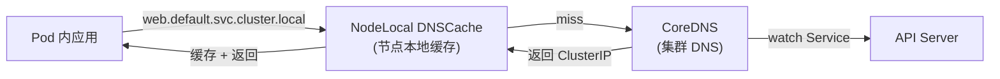
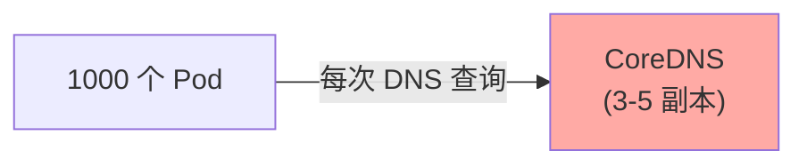
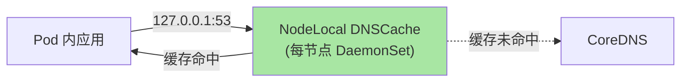

# DNS（CoreDNS / NodeLocal DNSCache）：服务发现的真相

> K8s 集群内服务发现靠 DNS——`web.default.svc.cluster.local` 解析到 ClusterIP。CoreDNS 是默认 DNS 服务器，NodeLocal DNSCache 是性能优化层。本篇讲清 DNS 工作原理、CoreDNS 调优、NodeLocal DNSCache 用法。

## 一句话摘要

CoreDNS 是 K8s 默认集群 DNS，自动为 Service 创建 A 记录；NodeLocal DNSCache 在每个节点跑 DNS 缓存，减少 CoreDNS 压力；DNS 是 K8s 服务发现的核心组件——所有 Pod 都依赖它。

## 一、为什么 DNS 是 K8s 的核心

### 1.1 Pod 怎么找到其他服务

```bash
# 在 Pod 内
curl http://web.default.svc.cluster.local   # 跨 namespace
curl http://web                              # 同 namespace
```

Pod 用 DNS 名字而不是 ClusterIP 访问服务——**DNS 让服务位置解耦**。

### 1.2 DNS 在 K8s 中的位置



## 二、CoreDNS 工作机制

### 2.1 CorePlugin 链

```yaml
# Corefile 默认配置（K8s 1.30+）
apiVersion: v1
kind: ConfigMap
metadata:
  name: coredns
  namespace: kube-system
data:
  Corefile: |
    .:53 {
        errors
        health
        ready
        kubernetes cluster.local in-addr.arpa ip6.arpa {
            pods insecure
            fallthrough in-addr.arpa ip6.arpa
        }
        forward . /etc/resolv.conf
        cache 30
        loop
        reload
        loadbalance
    }
```

### 2.2 自动创建的 DNS 记录

```bash
# Service A 记录
web.default.svc.cluster.local → 10.96.1.100 (ClusterIP)

# Pod A 记录（如果开启 pods）
10-244-1-5.default.pod.cluster.local → 10.244.1.5

# SRV 记录
_http._tcp.web.default.svc.cluster.local → port 80
```

### 2.3 DNS 搜索域

```yaml
# Pod 内 /etc/resolv.conf
search default.svc.cluster.local svc.cluster.local cluster.local
nameserver 10.96.0.10   # CoreDNS Service IP
```

**含义**：
- `web` → `web.default.svc.cluster.local` → `web.svc.cluster.local` → `web.cluster.local`
- `web` 在 `default` namespace 内 → 解析为 `web.default.svc.cluster.local`

## 三、NodeLocal DNSCache

### 3.1 为什么需要



**问题**：
- 1000 Pod × 每秒 N 查询 = CoreDNS 压力大
- 跨节点 DNS 查询延迟高
- conntrack 抖动（iptables conntrack 对 UDP 53 处理不友好）

### 3.2 NodeLocal DNSCache 解法



**优势**：
- DNS 查询延迟从「跨节点 ~ms 级」降到「本地 ~μs 级」
- 减少 CoreDNS 压力
- 绕过 conntrack 抖动

### 3.3 部署 NodeLocal DNSCache

```bash
# 1. 应用 manifest
kubectl apply -f https://k8s.io/examples/admin/dns/node-local-dns.yaml

# 2. Pod /etc/resolv.conf 改为 169.254.20.10
# （NodeLocal DNSCache 的 LinkLocal 地址）
```

```yaml
# 关键 manifest 片段
spec:
  hostNetwork: true            # 用宿主机网络
  dnsPolicy: Default           # 用宿主机 DNS
  containers:
  - name: node-cache
    args:
    - "-localip"
    - "169.254.20.10"          # LinkLocal 地址
    - "-conf"
    - "/etc/Corefile.template"
```

## 四、CoreDNS 调优

### 4.1 副本数与资源

```yaml
spec:
  replicas: 3                   # 至少 2 副本，推荐 3（容忍 1 节点故障）
  resources:
    requests:
      cpu: 100m
      memory: 128Mi
    limits:
      cpu: 1000m                # DNS 占用高可能影响 CoreDNS
      memory: 1Gi
```

### 4.2 缓存配置

```yaml
# Corefile
cache 30                       # 缓存 30 秒（默认）
# 大集群可以延长
cache 300                      # 减少 CoreDNS 压力
```

### 4.3 健康检查与就绪

```yaml
# Corefile
health {
    lameduck 5s                 # 故障后 5s 才摘流量
}
ready
```

### 4.4 监控指标

```txt
# CoreDNS 请求数
coredns_dns_requests_total

# 缓存命中率
sum(rate(coredns_cache_hits_total[5m])) / 
  sum(rate(coredns_dns_requests_total[5m]))

# 99% 延迟
histogram_quantile(0.99, coredns_dns_request_duration_seconds_bucket)
```

## 五、典型场景

### 5.1 DNS 查询慢

```bash
# 1. 在 Pod 内测试
kubectl exec my-pod -- nslookup web.default.svc.cluster.local

# 2. 看耗时
kubectl exec my-pod -- time nslookup web.default.svc.cluster.local
# real    0m0.005s   # 5ms 在 NodeLocal DNSCache 下
# real    0m0.030s   # 30ms 直接打 CoreDNS

# 3. 看 CoreDNS 监控
kubectl top pod -n kube-system -l k8s-app=kube-dns
```

### 5.2 DNS 不通

```bash
# 1. 检查 CoreDNS Pod 状态
kubectl get pod -n kube-system -l k8s-app=kube-dns

# 2. 检查 Service
kubectl get svc -n kube-system kube-dns
# 应有 ClusterIP 10.96.0.10

# 3. 检查 Pod /etc/resolv.conf
kubectl exec my-pod -- cat /etc/resolv.conf
# nameserver 必须是 kube-dns Service IP 或 169.254.20.10（NodeLocal）
```

### 5.3 DNS 抖动（iptables conntrack）

```bash
# 现象：偶发 DNS 查询 5s+ 延迟
# 原因：UDP 53 查询被 conntrack 清理
# 解决：
# 1. 部署 NodeLocal DNSCache
# 2. 调 conntrack UDP 超时
sysctl -w net.netfilter.nf_conntrack_udp_timeout=60
sysctl -w net.netfilter.nf_conntrack_udp_timeout_stream=180
```

## 六、与其他组件的边界

| 组件 | 角色 | 与 DNS 的关系 |
|---|---|---|
| **Service** | 服务发现（IP 层） | DNS 把 Service 名字解析为 ClusterIP |
| **EndpointSlice** | 后端 Pod 列表 | DNS 解析时不直接涉及 |
| **kube-proxy** | ClusterIP 转发 | DNS 解析后的 IP 由 kube-proxy 转发到 Pod |
| **CNI** | Pod 网络 | DNS 查询走 CNI 网络 |

## 七、自测三问

1. **CoreDNS 自动创建的 DNS 记录格式是什么？**
   - `<svc-name>.<namespace>.svc.cluster.local` → ClusterIP。例如 `web.default.svc.cluster.local` → `10.96.1.100`。

2. **NodeLocal DNSCache 解决什么问题？**
   - 减少 CoreDNS 压力 + 降低 DNS 查询延迟 + 绕过 iptables conntrack 抖动。每节点一个缓存，Pod 走 127.0.0.1。

3. **CoreDNS 至少需要几个副本？**
   - 至少 2 个副本（容忍 1 节点故障）。生产推荐 3 副本——容忍 1 节点故障 + 还有 1 副本在滚动升级。

## 📌 数据与事实声明

- 写于 2026-09-07，针对 K8s 1.30+
- CoreDNS GA 替代 kube-dns：K8s 1.11（2018-09）
- NodeLocal DNSCache：K8s 1.18+ 推荐（公开讨论）
- CoreDNS 默认缓存：30s
- 行业认知：DNS 性能问题是 K8s 集群 TOP 3 性能问题（公开讨论）
- 免责：CoreDNS 配置演进中

## 📚 参考资料

| 类型 | 标题 | 来源 |
|---|---|---|
| 官方文档 | DNS for Services and Pods | kubernetes.io/docs/concepts/services-networking/dns-pod-service/ |
| 官方文档 | CoreDNS | coredns.io |
| 官方文档 | NodeLocal DNSCache | kubernetes.io/docs/tasks/administer-cluster/nodelocaldns/ |
| 实战 | Debugging DNS | kubernetes.io/docs/tasks/administer-cluster/dns-debugging-resolution/ |
