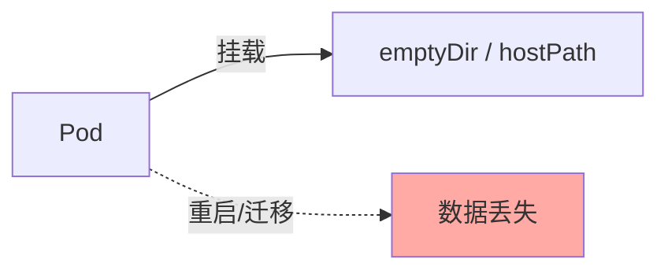
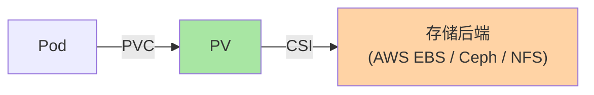
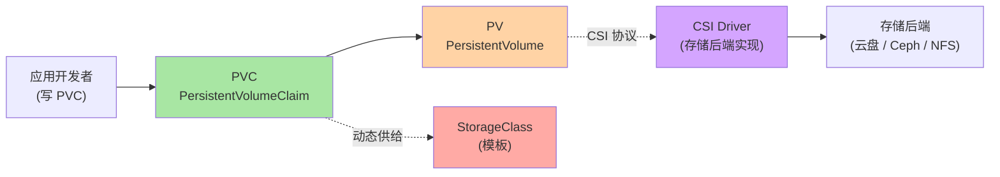
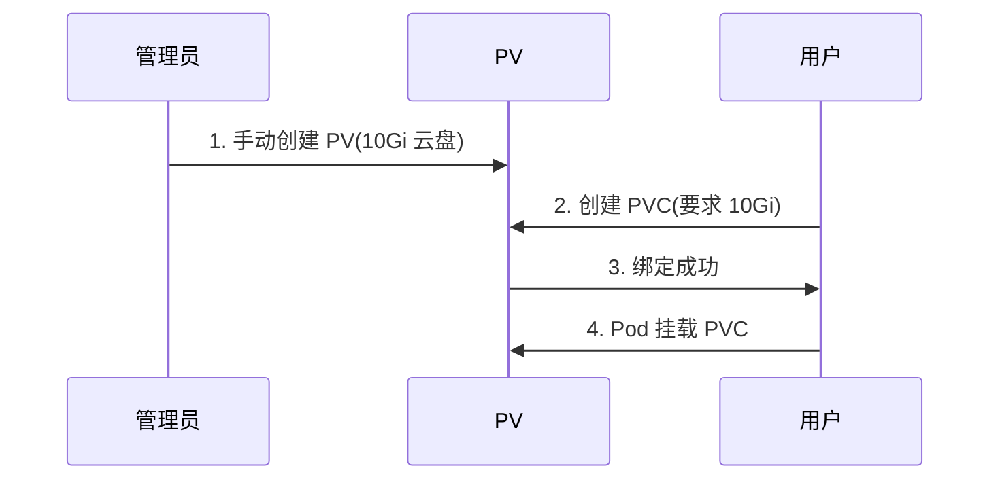
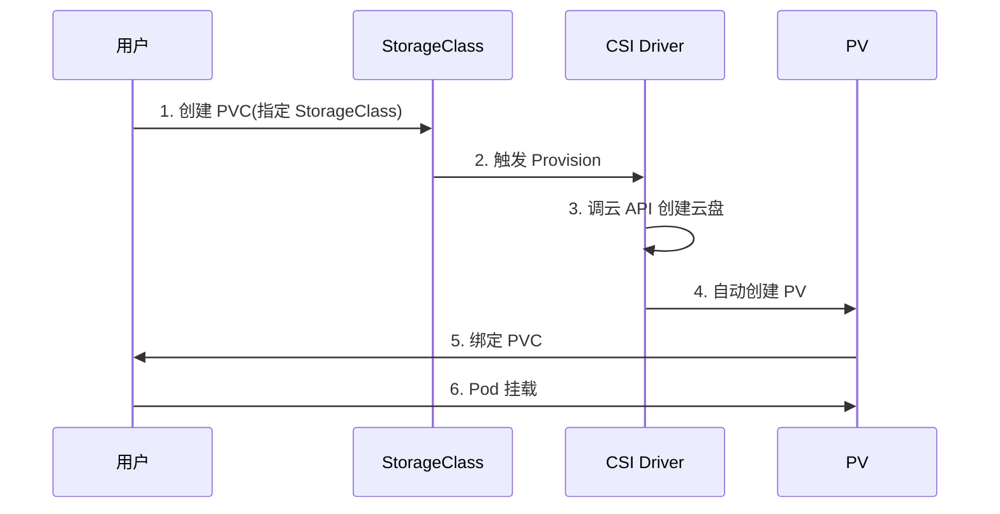
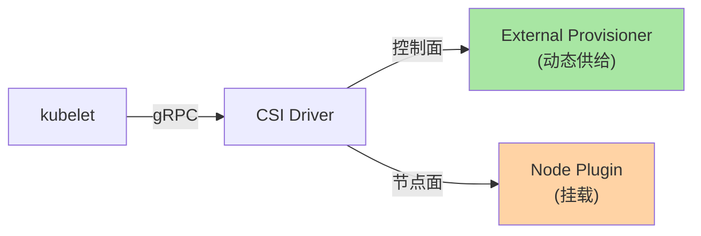
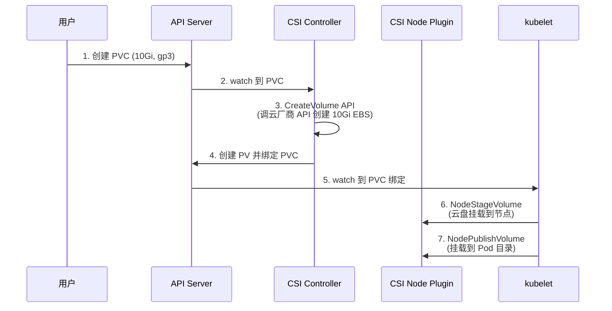

# K8s 存储子系统：PV / PVC / StorageClass / CSI

> 容器是「短暂」的——重启就丢数据。生产应用需要持久化存储。K8s 通过 PV/PVC/StorageClass 三层抽象 + CSI 标准，把存储从「Pod 内部」剥离到「集群级资源」。本篇讲清四层模型、CSI 工作机制、典型用法。

## 一句话摘要

K8s 存储分 4 层抽象——PV（集群资源）、PVC（应用需求）、StorageClass（供给模板）、CSI（驱动接口）；动态供给靠 StorageClass 自动创建 PV；CSI 驱动是 K8s 与存储后端的桥梁。

## 一、为什么需要独立存储抽象

### 1.1 Pod 的短暂性



**问题**：容器本质是无状态设计——重启就丢数据。

### 1.2 存储抽象的必要性



**关键认知**：
- Pod 只声明「我要多少存储」（PVC）
- PV 是「实际可用的存储资源」
- CSI 驱动负责「怎么把存储挂载到 Pod」

## 二、四层抽象

### 2.1 完整模型



### 2.2 各层职责

| 抽象 | 谁创建 | 含义 |
|---|---|---|
| **PV** | 管理员 / 自动 | 集群级存储资源（10Gi 云盘） |
| **PVC** | 应用开发者 | 存储需求声明（我要 10Gi） |
| **StorageClass** | 管理员 | 存储模板（动态供给规则） |
| **CSI Driver** | 管理员部署 | 存储后端实现 |

### 2.3 四种 accessModes

| 模式 | 缩写 | 含义 | 典型场景 |
|---|---|---|---|
| **ReadWriteOnce** | RWO | 单节点读写 | 数据库（块存储） |
| **ReadOnlyMany** | ROX | 多节点只读 | 静态资源（文件存储） |
| **ReadWriteMany** | RWX | 多节点读写 | 共享文件（NFS） |
| **ReadWriteOncePod** | RWOP | 单 Pod 读写 | K8s 1.22+ 严格模式 |

## 三、三种供给模式

### 3.1 静态供给（已存在 PV）



**适用**：固定容量、特殊配置（如已加密的 EBS）。

### 3.2 动态供给（StorageClass）



**适用**：云存储、通用需求——**生产主流**。

### 3.3 临时卷（emptyDir）

```yaml
spec:
  containers:
  - name: app
    volumeMounts:
    - name: cache
      mountPath: /cache
  volumes:
  - name: cache
    emptyDir: {}        # Pod 内部临时目录，Pod 删除时清理
```

**适用**：缓存、临时数据。

## 四、CSI 驱动机制

### 4.1 CSI 三组件



| 组件 | 角色 | 部署形态 |
|---|---|---|
| **External Provisioner** | 监听 PVC → 创建 PV | Deployment（控制面） |
| **External Attacher** | 把卷挂载到节点 | Deployment（控制面） |
| **Node Plugin** | 把卷挂载到 Pod 目录 | DaemonSet（每节点） |

### 4.2 CSI 工作流程



### 4.3 主流 CSI Driver

| CSI Driver | 存储类型 | 部署 |
|---|---|---|
| **aws-ebs-csi-driver** | AWS EBS（块） | k8s.io |
| **gcp-pd-csi-driver** | GCP PD（块） | k8s.io |
| **azure-disk-csi-driver** | Azure Disk（块） | k8s.io |
| **ceph-csi** | Ceph RBD / CephFS | ceph |
| **nfs-csi** | NFS | k8s-csi |
| **minio-csi** | MinIO S3 | minio |

## 五、典型配置

### 5.1 StorageClass（动态供给）

```yaml
apiVersion: storage.k8s.io/v1
kind: StorageClass
metadata:
  name: gp3
provisioner: ebs.csi.aws.com
parameters:
  type: gp3
  fsType: ext4
  iops: "3000"
  throughput: "125"
reclaimPolicy: Delete        # PV 释放时删除云盘
volumeBindingMode: WaitForFirstConsumer  # 等 Pod 调度再创建 PV（避免 zone 错配）
allowVolumeExpansion: true   # 允许扩容
```

### 5.2 PVC（开发者声明）

```yaml
apiVersion: v1
kind: PersistentVolumeClaim
metadata:
  name: app-data
spec:
  storageClassName: gp3
  accessModes:
  - ReadWriteOnce
  resources:
    requests:
      storage: 10Gi
```

### 5.3 Pod 使用

```yaml
spec:
  containers:
  - name: app
    volumeMounts:
    - name: data
      mountPath: /var/lib/app
  volumes:
  - name: data
    persistentVolumeClaim:
      claimName: app-data
```

## 六、有状态应用：StatefulSet

### 6.1 Deployment vs StatefulSet

| 维度 | Deployment | StatefulSet |
|---|---|---|
| Pod 命名 | 随机（web-abc123） | 固定（web-0, web-1） |
| 启动顺序 | 并行 | 顺序（0 → 1 → 2） |
| 存储 | 共享 PVC（所有人用同一卷） | 每个 Pod 独立 PVC |
| 典型场景 | 无状态 Web | 数据库 / 消息 |

### 6.2 StatefulSet 自动创建 PVC

```yaml
apiVersion: apps/v1
kind: StatefulSet
metadata:
  name: postgres
spec:
  serviceName: postgres
  replicas: 3
  template:
    spec:
      containers:
      - name: postgres
        volumeMounts:
        - name: data
          mountPath: /var/lib/postgresql/data
  volumeClaimTemplates:        # 关键：每个 Pod 自动创建 PVC
  - metadata:
      name: data
    spec:
      accessModes: [ReadWriteOnce]
      storageClassName: gp3
      resources:
        requests:
          storage: 100Gi
```

**效果**：
- Pod postgres-0 → PVC data-postgres-0 → PV → EBS 1
- Pod postgres-1 → PVC data-postgres-1 → PV → EBS 2
- Pod postgres-2 → PVC data-postgres-2 → PV → EBS 3

## 七、常见问题

### 7.1 PVC 一直 Pending

```bash
kubectl describe pvc app-data
# Events:
#   FailedBinding: no persistent volumes available for this claim
# 原因：
# 1. 没有匹配的 StorageClass
# 2. 没有静态 PV 满足要求
# 3. CSI Driver 未安装
```

### 7.2 PVC 绑定失败（zone 错配）

```bash
# 错误：
# FailedBinding: volume node affinity conflict
# 原因：EBS 在 us-east-1a，但 Pod 调度到 us-east-1b

# 解决：
# 1. volumeBindingMode: WaitForFirstConsumer（推荐）
# 2. Pod 加 zone 亲和性匹配 EBS
```

### 7.3 卷扩容失败

```bash
# 1. StorageClass 必须 allowVolumeExpansion: true
# 2. 扩容请求（K8s 1.11+）
kubectl edit pvc app-data
# spec.resources.requests.storage: 10Gi → 50Gi

# 注意：只能扩大不能缩小
```

## 八、自测三问

1. **PV 和 PVC 的本质区别？**
   - PV 是「集群资源」（管理员创建或自动创建）；PVC 是「应用需求」（开发者声明）。PVC 绑定到 PV。

2. **动态供给为什么需要 StorageClass？**
   - StorageClass 是「存储模板」——定义用哪个 CSI Driver、什么参数。PVC 指定 StorageClass 后，CSI 自动创建 PV。

3. **StatefulSet 怎么给每个 Pod 独立存储？**
   - 用 `volumeClaimTemplates`——每个 Pod 自动创建一个 PVC（Pod 序号作为 PVC 后缀），自动绑定独立 PV。

## 📌 数据与事实声明

- 写于 2026-09-07，针对 K8s 1.30+
- CSI GA：K8s 1.13（2019-12）
- in-tree volume plugin 移除：K8s 1.26（azure-disk/file, vsphere）、K8s 1.28（gce-pd）
- ReadWriteOncePod：K8s 1.22+ GA
- 行业认知：生产集群 90%+ 用云厂商 CSI（公开讨论）
- 免责：CSI 版本演进中

## 📚 参考资料

| 类型 | 标题 | 来源 |
|---|---|---|
| 官方文档 | Persistent Volumes | kubernetes.io/docs/concepts/storage/persistent-volumes/ |
| 官方文档 | Storage Classes | kubernetes.io/docs/concepts/storage/storage-classes/ |
| 官方文档 | CSI | kubernetes-csi.github.io/docs/ |
| 实战 | StatefulSet Basics | kubernetes.io/docs/tutorials/stateful-application/basic-stateful-set/ |
