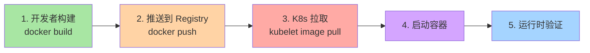
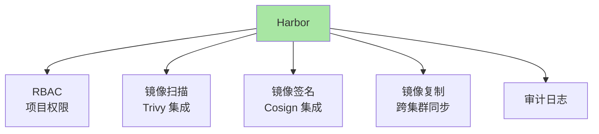
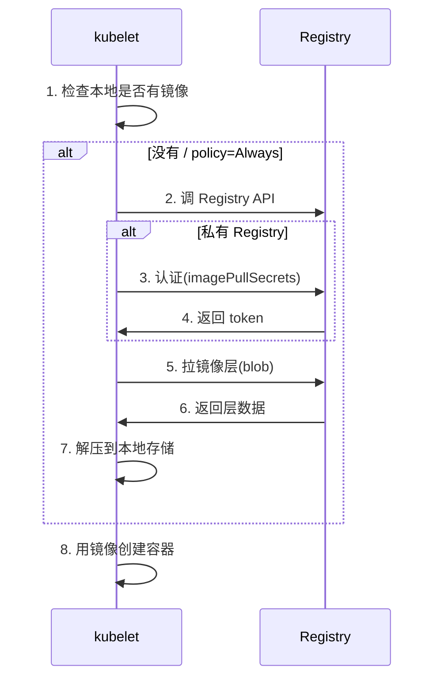
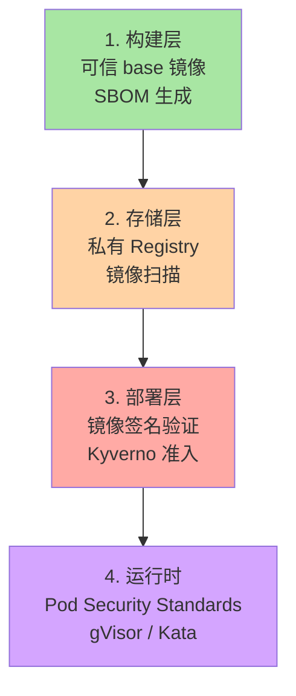
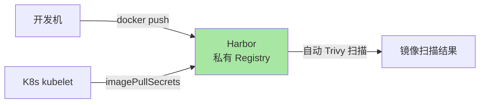
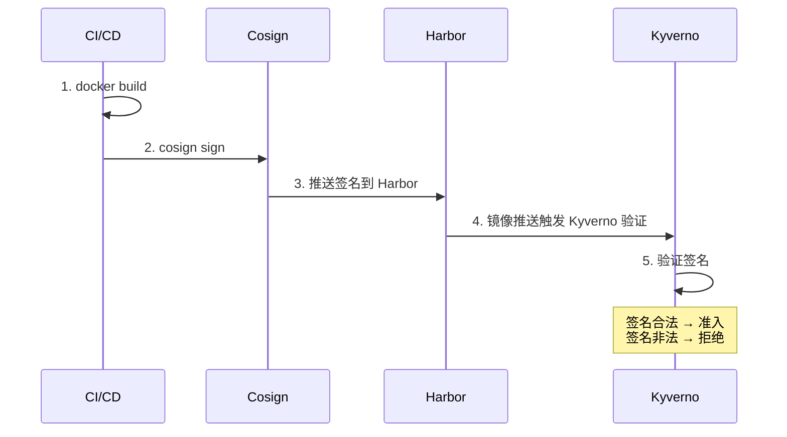

# 镜像仓库与供应链安全：从拉取到验证的完整链路

> K8s Pod 启动第一步是「拉镜像」——如果镜像被篡改/投毒，整个集群沦陷。本篇讲清镜像仓库分类、imagePullPolicy 机制、镜像签名（Cosign/Sigstore）、私有 registry 认证、典型安全实践。

## 一句话摘要

K8s 镜像供应链 = 「开发者构建镜像 + push 到 Registry + kubelet 拉镜像 + 验证签名」全链路；安全靠私有 Registry + 镜像签名（Cosign/Sigstore）+ 准入控制（Kyverno/OPA）+ 漏洞扫描（Trivy）四件套。

## 一、为什么需要理解镜像供应链

### 1.1 镜像投毒的真实风险

```
攻击场景：
  - 攻击者破解公开镜像的 Dockerfile
  - 注入恶意代码（如后门）
  - 镜像被全球 1000 个 K8s 集群拉取
  - 1000 个集群沦陷
```

**真实案例**：2020 年 SolarWinds 攻击、2021 年 Codecov 攻击、2024 年 xz-utils 投毒——都是供应链攻击。

### 1.2 镜像供应链的 5 个环节



**关键认知**：每一环都可能被攻击——防御要全链路。

## 二、镜像仓库分类

### 2.1 公共 vs 私有

| 类型 | 例子 | 适用 |
|---|---|---|
| **公共 Registry** | Docker Hub / Quay.io / ghcr.io | 开源镜像 |
| **云厂商 Registry** | AWS ECR / GCP GCR / 阿里云 ACR | 云上私有 |
| **自建 Registry** | Harbor / Distribution / Nexus | 金融/政府 |

### 2.2 Harbor 主流原因



**行业认知**：Harbor 是自建 Registry 的事实标准（公开讨论，CNCF 毕业）。

## 三、K8s 镜像拉取机制

### 3.1 imagePullPolicy 三档

```yaml
spec:
  containers:
  - name: app
    image: my-registry.com/web:v1.0
    imagePullPolicy: IfNotPresent    # 默认值（看 tag）
```

| policy | 行为 | 适用 |
|---|---|---|
| `Always` | 每次都拉 | tag 是 `latest`、或要保证新镜像 |
| `IfNotPresent` | 本地有就用本地（默认） | tag 是固定版本 |
| `Never` | 不拉，只用本地 | 离线场景 |

**默认值规则**：
- tag 是 `latest` 或省略 → 默认 `Always`
- tag 是固定版本（如 `v1.0`） → 默认 `IfNotPresent`

### 3.2 拉取流程



### 3.3 私有 Registry 认证

```yaml
# 1. 创建 Secret
apiVersion: v1
kind: Secret
metadata:
  name: my-registry-secret
  namespace: default
type: kubernetes.io/dockerconfigjson
stringData:
  .dockerconfigjson: |
    {
      "auths": {
        "my-registry.com": {
          "username": "admin",
          "password": "secret"
        }
      }
    }
---
# 2. Pod 引用
spec:
  containers:
  - name: app
    image: my-registry.com/web:v1.0
  imagePullSecrets:
  - name: my-registry-secret
```

**关键认知**：`imagePullSecrets` 是 K8s 1.24 之前 ServiceAccount 镜像拉取的推荐方式。

## 四、镜像签名与验证

### 4.1 Cosign + Sigstore

```mermaid
sequenceDiagram
    participant D as 开发者
    participant C as Cosign
    participant R as Registry
    participant V as 验证方

    D->>C: 1. cosign sign --key cosign.key my-registry.com/web:v1.0
    C->>R: 2. 签名附在镜像 manifest
    V->>C: 3. cosign verify --key cosign.pub my-registry.com/web:v1.0
    C->>V: 4. 验证签名
    style C fill:#a8e6a3

```

**关键认知**：Sigstore 让签名**无需自建 PKI**——基于 OIDC 身份（GitHub/Google）。

### 4.2 准入控制验证

```yaml
# Kyverno Policy：只允许签名镜像
apiVersion: kyverno.io/v1
kind: ClusterPolicy
metadata:
  name: verify-image-signatures
spec:
  validationFailureAction: Enforce
  rules:
  - name: verify-cosign
    match:
      any:
      - resources:
          kinds:
          - Pod
    verifyImages:
    - imageReferences:
      - "my-registry.com/*"
      attestors:
      - entries:
        - keys:
            publicKeys: |-
              -----BEGIN PUBLIC KEY-----
              ...
              -----END PUBLIC KEY-----
```

**效果**：未签名镜像部署被拒绝。

### 4.3 SLSA / in-toto 进阶

| 标准 | 含义 | 工具 |
|---|---|---|
| **SLSA** | Supply chain Levels for Software Artifacts（Google 主导） | slsa-framework |
| **in-toto** | 供应链元数据标准 | in-toto |
| **Sigstore** | 签名基础设施（Cosign/Rekor/Fulcio） | sigstore |

## 五、镜像漏洞扫描

### 5.1 Trivy 集成

```yaml
# Harbor 自动集成 Trivy
# - 镜像 push 时自动扫描
# - 漏洞等级 Critical / High / Medium / Low
# - 在 Harbor UI 显示扫描结果
```

### 5.2 准入控制策略

```yaml
# Kyverno：禁止 High 以上漏洞镜像
apiVersion: kyverno.io/v1
kind: ClusterPolicy
metadata:
  name: block-vulnerable-images
spec:
  validationFailureAction: Enforce
  rules:
  - name: scan-results
    match:
      any:
      - resources:
          kinds:
          - Pod
    context:
    - name: image-scan
      imageRegistry:
        reference: "my-registry.com/web:v1.0"
        attestors:
        - entries:
          - keyless:
              issuer: "https://oauth2.sigstore.dev/auth"
              subject: "https://github.com/myorg/myrepo"
    validate:
      message: "镜像漏洞等级超限"
      pattern:
        metadata:
          annotations:
            trivy-scan-result: "CLEAN"
```

## 六、典型安全实践

### 6.1 四层防御



### 6.2 推荐实践清单

| 实践 | 优先级 |
|---|---|
| ✅ 用私有 Registry（Harbor） | P0 |
| ✅ 启用镜像扫描（Trivy） | P0 |
| ✅ 镜像签名（Cosign） | P1 |
| ✅ 准入控制（Kyverno/OPA） | P1 |
| ✅ Pod Security Standards（PSS） | P0 |
| ✅ 运行时沙箱（gVisor/Kata） | P2 |
| ✅ SBOM 生成 | P2 |
| ✅ 定期重新扫描 | P1 |

### 6.3 镜像拉取优化

```yaml
# 1. 用镜像预拉（kubelet flags）
--image-pull-progress-deadline=2m    # 拉取超时 2 分钟

# 2. 用 ImagePullPolicy 减少拉取
imagePullPolicy: IfNotPresent

# 3. 节点本地镜像缓存（K8s 1.30+ 新特性）
# kubelet image cache 自动管理
```

## 七、典型场景

### 7.1 私有 Registry 部署



### 7.2 镜像签名全流程



### 7.3 供应链攻击应急

```bash
# 假设某镜像被投毒
# 1. 立即禁用该镜像
kubectl delete pods --all -n production    # 强制重启（重新拉镜像）
# 2. 切换到已知安全的镜像版本
kubectl set image deployment/app web=my-registry.com/web:v1.1-safe
# 3. 加准入控制拒绝旧 tag
kubectl apply -f kyverno-block-old.yaml
```

## 八、自测三问

1. **imagePullPolicy 默认值是怎么决定的？**
   - tag 是 `latest` 或省略 → 默认 `Always`；tag 是固定版本（如 `v1.0`）→ 默认 `IfNotPresent`。

2. **Cosign 签名和传统 PKI 签名有什么区别？**
   - Cosign 基于 Sigstore 基础设施，用 OIDC 身份（GitHub/Google）签发证书，**无需自建 CA**；传统 PKI 需要自己维护 CA/证书链。

3. **镜像供应链的 4 层防御是什么？**
   - 构建层（可信 base + SBOM） + 存储层（私有 Registry + 扫描） + 部署层（签名验证 + 准入控制） + 运行时层（PSS + 沙箱）。

## 📌 数据与事实声明

- 写于 2026-09-07，针对 K8s 1.30+
- Harbor 当前版本：v2.10+
- Cosign 当前版本：v2.x
- Sigstore GA：2023
- K8s 1.24+ ServiceAccount 镜像拉取：默认不自动创建 imagePullSecrets
- 行业认知：供应链攻击是云原生 TOP 3 安全威胁（公开讨论）
- 免责：Kyverno / OPA 策略语法演进中

## 📚 参考资料

| 类型 | 标题 | 来源 |
|---|---|---|
| 官方文档 | Pull an Image from a Private Registry | kubernetes.io/docs/tasks/configure-pod-container/pull-image-private-registry/ |
| 官方文档 | ImagePullPolicy | kubernetes.io/docs/concepts/containers/images/ |
| Sigstore | Sigstore | sigstore.dev |
| Cosign | Cosign | docs.sigstore.dev/cosign/overview |
| Kyverno | Kyverno | kyverno.io |
| 实战 | SLSA | slsa.dev |
