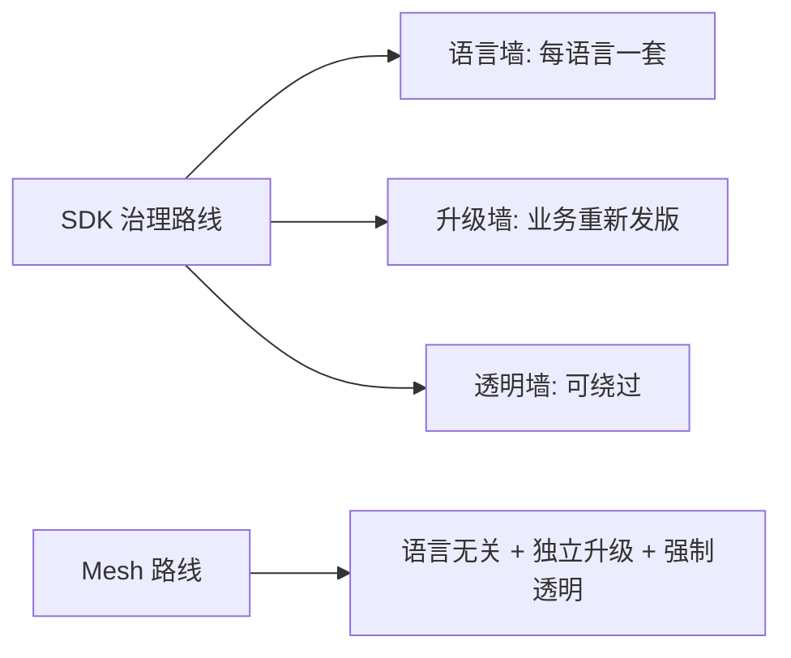
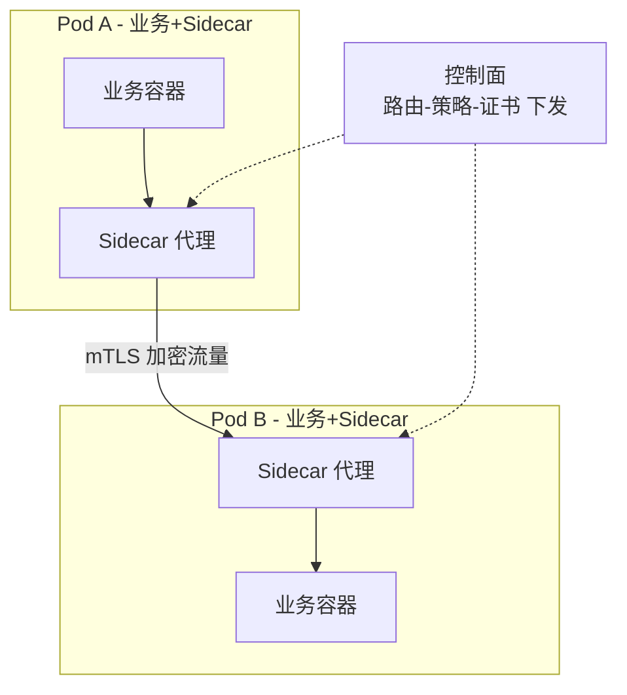

# Service Mesh 系列导读

> Service Mesh 把微服务治理（流量管理/熔断/mTLS/可观测）从「业务代码里的 SDK」下沉到「基础设施层的 Sidecar 代理」——业务代码回归业务，治理能力平台化。本系列讲清楚它的原理、代价与落地路径。

## 一句话摘要

Service Mesh = 数据面（每个 Pod 旁边的 Sidecar 代理，接管全部进出流量）+ 控制面（统一下发路由/策略/证书）；它解决的是「微服务治理能力与业务代码解耦」——多语言团队不再各自维护治理 SDK，治理升级不用改业务代码；代价是 Sidecar 的资源开销、延迟增量与运维复杂度。

## 一、为什么需要 Service Mesh

## 一、为什么需要 Service Mesh

微服务治理的演进：**单体内嵌**（代码里写治理逻辑）→ **SDK 库**（Spring Cloud/Hystrix，治理与业务同进程但绑定语言与升级）→ **Service Mesh**（治理下沉基础设施）。SDK 路线的痛：多语言团队各养一套 SDK、SDK 升级要全量业务重新发版、治理逻辑与业务代码耦合。

Mesh 的回答：治理逻辑写进 Sidecar 代理（业务容器旁多一个代理容器），所有进出流量被透明劫持——**业务代码零感知，治理能力全局统一**。

## 二、系列地图

| 篇 | 主题 | 回答的问题 |
|---|---|---|
| 1 | 什么是 Service Mesh | Sidecar 模式与数据面/控制面 |
| 2 | 数据面原理 | Sidecar 如何透明劫持流量（iptables/ebpf） |
| 3 | 控制面与 Istio | Pilot/XDS 协议、配置如何下发 |
| 4 | 流量管理 | 金丝雀/灰度/故障注入在 Mesh 层怎么做 |
| 5 | 安全与可观测 | mTLS 零信任、Mesh 层黄金指标 |
| 6 | 落地路径与代价 | 什么团队该上、资源开销账、渐进接入 |

## 三、怎么读

- **决策者**：读 0 + 6（值不值得上的取舍账）
- **工程师**：1 → 5 顺序读，每篇有可动手的最小实验
- **前置**：K8s 系列（同仓库 devops/kubernetes）——Mesh 是 K8s 之上的层，不熟悉 K8s 先读那边

**边界**：本系列讲 Mesh 本身；业务治理的方法论（限流阈值怎么定/降级预案怎么设计）在稳定性系列。

从架构上下游看：Mesh 处在「K8s 容器编排」与「业务微服务」之间——它上游消费 K8s 的 Pod/Service 抽象，下游为全部业务流量提供治理通道，是云原生架构里「通信治理」这一层的标准化落点。

## 四、分层规划

- **入门层（本层，6 篇）**：原理主干 + 代价账 + 落地路径——读完能做「上不上 Mesh」的决策
- **特性层（规划）**：Istio 深挖（Envoy 配置/流量规则细节）、多集群 Mesh、性能调优
- **专题层（规划）**：万级 Pod 的 Mesh 治理、Mesh 与 Serverless 的融合

## 值得讨论：上 Mesh 前必答的三个追问

**追问 1**：你的痛点是「治理不一致」还是「治理缺失」？——Mesh 治理的是前者；治理都还没做的团队，先做治理再谈 Mesh。**我的判断**：Mesh 是治理的收敛器，不是治理的创造器。

**追问 2**：Sidecar 的资源账算过吗？——千级 Pod × 每 Pod 0.3 核 ≈ 300 核常驻成本，加上 Mesh 控制面与运维人力，这笔账要摆在台面上对照收益。

**追问 3**：渐进路径设计了吗？——namespace 级灰度注入 → 观察两周 → 逐步扩大，直接全量开启注入是 Mesh 落地的头号事故来源。

## 📌 数据与事实声明

- 写于 2026-09-11，基于 Istio 1.2x / Envoy 主线口径
- 行业认知：Sidecar 资源开销（每实例 0.1-0.5 核 + 50-100MB 内存）与延迟增量（毫秒级）为公开基准口径
- 免责：以 istio.io 官方文档为准

## 📚 参考资料

| 类型 | 标题 | 来源 |
|---|---|---|
| 官方文档 | Istio 官方文档 | istio.io |
| 书 | 《Istio Service Mesh 权威解析》 | 公开出版 |
| 原则 | The Service Mesh 家族（Envoy/Istio/Linkerd） | 官方站点 |
