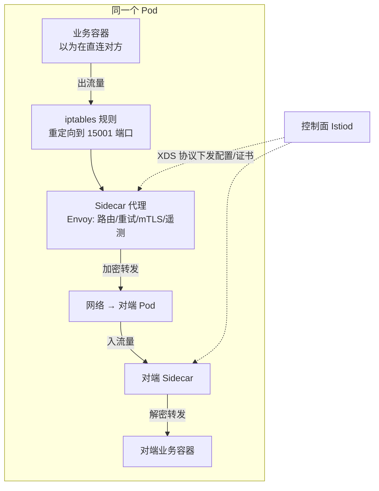
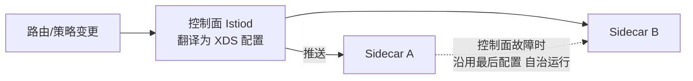

# 什么是 Service Mesh：Sidecar 模式与治理下沉

> 服务间的每次调用都经过一个「看不见的代理」——这个代理管重试、管加密、管路由、管监控，业务代码对此毫无感知。这就是 Service Mesh：把微服务治理从「每个团队每个语言的 SDK」下沉为「集群统一的基础设施」。

## 一句话摘要

Service Mesh = **数据面**（每个业务 Pod 旁挂一个 Sidecar 代理，透明劫持全部进出流量，执行重试/熔断/加密/遥测）+ **控制面**（统一管理所有 Sidecar 的行为：路由规则/证书/策略）；它把治理能力与业务代码彻底解耦——多语言统一治理、升级不动业务，代价是每 Pod 的资源开销与一层代理延迟。

## 本文核心

**核心机制一句话**：Sidecar 通过劫持流量（iptables 重定向）让业务容器的所有进出流量都经过代理，代理执行治理逻辑后转发——业务代码以为在直连对方，实际每跳都过两次代理。

**机制链**：业务容器发起请求 → iptables 规则劫持到 Sidecar → Sidecar 执行治理（路由/重试/mTLS/遥测）→ 加密转发到对端 Sidecar → 对端 Sidecar 解密转给业务容器；控制面向全部 Sidecar 下发统一配置。

**失效点/边界**：Sidecar 增加每跳延迟（毫秒级）与资源开销（每 Pod 0.1-0.5 核）；代理故障会拖死业务容器（Sidecar 与业务共生）；治理规则配错影响全局。

## 一、背景：SDK 治理路线的三面墙

Spring Cloud/Hystrix 这类 SDK 把治理能力做成了库——比在业务代码里手写治理强，但规模化后撞上三面墙：

- **语言墙**：SDK 绑定语言——Java 团队用 Spring Cloud，Go/Python/Node 团队各自重造。多语言公司维护 N 套治理栈
- **升级墙**：SDK 升级 = 全量业务重新编译发版——治理能力的演进被业务的发布节奏绑架，**SDK 版本碎片化**（生产同时跑着 5 个版本的治理逻辑）
- **透明墙**：SDK 在业务进程内，业务开发者绕过 SDK 直连（netty 直写）无护栏——治理纪律靠人遵守

**Mesh 的回答**：把治理逻辑从「业务进程内」移到「业务进程外的 Sidecar」——语言无关（任何语言的流量都过代理）、升级独立（Sidecar 升级不动业务 Pod 的业务容器）、强制透明（流量劫持无法绕过）。

## 二、核心：Sidecar 如何透明劫持流量

**劫持的原理**：Pod 创建时，Sidecar 注入器改写 Pod 规范并写入 iptables 规则——把出流量重定向到 Sidecar 的 15001 端口、入流量到 15006。业务容器完全无感知（它连的「对方地址」实际是本地代理）。**新版本用 eBPF 可以更低开销地实现劫持**（跳过部分 TCP 栈），是演进方向。

**mTLS 自动加密**：Sidecar 间用工作负载证书做双向 TLS——证书由控制面自动轮换（业务零配置），服务间通信默认加密。这是零信任网络的 Mesh 层落地。

**可观测白拿**：所有流量过代理，代理天然记录「服务 A → 服务 B 的 QPS/延迟/错误率」——**多语言团队的统一黄金指标不再依赖各语言 SDK**，Mesh 送的全局视角。

## 三、机制：数据面与控制面的分工

- **数据面（Envoy/Linkerd-proxy）**：跑在每个 Pod 里的代理，执行具体动作（转发/重试/加密/上报指标）——它是「干活的」
- **控制面（Istiod）**：把用户的路由规则/策略翻译成 XDS 配置，推送给全部数据面——它是「指挥的」。控制面挂了，已有配置继续生效（数据面自治），只是改不了新策略——**控制面故障 ≠ 数据面故障**，这是 Mesh 高可用设计的核心分层

**与 K8s 的关系**：K8s 管容器的部署与扩缩（资源编排层），Mesh 管服务间的通信治理（通信治理层）——Mesh 建在 K8s 之上（Sidecar 注入依赖 Pod 机制），两者是叠加不是竞争。

量级分档的取舍一句话：30 服务以下 Mesh 是奢侈品；50-200 服务（日千万级流量）是甜点区；亿级流量、千级服务的平台 Mesh 必配（治理一致性只能靠它）——**量级决定要不要，语言多样性决定多急**。

## 四、实践：典型场景与怎么选

**典型场景**：

- **多语言微服务**：Java/Go/Python 团队统一治理——Mesh 的最强场景
- **零信任安全**：服务间 mTLS 全覆盖（等保/安全合规要求）
- **渐进式金丝雀**：Mesh 层按 header/百分比切流，比网关层粒度更细

**怎么选（何时上 Mesh）**：服务数 > 50 且多语言 → Mesh 收益显著；单一 Java 栈 + Spring Cloud 成熟 → SDK 已够用，Mesh 的运维成本（Istio 学习曲线陡峭）大于收益。**我的判断：Mesh 是「治理的平台化」，团队没有平台工程能力时上 Mesh 是给自己找新问题**。

## 与 Spring Cloud SDK 的区别

| 维度 | SDK（Spring Cloud） | Service Mesh |
|---|---|---|
| 治理位置 | 业务进程内 | 进程外 Sidecar |
| 语言支持 | 绑定语言 | 语言无关 |
| 升级 | 业务重新发版 | Sidecar 独立升级 |
| 侵入性 | 注解+依赖+配置 | 零侵入（流量劫持） |
| 资源开销 | 业务进程内 | 每 Pod 额外 0.1-0.5 核 |

取舍本质：**SDK 的治理成本由各业务团队分摊（且多语言乘 N），Mesh 的成本由平台集中承担**——团队越多、语言越杂，Mesh 越划算。

> 💡 实战提示：体验 Mesh 的最快路径是 istio 官方 bookinfo 示例——十分钟跑通后用 Kiali 看流量拓扑，「服务网格」从抽象概念变成看得见的图。

## 常见误区

- **误区一：Mesh 是微服务必需品**。小规模（<30 服务）单一语言上 Mesh，运维复杂度大于收益——Mesh 解决的是「规模×多语言×治理一致性」问题
- **误区二：Sidecar 资源开销可忽略**。千级 Pod × 每 Pod 0.3 核 = 300 核的常驻开销——大规模下 Sidecar 资源是实打实的成本项
- **误区三：上了 Mesh 就不需要业务层治理**。Mesh 管通用治理（路由/重试/mTLS），业务语义治理（订单级幂等/业务降级）仍在业务层——两层互补不替代

## 你们可能会问

**Q1：Sidecar 挂了业务会挂吗？**
会——Sidecar 劫持了全部流量，代理进程崩溃 = 业务容器断网。所以 Sidecar 的资源保障与快速重启是 Mesh 运维的重点（这也是它被诟病「侵入性转移」的原因）。

**Q2：eBPF 会取代 Sidecar 吗？**
eBPF 能降低劫持开销（跳过部分 TCP 栈）， Istio ambient 模式也在去 Sidecar 化——但治理逻辑仍需要「代理层」执行，演进的形态是「更轻的代理」而非「没有代理」。

## 自测三问

1. **Sidecar 怎么做到「业务无感知」的流量劫持？**
   - Pod 内 iptables 规则把出入流量重定向到 Sidecar 端口——业务容器看到的「连接」实际都过代理。

2. **控制面挂了会怎样？**
   - 数据面按最后一次下发的配置继续工作（自治性）——只是无法变更新策略；这是 Mesh 分层高可用的设计基石。

3. **什么团队该上 Mesh？**
   - 服务数 50+ 且多语言、治理一致性诉求强、有平台工程能力的团队；单一 Java 栈小规模团队用 SDK 更划算。

## 5W 速记卡

| W | 一句话 |
|---|---|
| What | Sidecar 数据面 + 控制面的服务间通信治理基础设施 |
| Why | 治理能力与业务代码解耦：多语言统一、升级独立、强制透明 |
| Where | K8s 之上的服务通信治理层 |
| When | 服务规模 × 语言多样性 × 治理一致性诉求三者齐备时 |
| Who | 平台团队运营 Mesh，业务团队零成本享受治理 |

## 下篇预告

下一篇 [2_数据面原理](./2_数据面原理-透明劫持与转发-入门.md)：iptables 劫持、Envoy 的线程模型与流量处理细节。

## 追问链与我的判断

**追问链 1**：「Sidecar 的延迟增量到底多少？」→ 每跳增加 0.5-2ms（纯代理转发）→ 对 P99 200ms 的接口无感，对 P99 2ms 的内部紧耦合调用是 100% 劣化 → **Mesh 不适合对延迟极端敏感的内部紧耦合调用**。

**追问链 2**：「治理下沉了，业务团队会不会失去治理灵活性？」→ Mesh 管通用治理（路由/重试/mTLS），业务特有治理（订单幂等/业务降级）仍在业务层 → **我的判断：Mesh 抽走的是「通用治理的实现」，留下的是「业务治理的语义」——两层不冲突**。

**实践叙事**：某多语言团队（Java+Go+Python）在 Mesh 落地后第一件事是「删除各语言的熔断 SDK」——治理逻辑收敛到 Mesh 后，三套 SDK 的版本碎片化问题消失，这就是治理下沉的直接收益。

## 核心带走

**30 秒复述**：Service Mesh = Sidecar 数据面（透明劫持+治理执行）+ 控制面（统一配置下发）；价值 = 多语言统一治理 + 升级独立 + 强制透明；代价 = 每 Pod 资源开销 + 毫秒延迟 + Mesh 运维复杂度。**失效边界**：小规模单语言不值得上；Sidecar 故障拖死业务容器；极端延迟敏感场景要绕行。

## 📌 数据与事实声明

- 写于 2026-09-11，基于 Istio 1.2x / Envoy 主线；Sidecar 资源与延迟开销为公开基准口径
- 免责：以 istio.io/envoyproxy.io 官方文档为准

## 📚 参考资料

| 类型 | 标题 | 来源 |
|---|---|---|
| 官方文档 | Istio Concepts | istio.io/latest/docs/concepts |
| 官方文档 | Envoy 架构概述 | envoyproxy.io/docs |
| 书 | 《Istio Service Mesh 权威解析》 | 公开出版 |
