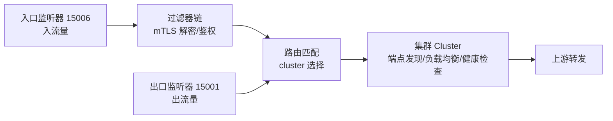
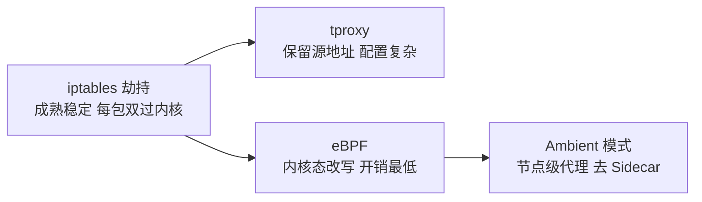

# 数据面原理：透明劫持与流量转发

> 业务容器「以为」自己在直连对方服务——实际上每个进出包都被 iptables 拦截转给了 Sidecar。数据面是 Mesh 的干活层：劫持怎么实现的、代理内部怎么处理流量、eBPF 为什么是演进方向，本篇拆开讲。

## 一句话摘要

数据面的透明劫持靠 **iptables 的 REDIRECT 规则**（把出入流量重定向到 Sidecar 监听端口），Sidecar（Envoy）按控制面下发的路由配置处理流量（集群发现/负载均衡/健康检查/mTLS/遥测）；演进方向是 **eBPF 接管劫持**（更低开销）与 **Ambient 模式**（共享代理节点替代每 Pod Sidecar）——劫持是透明的，但每一跳都有成本。

## 本文核心

**核心机制一句话**：iptables REDIRECT 把业务容器的出入流量改道到 Sidecar 端口，Envoy 按监听器→过滤器链→集群的三段结构处理流量，治理逻辑全部在代理层执行——业务进程的「直连」是幻觉。

**机制链**：出流量 iptables 劫持 → Envoy 出口监听器 → 路由匹配（集群选择/负载均衡）→ mTLS 加密 → 对端 Sidecar 入口监听 → 解密转发到对端业务容器；控制面通过 XDS 把路由/集群/证书配置推给全部 Sidecar。

**失效点/边界**：劫持规则覆盖不全的流量（如特权端口、UDP）会绕过 Mesh；Sidecar 进程故障 = 业务容器断网；每跳双代理的延迟与资源是常驻成本。

量级视角的取舍：百 Pod 团队 iptables 劫持绰绰有余；万级 Pod（亿级流量入口）每包双过内核栈的开销放大到不可忽视——**量级越大，eBPF/Ambient 的收益越显著**。

## 一、背景：透明劫持的三种实现

- **iptables REDIRECT**（主流）：改写 NAT 表把流量转向 Sidecar 端口——成熟稳定，但每包过内核栈两次（开销）
- **tproxy**：透明代理保留源地址（某些场景 REDIRECT 丢源 IP）——配置更复杂
- **eBPF**（演进方向）：内核态直接改写 sock 的对端地址——跳过 iptables 与部分 TCP 栈，开销显著降低（Istio ambient 模式与 Cilium 的路线）

三种实现的设计思想差异：iptables 用「成熟优先」哲学（先能用再优化），tproxy 用「准确性优先」（保源地址），eBPF 用「内核可编程」哲学（把治理下沉到内核）——**数据面的演进史就是劫持方式的设计哲学演进史**。

**劫持的边界**：iptables 规则要豁免自身端口（避免 Sidecar 自己的流量循环劫持——经典的「回环死循环」问题）；K8s 探针端口、DNS 端口也要精心排除——**劫持规则的完备性是数据面稳定的第一关**。

从数据面的架构上下游看：它的上游是控制面（XDS 配置的消费者），下游是真实的业务容器（流量的生产者与最终接收者）——数据面是两者之间唯一的通道，这也意味着它的配置正确性 = 全集群通信的正确性。

## 二、核心：Envoy 的流量处理模型

Envoy 的三段抽象：**Listener**（监听端口）→ **Filter Chain**（处理链：TLS/鉴权/限流）→ **Cluster**（上游集群与端点）。控制面的 XDS 协议（LDS/RDS/CDS/EDS）分别下发这四类配置——「XDS 全称表达的就是配置的四个维度」。

**负载均衡与健康检查在数据面**：Envoy 按 LB 策略（轮询/最少请求/ locality 感知）选端点，配合主动/被动健康检查摘除异常端点——Mesh 层的「熔断摘流」与 K8s 探针是两套独立机制（第 1 篇讲过假活问题，Mesh 的被动健康检查是第三道防线）。

## 三、机制：为什么 Sidecar 故障会断网

业务容器的流量被 iptables 强制导向 Sidecar——Sidecar 进程崩溃时，劫持规则还在，流量发往一个不监听的端口 → **连接被拒绝，业务断网**。这解释了 Sidecar 与业务容器的「共生关系」：资源上共生（同 Pod）、网络上共生（流量依赖）、故障上共生死。

**缓解手段**：Sidecar 的资源保障（独立 limits，防止业务挤压 Sidecar）、Sidecar 快速重启（K8s 自动拉起）、异常时 iptables 规则清理工具（应急逃生）。**Ambient 模式**（Istio 演进方向）把 Sidecar 改为节点级共享代理（ztunnel），业务 Pod 不再挂代理——解耦共生死关系，是去 Sidecar 化的落地形态。

数据面实现的取舍链：iptables 的成熟稳定 vs eBPF 的低开销；每 Pod Sidecar 的强隔离 vs Ambient 节点级代理的成本优势——**每一代实现都在「开销、隔离性、运维复杂度」三角里挪位置**，选型跟随团队内核版本与运维能力。

> 💡 实战提示：排查「Mesh 后不通」的第一步是 `iptables-save | grep 15001` 确认劫持规则存在，第二步 `netstat` 确认 Sidecar 在监听——十次里八次问题在这两步。

## 四、实践：典型场景

- **排查「Mesh 后接口变慢」**：三步——确认流量确实走了 Sidecar（iptables 规则核对）→ 看 Envoy 统计（upstream_rq_time）→ 对比直连基线定位是代理开销还是路由绕路
- **端口冲突排查**：业务自己监听 15001/15006 等保留端口会与 Sidecar 冲突——**业务端口避开 Mesh 保留段**是接入前检查项
- **UDP/特殊协议**：Mesh 劫持覆盖 TCP/HTTP，UDP（如 DNS 走 UDP）的处理策略各 Mesh 不同——协议覆盖范围是选型检查项

## 你们可能会问

**Q1：业务容器能不能直连绕过 Sidecar？**
技术上可以（直连对端 Pod IP 的业务端口）——但会绕过 mTLS 与治理，零信任体系下等于裸奔；逃生通道存在是为了应急排障，不是日常用法。

**Q2：Sidecar 的资源配多少合适？**
起步 Envoy 0.1 核 + 128Mi，按实测流量调——大流量 Pod（网关型）的 Sidecar 要单独加大，甚至考虑把超高频调用方从 Mesh 里摘出去单独治理。

## 与 K8s Service 的区别

K8s Service 做的是「服务发现 + 基础负载均衡」（四层），Mesh 在其上叠加「七层治理」（路由规则/重试策略/mTLS/细粒度遥测）——Mesh 的负载均衡决策能基于 HTTP 头/权重/版本，这是 K8s Service 做不到的。

## 常见误区

- **误区一：Sidecar 是可选的旁路组件**。劫持模式下 Sidecar 是流量的必经之路——它挂了业务就断网，资源保障必须按生产级配置
- **误区二：Mesh 后应用不需要超时重试配置了**。Mesh 的重试/超时是默认兜底，业务语义的超时（用户可等待时长）仍要业务定——两层配置要协调（内层超时 < 外层超时）
- **误区三：劫持规则全局通用**。不同协议、特权端口、健康检查端口的排除规则是每套系统要定制的——劫持规则的完备性决定数据面的稳定性

## 自测三问

1. **iptables 劫持的原理与边界？**
   - REDIRECT 改写 NAT 转发到 Sidecar 端口；边界是规则完备性（自身端口/探针/DNS 排除）与每包双过内核栈的开销。

2. **Envoy 的 Listener/Filter/Cluster 三段抽象是什么？**
   - 监听端口接流量 → 过滤器链处理（TLS/鉴权）→ 集群做端点选择与转发——XDS 四类配置对应这四维。

3. **为什么 Sidecar 挂了会断网？Ambient 怎么解决？**
   - 劫持规则把流量强制导向已死的代理端口；Ambient 用节点级共享代理（ztunnel）替代每 Pod Sidecar，解耦共生死关系。

## 5W 速记卡

| W | 一句话 |
|---|---|
| What | 透明劫持 + Envoy 三段处理的数据面实现 |
| Why | 数据面是 Mesh 治理逻辑的执行者——原理决定排障能力 |
| Where | 每个注入 Mesh 的 Pod 内 |
| When | 流量出入的全部时刻 |
| Who | Mesh 平台运维数据面，业务避让保留端口 |

## 开放问题

- **eBPF 接管劫持的兼容性**：内核版本依赖、与 CNI 的协作、调试复杂度——eBPF 路线的生产化仍在多版本迭代中
- **零信任的 Mesh 内深化**：mTLS 覆盖了传输加密，服务级的授权策略（谁调用谁的细粒度权限）的规模化治理仍在演进

## 核心带走

**30 秒复述**：数据面 = iptables 透明劫持 + Envoy 三段处理（Listener→Filter→Cluster）+ XDS 配置驱动；Sidecar 与业务共生死（挂了即断网），Ambient 模式用节点级代理解耦。**失效边界**：劫持规则不完备、Sidecar 资源被挤压、保留端口冲突——数据面稳定性三关。

## 📌 数据与事实声明

- 写于 2026-09-11，基于 Istio 数据面（Envoy）与 iptables 劫持的官方文档口径；eBPF/Ambient 为演进方向声明
- 免责：以 istio.io / envoyproxy.io 官方文档为准

## 📚 参考资料

| 类型 | 标题 | 来源 |
|---|---|---|
| 官方文档 | Envoy Deployment data plane | envoyproxy.io/docs |
| 官方文档 | Istio Ambient Mode | istio.io/latest/docs/ambient |
| 官方文档 | Kubernetes Services（对比概念） | kubernetes.io/docs |
