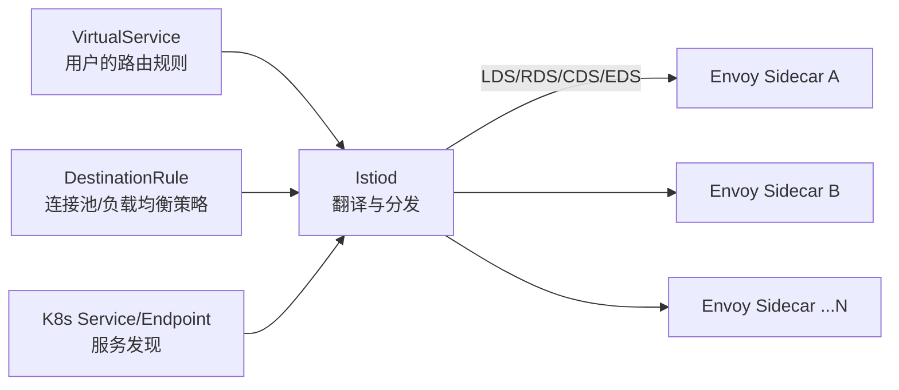
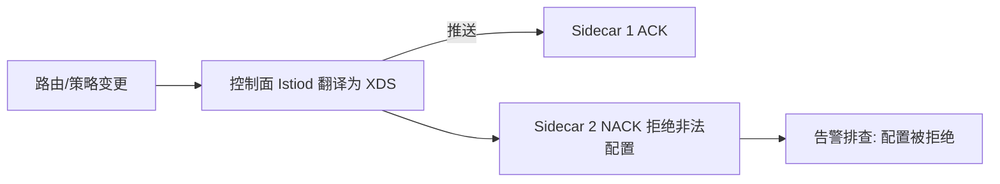

# 控制面与 Istio：XDS 协议与配置下发

> 数据面（Envoy）这么强，但它怎么知道「该把流量转发到哪里、要不要重试、要不要加密」？答案是控制面 Istiod 通过 **XDS 协议**把配置推给每一个 Sidecar。控制面是 Mesh 的大脑——理解 XDS，就看懂了 Mesh 的神经系统。

## 一句话摘要

Istiod 把用户的路由/策略配置翻译成 XDS 协议的四类配置（LDS 监听器/RDS 路由/CDS 集群/EDS 端点），通过 gRPC 长连接**推送给全部数据面 Sidecar**；控制面故障时数据面按最后配置自治运行——控制面设计的关键是「推送的增量性、顺序性与规模」。

## 本文核心

**核心机制一句话**：XDS 是控制面与数据面之间的 gRPC 配置推送协议——四类资源（Listener/Route/Cluster/Endpoint）各自有独立的发现服务，Istiod 是「K8s API + 用户配置 → Envoy 配置」的翻译器与分发器。

**机制链**：用户写 VirtualService/DestinationRule → Istiod 监听 K8s API 变化 → 转换为 Envoy 配置 → XDS gRPC 增量推送到全部 Sidecar → 数据面热更新（不重启连接）。

**失效点/边界**：控制面是配置变更的必经之路——Istiod 故障期间配置无法变更（已有配置继续生效）；推送风暴（全量配置变更引发全部 Sidecar 同时重建连接）是大规模 Mesh 的特有风险。

## 一、背景：从静态配置到 XDS 动态推送

Envoy 诞生时的配置是静态文件（重启生效）——服务网格需要「配置动态生效」：路由规则改了要立即生效、服务扩缩容后端点列表要实时更新。XDS（xDiscovery Service）就是为此设计的一族协议：LDS 发现监听器、RDS 发现路由、CDS 发现集群、EDS 发现端点。

**推 vs 拉的设计选择**：Envoy 与 Istiod 之间是 gRPC **长连接双向流**——Istiod 主动推（变更秒级生效），Envoy 定期 ACK（确认版本）。这个设计的含义：控制面故障不影响已推送的配置（数据面自治），但「推送风暴」要防（详见 §四）。

## 二、核心：Istiod 的翻译器角色

**Istiod 做的三件翻译**：

1. **K8s 服务发现 → EDS 端点表**：K8s 里 Service 的 Pod 列表变化，Istiod 转换成 Envoy 的 ClusterLoadAssignment（哪些 IP:Port 可用）
2. **VirtualService/DestinationRule → RDS/CDS**：用户的流量规则（如「v2 版本导 10% 流量」）翻译成 Envoy 的路由配置
3. **证书管理 → SDS**：工作负载证书（mTLS 用）的签发与轮询下发

**翻译的复杂度藏在「规模化」里**：1000 个服务的 Mesh，Envoy 每个实例理论上要感知全部 1000 个服务的端点（万级端点表）——**全量推送的内存与 CPU 开销是 O(服务数 × Sidecar 数)**。规模化的解法是 **Sidecar 资源限制（SidecarScope）**：让每个 Sidecar 只感知「它需要知道的」命名空间与服务（依赖剪枝），这是万级 Pod Mesh 治理的核心技术（特性层展开）。

## 三、机制：推送的顺序性与增量

XDS 有两种模式：**全量推送**（变更一次推全部相关配置）与**增量推送**（只推变更部分，EDS 优先支持）。大规模 Mesh 的关键设计：

- **最终一致而非即时一致**：一次变更推给几千个 Sidecar 有先后顺序——灰度规则生效期间「部分 Sidecar 用新规则、部分用旧」是正常中间态。对顺序敏感的场景（金丝雀比例精确控制）要理解这个特性
- **配置版本与 ACK**：每个配置有版本号，Envoy ACK 后控制面才认为推送完成——版本不推进（NACK）说明配置被 Envoy 拒绝（如非法配置），是控制面排障的关键信号
- **控制面的资源**：Istiod 是无状态多实例（可水平扩展），但「监听全部 K8s 事件 + 计算全量配置」的 CPU 与内存随规模增长——万级服务场景 Istiod 本身的容量规划是专题课题

> 💡 实战提示：Istiod 内存随服务数增长的主要因子是「全量端点表」——万级服务前先配置 Sidecar 资源限制（依赖剪枝），这一步能砍掉 80% 的推送开销。

## 四、实践：典型场景与怎么选

## 四、实践：典型场景与怎么选

**典型场景**：

- **金丝雀发布**：VirtualService 按 weight 切 v1/v2 流量（90/10），配合指标观察调整比例——Mesh 层金丝雀比网关层粒度细（可按 header/用户）
- **故障注入**：VirtualService 的 fault 注入（延迟/中断指定比例请求）——不用改代码就能测试系统的容错能力（混沌工程的 Mesh 层实现）
- **多集群**：Istiod 多集群部署，服务发现跨集群聚合——多活的通信治理基础

**何时选 Istio 而不是轻量方案**：需要完整流量管理 + mTLS + 多集群 → Istio；只需要基础服务发现与简单 LB → K8s Service + 轻量网关即可。**Istio 的学习曲线是真实成本**——按需引入，不要「因为厉害所以上」。

XDS 协议的演进贯穿 Mesh 历史：从全量推送到增量 XDS、从单集群到多集群统一发现——**协议每一步演进都被万级服务场景的推送风暴倒逼**。

从架构上下游看：控制面处在「K8s API 事件源」与「全集群 Sidecar 执行者」之间——上游意图翻译成下游配置，是 Mesh 的指挥枢纽。

## 与 Envoy 直用的区别

不用 Istio 也可以直接用 Envoy（静态配置或自研 XDS 服务）——Istio 的增值是「与 K8s 深度集成 + 自动 Sidecar 注入 + 证书管理 + 诊断工具」；直接用 Envoy 的是「有平台团队且需要极致定制」的场景。取舍本质：** Istio 买的是「全家桶与集成度」，代价是抽象层的复杂度**。

## 你们可能会问

**Q1：Istiod 要部署几个实例？**
至少 2 个多可用区分布——它是配置变更的必经之路，挂了影响「新配置生效」但不影响存量流量；资源按「服务数×端点数」容量规划。

**Q2：VirtualService 写错了会怎样？**
XDS 配置会被 Envoy NACK 拒绝（配置不生效），Istiod 侧有 rejected 配置日志——这就是为什么配置要走 Git 审批而不是控制台直改。

## 常见误区

## 常见误区

- **误区一：控制面挂了 Mesh 就瘫了**。数据面自治是设计基石——Istiod 挂掉的后果是「配置无法变更」，存量流量照常。把控制面当核心链路过度扩容，不如把它的稳定性设计做对
- **误区二：配置推了就立即全量生效**。增量推送有传播延迟（秒级），灰度比例的精确控制要理解「中间态」的存在
- **误区三：XDS 配置不需要版本管理**。路由规则是生产变更（等价于发布）——VirtualService 也要走 Git 管理 + 审批 + 灰度，不能在控制台随手改

## 自测三问

1. **XDS 的四类资源分别是什么？**
   - LDS（监听器）、RDS（路由）、CDS（集群）、EDS（端点）——四者组合构成一个 Sidecar 的完整行为配置。

2. **Istiod 挂了流量会断吗？**
   - 不会。数据面按最后收到的配置自治运行；影响的是「配置无法变更」。但长期挂起意味着无法响应新故障——控制面可用性仍是生产要求。

3. **万级服务场景 XDS 的规模问题怎么解？**
   - Sidecar 资源限制（Scope）做依赖剪枝——每个 Sidecar 只感知相关服务，把 O(全量) 降为 O(依赖)。

## 5W 速记卡

| W | 一句话 |
|---|---|
| What | Istiod 通过 XDS 向数据面推送配置的控制面体系 |
| Why | 让全集群 Sidecar 的行为统一受控、变更秒级生效 |
| Where | K8s 之上的 Mesh 控制层 |
| When | 路由变更/证书轮换/服务发现变化的每一次 |
| Who | 平台团队运营 Istiod，业务写 VirtualService/DR |

## 下篇预告

下一篇 [4_流量管理](./4_流量管理-金丝雀灰度与故障注入-入门.md)：Mesh 层的流量切分、故障注入与超时重试——治理能力的实操面。

## 开放问题

- **推送风暴的根治**：万级 Sidecar 同时重连（如 Istiod 滚动升级）的推送风暴——增量协议与分级推送的组合方案仍是运维难题
- **多租户的配置隔离**：共享 Mesh 上多团队的规则互相影响的隔离模型仍在演进

## 核心带走

## 核心带走

**30 秒复述**：控制面 Istiod = 「K8s 配置 + 用户规则 → Envoy XDS 配置」的翻译器与推送器，四类资源（LDS/RDS/CDS/EDS）经 gRPC 长连接增量下发；数据面自治（控制面故障不影响存量流量）。**失效边界**：推送风暴、版本不推进（NACK）、全量感知的规模墙——三处都要 SidecarScope 与增量 XDS 应对。

## 📌 数据与事实声明

- 写于 2026-09-11，基于 Istio 1.2x 与 XDS 协议公开文档；SidecarScope 机制为官方特性
- 免责：以 istio.io 官方文档为准

## 📚 参考资料

| 类型 | 标题 | 来源 |
|---|---|---|
| 官方文档 | Istio: Pilot Discovery / XDS 协议 | istio.io/latest/docs/ops/configuration |
| 官方文档 | Envoy XDS Protocol | envoyproxy.io/docs/envoy/latest/api-docs |
| 书 | 《Istio Service Mesh 权威解析》控制面章 | 公开出版 |
