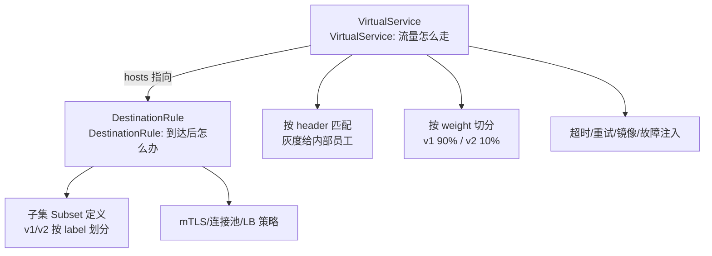

# 流量管理：金丝雀灰度、故障注入与超时重试

> Mesh 的流量管理是它最「值钱」的能力：按百分比切流量做金丝雀、按 header 做精准灰度、注入故障测韧性、声明式配超时重试——这些以前要写代码或改网关配置的事，现在都是声明式规则。

## 一句话摘要

Mesh 流量管理四件套：**按内容路由**（header/URI/权重把流量分到不同版本）、**故障注入**（不碰代码注入延迟/中断，测试系统容错）、**超时与重试**（声明式配置，出口统一治理）、**流量镜像**（生产流量复制到新版本，真实流量预演）——全部通过 VirtualService/DestinationRule 两条声明式规则表达，改规则即改行为，零代码。

## 本文核心

**核心机制一句话**：VirtualService 管路由（流量去哪、失败怎么办），DestinationRule 管目的地策略（连接池/负载均衡/mTLS/版本子集）——两条规则组合实现金丝雀/灰度/故障注入/超时重试的全部流量治理。

**机制链**：用户写规则 → Istiod 翻译进 Envoy → 每个 Sidecar 按规则执行：匹配（header/权重）→ 路由（子集选择）→ 动作（超时/重试/镜像/故障注入）→ 上游子集（按 label 区分的版本）。

**失效点/边界**：规则生效有秒级传播延迟；镜像流量是「只看不回」（响应被丢弃）；重试在 Mesh 层与业务层叠加时要防重试风暴（内外层预算协调）。

## 一、背景：网关层灰度不够用的地方

网关能做按比例/按 header 的灰度，但三个场景它无能为力：

- **服务间调用的灰度**：网关只管入口——A 服务调 B 服务要按版本灰度，网关管不到内部链路
- **故障注入**：模拟「下游 B 挂了」对 A 的影响——网关无法只对 A→B 的调用注入故障
- **细粒度重试策略**：不同下游的重试策略应不同（幂等读可重试 3 次，支付不重试）——出口统一治理需要 Mesh

Mesh 的流量管理作用在**服务间通信的每一跳**——这是它与网关的本质分工。

量级分档的取舍：十万级 QPS 的入口灰度靠网关+Mesh 配合（入口挡量、Mesh 管版本）；千万级日订单的内部链路灰度靠 Mesh 的子集路由（服务间每一跳都能按版本精确切分）；亿级流量的全站金丝雀则要求 Mesh 与发布体系（第 12 篇）深度联动——**量级越大，灰度的精度要求越高**。

## 二、核心：两条规则的全景



**金丝雀发布的 Mesh 姿势**（对比第 12 篇发布体系的实例级灰度，Mesh 是「版本级」灰度）：

```yaml
# VirtualService: 10% 流量到 v2
http:
- route:
  - destination: { host: reviews, subset: v1 }
    weight: 90
  - destination: { host: reviews, subset: v2 }
    weight: 10
# DestinationRule: 子集按 Pod label 划分
subsets:
- name: v1
  labels: { version: v1 }
- name: v2
  labels: { version: v2 }
```

**故障注入示例**（混沌工程的 Mesh 层落地）：

```yaml
http:
- fault:
    delay: { percentage: { value: 10 }, fixedDelay: 5s }   # 10% 请求延迟 5 秒
  route: [...]
```

**流量镜像**：`mirror: { host: v2 }`——生产流量原样复制一份发给新版本（响应丢弃），**用真实流量测试新版本**而不影响用户。这是「灰度只能暴露比例性问题」的补位方案。

## 三、机制：超时与重试的出口统一治理

Mesh 层给每个服务调用声明式配置超时与重试：

```yaml
http:
- timeout: 2s
  retries:
    attempts: 2
    perTryTimeout: 800ms
    retryOn: "connect-failure,reset,5xx"
```

**灰度与镜像的取舍**：灰度把真实流量分给新版本（有暴露风险但反馈真实），镜像把流量复制给新版本（零暴露但响应丢弃）——**预演用镜像、放量用灰度**，两者是发布安全的不同阶段。（第 3 篇重试三铁律的 Mesh 延伸）：Mesh 层重试与业务层重试会**相乘**（Mesh 2 次 × 业务 3 次 = 6 次下游压力）——纪律：**全链路只在一层做重试**（推荐 Mesh 层统一），业务层只在语义重试（换实例/换渠道）时做。重试预算的思路在 Mesh 层同样适用。


> 💡 实战提示：金丝雀的三段观察节奏——10% 观察 1 小时（错误率对比）、50% 观察 2 小时（容量与缓存）、100% 后再观察 24 小时（长尾问题）——节奏比比例更重要。

## 四、实践：典型场景与起步路径

## 四、实践：典型场景与起步路径

**典型场景**：

- **版本灰度**：金丝雀按权重 + 按 header 精准灰度（测试人员 header 走 v2）
- **故障演练**：注入 10% 5 秒延迟，观察系统是否按预期熔断降级（混沌工程 Mesh 层实现，第 8 篇联动）
- **迁移期双跑**：流量镜像给新版本，对比新旧版本的响应差异（真实流量预演，零风险）
- **出口熔断**：DestinationRule 的 outlierDetection（异常点摘除）——对下游故障的自动熔断

**起步路径**：先路由（金丝雀）→ 再超时重试（出口统一）→ 再镜像（新版本预演）→ 最后故障注入（演练）。**每一步都是声明式规则，回滚 = 删规则**。

流量管理的架构上下游：VirtualService 的规则由 Istiod 下发到数据面执行（上游），执行的遥测数据回流到监控（下游）——规则与遥测构成闭环，灰度比例的调整就靠这个闭环反馈。

VirtualService/DestinationRule 分两条规则的设计哲学：**「意图」与「策略」分离**——VS 表达流量意图（去哪、怎么处理），DR 表达目的地策略（到了之后怎么连）；分开后各自独立演进，这是声明式 API 设计的经典范例。

## 开放问题

- **故障注入的覆盖度**：Mesh 注入是网络层故障（延迟/中断），应用层故障（脏数据/部分字段异常）的注入仍需业务工具——注入面的完整性是混沌工程的开放问题
- **灰度比例的自动调节**：按指标自动升降比例（AI 灰度）在头部团队试点，误判的爆炸半径控制是核心难点

何时用哪个的决策：入口级灰度（新服务上线）用网关层；服务间版本的灰度用 Mesh 子集路由；测试新版本的真实表现用镜像；测试系统容错用故障注入——**四类场景各有主场，按目标选**。

## 与网关灰度的区别

## 与网关灰度的区别

## 与网关灰度的区别

## 与网关灰度的区别

| 维度 | 网关灰度 | Mesh 灰度 |
|---|---|---|
| 作用点 | 入口一次 | 服务间每一跳 |
| 粒度 | 接口级 | 服务版本级 + header 级 |
| 故障注入 | 难 | 原生支持 |
| 依赖 | 网关产品 | Mesh 基建 |

两者配合：网关管入口的粗粒度，Mesh 管内部链路的精细治理——**灰度的完整体系是两层叠加**。

## 你们可能会问

**Q1：故障注入和混沌工程的区别？**
Mesh 故障注入是混沌工程的一种「注入手段」——注入是动作，混沌工程是方法论（稳定态假设+观察+爆炸半径控制，第 8 篇纪律全部适用）。

**Q2：超时设置和 Mesh 重试会互相影响吗？**
会——重试的总耗时 = 每次超时 × 次数，外层超时必须大于重试总耗时，否则重试还没完成外层先断——**内外层超时协调是 Mesh 重试的头号配置错误**。

## 常见误区

## 常见误区

- **误区一：VirtualService 改了立即全量生效**。XDS 推送有秒级传播延迟——灰度比例的「精确」要理解中间态（第 3 篇）
- **误区二：故障注入可以随意在生产做**。注入的爆炸半径控制与混沌工程同一纪律（第 8 篇三道保险）——注入是测试工具不是故障制造器
- **误区三：重试配置各层随便加**。Mesh 层 + 业务层重试相乘会造成下游压力倍增——全链路重试预算要统一规划（第 3 篇铁律）

## 自测三问

1. **VirtualService 和 DestinationRule 各管什么？**
   - VS 管「流量怎么走」（路由匹配/权重/超时/重试/故障注入）；DR 管「到达目的地后的策略」（子集定义/连接池/mTLS/LB）。

2. **流量镜像解决什么问题？**
   - 用真实生产流量测试新版本（响应丢弃不影响用户）——比测试环境构造数据更真实，比灰度更零风险。

3. **Mesh 层重试和业务层重试怎么协调？**
   - 全链路统一在一层做重试（推荐 Mesh 出口层），业务层只在语义换道时重试——两层叠加会相乘放大下游压力。

## 5W 速记卡

| W | 一句话 |
|---|---|
| What | 声明式流量管理：路由/灰度/故障注入/超时重试/镜像 |
| Why | 服务间每跳的治理需求，网关层覆盖不到 |
| Where | 服务间通信的每一跳 |
| When | 版本发布/混沌演练/新版本预演/出口治理统一 |
| Who | 平台定规则模板，业务按声明式规则使用 |

## 下篇预告

下一篇 [5_安全与可观测](./5_安全与可观测-mTLS与Mesh层指标-入门.md)：mTLS 零信任与 Mesh 层黄金指标——安全与观测的 Mesh 落地。

## 核心带走

**30 秒复述**：流量管理 = VirtualService（流量怎么走：路由/权重/超时/重试/镜像/故障注入）+ DestinationRule（到达后怎么办：子集/连接池/mTLS）；金丝雀按权重+header 精确切分，镜像用真实流量零风险预演，故障注入是 Mesh 层混沌工程。**失效边界**：推送中间态、重试叠加放大、镜像响应被丢弃——三者理解了才叫会用。

## 📌 数据与事实声明

- 写于 2026-09-11，基于 Istio 流量管理官方文档口径；故障注入与镜像为 Istio 原生特性
- 免责：以 istio.io 为准

## 📚 参考资料

| 类型 | 标题 | 来源 |
|---|---|---|
| 官方文档 | Istio Traffic Management | istio.io/latest/docs/tasks/traffic-management |
| 官方文档 | VirtualService / DestinationRule 参考 | istio.io/latest/docs/reference/config |
| 行业实践 | Mesh 金丝雀与故障注入公开分享 | 公开报道 |
