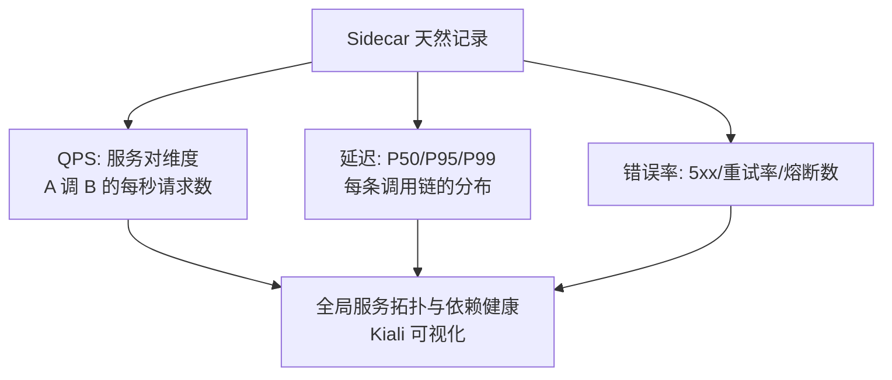
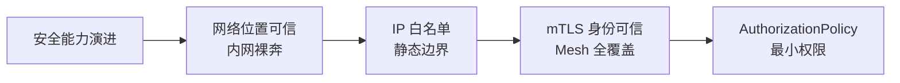

# 安全与可观测：mTLS 零信任与 Mesh 层黄金指标

> Mesh 的两个「白拿」能力：安全（服务间自动 mTLS 加密——零代码改造）与可观测（全链路黄金指标——零埋点成本）。两者都源于同一个事实：全部流量都过 Sidecar，代理看得见一切、也能加密一切。

## 一句话摘要

Mesh 安全 = **mTLS 全自动加密**（证书由控制面签发轮换，业务零配置）+ **授权策略**（L7 级细粒度「谁能调谁」）；Mesh 可观测 = **代理天然产出的黄金指标**（QPS/延迟/错误率按服务对维度）+ 分布式追踪（Envoy 生成的 trace header）——两者共同构成零信任网络与全局可观测的基础设施层。

## 本文核心

**核心机制一句话**：mTLS 把「网络位置可信」升级为「身份可信」——每个工作负载持有控制面签发的证书，Sidecar 间双向验证后加密通信，冒充与窃听在协议层被杜绝。

**机制链**：控制面 CA 签发工作负载证书 → 证书轮换自动下发到 Sidecar → 每次连接双向证书验证 → 加密通信；同时 Sidecar 记录每次调用的黄金指标与 trace header——安全与观测共用同一个流量截点。

**失效点/边界**：证书轮换的窗口期处理（轮换瞬间的连接管理）；mTLS 只覆盖 Mesh 内流量（Pod 到外部系统的加密另配）；Mesh 指标是「服务对」维度（细到业务语义仍要业务埋点）。

mTLS 自动化的设计思想值得一看：**把「安全操作」从「运维动作」降为「基础设施属性」**——证书签发/轮换/撤销全部内化到控制面与 K8s 身份体系，安全性不再依赖运维的勤勉，而依赖系统的设计。这是「安全的正确姿势：让正确的事情成为默认」。

## 一、背景：零信任为什么需要 mTLS

传统内网安全模型是「城堡与护城河」：内网即可信。零信任模型的回答：**网络位置不代表身份**——内网里的 Pod 同样要互相验证。微服务场景下这尤其重要：一个被攻破的边缘服务不应该能随意调用核心服务。

mTLS（双向 TLS）的实现难点不在 TLS 本身，在**证书管理**：每 Pod 一张证书、定期轮换、撤销机制——Mesh 的控制面（Istiod CA）把这些全部自动化：Pod 创建时自动签发、到期自动轮换、业务零感知。**这是「治理下沉」在安全领域的复刻：证书管理从运维操作变成基础设施能力**。

## 二、核心：Mesh 层的黄金指标

**Mesh 层指标的独特价值**：语言无关（Go/Java/Python 服务统一口径）、零埋点（代理自动记录）、维度天然（source/target 工作负载对）——多语言团队的「统一黄金指标」问题被 Mesh 结构性解决。局限：指标粒度是「服务对+方法」，业务语义指标（下单成功率按渠道）仍需业务埋点。

**Kiali 可视化**：把 Mesh 的指标/配置渲染成实时拓扑图——服务依赖、流量分布、mTLS 覆盖率一目了然，是 Mesh 运维的眼睛。

## 三、机制：授权策略的细粒度

mTLS 之后是授权（Authentication 之上是 Authorization）：Istio AuthorizationPolicy 声明「谁可以调用谁的那个方法」——从网络层的「IP 白名单」升级为「身份 + 方法 + 路径」的细粒度授权。零信任的完整落地 = mTLS（加密+身份）+ AuthorizationPolicy（最小权限）。

量级分档的取舍：千级 Pod 全量 mTLS 的加密开销（CPU 5-10%）在可接受范围；亿级流量的入口网关与 Mesh 加密叠加时要评估吞吐——**安全强度与吞吐性能的取舍按量级实测**。

从架构上下游看：Mesh 安全层的上游是控制面 CA（证书签发）与 K8s 服务账号（身份源），下游是全部业务容器的通信通道——**安全策略在控制面定，加密在数据面执行，业务层无感知**。

> 💡 实战提示：mTLS 迁移用 permissive 模式观察一周「非加密流量清单」（Kiali 有现成视图）——清单清零后切 strict，是零事故的迁移路径。

## 四、实践：典型场景与起步路径

**典型场景**：

- **等保/合规**：服务间通信加密的全覆盖要求——mTLS 一键开启（strict 模式），存量服务渐进迁移（permissive 过渡模式）
- **多团队故障定位**：「谁调挂了我的服务」——Mesh 指标直接给出上游流量变化
- **审计**：全部服务间调用的可观测记录——安全审计的天然素材

**起步路径**：mTLS permissive 模式全量开启（观测覆盖率）→ 排查非加密流量 → 切 strict → AuthorizationPolicy 按核心链路逐个收紧。

## 你们可能会问

**Q1：mTLS 会不会影响性能？**
会——加密解密有 CPU 开销（实测 5-10%），TLS 握手有连接建立成本——解法是连接复用（Sidecar 间长连接）与证书会话恢复，量级实测后再定 strict 范围。

**Q2：证书泄露了怎么办？**
工作负载证书有效期短（Istio 默认 24 小时自动轮换）——泄露影响窗口被轮换机制限制；配合 SPIFFE 身份标识（证书绑定工作负载身份），泄露的证书在别处也无法使用。

## 与业务层安全的区别

Mesh 安全管「传输与身份」（通信加密/服务身份/访问控制），业务安全管「语义」（参数校验/业务风控/数据脱敏）——**零信任不消灭业务校验，消灭的是「内网裸奔」**。两者叠加才是完整纵深。

## 常见误区

- **误区一：mTLS 了就不需要应用层认证**。mTLS 认证的是「服务身份」（Pod/工作负载），用户身份（JWT/Session）仍是业务层的事——服务身份 ≠ 用户身份
- **误区二：Mesh 指标可以替代业务埋点**。Mesh 指标到「服务对+方法」粒度，「下单成功率按支付渠道」的业务维度必须业务埋点
- **误区三：permissive 模式就是安全的**。permissive 只是「允许明文过渡」，严格模式（strict）才是目标态——停在 permissive 等于加密了但没全加密

## 自测三问

1. **mTLS 解决什么传统内网安全的问题？**
   - 内网即可信的假设被零信任取代——mTLS 让服务间通信默认加密+双向身份验证，被攻破的边缘服务无法随意调用核心。

2. **Mesh 层黄金指标的三个维度与局限？**
   - QPS/延迟/错误率，天然按服务对维度、零埋点多语言统一；局限是粒度到「服务对+方法」，业务语义指标要业务埋点。

3. **permissive 与 strict 模式的区别？**
   - permissive 允许明文+加密并存（迁移期），strict 强制全 mTLS（目标态）——迁移完成后应切 strict。

## 5W 速记卡

| W | 一句话 |
|---|---|
| What | mTLS 零信任加密 + 授权策略 + 代理层黄金指标 |
| Why | 服务间安全与可观测的基础设施化——零埋点零配置 |
| Where | Mesh 内全部服务间通信 |
| When | permissive 起步渐进迁移，最终 strict 全加密 |
| Who | 平台运营证书与策略，业务定义授权规则 |

## 下篇预告

下一篇 [6_落地路径与代价](./6_落地路径与代价-是否该上Mesh-入门.md)：资源开销的账、渐进接入路径与「该不该上」的决策。

## 核心带走

**30 秒复述**：Mesh 安全 = mTLS 全自动加密（证书控制面托管、业务零配置）+ AuthorizationPolicy 最小权限（身份+方法+路径）；可观测 = 代理天然产出的服务对黄金指标（零埋点多语言统一）+ Kiali 拓扑。**失效边界**：服务身份≠用户身份；Mesh 指标到服务对为止，业务语义指标仍需埋点；permissive 不是终点。

## 开放问题

- **性能与安全的动态平衡**：mTLS 加密开销在超大规模下可观，「按服务对重要性动态选择加密强度」的自动化策略仍在演进
- **审计与可观测的融合**：安全事件与流量指标的关联分析（异常调用模式的自动识别）是 Mesh 安全的下一站

## 📌 数据与事实声明

- 写于 2026-09-11，基于 Istio 安全（mTLS/AuthorizationPolicy）与遥测官方文档口径
- 免责：以 istio.io 为准

## 📚 参考资料

| 类型 | 标题 | 来源 |
|---|---|---|
| 官方文档 | Istio Security（mTLS/Authorization） | istio.io/latest/docs/concepts/security |
| 官方文档 | Kiali 可视化 | kiali.io |
| 书 | 《零信任网络》 | 公开出版 |
