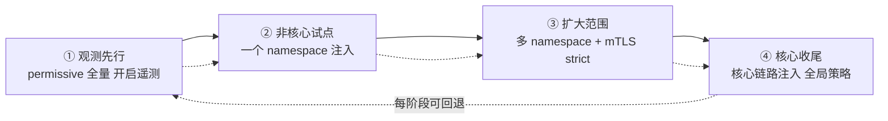
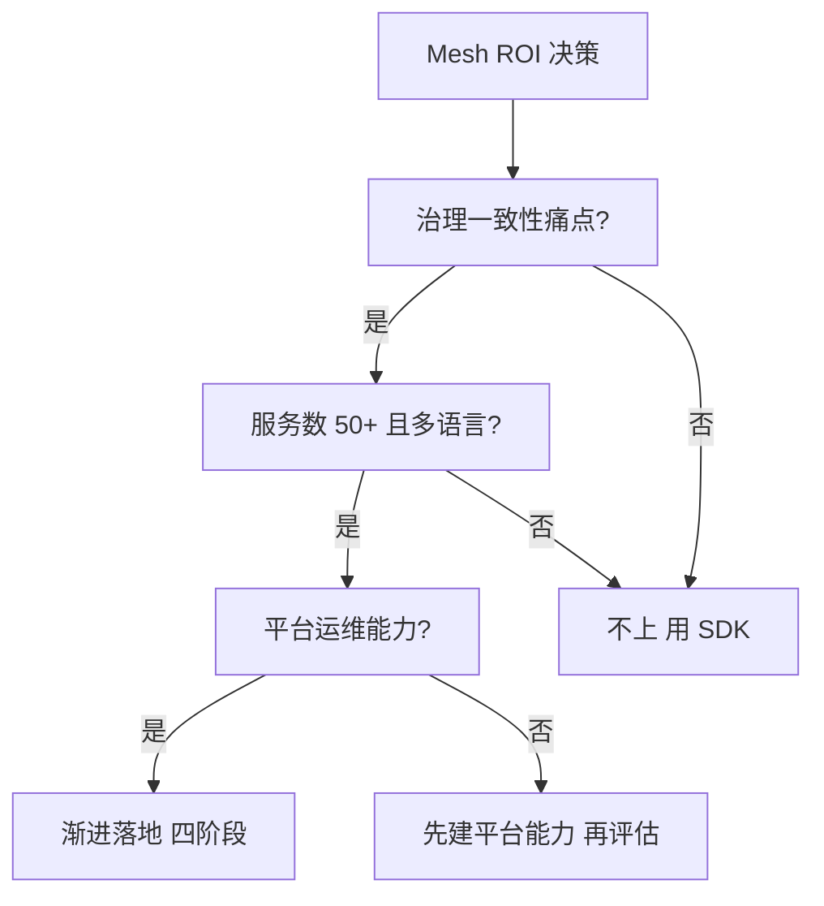

# 落地路径与代价：是否该上 Service Mesh

> 前面五篇讲了 Mesh 的能力，本篇讲最难的决策：**该不该上、怎么上、代价是什么**。Mesh 不是技术信仰问题，是 ROI 问题——资源开销、运维复杂度、团队学习曲线都是真实成本，收益要能算得清。

## 一句话摘要

上 Mesh 的决策 = **收益三问**（治理一致性痛点真吗？多语言/多团队规模到了吗？平台运维能力有了吗？）× **代价三笔账**（Sidecar 资源、延迟增量、运维复杂度）；落地路径 = namespace 灰度注入 → 观察扩展 → 核心链路收尾，**渐进是唯一正确的姿势**。

## 本文核心

**核心机制一句话**：Mesh 的收益随「服务数 × 语言数 × 团队数」增长，成本相对固定（Sidecar 资源 + Mesh 运维人力）——**规模决定 ROI，规模不到则不划算**。

**机制链**：痛点确认（治理一致性/多语言碎片化）→ 能力评估（平台运维团队）→ 渐进落地（非核心 namespace → 观察 → 扩大 → 核心链路）→ 持续运营（版本升级/容量/故障演练）。

**失效点/边界**：Mesh 不是稳定性欠账的解药（治理缺失的团队上 Mesh 是给混乱加了一层基础设施）；单语言小规模团队的 SDK 更划算。

## 收益三问的追问链（质疑者视角）

这三问经不起追问就没有资格上 Mesh——**追问是决策的质检环节**：每一问的答案都要有数字与案例支撑，否则就是「因为别人有所以我们要有」的从众决策。

## 一、收益三问（决策的前半段）

**问 1：治理一致性是真痛点吗？**——多语言团队各自维护治理 SDK（Java 一套/Go 一套/Python 一套），版本碎片化、能力不齐、升级地狱——这个痛真实存在才谈 Mesh。

**问 2：规模到了吗？**——服务数 <30 的单语言团队，Spring Cloud SDK 足够；50+ 服务、多语言、多团队，治理一致性的收益开始压过成本。

**问 3：平台运维能力有了吗？**——Mesh 需要专人运营（版本升级/容量规划/故障排查）——**没有平台团队直接上 Mesh，是把治理问题升级成了基础设施问题**。

三笔账背后的设计思想：**治理成本从「分布式分摊」收拢为「平台集中」**——集中才有规模效应（一次升级全集群受益），这是 Mesh 经济学的本质。

## 二、核心：代价三笔账

| 账 | 内容 | 量级参考 |
|---|---|---|
| **资源账** | 每 Pod Sidecar 开销（CPU/内存） | 千级 Pod ≈ 数百核常驻 |
| **延迟账** | 每跳双代理的延迟增量 | 毫秒级（对多数业务可接受，极端延迟敏感场景慎用） |
| **运维账** | Mesh 版本升级/故障排查/团队学习 | 专人 0.5-1 人力起步 |

**资源账的细化**：Sidecar 的 CPU 与流量成正比（高吞吐服务的 Sidecar 要单独配额）；内存相对固定——**高吞吐大流量 Pod 是 Sidecar 成本的主要贡献者**，这类服务可以考虑摘出 Mesh 单独治理（隔离原则的存储版）。

量级分档意识：日请求千万级、几十个服务——Mesh 的甜点区起点；亿级流量、千级服务——Mesh 从可选变必配；十万级以下的小团队——SDK 更划算。**量级决定 ROI 的分母**。

## 三、机制：渐进落地的四阶段

**四阶段的每一段都有退出条件**：观测阶段验证「Sidecar 对业务无感」；试点阶段验证「治理策略正确」；扩大阶段验证「性能与资源达标」；核心收尾验证「全链路压测通过」——**任何一段不达标就停在该段，而不是继续推进**。

> 💡 实战提示：迁移前先跑 `istioctl analyze`——官方诊断工具预检注入后的配置问题（端口冲突/资源缺失/不兼容规则），把坑提前暴露在注入之前。

## 四、实践：典型场景与常见坑

## 四、实践：典型场景与常见坑

**典型场景**：

- **多语言公司治理统一**：Mesh 把 N 套 SDK 收敛成一套基础设施
- **安全合规驱动**：mTLS 全覆盖的等保要求——Mesh 是最低改造成本的合规路径
- **多集群/多活演进**：Mesh 的跨集群流量管理是多活的通信基础

**常见坑**：

- **资源未预留**：Sidecar 注入后 Pod 资源请求翻倍，K8s 调度失败——**注入前要更新 Pod 的 resources**
- **升级顺序错误**：先升 Istio 后升数据面（或反之）的版本兼容矩阵——跟随官方升级路径
- **把 Mesh 当监控用**：Mesh 遥测是服务对维度，业务指标仍需业务埋点——期望错位是「上了 Mesh 却觉得没用」的常见根因

从架构上下游看：Mesh 落地的上游是「K8s 成熟度 + 平台团队能力」，下游是「全部业务团队的治理体验」——上游不成熟就上 Mesh，是把下游全拖下水。

## 与「单服务 Sidecar 网关」的区别

Mesh 的 Sidecar 与独立部署的 Sidecar 网关不是一回事：独立网关只代理自己这一个服务，Mesh 的价值在「控制面统一管理全集群代理」——**单服务的代理是玩具，有控制面编排的代理网络才是网格**。

## 与稳定性系列的关系

## 与稳定性系列的关系

Mesh 的故障注入是混沌演练的 Mesh 层实现；Mesh 的遥测是可观测体系的服务间数据源；Mesh 的 mTLS 是零信任的落地——**Mesh 是稳定性武器库的「基础设施化形态」**。

## 什么时候不要上 Mesh（不适用与代价）

- **单体或服务数 <20**：治理复杂度还没到，SDK/网关足够
- **单一语言且框架治理成熟**：Spring Cloud 体系已覆盖主要诉求
- **无平台运维人力**：Mesh 的运维成本没有承接者，上了就是无人区
- **对启动延迟极端敏感**：Sidecar 注入增加启动时间与每跳延迟

## 你们可能会问

**Q1：Mesh 和 API 网关功能重叠，留一个行不行？**
不行——网关管「南北向」（外部进来的流量），Mesh 管「东西向」（内部服务间），职责边界不同，大型系统两者都要。

**Q2：Sidecar 注入后老服务会挂吗？**
permissive 模式 + 灰度注入的流程下不会——注入只增加代理旁路，不改业务容器；但资源请求要提前调大。

## 自测三问

## 自测三问

## 自测三问

1. **上 Mesh 的三个前提问题是什么？**
   - 治理一致性痛点真实吗？规模到了吗（50+ 服务/多语言）？平台运维能力有了吗？——三个都是才上。

2. **渐进落地的四阶段与退出条件？**
   - 观测先行 → 非核心试点 → 扩大范围 → 核心收尾；每段有验证目标，不达标停在当前段。

3. **Sidecar 成本的主要贡献者？**
   - 高吞吐大流量 Pod（Sidecar CPU 与流量成正比）——这类服务考虑摘出或独立配额。

## 5W 速记卡

| W | 一句话 |
|---|---|
| What | Mesh 的决策框架与渐进落地路径 |
| Why | 上与不上、怎么上——决策错误与落地错误的代价都极高 |
| Where | 多语言/多团队/中大规模微服务体系 |
| When | 治理一致性痛点真实 + 平台能力具备时 |
| Who | 平台团队主导落地，业务渐进接入 |

## 开放问题

- **Mesh 的终局形态**：Sidecar → Sidecarless（Ambient）→ eBPF 内核化——代理的形态在演进，治理下沉的趋势不变，但终局未定
- **Mesh 与函数计算的融合**：Serverless 场景下的服务间治理如何用 Mesh 表达，仍是探索期

## 核心带走

**30 秒复述**：上 Mesh 的决策 = 收益三问（治理一致性痛点/规模/平台能力）+ 代价三账（资源/延迟/运维）→ 渐进落地四阶段（观测/试点/扩大/收尾），每段有退出条件。**失效边界**：无平台能力硬上、注入不改资源配额、把 Mesh 当业务监控——三条都是「上了 Mesh 反而更乱」的经典路径。

## 📌 数据与事实声明

- 写于 2026-09-11；Sidecar 资源量级与渐进路径为行业公开实践口径；ROI 判断框架为教学归纳
- 免责：决策阈值按团队实际规模与人力裁剪

## 📚 参考资料

| 类型 | 标题 | 来源 |
|---|---|---|
| 官方文档 | Istio Deployment Best Practices | istio.io |
| 行业实践 | 大厂 Mesh 落地与撤退的公开分享（有上有下，都是真实经验） | 公开报道 |
| 书 | 《Istio Service Mesh 权威解析》 | 公开出版 |
