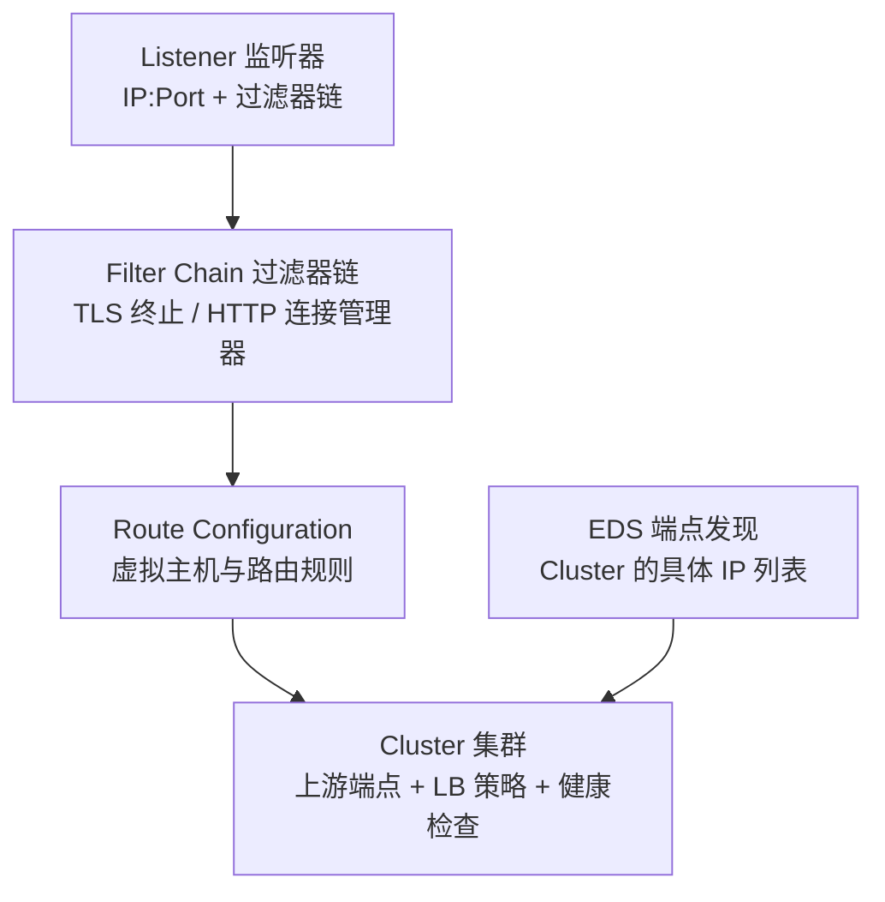
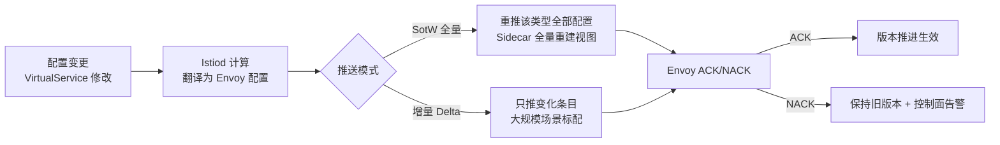
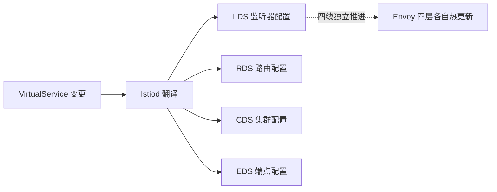

# Envoy 与 XDS 协议详解：Mesh 数据面的内核

> Envoy 是 Mesh 数据面的发动机，XDS 是它的燃油管路——理解这两者，Mesh 的一切行为都可以从配置推导。本篇下钻到 Envoy 的配置模型、线程架构与 XDS 的分发细节。

## 一句话摘要

Envoy 的配置模型 = **Listener → FilterChain → Route → Cluster 四层抽象**，XDS 协议（LDS/RDS/CDS/EDS + SDS）把四层配置从控制面推送到每个数据面实例；理解 XDS 的「最终一致 + 顺序保证 + 版本回退」三个语义，就能解释 Mesh 排障中 80% 的「配置为什么不生效」。

## 本文核心

**核心机制一句话**：Envoy 用「监听器接流量 → 过滤器链加工 → 路由决策 → 集群转发」的四段流水线处理每个连接，XDS 把四段的配置解耦为四类独立资源，支持独立变更与组合。

**机制链**：配置变更（VirtualService）→ Istiod 翻译为 XDS 资源 → gRPC 增量推送 → Envoy 热更新（Drain 机制平滑替换监听器）→ 生效；每类资源独立版本号、独立 ACK/NACK——四条配置线并行推进。

**失效点/边界**：NACK（配置被拒绝）只报错不自动回退——坏配置会卡住该类资源的版本推进；热更新的 Drain 窗口期有连接排空延迟；全量重建（如证书变更）会引发连接抖动。

## 一、Envoy 的配置模型：四层抽象

**四层的分工与 XDS 对应**：

| 层 | 职责 | XDS | 典型配置来源 |
|---|---|---|---|
| Listener | 监听端口 + 接入处理 | LDS | Sidecar 注入模板 |
| FilterChain | TLS/HTTP 解码/故障注入 | LDS(内嵌) | Sidecar 模板 + 策略 |
| Route | 路由匹配与转发规则 | RDS | VirtualService |
| Cluster | 上游服务定义 | CDS | DestinationRule + 服务发现 |
| Endpoint | 集群的具体端点 | EDS | K8s Endpoints |

**为什么拆四层**：变更频率不同——端点表（Pod 扩缩容）分钟级高频变化，路由规则低频变化，监听器几乎不变。拆开后各层独立版本推进，**高频变更不牵连低频配置**——这是配置热更新的关键设计。

## 二、核心：XDS 的三种推送语义

**三个关键语义**：

1. **最终一致**：配置推给全部 Sidecar 有先后（秒级窗口）——灰度比例的「中间态」由此而来
2. **顺序保证（同一资源类型）**：同一类资源的更新按序应用；不同类型之间无顺序保证——**路由引用了不存在的 Cluster 时会短暂 503**（CDS 未到 RDS 先到），Istiod 通过「先 CDS 后 RDS」的推送顺序规避
3. **版本回退**：配置出错 NACK 后保持旧版本——**「新配置被拒绝」是安全特性**，坏配置不会污染数据面

> 💡 实战提示：`istioctl proxy-config` 系列命令可以直接 dump 任意 Sidecar 的四层配置——排障时「用户配置 → Istiod 翻译 → Envoy 实际生效」三层对比，不一致的那层就是问题层。

## 三、机制：Envoy 的线程架构与热更新

- **线程模型**：每个 worker 线程跑完整的「监听器 → 过滤器 → 集群」处理栈（非事件分发模型）——worker 数 = CPU 核数，无锁化设计
- **热更新（Drain）**：监听器配置变更时旧监听器进入 draining 状态（存量连接继续处理直至空闲或超时），新监听器接新连接——**连接不断、配置生效**
- **Sidecar 资源画像**：Envoy 的内存大头是「集群与端点表」——万级服务场景的 SidecarScope 依赖剪枝（只推相关服务）就是砍这块内存

## 四、实践：典型场景与排障路径

- **排障三层对比**：`istioctl proxy-config` dump 四层配置 → 与用户的 VirtualService/DestinationRule 对照 → 不一致的层就是「翻译或推送」出问题的层
- **NACK 排查**：Istiod 日志搜 NACK——常见原因：引用了不存在的 subset、配置字段类型错误、版本不兼容
- **推送延迟监控**：配置版本更新时间戳与 ACK 时间戳的差值（push latency）——秒级以上说明控制面或网络有压力

**典型场景**：

- **金丝雀比例不生效**：查 RDS 是否推送成功（版本推进）→ 推了但路由没命中 → 查 match 条件的 header 大小写/前缀匹配
- **部分 Sidecar 行为不一致**：某实例 NACK 后保持旧版本——检查该实例的 Envoy 版本兼容性

## 五、为什么不用 Nginx 而用 Envoy（设计思想）

Nginx 是优秀的反向代理，但 **Envoy 从第一天就为「动态配置」设计**：全量 API 驱动（XDS）、热更新无 reload、最终一致的分布式语义——Nginx 的 reload 是「换一个进程」，Envoy 的更新是「同一个进程换配置」。**这个底层设计差异决定了 Mesh 只能选 Envoy 这类 API 驱动的代理**。

业内惯例与生产实践：大厂 Mesh 团队的共识是「配置变更走 GitOps + 自动 NACK 监控」——VirtualService 的每次修改都经 PR 评审与 CI 校验（防止坏配置推到数据面），生产环境禁止控制台直改。

## 常见误区

- **误区一：配置推了就一定生效**。NACK（拒绝）是常态化的保护机制——被 Envoy 拒绝的配置保持旧版本，控制面要监控 NACK 率
- **误区二：不同类型资源的推送顺序无关紧要**。RDS 引用 CDS 的集群名——先推 RDS 后推 CDS 会有短暂 503；Istiod 内部有排序，但自定义 XDS 服务要注意
- **误区三：Sidecar 内存可以无限堆**。端点表随服务数线性增长，万级服务不配 SidecarScope 会把每个 Sidecar 撑到 GB 级内存

## 你们可能会问

**Q1：XDS 推送失败会不会丢配置？**
不会——Envoy NACK 后保持旧版本，Istiod 会重试推送；控制面日志与 Istiod 指标（pilot_xds_pushes）能看到推送失败率。

**Q2：怎么知道一个 Sidecar 的配置是不是最新的？**
`istioctl proxy-status` 显示每个 Sidecar 的 sync 版本——与 Istiod 当前版本对比，落后的就是推送延迟或失败的实例。

**Q3：Sidecar Scope 会不会导致依赖发现不完整？**
会——剪枝后 Sidecar 只感知配置的命名空间；跨命名空间调用的服务要显式加进 exportTo 或 Sidecar 的 egress 配置。

## 自测三问

1. **XDS 为什么拆成四类独立资源？**
   - 变更频率不同（端点高频/监听器低频）——拆开独立版本推进，高频变更不牵连低频配置。

2. **NACK 意味着什么？**
   - 数据面拒绝了控制面的配置（非法/不兼容）——旧版本继续生效，这是坏配置不污染数据面的保护机制；NACK 需要告警排查。

3. **万级服务下 Sidecar 内存爆炸怎么解？**
   - SidecarScope 依赖剪枝——每个 Sidecar 只感知它的命名空间与依赖服务，把全量端点表裁剪成局部表。

## 5W 速记卡

| W | 一句话 |
|---|---|
| What | Envoy 四层配置模型 + XDS 推送协议的完整体系 |
| Why | Mesh 的一切行为由配置驱动——理解 XDS 就是理解 Mesh 的神经系统 |
| Where | 控制面到全部数据面的配置链路 |
| When | 每次配置变更/证书轮换/端点变化 |
| Who | Istiod 翻译推送，Envoy 执行，平台团队监控 NACK |

## 追问链与我的判断

**追问链 1**：「XDS 推送是推给全部 Sidecar 还是只推受影响的？」→ Istiod 计算每个 Sidecar 的依赖范围，只推受影响的 → 那 Sidecar 没配 Scope 时全量感知，一次推送就是万级实例——**这就是 SidecarScope 存在的理由**。

**追问链 2**：「NACK 后配置卡住了，用户看到的什么？」→ 路由还是旧的（用户无感），但 Istiod 日志在报错——**不告警的 NACK = 配置变更静默失败**，这是 Mesh 运维的隐形坑。

**我的判断**：XDS 的「最终一致 + 版本回退」设计是 Envoy 对分布式配置管理最成熟的答案——比 Apollo/Nacos 的配置中心多了一层「拒绝坏配置」的保护，代价是理解四层资源模型的学习成本。这笔学习投资对 Mesh 用户是必修课。

## 开放问题

- **XDS 的推送风暴**：万级 Sidecar 同时重连（Istiod 滚动升级）的推送收敛，增量 XDS 缓解但未根治
- **配置可观测的标准**：三层对比（用户意图/翻译结果/实际生效）目前靠命令逐层 dump，自动 diff 工具仍在发展

## 核心带走

**30 秒复述**：Envoy 四层抽象（Listener/Filter/Route/Cluster）+ XDS 五协议（+SDS 证书）= Mesh 数据面的完整配置模型；推送语义是最终一致 + 顺序保证 + 版本回退（NACK 保护）。**失效边界**：NACK 不告警则配置卡住无人知；无 SidecarScope 则万级服务内存爆炸；推送顺序错则短暂 503。

## 核心带走

**30 秒复述**：Envoy 四层抽象（Listener/Filter/Route/Cluster）+ XDS 五协议（+SDS 证书）= Mesh 数据面的完整配置模型；推送语义是最终一致 + 顺序保证 + 版本回退（NACK 保护）。**失效边界**：NACK 不告警则配置卡住无人知；无 SidecarScope 则万级服务内存爆炸；推送顺序错则短暂 503。

**架构演进的取舍复盘**：XDS 从全量到增量的演进、Istiod 从单 Pod 到多实例的水平扩展、SidecarScope 从无到有——**每一次架构演进都对应一个量级瓶颈的突破**；架构的合理性永远相对于当时的量级，量级变了架构要跟着演进。这也是「量级分档」作为写前约束的底层逻辑。

## 📌 数据与事实声明

- 写于 2026-09-11，基于 Envoy 1.3x / Istio 1.2x 官方文档与源码口径
- 免责：以 envoyproxy.io / istio.io 为准

## 📚 参考资料

| 类型 | 标题 | 来源 |
|---|---|---|
| 官方文档 | Envoy XDS Protocol | envoyproxy.io/docs/envoy/latest/api-docs/xds_protocol |
| 官方文档 | Istio Sidecar Resource | istio.io/latest/docs/reference/config/scope |
| 书 | 《Istio Service Mesh 权威解析》Envoy 章 | 公开出版 |
