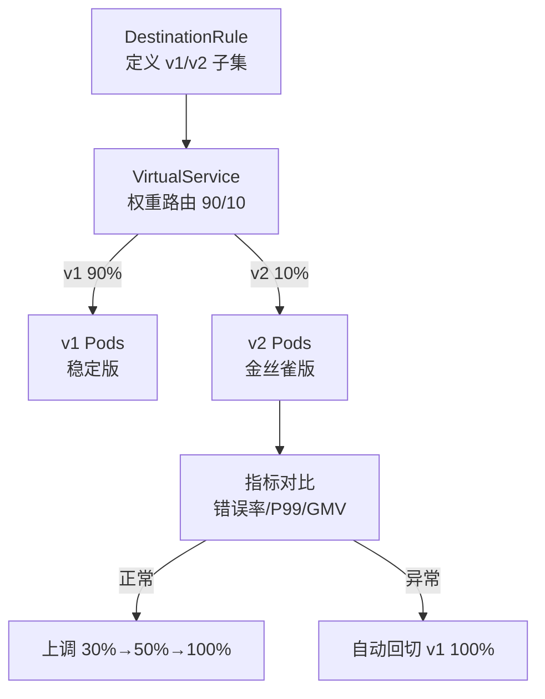
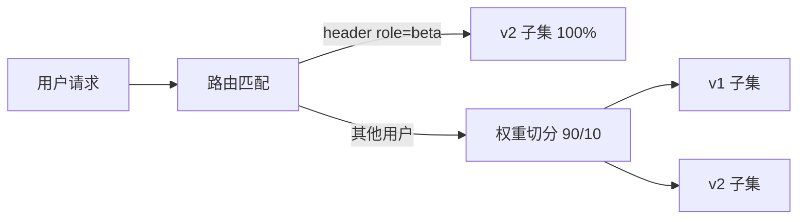

# 流量规则与金丝雀发布实战：从 VirtualService 到生产发布

> 金丝雀发布是 Mesh 流量管理的招牌能力——但生产级的金丝雀不只是「设个 10% 权重」。本篇从规则语法到发布流程、从指标守护到自动回滚，讲生产可用的完整金丝雀方案。

## 一句话摘要

生产级金丝雀 = **VirtualService 权重路由（流量切分）** + **DestinationRule 子集（版本定义）** + **指标对比守护（新版本 vs 基线）** + **自动回滚（指标异常即回切）**——四者缺一不可：只有路由没有守护是盲飞，只有守护没有路由是无米之炊。

## 本文核心

**核心机制一句话**：金丝雀的本质是「用路由规则控制暴露面大小，用指标对比控制推进节奏」——权重是旋钮，指标是仪表盘，回滚是刹车。

**机制链**：DestinationRule 按 Pod label 定义 v1/v2 子集 → VirtualService 按权重路由（90/10）→ 指标面板对比两版本错误率/P99 → 异常自动回切 100% v1 → 复盘修复后重来。

**失效点/边界**：权重路由不保证「同一用户始终同一版本」（需要一致性则用 header 灰度）；指标对比要有足够流量（低流量服务对比无统计意义）；数据库 schema 变更不在 Mesh 灰度范围内（数据迁移是另一条线）。

## 一、背景：金丝雀的三种粒度

| 粒度 | 手段 | 适用 |
|---|---|---|
| **实例级** | 发布系统按批次替换 Pod | 基础发布安全 |
| **流量级（Mesh）** | VirtualService 按 weight 切流 | 版本 A/B 对比 |
| **用户级** | 按 header/cookie 精准导流 | 内测/白名单 |

三种粒度可叠加：金丝雀 Pod 上线（实例级）→ Mesh 10% 流量（流量级）→ 白名单用户全走 v2（用户级）——**从「撞得到」到「定向试」逐步放大暴露面**。

## 二、核心：完整的生产金丝雀配置



**完整配置示例**（生产级）：

```yaml
# DestinationRule: 定义子集
apiVersion: networking.istio.io/v1beta1
kind: DestinationRule
metadata:
  name: reviews
spec:
  host: reviews
  subsets:
  - name: v1
    labels: { version: v1 }
  - name: v2
    labels: { version: v2 }

# VirtualService: 权重路由 + 超时重试
apiVersion: networking.istio.io/v1beta1
kind: VirtualService
metadata:
  name: reviews
spec:
  hosts: [reviews]
  http:
  - route:
    - destination: { host: reviews, subset: v1 }
      weight: 90
    - destination: { host: reviews, subset: v2 }
      weight: 10
    timeout: 3s
    retries:
      attempts: 2
      perTryTimeout: 1s
      retryOn: "connect-failure,reset,5xx"
```

**配置的三个生产纪律**：

1. **超时与重试必须显式声明**——不配则走默认（无重试/无限流），金丝雀版的超时策略要与 v1 对齐（否则对比指标不公平）
2. **子集的 label 与 Pod 完全匹配**——label 拼错时 subset 查不到端点，流量到 v2 会 503（这是金丝雀最常见的翻车）
3. **权重变更走 GitOps**——直接改线上的 VS 是「无审批的生产变更」，与配置变更治理（第 11 篇）冲突




## 三、机制：指标守护与自动回滚

## 三、机制：指标守护与自动回滚

金丝雀的灵魂不在路由在**守护**。指标对比的完整设计：

| 指标 | 基线来源 | 异常阈值 | 动作 |
|---|---|---|---|
| 错误率 | v1 同期 | v2 > v1 × 2 | 回滚 |
| P99 延迟 | v1 同期 | v2 > v1 × 1.5 | 暂停放量 |
| 业务指标（GMV/转化） | 历史曲线环比 | 环比降 20% | 回滚 + 告警 |

**自动回滚的实现路径**：指标平台（Prometheus）检测异常 → 调用 Istio API 把 v2 权重调回 0 → 告警通知——**回滚脚本要提前验证**（演练时真回滚一次，确保权限与流程通）。

> 💡 实战提示：金丝雀观察期不要低于 30 分钟——部分问题（缓存失效后的回源、连接池耗尽）需要时间暴露；「发布完 5 分钟没事就全量」是金丝雀形同虚设的标志。

底层实现的关键路径在 Envoy 的 RouteConfiguration：权重路由的 `weighted_clusters`、header 匹配的 `header_match`、故障注入的 `fault filter`——VirtualService 是这些 Envoy 配置的高级语法糖。**理解翻译关系，路由不生效时就知道去 Envoy 配置里查什么**。

## 四、实践：典型场景与常见坑

**典型场景**：

- **新版本验证**：v2 上线 → 5% 金丝雀 → 指标对比 30 分钟 → 正常则 25% → 50% → 100%——每步指标守护
- **A/B 测试**：按 header 精准分流（会员走新版/非会员走旧版），业务效果对比
- **回滚验证**：金丝雀发现异常 → 自动回切 → 确认 v1 恢复正常 → 保留 v2 日志供排查

**常见坑**：

- **坑 1：subset 的 label 匹配不上**——v2 Pod 没有 `version: v2` label 或 label 拼错，流量路由到空子集 503。排查：`istioctl proxy-config endpoint` 看 subset 端点是否为空
- **坑 2：金丝雀期间用户来回跳版本**——权重路由不保证会话粘性，用户一次刷新走 v1 下一次走 v2。需要会话粘性则用 header 灰度（登录后 header 固定版本）
- **坑 3：低流量服务的金丝雀无统计意义**——日 1000 请求的服务 10% = 100 请求，错误率对比无统计显著性；**低流量服务的金丝雀靠人工判断，不靠指标对比**

量级分档的取舍：日千万级请求的服务金丝雀 10% = 百万级样本，统计意义充分；日十万级请求的服务金丝雀 10% 只有万级样本——**量级决定金丝雀的样本充足度与观察策略**，低量级服务靠人工判断而非统计。

## 五、业内惯例与生产实践

## 五、业内惯例与生产实践

大厂 Mesh 团队的金丝雀已从「手动调权重」演进到「自动化分析引擎」（如 Flagger/Argo Rollouts）：定义指标阈值 → 自动调整权重 → 异常自动回滚——**人工只做审批，机器做节奏**。这是金丝雀的下一站（第 12 篇发布体系的自动化延伸）。

何时用哪个的决策表：版本灰度用子集权重、精准内测用 header 路由、新版本预演用镜像、韧性测试用故障注入——按目标选手段，不按炫技选手段。

## 追问链与我的判断

**追问链 1**：「金丝雀 10% 出问题，那 10% 的用户不是白当小白鼠了？」→ 是的，这正是金丝雀的本质代价 → 有没有零暴露的方案？→ 有：流量镜像（真实流量预演但响应丢弃）+ 测试环境全链路压测 → **金丝雀是「最后一步验证」而非「第一步测试」**——测试不充分就上金丝雀，是拿用户当测试。

**追问链 2**：「Mesh 金丝雀和蓝绿部署什么区别？」→ 蓝绿是全量切换（100%↔0%，资源双倍），金丝雀是渐进暴露（资源按需）→ Mesh 的权重路由让「蓝绿」变成「任意比例的渐进」——**Mesh 金丝雀是蓝绿的细粒度演进**。

**我的判断**：金丝雀的自动化程度是发布成熟度的试金石——手动调权重的金丝雀是入门，指标守护 + 自动回滚才是生产级。**发布自动化的尽头不是无人值守，是「自动执行 + 人守边界」**。

## 你们可能会问

**Q1：金丝雀期间缓存怎么处理？**
新旧版本如果用不同的缓存 key 结构，需要双写缓存或缓存版本隔离——否则 v2 写的新格式 v1 读不懂。

**Q2：金丝雀的比例精确吗？**
权重是概率性的（每个请求独立按权重分配），不是精确 10:90 的计数——大流量下趋近精确，小流量有偏差。

## 常见误区

- **误区一：金丝雀就是加个权重**。没有指标对比与自动回滚的权重路由，只是「慢一点的直接全量」
- **误区二：金丝雀只看错误率**。业务指标（GMV/转化率）的变化往往早于错误率——金丝雀要配业务指标守护
- **误区三：v2 稳定后立刻删 v1**。保留旧版本至少一个回滚窗口（24h+），防止 v2 的长尾问题触发紧急回切

## 自测三问

1. **生产级金丝雀的四要素是什么？**
   - 权重路由（切流量）+ 子集定义（版本分组）+ 指标对比（判断依据）+ 自动回滚（刹车）——缺一不可。

2. **subset 路由到空子集的常见原因？**
   - Pod label 与 subset 定义不匹配——用 `istioctl proxy-config endpoint` 检查子集端点是否为空。

3. **低流量服务的金丝雀怎么做？**
   - 流量不足以做统计对比，金丝雀退化为「人工观察 + 延长观察期」；或先做流量镜像预演，再小比例金丝雀。

## 5W 速记卡

| W | 一句话 |
|---|---|
| What | VirtualService 权重路由 + 指标守护 + 自动回滚的生产金丝雀 |
| Why | 版本发布的安全验证——渐进暴露、异常即回 |
| Where | Mesh 内全部服务的版本发布 |
| When | 每次新版本上线、每次架构变更验证 |
| Who | 开发发起、平台自动化执行、SRE 守护指标 |

## 开放问题

- **金丝雀的智能化**：指标对比的统计显著性判断（多少流量才有统计意义）与自动分析（AI 判断指标异常）在头部团队试点，通用方案未成熟
- **数据库变更的金丝雀**：代码可以金丝雀，schema 变更没有金丝雀——数据变更的安全验证仍是开放难题（expand/migrate/contract 是缓解不是解）

## 核心带走

**30 秒复述**：生产金丝雀 = DR 子集 + VS 权重路由 + 指标守护（错误率×2 回滚/P99×1.5 暂停）+ 自动回滚；金丝雀是「最后一步验证」不是「第一步测试」；低流量服务不靠指标靠人。**失效边界**：label 不匹配空子集 503、无会话粘性的用户跳版本、观察期不足 30 分钟——三条是金丝雀翻车 Top3。

## 📌 数据与事实声明

- 写于 2026-09-11，基于 Istio 1.2x VirtualService/DestinationRule 官方文档口径
- 行业认知：金丝雀发布最佳实践参考 Flagger/Argo Rollouts 开源项目与公开分享
- 免责：以 istio.io 与各发布工具官方文档为准

## 📚 参考资料

| 类型 | 标题 | 来源 |
|---|---|---|
| 官方文档 | Istio: Canary deployments | istio.io/latest/blog |
| 官方项目 | Flagger（自动化金丝雀） | flagger.app |
| 官方项目 | Argo Rollouts | argo-rollouts.readthedocs.io |
