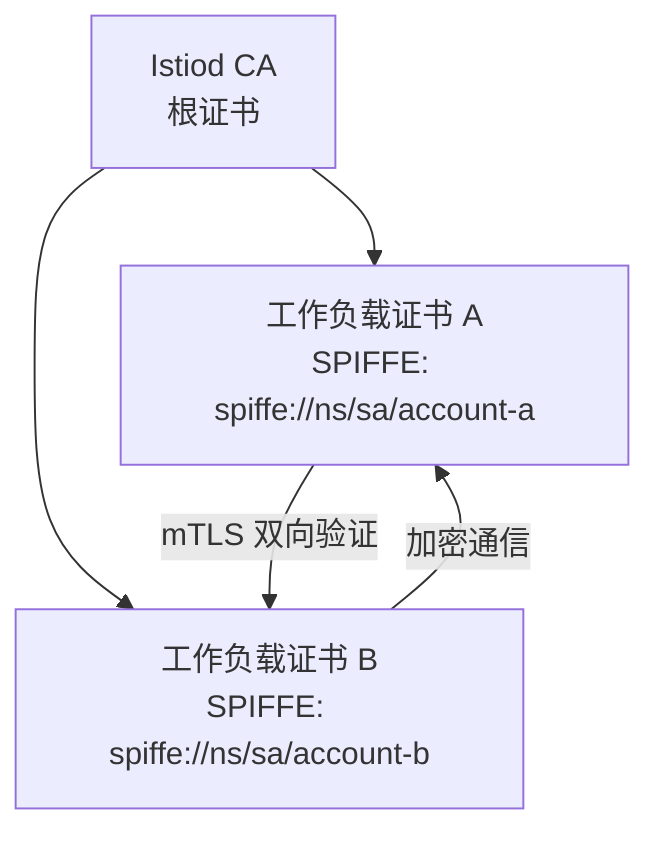
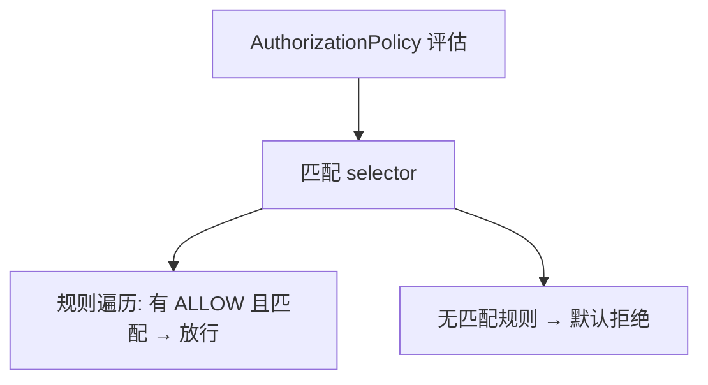
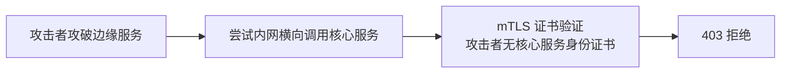

# mTLS 与零信任安全：Mesh 层的完整安全体系

> 零信任的核心理念是「不信任网络位置，只验证身份」——Mesh 的 mTLS + AuthorizationPolicy 把这个理念从安全白皮书变成了基础设施层的能力。本篇下钻到证书体系、授权模型与生产安全事件推演。

## 一句话摘要

Mesh 安全三层：**mTLS**（传输加密 + 服务身份验证，解决窃听与冒充）→ **AuthorizationPolicy**（L7 授权，解决越权调用）→ **审计**（全流量可追溯，解决事后追查）；与业务安全互补不替代——Mesh 管服务间通信安全，业务管用户级安全。

## 本文核心

**核心机制一句话**：mTLS 的本质是「用基础设施层强制执行身份验证」——每个工作负载持有 CA 签发的 SPIFFE 身份证书，Sidecar 间双向验证后加密通信，冒充与窃听在协议层被杜绝。

**机制链**：控制面 CA 启动时生成根证书 → 每 Pod 创建时自动签发工作负载证书（含 SPIFFE ID）→ Sidecar 间连接时双向证书验证 → 加密通信；AuthorizationPolicy 在 mTLS 之上叠加 L7 授权（who can call what）。

**失效点/边界**：证书泄露在轮换周期内仍有影响（短有效期是缓解非根治）；mTLS 只覆盖 Mesh 内流量（外部 API 的 TLS 另配）；授权策略配错会阻断合法调用。

## 一、背景：零信任与内网裸奔的代价

传统内网模型「护城河 + 城堡」的假设在微服务 + 云原生环境下全面失效：Pod IP 动态变化、服务间东西向流量绕过防火墙、一个边缘服务被攻破后内网横向移动畅通无阻。

**零信任的核心转变**：「网络位置 → 工作负载身份」——不再问「你从哪个 IP 来」，改问「你是谁、你的证书有效吗」。Mesh 的 mTLS 是零信任在服务间通信层的落地。

从实现角度看，mTLS 的关键路径在 Envoy 的 SslSocket（TLS 握手与加解密）和 Istiod 的 CA 模块（证书签发与轮换）——理解「证书怎么来、怎么验证」就理解了 mTLS 的机制本质。

## 二、核心：证书体系与 SPIFFE 身份



**SPIFFE 身份格式**：`spiffe://<trust-domain>/<namespace>/<service-account>`——证书绑定的是「K8s namespace + ServiceAccount」的身份，不是 IP 地址。Pod 扩缩容 IP 变了身份不变——**身份与位置解耦是零信任的基石**。

**证书轮换**：默认 24 小时有效期自动轮换（无需重启业务），泄露影响窗口被轮换机制限制。

## 三、核心

mTLS 的设计思想是把安全操作从运维动作降为基础设施属性——证书签发/轮换/撤销全部内化到控制面。：AuthorizationPolicy 的授权模型

```yaml
# 只允许 frontend SA 调用 reviews 的 GET
apiVersion: security.istio.io/v1beta1
kind: AuthorizationPolicy
metadata: { name: reviews-viewer, namespace: default }
spec:
  selector: { matchLabels: { app: reviews } }
  action: ALLOW
  rules:
  - from:
    - source: { principals: ["cluster.local/ns/default/sa/frontend"] }
    to:
    - operation: { methods: ["GET"] }
```

**默认拒绝语义**：一旦某工作负载有任何 ALLOW 规则，未匹配规则的请求全部拒绝——这是「白名单思维」的强制化。





量级分档的取舍：千级 Pod 全量 mTLS 的 CPU 开销约 5-10%（公开基准）；亿级流量的入口层加解密成本需专门评估（可能需要硬件加速或仅对核心链路加密）；千万级以下的中小规模 mTLS 开销几乎无感。

## 四、实践：典型场景与防资损联动

**典型场景**：金融系统支付服务只允许订单服务调用（AuthorizationPolicy 按 principals 限制）；多租户平台租户 A 的服务不能调租户 B 的数据库代理。

**防资损联动**：Mesh 层 mTLS 防止中间人窃听支付信息，AuthorizationPolicy 防止未授权服务调用资金接口——这是资金安全的技术兜底，与业务层的资金校验互补。

**生产事故推演**：某微服务的调试接口 `/debug/pprof` 暴露在内网，被攻击者利用获取内存数据——如果有 AuthorizationPolicy 限制 `/debug` 路径只允许运维 SA 访问，这个攻击路径就不存在。

安全体系在架构上下游的位置：Mesh 安全层处理「服务间通信」这一段（传输加密+服务身份+L7 授权），上游是「用户身份认证」（JWT/OAuth），下游是「业务逻辑校验」（参数/风控）——三段串联才是完整的零信任链路，缺任何一段都是安全短板。

业内惯例与生产实践：金融行业 Mesh 落地的安全基线是「mTLS strict 全覆盖 + AuthorizationPolicy 核心链路全覆盖 + 调试接口全关闭」——这是安全审计的检查项，不是可选优化。

## 追问链与我的判断

**追问链 1**：「mTLS 加密了，还需要 HTTPS 吗？」→ 入口层外部用户走 HTTPS（浏览器不支持 mTLS），内部服务间走 mTLS——两层加密管两段链路，不冲突。

**追问链 2**：「证书被盗了攻击者能冒充吗？」→ 证书绑定 SPIFFE ID + K8s ServiceAccount——攻击者需要同时拿到 Pod 的 token 与私钥，比窃取静态 API Key 难一个量级；但**不是不可能**，所以还需要 AuthorizationPolicy 做行为层的最小权限限制。

**我的判断**：mTLS 是零信任的「传输层地基」，但零信任的完整性还需要授权策略与业务层安全叠加——**单靠 Mesh 安全层不能解决全部安全问题，不要因为上了 Mesh 就放松安全审计**。

## 常见误区

- **误区一：mTLS 之后不需要业务层鉴权**。mTLS 认证的是「服务身份」，业务层的用户身份（JWT/Session）仍是业务层的事——服务身份≠用户身份
- **误区二：permissive 模式已经安全了**。permissive 允许明文并存，等于加密了但没全加密——目标态必须是 strict
- **误区三：AuthorizationPolicy 配多了会影响性能**。L7 授权在 Sidecar 本地执行，微秒级开销——大规模场景的性能瓶颈不在授权

## 你们可能会问

**Q1：mTLS 的性能开销到底多少？**
公开基准显示 5-10% CPU 开销（TLS 握手 + 加解密），延迟增量微秒级——多数业务可接受；极端性能场景可评估仅对核心链路开 mTLS。

**Q2：AuthorizationPolicy 和 K8s NetworkPolicy 什么区别？**
NetworkPolicy 管三四层的 IP/端口隔离，AuthorizationPolicy 管七层的「身份+方法+路径」授权——两者叠加使用，网络边界与应用语义各管一段。

**Q3：mTLS 和业务鉴权怎么配合？**
mTLS 认证服务身份（基础设施层），业务层认证用户身份（JWT/RBAC）——两层互补不互替，零信任的完整链路需要三层串联。

## 何时用哪个（速查决策）

- 传输加密 → mTLS；服务调用权限 → AuthorizationPolicy；用户权限 → 业务层 JWT/RBAC——三层各管一段，组合使用。

> 💡 实战提示：mTLS strict 切换前，先用 Kiali 的 mTLS 面板检查覆盖率——确认全部服务对都显示锁形图标后再切 strict，否则某个漏注入的服务会突然断连。

## 自测三问

1. **mTLS 的身份验证机制是什么？**
   - SPIFFE 身份证书（K8s SA 绑定）双向验证——身份与位置解耦，Pod IP 变化不影响身份。

2. **AuthorizationPolicy 的默认语义是什么？**
   - 白名单：有 ALLOW 规则的工作负载，未匹配规则的请求全部拒绝——默认拒绝而非默认放行。

3. **mTLS 和业务鉴权的边界？**
   - mTLS 管服务间通信身份（基础设施层），业务鉴权管用户身份与操作权限（业务层）——两层叠加不可互替。

## 5W 速记卡

| W | 一句话 |
|---|---|
| What | mTLS 加密 + SPIFFE 身份 + L7 授权的 Mesh 安全体系 |
| Why | 零信任的服务间落地：不信任网络位置，只验证工作负载身份 |
| Where | Mesh 内全部服务间通信 |
| When | permissive 起步渐进迁移，最终 strict 全加密 + 全授权 |
| Who | 平台运营 CA 与证书，业务定义授权规则 |

## 开放问题

- **Mesh 安全与 CI/CD 的联动**：授权策略的变更是否需要像代码一样走 PR 评审——安全策略的 GitOps 化仍在探索
- **跨集群信任域**：多集群 Mesh 的信任域联邦（跨集群证书互认）配置复杂，简化方案仍在演进

## 核心带走

**30 秒复述**：Mesh 安全 = mTLS（SPIFFE 身份证书 + 双向验证 + 加密通信）+ AuthorizationPolicy（白名单 + L7 授权）+ 审计（全流量可追溯）。**失效边界**：permissive 停留、证书泄露影响窗口、授权策略配错阻断合法调用——三层布防按事前/事中/事后覆盖。

## 📌 数据与事实声明

- 写于 2026-09-11，基于 Istio 安全模型（SPIFFE/AuthorizationPolicy）官方文档口径
- 免责：以 istio.io 为准

## 📚 参考资料

| 类型 | 标题 | 来源 |
|---|---|---|
| 官方文档 | Istio Security Concepts | istio.io/latest/docs/concepts/security |
| 标准 | SPIFFE Specification | spiffe.io |
| 书 | 《零信任网络》Evan Gilman | 公开出版 |
