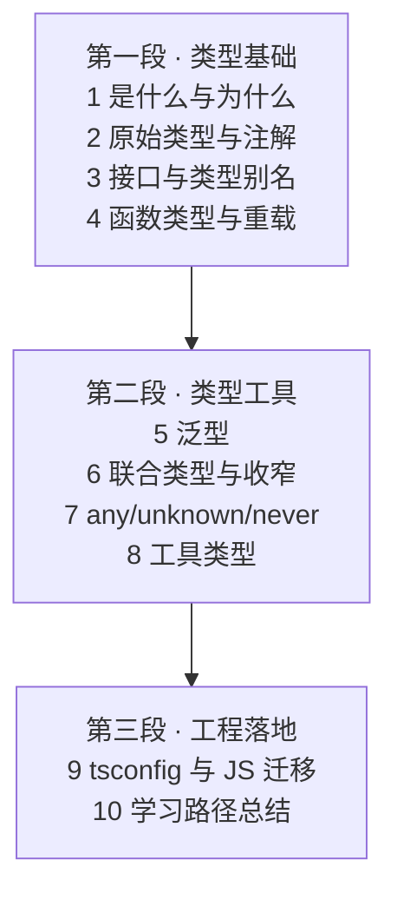

# TypeScript 系列导读

> TypeScript = JavaScript + 类型系统。它不改变 JS 的运行时，只在编译期做类型检查——这个定位决定了它的全部学习路径：先补类型思维，再学类型工具，最后融进工程。本系列按「类型基础 → 类型工具 → 工程落地」三段推进。

## 一句话摘要

TypeScript 系列入门层 10 篇：从「TS 是什么、和 JS 的区别」起步，经类型系统基础（注解/接口/函数/泛型）、类型工具（收窄/工具类型/any-unknown-never 三兄弟），到 tsconfig 工程配置与 JS 项目渐进迁移——读完能在真实工程里写出类型安全的 TS 代码。

## 一、为什么 TS 已经是前端默认选项

JavaScript 的类型问题在小型脚本里不明显，在中大型项目里是灾难性的：函数参数传错类型要等运行时才炸、重构改个字段名全靠全文搜索、IDE 补全靠猜。TS 的回答是**编译期类型检查**——把一大类错误从「上线后用户发现」提前到「保存文件时编辑器标红」。

行业事实：主流框架（Vue 3、Angular）与工具链全部用 TS 编写，新项目默认 TS 已经是行业共识。**学 TS 不是「多学一门语言」，是给已有的 JS 知识装上类型层**——JS 能力全部复用，学习成本集中在类型系统本身。

## 二、系列地图：三段十篇

| 段 | 回答的问题 | 篇目 |
|---|---|---|
| 类型基础 | TS 是什么？类型怎么标注？ | 1-4 |
| 类型工具 | 复杂类型怎么表达与收窄？ | 5-8 |
| 工程落地 | 怎么配置、怎么从 JS 迁移？ | 9-10 |

## 三、怎么读这个系列

- **JS 转 TS**（最常见路径）：按 1 → 9 顺序读，重点在 2/3/6（日常 80% 的类型代码是这三篇的内容）
- **速查**：每篇的「自测三问」与「常见误区」可当 checklist；7（any/unknown/never）与 8（工具类型）适合当工具书回头翻
- **前置要求**：会 JavaScript（ES6+，函数/对象/数组方法）——本系列不重复讲 JS

**学习方法建议**：TS 是练出来的不是看出来的——每读完一篇，把手头 JS 项目的单个文件改成 TS，比通读十篇都有用。第 9 篇专门讲怎么渐进迁移（允许 `.js` 与 `.ts` 共存）。

## 四、分层与演进

- **入门层（本层，10 篇）**：类型系统主干 + 工程迁移——读完能在项目里写 TS
- **特性层（规划）**：类型编程入门（条件类型/映射类型/infer）、装饰器、声明文件（.d.ts）编写、tsconfig 深挖
- **专题层（规划）**：大型项目类型架构（类型安全的 API 层/状态管理）、TS 编译原理概览

## 维护说明

- **下篇衔接**：1 是什么与为什么 → 2 类型基础 → 3 接口与类型别名 → 4 函数与重载 → 5 泛型 → 6 联合与收窄 → 7 三兄弟 → 8 工具类型 → 9 工程迁移 → 10 总结
- **边界**：本系列讲类型系统与工程迁移，框架内使用（Vue/React + TS）留给前端框架系列

## 📌 数据与事实声明

- 写于 2026-09-10，基于 TypeScript 5.x 主线
- 行业认知：「新项目默认 TS」为前端社区公开共识（State of JS 调查 TS 使用率连年上升，公开数据）
- 免责：语法与编译选项以 typescriptlang.org 官方文档为准

## 📚 参考资料

| 类型 | 标题 | 来源 |
|---|---|---|
| 官方文档 | The TypeScript Handbook | typescriptlang.org/docs/handbook |
| 官方 playground | TS 在线演练场 | typescriptlang.org/play |
| 书 | 《Effective TypeScript》Dan Vanderkam | 公开出版 |
