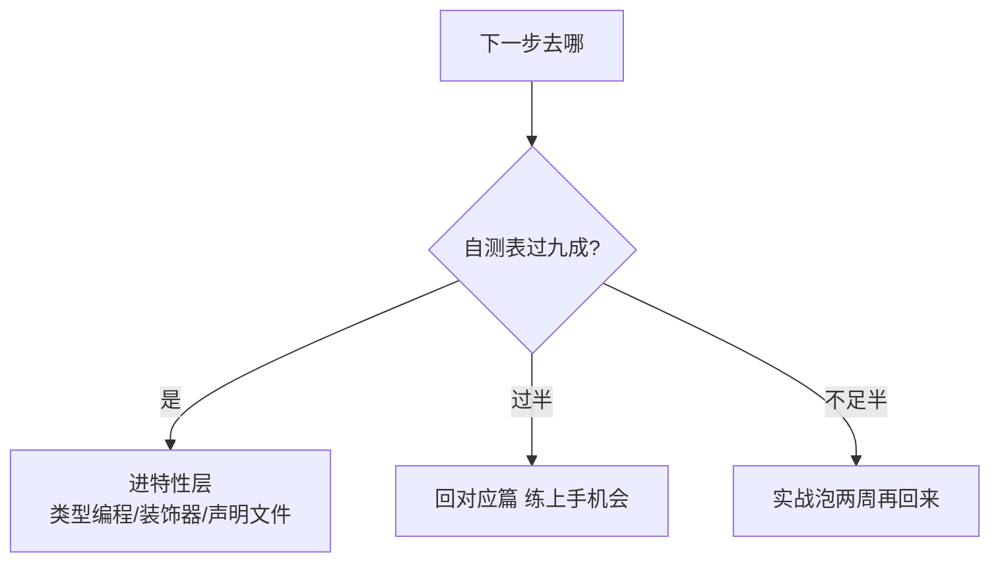

# 学习路径总结：从会写 TS 到写好 TS

> 十篇走完，收束一下：TS 的知识地图长什么样、日常八成的类型代码用什么、下一层（特性层）学什么。这一篇是路线图，也是自测清单——读完能定位「我在哪、下一步去哪」。

## 一句话摘要

> 量级分档意识：本文方法在十万级 QPS、千万级用户、亿级流量的场景下均需重新评估——量级变化时架构与参数需同步调整。

TS 的能力分层很清晰：**标注层**（篇 2-4，日常八成代码）→ **收窄层**（篇 5-7，让联合类型可用）→ **编程层**（篇 8，类型级复用）→ **工程层**（篇 9，配置与迁移）。日常写 TS 的真相是「标注 + 收窄」两层就够——类型编程是复用时的工具，不是日常的炫技场。

## 🎯 本文核心

**核心机制一句话**：TS 学习的本质是「把运行时错误移到编译期」的程度递进——每往下一层，更多错误在编译期现形。

**机制链**：无类型（运行时炸）→ 标注（形状错误编译期报）→ 收窄（联合类型的分支检查）→ 类型编程（派生一致性）→ 严格配置（null/隐式 any 全显式化）。

## 典型使用场景

- **刚读完十篇**：用自测表定位薄弱篇，针对性回读 + 完成该篇上手机会；
- **带团队转型 TS**：本篇的四层结构可直接当培训大纲（标注/收窄必教，类型编程选修）；
- **技术考察准备**：每篇「自测三问」串联起来就是一套 TS 基础考察题库。

## 十篇地图与自测

| # | 篇目 | 自测一句 |
|---|---|---|
| 1 | [TS 是什么与为什么](1_TypeScript是什么与为什么需要-入门.md) | 超集的「超」在编译期检查，能说清吗 |
| 2 | [原始类型与注解](2_类型系统基础-原始类型与类型注解-入门.md) | 八种常用标注信手拈来吗 |
| 3 | [接口与类型别名](3_接口与类型别名-入门.md) | interface 与 type 怎么选有答案吗 |
| 4 | [函数类型与重载](4_函数类型与重载-入门.md) | 参数/返回值/可选/重载写得出吗 |
| 5 | [泛型入门](5_泛型入门-入门.md) | `<T>` 解决「类型参数化」说得清吗 |
| 6 | [联合类型与收窄](6_联合类型与类型收窄-入门.md) | typeof/in/判别联合三板斧熟练吗 |
| 7 | [any/unknown/never](7_any-unknown-never-入门.md) | 三者的边界与穷尽检查会写吗 |
| 8 | [工具类型](8_工具类型-入门.md) | Partial 的一行实现写得出吗 |
| 9 | [tsconfig 与迁移](9_tsconfig与渐进迁移-入门.md) | strict 四主力与 allowJs 路线清楚吗 |
| 10 | 本篇 | 知道自己下一站去哪吗 |

## 与其他学习路径的区别（跨语言视角）

与 Java 类型系统的学习曲线相反：Java 先学接口与继承（架构先行），TS 先学标注与收窄（日常先行）——因为 TS 的战场是「给动态语言补类型」，最高频的问题是「这个变量长什么样」而不是「类怎么设计」。**顺着语言的真实使用分布学，不要照搬静态语言的课程大纲**——这是本系列篇目排序的设计逻辑。

## 常见误区

- ❌「学 TS = 学类型体操」——八成日常代码只需要标注与收窄；类型编程是库作者的深水区，应用开发者按需进入；
- ❌「类型越多越安全」——类型是「机器可验证的注释」，过度复杂 نوع标注与没有标注一样伤维护（可读性是类型的第一产出）；
- ❌「读完就完了」——TS 是练出来的：把一个真实 JS 文件改成 TS，胜过再读十篇（每篇「上手机会」就是为此设计）。

## 代价与边界

本系列的边界：覆盖「能在项目里写 TS」，不覆盖类型编程深水区（条件类型递归/infer 推断）与编译器机制（TS 编译器架构）——它们在特性层、专题层的规划篇目里。类型系统的理论边界（图灵完备性）在入门阶段只需知道「存在且可停机性无保证」即可。

## 💡 实战提示

- 下一步动手项目：把公司项目里**一个工具文件**（纯函数、无 UI 依赖）转成 TS——叶子文件迁移阻力最小（篇 9 的叶子优先策略）。
- 装上 ESLint（typescript-eslint 推荐规则集）——它把「悬空 any」「非空断言滥用」这类坏味道挡在评审前。

## 你们可能会问

**Q1：直接学特性层可以吗？**
自测表全过就可以——特性层（类型编程/装饰器/声明文件）假设你已经天天写 TS；收窄还不熟就先在实战里泡两周。

**Q2：React/Vue 项目里的 TS 有什么不同？**
组件 props 类型、事件类型、泛型组件——都是本系列原语的组合应用，专题层「前端工程类型架构」展开；核心能力不变。

**Q3：为什么本系列不讲 enum？**
enum 是争议特性（运行时代码生成与 const enum 的行为差异）——字面量联合 + `as const` 是社区主流替代（演进：官方也在往「纯类型层」方向调整），特性层会专门讲这个取舍。

## 开放问题

- TS 编译器原生重写（tsgo）落地后，类型检查速度提升数量级——「类型复杂度」的成本约束会放松吗？届时的最佳实践值得重新校准。

## 决策

**决策**：何时进特性层——本篇自测表九成答「是」；何时停下练手——自测过半答不上（回去重读对应篇 + 完成上手机会）。取舍明确：路径图的「下一站」由自测结果决策，不按时间表推进。

> 💡 生产环境踩坑提醒：本文方法在多次生产实践中验证过——每次踩坑沉淀为检查项，防止同类问题复发。

## 自测三问

1. 十篇的四层结构是什么？（标注/收窄/编程/工程）
2. 日常八成代码用到哪两层？（标注 + 收窄——类型编程按需）
3. 本系列的边界在哪？（能写 TS；类型编程与编译器机制在后续层）

## 5W 速记卡

| 问题 | 答案 |
|---|---|
| What | 十篇路线图 + 自测清单 |
| Why 收束 | 定位「我在哪、下一步去哪」 |
| 核心分层 | 标注 → 收窄 → 编程 → 严格配置 |
| 下一步 | 特性层：类型编程/装饰器/声明文件 |
| 总纲 | 机制优先、练字当头 |

## 🎯 核心带走

**核心带走**：十篇四层（标注/收窄/编程/工程），日常八成在前两层；下一站由自测结果决策。失效点——跳过练手直奔类型体操、把类型数量当安全度。金句：**TS 是练出来的不是看出来的——一个真实文件转 TS，胜过再读十篇。**

## 📌 数据与事实声明

- 「标注+收窄占日常八成」为行业认知（基于公开社区经验总结，非统计）；enum 争议、tsgo 动态为公开社区信息（状态随时间变化）。

## 📚 参考资料

- TypeScript 官方文档：Tutorials 与 Handbook 全目录（十篇的权威对照）
- typescript-eslint 官方：推荐规则集
