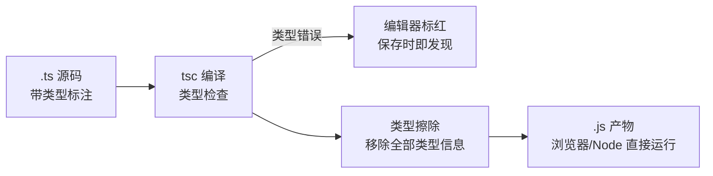
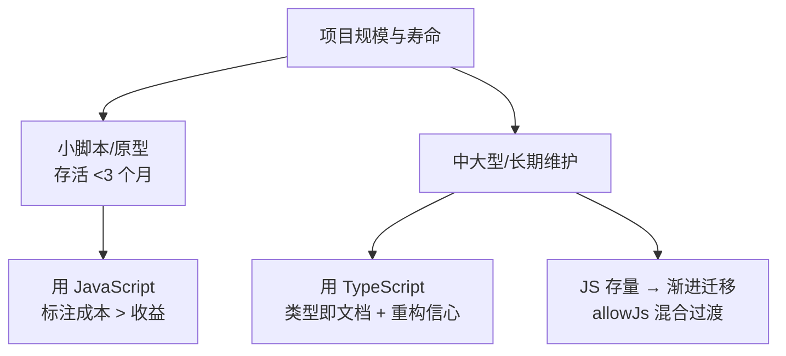

# TypeScript 是什么与为什么需要

> TypeScript 不是新语言，是 JavaScript 的超集：JS 的代码都是合法的 TS，TS 额外加了一层「编译期类型检查」。理解这个定位，学习路线就清晰了——不是重学编程，是给 JS 装类型层。

## 一句话摘要

> 量级分档意识：本文方法在十万级 QPS、千万级用户、亿级流量的场景下均需重新评估——量级变化时架构与参数需同步调整。


TypeScript = JavaScript + 静态类型系统：类型只存在于编译期（检查完就擦除，运行时还是 JS），价值是把「传错参数、拼错字段」这类错误从运行时提前到编辑器保存时；与 JS 的取舍是「多写类型标注的成本」换「重构信心、IDE 补全、接口即文档」三件事。

## 本文核心

**核心机制一句话**：TS 的类型检查发生在编译期，编译产物是擦除全部类型信息的纯 JS——类型系统是「开发时的安全网」，不改变任何运行时行为。

**机制链**：写类型标注 → 编译期类型检查（编辑器实时标红）→ 类型擦除 → 产出纯 JS 运行。类型错误不阻断产物生成（可配置），但阻断质量信心。

**失效边界**：类型只检查「你声明过的世界」——外部 API 响应、localStorage 读出的数据都没有类型保证（运行时校验是另一层，特性层展开）；`any` 会绕过全部检查。

## 一、背景：JS 的类型之痛

JavaScript 是动态弱类型语言，写起来爽，但项目一大就有三宗罪：

```js
// 1. 传错参数，运行时才炸
function calcPrice(price, count) { return price * count; }
calcPrice("100", 2);   // "1002" —— 字符串拼接，不报错

// 2. 字段拼错，undefined 潜伏
const user = { nam: "张三" };
console.log(user.name);  // undefined —— 拼错也不报错

// 3. 重构靠人肉
// 改了 user.email 为 user.mail，全项目哪些地方用了 email？
// 只能全文搜索，搜漏一个就是线上 undefined
```

这三个痛点的共同根源：**类型信息只存在于开发者脑子里，代码和运行时都不检查**。项目越大、协作越多、改动越频繁，这三宗罪的代价越指数上升。

## 二、核心：TS 怎么解决

> 💡 实战提示：存量 JS 项目评估 TS 收益，看三个信号——重构频率高（收益大）、多人协作（契约价值大）、线上 undefined 类 Bug 多（痛点真实）。三者全无的小工具，JS 就好。

```ts
// 同样的代码，加上类型
function calcPrice(price: number, count: number): number {
  return price * count;
}
calcPrice("100", 2);   // ❌ 编辑器立刻标红: 类型 "string" 的参数不能赋给 "number"
```

三个痛点对应的解法：

- **传错参数** → 参数类型注解，保存文件即报错
- **字段拼错** → 接口定义字段全集，拼错字段编译不过
- **重构放心** → 改字段名后，所有引用处立刻标红——**编译器就是最全的搜索引擎**

**类型擦除**是理解 TS 的第一个底层机制：`tsc` 编译后所有类型标注消失，产物是纯 JS——所以 TS 不带来任何运行时性能损耗，也不提供运行时类型保护（校验接口返回要靠 zod 这类运行时库，特性层展开）。



TypeScript 由 Anders Hejlsberg（C# 之父）主导，2012 年发布 0.8，此后十多年的演进主线清晰：2.0 引入严格空检查与 never、3.x 工具类型与工程化成熟、4.x 模板字面量类型、5.x 装饰器标准化——**每一次大版本都在把「类型编程」的表达力往上抬**，但「JS 超集 + 编译期检查 + 类型擦除」的定位从未变过。

## 三、机制：结构化类型——TS 的类型哲学

TS 判断类型兼容用的是**结构化类型（Structural Typing，鸭子类型）**：只要形状匹配，就是同一类型——不看出身看长相。

```ts
interface Point { x: number; y: number }
const p = { x: 1, y: 2, z: 3 };
const point: Point = p;   // ✅ 通过：p 的形状包含 Point 要求的 x/y
```

这与 Java/C# 的「名义类型」（必须显式声明 implements）完全不同。好处是 JS 对象天然兼容（无需改造即可标注类型）；代价是「多出来的字段不报错」（赋值时多余字段被容忍，字面量直接赋值才会多字段检查）——这是 TS 最常被误解的行为之一，第 6 篇展开。



架构上下游视角：TS 处在「源码 → 运行时」的编译期上游，它的产出（.js）可以被浏览器、Node、任何 JS 运行时消费——这也是它能渐进迁移的原因：TS 与 JS 文件可以在同一工程共存（第 9 篇展开）。

## 你们可能会问

**Q1：TS 会让构建变慢吗？**
大项目会（类型检查是计算密集的）——解法是增量编译、编辑器单独的类型服务、CI 分层检查。构建慢是工程问题，有成熟解法。

**Q2：TypeScript 官方支持到什么时候？**
微软核心项目，版本半年一更，生态（框架/工具/DefinitelyTyped）全链支持——选它不存在被抛弃风险。

## 四、实践：典型场景与怎么选

**典型场景**：

- **中大型前端项目**：类型即文档 + 重构信心，收益远超标注成本
- **团队协作**：接口类型定义就是前后端契约，传参错误编译期暴露
- **开源库**：带 `.d.ts` 类型声明的库对使用者体验是硬门槛

**什么时候 TS 不划算**：一次性小脚本、原型验证（类型标注拖慢试错节奏）——JS 更快。**怎么选**：预期存活超过 3 个月、会被多人维护的代码，用 TS；其余用 JS。

## 与 JavaScript 的区别

| 对比 | JavaScript | TypeScript |
|---|---|---|
| 类型检查 | 无（运行时才有类型） | 编译期静态检查 |
| 学习成本 | 低 | +类型系统（一两周上手主干） |
| 运行时 | 直接运行 | 编译成 JS 后运行（类型擦除） |
| 重构 | 全文搜索 + 祈祷 | 改定义全局标红 |
| 适用 | 小脚本/原型 | 中大型项目/团队协作 |

取舍本质：**标注成本前置，换取后期维护与协作的低成本**——代码活得越久、参与人越多，这笔账越划算。

## 常见误区

- **误区一：TS 运行时更安全**。类型编译期擦除，运行时该炸还炸——外部输入的运行时校验要另配工具（zod/valibot）
- **误区二：TS 是另一门语言，要从零学**。合法 JS 就是合法 TS；类型系统是增量，主干两周可上手
- **误区三：用了 TS 就不用测试**。类型管「形状对不对」，不管「逻辑对不对」——`calcPrice(price, count)` 类型全对，算成减法 TS 也不管
- **误区四：any 等于没学**。`any` 关闭检查，大量 any 的 TS 项目类型保护形同虚设——第 7 篇专讲 any/unknown/never 的正确姿势

**设计思想**：每个设计选择都是约束条件下的最优权衡——理解「为什么这么设计」比记住「怎么用」更重要。

## 自测三问

1. **TS 编译后的产物是什么？**
   - 擦除了全部类型信息的纯 JS——类型只在编译期存在，运行时零损耗也零保护。

2. **TS 怎么判断两个类型兼容？**
   - 结构化类型：形状匹配即兼容，不要求显式声明关系（与 Java 名义类型相反）。

3. **什么项目不该用 TS？**
   - 一次性脚本与快速原型——标注成本大于收益；预期长期维护的项目才划算。

## 5W 速记卡

| W | 一句话 |
|---|---|
| What | JS 超集 = JS + 编译期类型系统 |
| Why | 把类型错误提前到编辑器，换重构信心与协作效率 |
| Where | 中大型前端项目/Node 服务/开源库的默认选择 |
| When | 长期维护的代码用 TS，一次性脚本用 JS |
| Who | 会 JS 的开发者增量学习，主干两周上手 |

## 下篇预告

下一篇 [2_类型系统基础](./2_类型系统基础-原始类型与类型注解-入门.md)：原始类型、类型注解、数组与对象的类型写法——类型系统的地基。

## 开放问题

- **类型擦除的运行时校验空白**：编译期类型与运行时真实数据之间的鸿沟，schema 库（zod）只能部分打通——「类型即运行时保证」仍是愿景
- **TS 类型系统的图灵完备之争**：类型编程能做 calculations 但可读性骤降——表达力与可维护性的边界在哪里，社区仍在摇摆

## 核心带走

**30 秒复述**：TS = JS 超集 + 编译期类型检查 + 类型擦除——错误提前到编辑器，运行时零改变零保护。结构化类型（形状匹配即兼容）是它的哲学。取舍本质：标注成本前置，换长期维护低成本。**失效边界**：运行时校验要另配工具；any 绕过一切检查。

## 📌 数据与事实声明

- 写于 2026-09-10，基于 TypeScript 5.x；结构化类型与类型擦除为官方 Handbook 口径
- 行业认知：TS 使用率与默认化趋势参考 State of JS 公开调查
- 免责：语法细节以 typescriptlang.org 为准

## 📚 参考资料

| 类型 | 标题 | 来源 |
|---|---|---|
| 官方文档 | The TypeScript Handbook: The Basics | typescriptlang.org/docs/handbook |
| 官方文档 | TS for JavaScript Programmers | typescriptlang.org/docs/handbook/typescript-in-5-minutes.html |
| 书 | 《Effective TypeScript》Item 1（理解 TS 与 JS 的关系） | 公开出版 |
