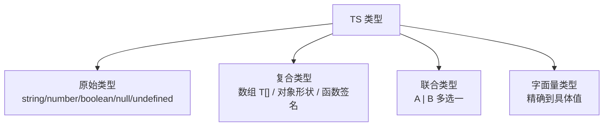
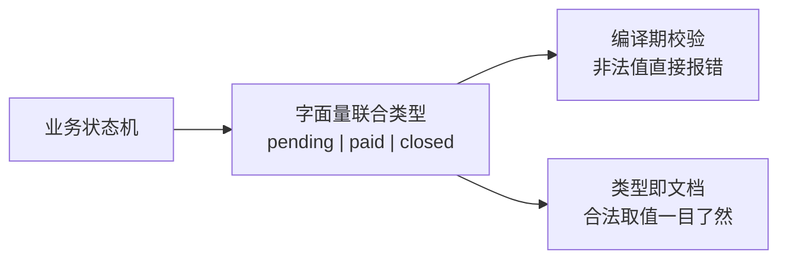

# 类型系统基础：原始类型与类型注解

> 类型注解就是给变量/参数/返回值贴「形状标签」。本篇覆盖日常 80% 的类型写法：八种基础类型、数组与对象、函数签名、类型推断——学完就能给大部分业务代码标注类型。

## 一句话摘要

TS 类型基础三板斧：**原始类型注解**（string/number/boolean/null/undefined 等）、**复合形状**（数组 `T[]`、对象 `{ 字段: 类型 }`、函数 `(参数: 类型) => 返回类型`）、**类型推断**（初始化时省略注解，编译器自动推）——纪律是「边界显式标注、内部依赖推断」，推断不是偷懒的借口而是推荐实践。

## 本文核心

**核心机制一句话**：TS 的类型注解是「形状声明」——变量能装什么、函数收什么还什么，编译期逐一核对。

**机制链**：显式注解（边界处：函数参数/返回值/导出变量）→ 推断填充内部（`const x = 1` 自动是 number）→ 联合类型表达「多选一」→ 字面量类型把值精确到具体值。

**失效边界**：推断只看初始化与赋值路径，`let` 后续赋其他类型会报错；对象字面量「多余属性检查」只在直接赋值时触发。

## 一、背景：八种日常类型

```ts
// 原始类型
let name: string = "张三";
let age: number = 25;             // 不分 int/float，全是 number
let isVip: boolean = true;
let u: undefined = undefined;
let n: null = null;

// ES2020+ 补充
let big: bigint = 100n;
let sym: symbol = Symbol("id");

// 两个「万能逃生口」（慎用，第 7 篇展开）
let anything: any = "什么都行";
let unknownVal: unknown = "比 any 安全的未知";
```

日常 95% 的场景只用前五种。`undefined` 与 `null` 是「空值的两种形态」——配合严格空检查（`strictNullChecks`，必开）使用，见第 9 篇。



## 二、核心：数组、对象与函数

```ts
// 数组：两种等价写法
let ids: number[] = [1, 2, 3];
let names: Array<string> = ["a", "b"];

// 对象：形状声明
let user: { name: string; age: number } = { name: "张三", age: 25 };

// 可选属性：? 表示可以没有
let profile: { name: string; bio?: string } = { name: "张三" };

// 函数：参数与返回值
function add(a: number, b: number): number { return a + b; }

// 函数表达式：参数靠上下文推断，返回值显式
const multiply = (a: number, b: number): number => a * b;

// 没有返回值：void
function log(msg: string): void { console.log(msg); }
```

**联合类型**是日常使用频率最高的进阶形态——「值可以是几种类型之一」：

```ts
let id: string | number;          // 既能是 string 也能是 number
id = "u_123";                     // ✅
id = 456;                         // ✅
id = true;                        // ❌ 报错

// 字面量类型：精确到具体的值（与联合组合 = 枚举效果）
let status: "pending" | "paid" | "closed" = "pending";
status = "paid";                  // ✅
status = "unknown";               // ❌ 只能是三个字面量之一
```

字面量联合在业务代码里的价值极高：订单状态、按钮类型、接口返回码——**把「合法取值」写进类型，拼错值编译期就报错**。



## 三、机制：类型推断——不写注解也有类型

```ts
let count = 10;            // 推断为 number（不用写 let count: number）
count = "十";              // ❌ 报错：推断已经生效

const list = [1, 2, 3];    // number[]

// 推断的边界：函数参数不推断（无上下文时是 any——隐式 any 是严格模式的报错项）
function double(x) { return x * 2; }   // ❌ 严格模式下报 Implicit any
```

**推断与标注的分工纪律**：**边界处显式标注**（函数参数/返回值、导出的变量、公共 API），**内部实现靠推断**。理由：边界类型是「契约」，要写给人看；内部类型推断永远比手写准确且省维护。

> 💡 实战提示：开 `noImplicitAny`（strict 家族成员）让「忘了标注的隐式 any」直接报错——这是从 JS 迁 TS 时最有价值的一个开关，它会把所有需要类型的地方自动列出来。

JS 到 TS 的类型系统不是另起炉灶：早期 TS（2012）类型能力有限，此后的演进逐步把 JS 的动态特性一一补上类型表达（联合、字面量、收窄）——今天的 TS 类型系统表达力已远超多数静态语言。

## 四、实践：典型场景

- **接口请求函数**：参数与返回值显式标注（`fetchUser(id: string): Promise<User>`），内部实现靠推断
- **状态管理**：state 用对象形状或联合字面量（`status: "loading" | "success" | "error"`）
- **工具函数**：泛型前的过渡——参数用最宽的合理类型（`string | number`），返回值显式

从代码架构的上下游看：类型定义在「上游」被消费于「下游」全链——类型文件就是工程里的契约层，上游改动类型，下游所有使用点编译期立刻暴露。

**常见坑**：对象类型一行写太长不可维护——超过 3 个字段就该抽成 `interface`（第 3 篇专讲）；`any` 类型的表达式会「污染」下游（any 的任何运算结果还是 any，检查全关）。

## 你们可能会问

**Q1：类型注解会让代码变啰嗦吗？**
边界处会（这是契约成本），内部靠推断不写——成熟的 TS 代码库注解密度并不高，都集中在函数签名和导出处。

**Q2：联合类型的值怎么安全使用？**
不能直接当其中某一种用——要先「收窄」（typeof 判断等），编译器只在收窄后的分支里放行对应类型的操作（第 6 篇专讲）。

## 与 JS 类型行为的区别

| 对比 | JavaScript | TypeScript |
|---|---|---|
| 类型何时检查 | 运行时（可能炸） | 编译期（标红） |
| `"100" * 2` | 200（隐式转换） | ❌ 编译报错 |
| 字段拼错 | undefined 潜伏 | ❌ 编译报错 |
| 取值范围约束 | 无 | 字面量联合精确约束 |

取舍：TS 不改变 JS 的运行时行为（`"100" * 2` 编译后还是会算成 200），它只是在编译期**拦住你写出这种代码**。

## 常见误区

- **误区一：所有变量都要写注解**。推断覆盖初始化场景，全写注解是噪音；只在边界与推断失灵处标注
- **误区二：`number` 分整型浮点型要写 int/float**。TS 只有 number（JS 同源），BigInt 是另一个类型
- **误区三：字面量类型用 `let` 声明会失效**。`let status = "pending"` 推断为 string 而非字面量——字面量收窄需要 `as const` 或显式注解（第 6 篇展开）

## 自测三问

1. **推断和标注的分工纪律是什么？**
   - 边界（函数签名/导出）显式标注，内部实现靠推断——契约写给人看，内部让编译器管。

2. **怎么表达「只能是三种状态之一」？**
   - 字面量联合类型：`"pending" | "paid" | "closed"`——把合法取值写进类型系统。

3. **函数参数为什么不能依赖推断？**
   - 无上下文时参数无法推断出类型（隐式 any，严格模式报错）；参数是函数的契约，必须显式。

## 5W 速记卡

| W | 一句话 |
|---|---|
| What | 原始类型/数组/对象/函数的类型注解 + 联合类型 + 推断 |
| Why | 让「值的形状」成为编译期契约 |
| Where | 一切 TS 代码的地基 |
| When | 边界标注、内部推断 |
| Who | 所有 TS 开发者的第一课 |

## 下篇预告

下一篇 [3_接口与类型别名](./3_接口与类型别名-入门.md)：interface 与 type 的能力差异、怎么选、对象类型怎么组织复用。

## 开放问题

- **类型推断的上限**：跨函数、跨文件的上下文推断（如根据使用处反推参数类型）是编译器长期演进方向，但目前参数仍需显式
- **JS 新语法与 TS 的同步延迟**：TC39 新提案到 TS 类型支持的时滞，偶尔影响尝鲜

## 核心带走

**30 秒复述**：类型基础 = 原始类型注解 + 复合形状（数组/对象/函数）+ 联合与字面量（多选一与精确值）+ 推断（初始化自动生效）。纪律：边界标注、内部推断；`noImplicitAny` 开着让遗漏自动暴露。**失效边界**：函数参数必须显式；any 会污染下游全部检查。

## 📌 数据与事实声明

- 写于 2026-09-10，基于 TypeScript 5.x；strictNullChecks/noImplicitAny 为官方编译选项
- 免责：以 typescriptlang.org Handbook 为准

## 📚 参考资料

| 类型 | 标题 | 来源 |
|---|---|---|
| 官方文档 | The Basics / Everyday Types | typescriptlang.org/docs/handbook |
| 官方文档 | TS Config: strict 家族 | typescriptlang.org/tsconfig |
| 书 | 《Effective TypeScript》Item 21-30 | 公开出版 |
