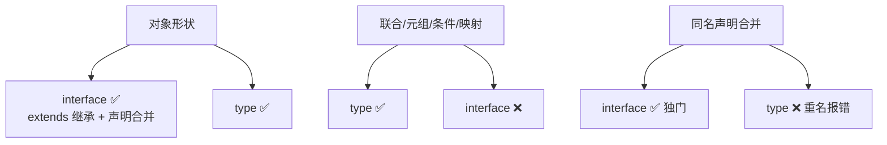
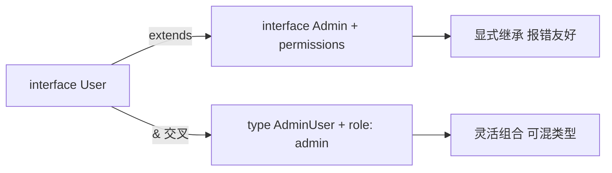

# 接口与类型别名

> 对象类型怎么组织与复用？TS 给了两把刀：`interface` 与 `type`。90% 场景两者可互换，但各有独门能力——interface 可声明合并、type 能表达联合与条件。本篇讲清楚能力边界与团队怎么选。

## 一句话摘要

`interface` 与 `type` 都描述对象形状：interface 支持声明合并（同名自动合并）与 extends 继承，适合「对象的契约」；type 是类型别名，能表达联合/元组/条件类型等 interface 表达不了的形状——**团队纪律比技术差异更重要：选定一种坚持用**（社区主流是对象用 interface、其余用 type）。

## 本文核心

**核心机制一句话**：interface 声明「对象形状契约」且支持声明合并与继承；type 是「任意类型的别名」，表达力覆盖 interface 到不了的地方（联合/元组/映射）。

**机制链**：interface 描述对象契约 → extends 复用扩展 → 声明合并（同名 interface 自动融合，扩展第三方类型的主力）→ type 别名兜住联合/元组/工具类型 → 两者可互相 extends 实现混用。

**失效边界**：interface 不能表达联合类型；type 不能声明合并（重名报错）——能力互补不是互相替代。

## 一、背景：为什么需要对象类型的组织方式

第 2 篇的对象类型是内联写法——`{ name: string; age: number }` 写一次可以，同一个形状在十个函数里用就要复制十遍。类型需要「命名 + 复用 + 扩展」，interface 和 type 就是两个答案。

```ts
// interface：对象契约
interface User {
  id: number;
  name: string;
  email?: string;            // 可选
  readonly createdAt: Date;  // 只读：创建后不可改
}

// 使用：形状契约贯穿函数与数据
function greet(u: User): string { return `Hi, ${u.name}`; }
const u: User = { id: 1, name: "张三", createdAt: new Date() };

// type：别名能力更强
type ID = string | number;                 // 联合——interface 表达不了
type Status = "pending" | "paid";
type Point = [number, number];             // 元组
```

## 二、核心：两者的能力差异



**interface 的独门**：声明合并——同名 interface 自动融合：

```ts
interface Window { title: string }
interface Window { version: number }
// Window = { title: string; version: number } —— 自动合并
```

这看起来奇怪，其实是**扩展第三方类型的主力机制**：给 window 挂自定义属性、给第三方库的 User 补字段，都靠声明合并（不修改原库代码）。type 重名直接报错——它是「定义」，不是「合并」。

**type 的独门**：联合、元组、映射类型、条件类型——interface 一个都表达不了。

**扩展（继承）**两者都支持，且可以互相 extends：

```ts
interface Admin extends User {        // interface extends interface ✅
  permissions: string[];
}
type AdminUser = User & { role: "admin" };   // type 用交叉类型 & 组合
```

`extends`（继承式扩展）与 `&`（交叉组合）的取舍：extends 报错信息更友好（显式检查兼容性），`&` 更灵活（可组合 type 联合成员）——多数团队日常用 `&` 组合、interface 用 extends。

## 三、机制：interface 怎么选，团队怎么定纪律

**社区主流纪律**（可作为团队规范的默认值）：

1. **对象的公开契约用 interface**（可被使用方声明合并扩展）
2. **联合/元组/工具类型组合用 type**
3. **同一项目内保持一致**——混用不是错，无纪律的混用才是错

**决策树**：形状是「纯对象」→ interface（默认）；需要联合/元组 → type；需要扩展第三方类型 → interface 声明合并；React Props/组件契约 → 两者皆可，跟团队规范走。

从工程架构的上下游看：类型定义文件（types.ts）是「上游契约」，组件与函数是「下游消费者」——契约一处改动，下游编译期全量暴露。

> 💡 实战提示：从 JS 迁 TS 的第一步就是把「函数参数里的内联对象」抽成 interface——一个文件里的核心数据形状抽完，这个文件的类型骨架就立住了。



## 你们可能会问

**Q1：interface 能表达函数类型吗？**
能（call signature 语法），但函数类型惯用 type——两者都能写时，跟团队纪律。真正只有 interface 能做的是声明合并。

**Q2：type 和 interface 可以互相 extends 吗？**
可以——interface extends type、type = interface & {...} 都合法。它们在「对象形状」上互通，差异只在独门能力。

## 四、实践：典型场景

- **API 响应建模**：interface 定义响应形状 + type 定义状态联合（`type Status = "loading" | "success" | "error"`）
- **组件 Props**：interface（可扩展、报错友好）+ `&` 组合 HTML 原生属性
- **扩展第三方**：声明合并给 window/第三方 User 补字段——不加改库代码

```ts
// 组件 Props 的常见组合形态
interface BaseProps { size?: "sm" | "md" | "lg"; disabled?: boolean }
type ButtonProps = BaseProps & { onClick?: () => void; children: React.ReactNode };
```

历史上 interface 与 type 的差距比今天大得多——TS 2.x 时代 type 能力有限，社区约定「对象用 interface」；随着 type 获得映射/条件类型，两者能力圈此消彼长，今天的结论已从「二选一」演进为「各用所长 + 团队纪律」。

## 与 type 的区别（能力矩阵）

| 能力 | interface | type |
|---|---|---|
| 对象形状 | ✅ | ✅ |
| extends 继承 | ✅ | ✅（用 `&` 交叉） |
| 声明合并 | ✅ 独门 | ❌ 重名报错 |
| 联合/元组/条件类型 | ❌ | ✅ 独门 |
| 映射类型 | ❌ | ✅ 独门 |

两者在能力上是**互补而非竞争**——「interface vs type 之争」的答案从来是「按场景各用所长」。

## 常见误区

- **误区一：interface 和 type 性能有差异**。没有——类型全部编译期擦除，选型只关乎表达力与团队纪律
- **误区二：声明合并是 bug**。它是特性（扩展第三方类型的官方机制）；但它也意味着 interface 可以被任何文件隐式修改——大型项目里同名 interface 要警惕意外的合并
- **误区三：交叉类型 `&` 是合并字段那么简单**。两个类型有同名但不同型的字段时，交叉结果是 `never`（比如 `string & number`）——交叉是「同时满足」，不是「字段相加」

## 自测三问

1. **interface 和 type 各自的独门能力？**
   - interface：声明合并 + extends 继承；type：联合/元组/映射/条件类型。对象契约默认 interface，联合等用 type。

2. **怎么扩展第三方库的类型？**
   - 声明合并：在自己代码里写同名 interface 补字段——原类型自动融合，不改库源码。

3. **`A & B` 交叉出 never 说明什么？**
   - A 和 B 有同名但类型冲突的字段（如 `name: string & number`）——交叉要求同时满足，冲突即 never。

## 5W 速记卡

| W | 一句话 |
|---|---|
| What | 对象类型的两种组织方式：interface 契约 + type 别名 |
| Why | 类型命名复用、扩展第三方、组件契约建模 |
| Where | 一切对象/函数形状超过 3 个字段的场景 |
| When | 对象契约用 interface，联合元组用 type，团队纪律统一 |
| Who | 全体 TS 开发者；平台团队定团队纪律 |

## 下篇预告

下一篇 [4_函数类型与重载](./4_函数类型与重载-入门.md)：函数参数/返回值/可选参数的完整类型写法，以及同一个函数多种调用签名的重载表达。

## 开放问题

- **声明合并的不可控性**：同名 interface 被任意文件隐式合并，大型项目的类型意外膨胀风险——是否有「封闭 interface」的提案仍是社区讨论
- **团队规范的自动化**：interface/type 混用的 lint 规则（如 consistent-type-definitions）只能管一半场景，复杂纪律仍靠人

## 核心带走

- 写于 2026-09-10，基于 TypeScript 5.x；声明合并与交叉类型行为为官方 Handbook 口径
- 免责：以 typescriptlang.org Handbook（Everyday Types / More on Functions）为准

## 📌 数据与事实声明

- 写于 2026-09-10，基于 TypeScript 5.x；声明合并与交叉类型行为为官方 Handbook 口径
- 「对象用 interface、联合用 type」为社区主流纪律（可按团队规范调整）
- 免责：以 typescriptlang.org Handbook 为准

## 📚 参考资料

| 类型 | 标题 | 来源 |
|---|---|---|
| 官方文档 | Handbook: Interfaces / Type Declarations | typescriptlang.org/docs/handbook |
| 官方文档 | Daily: Unions and Intersection Types | typescriptlang.org/docs/handbook/unions-and-intersections.html |
| 书 | 《Effective TypeScript》Item 12-13（interface vs type） | 公开出版 |
