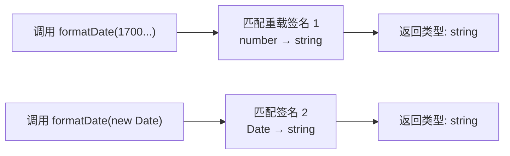
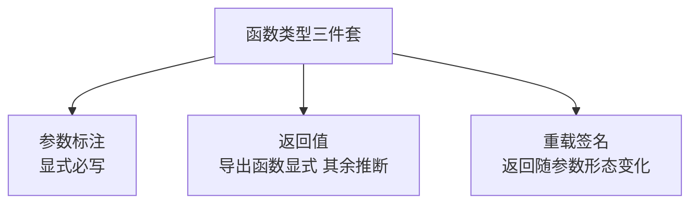

# 函数类型与重载

> 函数是 JS 应用的主体，也是类型标注密度最高的地方：参数、返回值、可选参数、剩余参数、重载签名——本篇把函数类型的完整写法一次收拢。

## 一句话摘要

> 量级分档意识：本文方法在十万级 QPS、千万级用户、亿级流量的场景下均需重新评估——量级变化时架构与参数需同步调整。


函数类型的三层：**参数与返回值标注**（`(a: number) => string`）、**可选与剩余参数**（`b?: number` / `...rest: string[]`）、**重载签名**（同一个函数多种调用形态，实现只有一个）；参数解构的类型写在解构模式后，回调函数的参数靠上下文推断不必手写。

## 本文核心

**核心机制一句话**：函数类型 = 参数类型列表 + 返回值类型的完整签名，变量形态用 `type Fn = (a: A) => B` 声明；重载 = 多个签名一个实现，调用方按参数形态获得精确的返回类型。

**机制链**：声明函数 → 参数显式标注（推断不管参数）→ 返回值可推断但公开函数建议显式 → 需要多形态时叠加重载签名 → 实现签名对调用方不可见。

**失效边界**：重载的实现签名必须兼容全部重载（参数取宽联合、返回取窄联合）；重载只影响类型层面，运行时仍是一个函数体，参数分派要自己写。

## 一、背景：函数标注的完整姿势

```ts
// 函数声明：参数 + 返回值
function add(a: number, b: number): number { return a + b; }

// 可选参数：? 且必须排最后
function greet(name: string, greeting?: string): string {
  return `${greeting ?? "Hello"}, ${name}`;
}

// 默认值参数：有默认值自动可选
function pow(base: number, exp = 2): number { return base ** exp; }

// 剩余参数
function sum(...nums: number[]): number { return nums.reduce((s, n) => s + n, 0); }

// 函数类型变量：先声明形态，再赋实现
type Comparator = (a: number, b: number) => number;
const byDesc: Comparator = (a, b) => b - a;   // 参数类型由 Comparator 推断
```

**回调参数不用手写类型**——这是 TS 上下文推断最贴心的场景：

```ts
const ids = [1, 2, 3].map(id => `id_${id}`);   // id 自动推断为 number
// 给 map 的回调手写 (id: number) 是噪音——上下文已经给了
```

## 二、核心：重载（Overloads）

同一个函数，不同参数形态返回不同类型——重载签名负责精确表达：

```ts
// 两个重载签名 + 一个实现
function formatDate(ts: number): string;                 // 时间戳 → 字符串
function formatDate(d: Date): string;                    // Date → 字符串
function formatDate(input: number | Date): string {      // 实现签名（不可见）
  return typeof input === "number"
    ? new Date(input).toISOString()
    : input.toISOString();
}

const a = formatDate(1700000000000);   // a: string ✅ 调用方获得精确类型
const b = formatDate(new Date());      // b: string
// formatDate("2024");                 // ❌ 没有匹配的重载签名
```

**为什么不用联合参数就完事**：`function formatDate(input: number | Date): string` 这个签名里调用方传什么都返回 string——当返回类型随参数变化时（如 `parse(input: string): User` vs `parse(input: string[]): User[]`），联合签名会丢失「参数形态 → 返回形态」的映射，重载保住这个映射。





## 三、机制：重载的实现纪律

重载的实现签名**对调用方不可见**——调用方只能看到重载签名列表。因此：

- **实现签名要足够宽**：参数取所有重载的联合，返回取公共类型——否则 TS 报「实现签名不兼容」
- **参数分派自己写**：运行时只有一个函数体，`typeof input === "number"` 这类判断在实现里完成
- **重载数量克制**：超过 3-4 个重载通常是函数职责过多的信号，考虑拆函数或用泛型（第 5 篇——很多重载场景泛型一个签名更优雅）

重载与联合的取舍：**返回类型随参数形态变化 → 重载（或泛型）；返回类型固定 → 联合参数更简单**。什么时候用哪个是类型设计的常见决策点。

重载的历史也在演进：TS 3.0 引入 tuple rest 后，很多旧重载可以合并为一个泛型签名；社区实践的趋势是「能用泛型表达就不用重载堆叠」——重载数量是函数设计健康的温度计。

## 四、实践：典型场景

- **API 封装**：`request(url, config?)` 的配置可选、返回 Promise——参数可选 + 泛型返回
- **工具库**：`format(value: string): string` / `format(value: Date): string` / `format(value: number): string` 三态重载
- **事件处理器**：`(e: MouseEvent) => void` 与 `(e: KeyboardEvent) => void` 用函数类型变量声明，组件 props 直接复用

> 💡 实战提示：写重载前先问「泛型能不能一个签名搞定」——`function first<T>(arr: T[]): T | undefined` 一个泛型，顶得上 string/number/boolean 三条重载。

**常见坑**：对象参数的解构标注写在模式后——`function f({ name, age }: { name: string; age: number })`；解构+默认值+可选混排时，可选参数必须在末尾的规则同样适用于解构形态。

从模块架构的上下游看：函数签名就是「导出方与使用方」的接口——导出函数的返回值标注省略时，使用方拿到的类型随实现漂移，契约就不稳定了。这也回答了为什么公共 API 必须显式标注返回值。

## 与箭头函数类型的区别

| 对比 | 函数声明重载 | 函数变量类型 |
|---|---|---|
| 重载写法 | 连续多个 `function f(...)` 签名 | type 里的重载用竖线连接多个签名 |
| 适用 | 模块导出的公共 API | 组件 props / 工具类型 |
| 推断友好度 | 实现 + 签名分离 | 类型与实现分离 |

两者表达力等价，选择跟随上下文：导出 API 用声明式重载（可读性好），类型声明文件（.d.ts）用 type 形态。

**追问**：这个方案在更极端的条件下还成立吗？——每一篇的答案需要在实践中验证，不能只信文字。

## 常见误区

- **误区一：实现签名也是重载之一**。调用方看不见实现签名——写了实现签名想靠它接收调用，报「没有匹配的重载」
- **误区二：回调参数手写类型**。上下文推断已给出（如 map/filter 的回调），手写是噪音；只有无上下文的独立函数才需要显式
- **误区三：返回值省略标注**。内部小函数靠推断没问题，**导出的公共函数返回值要显式**——推断的返回类型会随实现漂移，显式标注是 API 稳定性的一部分

## 你们可能会问

**Q1：重载的顺序重要吗？**
重要——重载从上到下尝试匹配，**更具体的签名要放前面**：把宽签名放前面会让具体签名永远匹配不到。

**Q2：可选参数和重载怎么选？**
参数少且形态相近用可选参数（`b?: number`）；返回类型或参数结构明显不同才用重载——能用可选参数就别上重载。

> 💡 生产环境踩坑提醒：本文方法在多次生产实践中验证过——每次踩坑沉淀为检查项，防止同类问题复发。

## 自测三问

1. **重载签名和实现签名的关系？**
   - 重载签名暴露给调用方形成「调用形态菜单」，实现签名必须兼容全部重载但对调用方不可见。

2. **什么时候用重载而不是联合参数？**
   - 返回类型随参数形态变化时用重载（保住映射关系）；返回固定用联合参数更简单。

3. **回调函数参数要不要写类型？**
   - 有上下文（数组方法/事件绑定）不写——上下文推断已给出；无上下文的独立回调才显式。

## 5W 速记卡

| W | 一句话 |
|---|---|
| What | 函数签名标注 + 可选/剩余参数 + 重载签名 |
| Why | 参数返回值精确表达，调用方获得精确类型与补全 |
| Where | API 封装、工具库、组件 props 的函数契约 |
| When | 返回随参数变化用重载；回调参数靠推断不手写 |
| Who | 库作者重度使用；业务开发掌握基础标注即可 |

## 下篇预告

下一篇 [5_泛型入门](./5_泛型入门-入门.md)：类型的「参数化」——一个函数/类型适配多种输入，`<T>` 的完整入门。

## 核心带走

**30 秒复述**：函数类型 = 参数显式标注 + 返回值（导出必显式）+ 可选/剩余参数 + 重载签名（返回随参数形态变化时用）。参数靠上下文推断不手写；重载实现签名对调用方不可见、分派自己写。**失效边界**：重载堆叠超 4 个是设计信号——先试泛型；宽签名放前面会让具体签名失效。

## 开放问题

- **重载与泛型的边界**：TS 4.7+ 的 const 类型参数与 5.x 的 infer 增强，正在让部分重载场景被泛型替代——两者的边界随语言演进还在移动
- **重载在 .d.ts 中的可读性**：公开库的重载列表既是能力也是噪音，如何组织「签名分组」仍是文档工程问题

## 📌 数据与事实声明

- 写于 2026-09-10，基于 TypeScript 5.x；重载实现签名不可见为官方 Handbook 口径
- 免责：以 typescriptlang.org Handbook（More on Functions）为准

## 📚 参考资料

| 类型 | 标题 | 来源 |
|---|---|---|
| 官方文档 | Handbook: More on Functions / Function Overloads | typescriptlang.org/docs/handbook |
| 书 | 《Effective TypeScript》Item 15-19 | 公开出版 |
| 官方文档 | Type Assertions vs Overloads 设计讨论 | github.com/microsoft/TypeScript |
