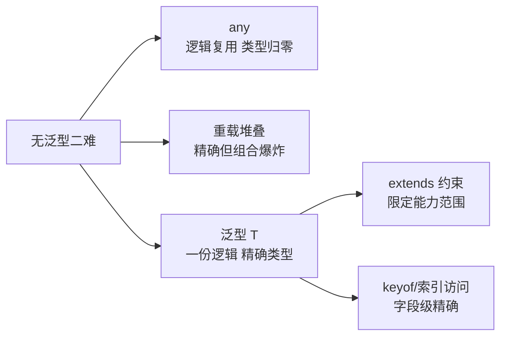
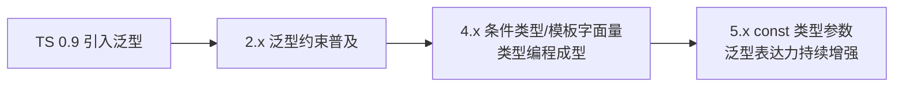

# 泛型入门

> 泛型 = 类型的「参数化」：`<T>` 是类型的形参，调用时传入具体类型。它解决的问题一句话——「写一份逻辑，保住精确的输入输出类型」。没有泛型，你要么写一堆重载，要么用 any 丢掉全部检查。

## 一句话摘要

泛型在函数/接口/类型上引入类型参数 `<T>`：参数与返回值通过 T 关联（进什么出什么，编译期精确追踪）；**约束**（`T extends xxx`）限定 T 的能力范围；**默认值**（`<T = string>`）让常用的类型参数可省略——泛型是「复用逻辑而不丢失类型精度」的唯一手段，any 复用逻辑但精度归零。

## 本文核心

**核心机制一句话**：泛型让调用方「把类型当参数传进去」，签名内的输入输出通过同一个 T 关联，返回类型随传入类型精确变化。

**机制链**：`<T>` 声明类型参数 → 参数与返回值引用 T（建立关联）→ `extends` 加约束（限定 T 必须有的能力）→ 默认值与多参数 → 复杂场景用 keyof/索引访问把「类型的字段」也参数化。

**失效边界**：T 上没有约束就不能调用任何方法（TS 不知道 T 有什么）；泛型嵌套过深（多层条件类型）会伤害可读性与编译速度——泛型不是越抽象越好。

## 一、背景：没有泛型时的两难

写一个「返回数组第一个元素」的函数：

```ts
// 方案一：any——逻辑复用了，类型全丢
function firstAny(arr: any[]): any {
  return arr[0];
}
const n = firstAny([1, 2, 3]);   // n: any —— 后续所有检查全关

// 方案二：重载——类型保住了，每类数组都要写一条
function firstNum(arr: number[]): number | undefined;
function firstStr(arr: string[]): string | undefined;
// …… boolean[] / User[] / Date[] …… 写不完
```

**any 复用但精度归零；重载精确但组合爆炸**。泛型在这个两难里撕开第三条路：

```ts
function first<T>(arr: T[]): T | undefined {
  return arr[0];
}
const n = first([1, 2, 3]);        // n: number | undefined ✅ 精确
const s = first(["a", "b"]);       // s: string | undefined ✅
const u = first([{ id: 1 }]);      // u: { id: number } | undefined ✅
```

调用方传什么类型，T 就是什么类型，返回值精确跟随——**逻辑写一份，类型全覆盖**。

泛型能力的演进没有停：4.7 引入 const 类型参数（字面量精确推断）、5.x 持续优化推断深度——**泛型从「可选进阶」演变成了「日常必修」**。

## 二、核心：约束、默认值与多参数

```ts
// 约束：T 必须至少有 length 属性，否则函数体内不能访问
function logLength<T extends { length: number }>(item: T): T {
  console.log(item.length);     // ✅ 有约束才能访问
  return item;
}
logLength("hello");              // ✅ string 有 length
logLength([1, 2]);               // ✅ 数组有 length
logLength(123);                  // ❌ number 没有 length

// 默认值：不传类型参数时使用默认
interface Response<T = unknown> {
  code: number;
  data: T;
}
const r: Response = { code: 0, data: "anything" };      // data: unknown
const r2: Response<User> = { code: 0, data: user };     // data: User

// 多参数：建立「输入与输出」的映射
function pickField<T, K extends keyof T>(obj: T, key: K): T[K] {
  return obj[key];
}
const name = pickField(user, "name");   // name: string ✅ 精确到字段类型
```

`pickField` 是泛型威力的展示：`K extends keyof T` 限定 K 只能是 T 的字段名，返回 `T[K]` 精确到「那个字段的类型」——传 "name" 得 string，传 "age" 得 number。**没有泛型，这个函数只能返回 any**。





## 三、机制：类型参数的推断与显式传递

泛型 T 通常**由实参推断**（`first([1,2,3])` 自动 T=number），两种情况需要显式传递：

- 推断不出来（无参数使用 T）：`const r: Response<User> = ...`
- 想覆盖推断：`first<string>(["a"])`——显式后传不匹配的参数会报错

**泛型接口与泛型类型的日常位置**：API 响应壳（`Response<T>`）、集合容器（`Map<K, V>`）、React 组件 Props（`List<T>` 组件）——凡是「结构相同、内部元素类型不同」的地方都是泛型的主场。

从工程架构的上下游看：泛型类型定义处在「类型契约的上游」——API 层、组件库、工具库用泛型把精确类型传递给下游业务代码，下游不用重复标注就能获得精确类型。上游泛型设计得越好，下游写得越少。

## 四、实践：典型场景

> 💡 实战提示：泛型入门的最小练习——把项目里所有返回 any 的工具函数改写成泛型，一周后你会自然建立「类型关联」思维，这是泛型的核心心智。

- **API 层**：`request<T>(url): Promise<T>`——一个请求函数覆盖全部接口，每个接口传自己的响应类型
- **React 组件**：`List<T>` 接收 `items: T[]` 与 `renderItem: (item: T) => ReactNode`——通用列表组件类型安全
- **工具函数**：防抖 `debounce<F extends (...args:any[])=>void>(fn: F): F`——返回类型保持原函数签名
- **状态管理**：`useState<User | null>`、reducer 的 `State`/`Action` 参数化

**泛型的克制纪律与何时用**：类型参数超过 2 个、或出现嵌套条件类型时，先问「业务真的需要这么抽象吗」——**泛型的复杂度由所有调用方共同承担**，过度抽象的类型比重复代码更难维护。

## 与 any、重载的区别

| 方案 | 逻辑复用 | 类型精确 | 维护成本 |
|---|---|---|---|
| any | ✅ | ❌ 全丢 | 低（埋雷） |
| 重载堆叠 | ✅ | ✅ | 高（组合爆炸） |
| **泛型** | ✅ | ✅ | 中（需学类型思维） |

三者是同一问题的三种答案，泛型是「复用与精确」的最优平衡——代价是理解 `<T>` 的心智成本，这份成本是一次性的。

## 你们可能会问

**Q1：泛型和 Java/C# 的泛型一样吗？**
思路相通（类型参数化），实现不同——TS 是编译期擦除的「结构化泛型」，没有 Java 的类型擦除强制转换问题，也没有运行时泛型信息（reified）。

**Q2：什么时候不该用泛型？**
只用一次、类型单一的场景——直接写具体类型更直白；泛型的价值在「多处使用且类型关联」，单处使用是过度抽象。

## 常见误区

- **误区一：泛型让代码更难读，能不用就不用**。该用泛型的地方用 any/重载，代价（丢检查/堆叠爆炸）比泛型的心智成本高得多——判断标准是「是否需要类型关联」
- **误区二：`<T extends any>` 有意义**。`extends any` 等于没有约束；同理 `<T extends unknown>` 也无意义——约束要表达「T 至少能做什么」
- **误区三：泛型类型参数越多越强大**。每个类型参数都是调用方的心智负担；三参以上先考虑拆分或用对象参数收拢

## 自测三问

1. **泛型解决 any 和重载的什么问题？**
   - any：逻辑复用但类型全丢；重载：精确但组合爆炸。泛型一份逻辑 + 精确类型，靠 T 关联输入输出。

2. **`T extends { length: number }` 的作用是什么？**
   - 约束 T 的能力范围：只有带 length 的类型才能传入，函数体内才能安全访问 item.length。

3. **`pickField` 为什么能返回精确的字段类型？**
   - `K extends keyof T` 限定 K 为字段名联合，返回 `T[K]` 是「该字段的类型」——类型层面的索引访问。

## 5W 速记卡

| W | 一句话 |
|---|---|
| What | 类型参数化：`<T>` 让逻辑复用且类型精确 |
| Why | 消灭 any/重载堆叠的两难，API 层与容器组件的地基 |
| Where | 请求封装/通用组件/工具函数/集合容器 |
| When | 「结构相同、元素类型不同」的场景就是泛型主场 |
| Who | 库作者与业务开发者都要会——现代 TS 代码泛型无处不在 |

## 下篇预告

下一篇 [6_联合类型与类型收窄](./6_联合类型与类型收窄-入门.md)：拿到 `string | number` 之后怎么安全使用——typeof/in/判等四大收窄手段。

## 核心带走

**30 秒复述**：泛型 = 类型参数化，`<T>` 关联输入输出保精确类型；`extends` 约束能力范围、默认值简化常用形、keyof/索引访问做字段级精确。克制纪律：类型参数超 2 个先想拆分。**失效边界**：无约束的 T 不能调方法；泛型嵌套过深伤可读性与编译速度。

## 开放问题

- **泛型复杂度的边界**：类型编程（条件类型/infer 嵌套）表达力已图灵完备，但可读性悬崖就在眼前——「类型体操」的度在哪里仍是社区争论
- **泛型性能**：深层泛型实例化拖慢编译器（TS 编译器自身的性能瓶颈之一），类型缓存与增量策略在持续优化

## 📌 数据与事实声明

- 写于 2026-09-10，基于 TypeScript 5.x；泛型约束与推断行为为官方 Handbook（Everyday Types: Generic Functions）口径
- 免责：以 typescriptlang.org 为准

## 📚 参考资料

| 类型 | 标题 | 来源 |
|---|---|---|
| 官方文档 | Handbook: More on Functions（泛型函数） | typescriptlang.org/docs/handbook |
| 官方文档 | Generics（完整泛型章） | typescriptlang.org/docs/handbook/generics.html |
| 书 | 《Effective TypeScript》Item 50 上下（泛型设计） | 公开出版 |
