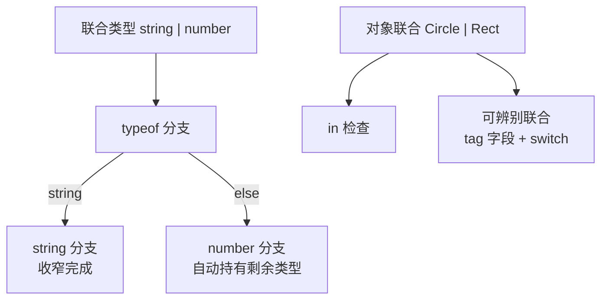
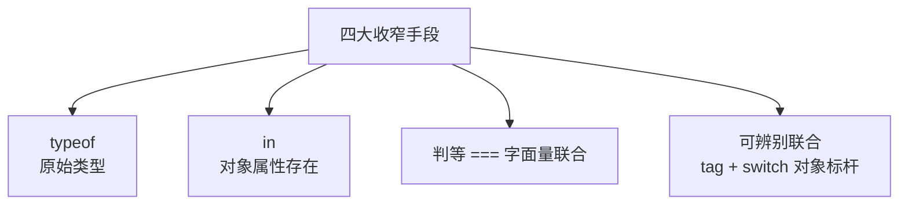

# 联合类型与类型收窄

> 拿到 `string | number` 类型的值，直接调用字符串方法会报错——因为编译器不知道它此刻是什么。类型收窄就是「用代码逻辑帮编译器确认具体类型」的过程：typeof、in、判等、可辨别联合，四大收窄手段覆盖日常全部场景。

## 一句话摘要

联合类型表达「多选一」，收窄（Narrowing）是让编译器在每个分支里确认具体类型的过程：**typeof**（原始类型）、**in**（对象属性存在性）、**判等**（=== 字面量）、**可辨别联合**（tag 字段 + switch）四大手段；收窄后分支内的操作才被放行——「先收窄再使用」是联合类型使用的唯一正确姿势。

## 本文核心

**核心机制一句话**：编译器沿着代码的控制流追踪类型——每个类型检查（if typeof/=== /in）之后，联合类型在该分支内被「收窄」为检查通过的那个成员。

**机制链**：联合类型声明 → 分支内做类型判断 → 控制流分析自动收窄 → 分支内安全使用具体类型 → else 分支持有剩余类型。

**失效边界**：收窄只对「编译器能追踪的判断」生效——把判断逻辑封装进函数（如 `isString(x)` 裸函数）会丢失收窄，要用类型谓词（`x is string`）显式声明。

## 一、背景：联合类型为什么不能直接用

```ts
function format(id: string | number): string {
  return id.toUpperCase();   // ❌ 报错：number 上没有 toUpperCase
}
```

编译器的逻辑无可挑剔：id 可能是 number，number 没有 toUpperCase——**联合类型的值只能安全使用所有成员共有的部分**。要调用特定成员的方法，必须先告诉编译器「此刻它是哪种」——这就是收窄。

## 二、核心：四大收窄手段

```ts
// ① typeof：收窄原始类型
function format(id: string | number): string {
  if (typeof id === "string") {
    return id.toUpperCase();        // ✅ 此分支内 id: string
  }
  return id.toFixed(2);             // ✅ 此分支内 id: number（剩余类型）
}

// ② in：收窄对象（检查属性存在性）
function area(shape: Circle | Rect): number {
  if ("radius" in shape) return 3.14 * shape.radius ** 2;   // Circle
  return shape.width * shape.height;                        // Rect
}

// ③ 判等：收窄字面量联合
function handle(status: "loading" | "success" | "error") {
  if (status === "loading") return "加载中";
  // 此分支 status: "success" | "error"
}

// ④ 可辨别联合：tag 字段 + switch（对象联合的标杆写法）
type Action =
  | { type: "increment"; step: number }
  | { type: "reset" };

function reducer(state: number, action: Action): number {
  switch (action.type) {
    case "increment": return state + action.step;   // ✅ action 有 step
    case "reset": return 0;                          // ✅ action 无多余字段
  }
}
```



**可辨别联合（Discriminated Union）是 TS 类型设计的王牌**：每个成员带一个字面量 tag 字段（type/kind），switch(tag) 后每个分支精确收窄——API 响应、Redux Action、组件状态全部用它。它的隐藏福利是**穷尽检查**：switch 漏了一个 case，配合 never 检查（第 7 篇）编译期就能发现。

## 三、机制：控制流分析与收窄失效

收窄由**控制流分析**驱动：编译器沿 if/return/循环追踪每一次类型判断。但这套追踪有边界——**判断逻辑一旦被封装进函数，收窄就断了**：

```ts
function isString(x: unknown) { return typeof x === "string"; }

function f(x: string | number) {
  if (isString(x)) {
    x.toUpperCase();   // ❌ 收窄失效——编译器不知道 isString 返回 true 意味着什么
  }
}

// 解法：类型谓词（Type Predicate）
function isString(x: unknown): x is string {    // ✅ x is string
  return typeof x === "string";
}
```

`x is string` 叫**类型谓词**：它告诉编译器「这个函数返回 true 时，x 就是 string」——自定义守卫的标准写法。这是「封装判断」与「保住收窄」的两全方案。

> 💡 实战提示：`as` 类型断言是「绕过收窄」的捷径——`x as string` 强行声明。断言应该是最后的手段（你比编译器更懂的场景），能用收窄解决的判断绝不用断言，否则类型系统的保护被自己拆掉。



## 四、实践：典型场景

- **API 响应处理**：可辨别联合建模成功/失败（`{ ok: true, data } | { ok: false, error }`），switch(ok) 后分支内字段精确
- **组件状态机**：`status: loading | success | error` + 收窄后各自渲染——联合收窄是前端状态管理的类型基石
- **解析外部输入**：unknown 进来，typeof/in 逐步收窄成确定形状（替代 as 断言的正确姿势）

收窄 vs 断言的深层取舍：收窄让编译器基于证据判断（代价是多写判断代码），断言跳过证据直接声明（代价是错误延迟到运行时）——代码长期主义选收窄。

**收窄后的边界**：收窄只在分支内生效，把收窄后的值存进可变变量再修改，收窄会失效（重新赋值可能改变类型）——用 const 或在收窄分支内立即使用。

收窄能力的演进贯穿 TS 历史控制流分析不断加强：从早期只支持简单 if 判断，到 4.x 支持别名条件收窄（const isStr = typeof x === "string" 也能收窄）——**编译器的「聪明程度」随版本持续提升**，老代码里的一些手动断言在新版编译器下已经可以删掉。

## 与 any 断言的区别

| 方案 | 类型安全 | IDE 支持 |
|---|---|---|
| 收窄 | ✅ 编译器验证 | ✅ 精确补全 |
| as 断言 | ❌ 你说的算 | ⚠️ 强制指定 |
| any | ❌ 关闭检查 | ❌ 无 |

收窄是「让编译器相信」，断言是「命令编译器闭嘴」——前者有保护，后者没有。

从数据流的架构上下游看：收窄处在「外部输入（unknown）→ 业务逻辑（精确类型）」的中间转换层——每个不可信输入进系统，第一站就是收窄成已知形状。收窄层写得越系统，运行时类型错误越接近零。

## 你们可能会问

**Q1：联合类型和枚举（enum）怎么选？**
现代 TS 社区主流是字面量联合——无需运行时对象、支持穷尽检查；enum 有运行时实体（反向映射等）但带来额外的运行时代码。新代码默认字面量联合。

**Q2：收窄会跨函数边界吗？**
不会——收窄是局部的。数组 filter 后元素类型也不收窄（filter 的返回类型还是原数组），要收窄得用类型谓词或泛型（filter is T）。

## 常见误区

- **误区一：封装类型判断函数后收窄还在**。裸函数返回 boolean 不会收窄；要用类型谓词 `x is T` 显式声明
- **误区二：可辨别联合的 tag 用普通字段**。tag 必须是**字面量类型**（`type: "increment"` 而非 `type: string`），否则 switch 无法收窄
- **误区三：`as` 满天飞很快**。每个 as 都是「我对编译器撒了个谎」——断言错误编译器不负责，运行时才炸；收窄 + 类型谓词才是正道

## 自测三问

1. **为什么联合类型不能直接调用成员方法？**
   - 联合的值可能是任一成员，方法只在部分成员上存在——必须先收窄确认具体类型。

2. **四大收窄手段分别适用什么场景？**
   - typeof 收原始类型；in 收对象属性；判等收字面量；可辨别联合（tag+switch）收对象联合——最后一个是对象场景的标杆。

3. **封装的判断函数怎么保住收窄？**
   - 类型谓词：返回类型写 `x is T`，编译器据此在调用处收窄。

## 5W 速记卡

| W | 一句话 |
|---|---|
| What | 联合类型的多选一表达 + 控制流收窄 |
| Why | 多形态数据的安全使用；穷尽检查防漏分支 |
| Where | API 响应/状态机/Redux Action/外部输入解析 |
| When | 有联合就必有收窄；对象联合首选可辨别形态 |
| Who | 所有 TS 开发者——收窄是 TS 日常的核心操作 |

## 下篇预告

下一篇 [7_any-unknown-never 三兄弟](./7_any-unknown-never-入门.md)：三个「特殊类型」的语义差异与正确姿势——收窄的尽头是 never。

## 开放问题

- **收窄分析的表达力边界**：依赖控制流分析的收窄永远有「编译器想不到」的形态（复杂循环、回调内的状态变化）——分析能力的上限与编译性能的平衡是长期课题
- **运行时校验与类型的打通**：zod 等 schema 库能从 schema 推导类型，把「运行时校验」和「编译期类型」打通——schema-first 的开发模式是否会成为标配仍在演进

## 核心带走

**30 秒复述**：联合类型表达多选一，收窄是安全使用的前提——四大手段（typeof/in/判等/可辨别联合）由控制流分析驱动；封装判断要用类型谓词（x is T）保住收窄。可辨别联合是对象联合的标杆形态，天然支持穷尽检查。**失效边界**：裸判断函数丢收窄；as 断言绕过保护；tag 字段不是字面量类型则收窄失效。

## 📌 数据与事实声明

- 写于 2026-09-10，基于 TypeScript 5.x；控制流收窄与类型谓词为官方 Handbook（Narrowing）口径
- 免责：以 typescriptlang.org 为准

## 📚 参考资料

| 类型 | 标题 | 来源 |
|---|---|---|
| 官方文档 | Handbook: Narrowing | typescriptlang.org/docs/handbook/2/narrowing.html |
| 官方文档 | Discriminated Unions | typescriptlang.org/docs/handbook/unions-and-intersections.html |
| 书 | 《Effective TypeScript》Item 22-23 | 公开出版 |
