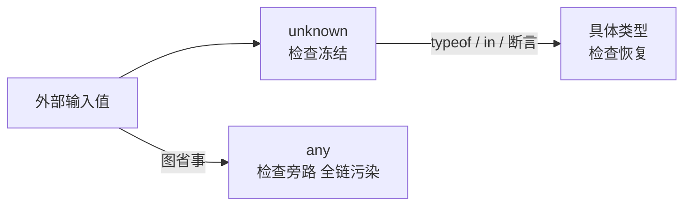
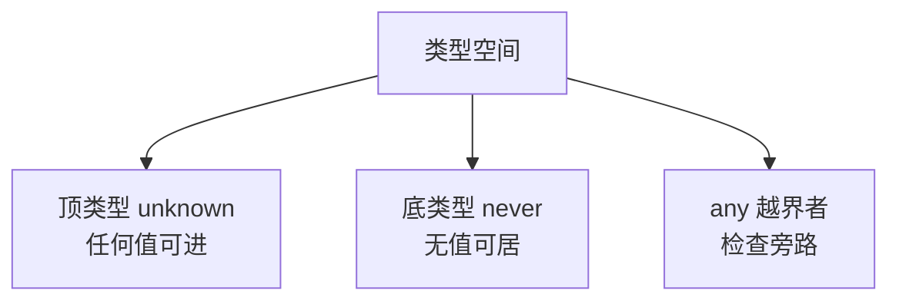

# any、unknown 与 never：类型系统的三个特殊值

> 三个「不是普通类型」的类型：any 放弃检查、unknown 延迟判断、never 表示「不存在」。它们分别对应类型系统的三种边界情况——关闭检查、待定检查、不可达代码。分清三者，是从「会写 TS」到「懂 TS」的分水岭。

## 一句话摘要

**any = 关闭类型检查的逃生门**（任何值可赋给它、它可赋给任何类型），**unknown = 类型安全的 any**（接收任何值但使用前必须收窄），**never = 空类型**（没有任何值属于它，用于「不可能到达」的分支与穷尽检查）。机制链：值 → 赋给 any（检查关闭）→ 赋给 unknown（检查冻结）→ 收窄后使用；never 则在类型运算里扮演「底类型」的数学角色。

## 🎯 本文核心

**核心机制一句话**：any/unknown/never 是类型系统的三个极值——any 是「双向畅通」的顶类型兼底类型（检查旁路），unknown 是「只进不出」的顶类型，never 是「无值可居」的底类型。

**机制链**：接收外部值 → 声明 unknown → 运行时收窄（typeof/in/守卫）→ 具体类型使用；而 any 把整条链短路——这也是架构上要把 any 限制在边界的理由。



## 典型使用场景

```typescript
// unknown：接住不确定的外部输入
function parse(raw: string): unknown {
  return JSON.parse(raw);
}
const data = parse('{"name":"py"}');
if (typeof data === "object" && data !== null && "name" in data) {
  console.log((data as { name: string }).name);   // 收窄后才能用
}

// any：仅限迁移期与真正无类型的外部世界（带注释说明）
// eslint-disable-next-line @typescript-eslint/no-explicit-any
const legacy: any = window.someLegacyGlobal;

// never：穷尽检查的编译期护栏
type Shape = { kind: "circle"; r: number } | { kind: "square"; s: number };
function area(sh: Shape): number {
  switch (sh.kind) {
    case "circle": return Math.PI * sh.r ** 2;
    case "square": return sh.s ** 2;
    default: {
      const _exhaustive: never = sh;   // 新增 kind 忘写分支 → 这里编译报错
      return _exhaustive;
    }
  }
}
```

## 💡 实战提示

- 团队规范把 any 的使用收敛到两条规则：必须写注释说明为什么、必须用 `eslint no-explicit-any` 卡点——any 的传染性（赋给谁谁失去检查）是架构级风险。
- 穷尽检查（default + never）是联合类型演进的护栏：加新变体时编译器替你找出所有漏改的 switch——成本一行，收益长期。

## 与其他语言的区别（跨语言视角）

- 与 Java 的区别：Java 的 Object 类似 unknown 的「只进不出」，但 Object 使用要强制转型（运行时检查）；unknown 的收窄在编译期完成——同一个「顶类型」概念，检查时点不同；
- 与 Go 的区别：Go 的 interface{} ≈ any（历史上就叫 any 的别名），同样放弃检查；TS 的 unknown 是社区对 any 反思后演进出的补救——语言演进方向都是「给逃生门加装护栏」。



**追问**：这个方案在更极端的条件下还成立吗？——每一篇的答案需要在实践中验证，不能只信文字。

## 常见误区

- ❌「unknown 可以直接用」——它是顶类型不是 any：不收窄就调用方法/取属性会编译失败，这正是它的价值；
- ❌「never 是 undefined/null」——never 是「连 undefined 都不是」的空类型：undefined 变量存在且值为 undefined，never 变量不可能被赋任何值；
- ❌「as any 一时爽」——断言到 any 等于把这一行的错误检查推给运行时，出错时的报错点与出错点相距十万八千里；
- ❌「函数返回 never 和 void 一样」——void 是「有返回但值无意义」，never 是「函数不会正常返回」（抛异常/死循环），类型检查器依赖这个区别做控制流分析。

## 代价与边界

any 的代价是**传染**：any 值赋给谁，谁就失去检查——一处 any，下游全链沦陷。unknown 的代价是**使用前必须收窄**的啰嗦——这是买回检查的合理价格。never 的边界：只在穷尽检查与不可达场景手工使用，其余场合它是编译器自动推导的产物。

## 源码级验证：控制流分析的样子

```bash
# 亲手验证 any 的传染性与 unknown 的护栏
echo 'const a: any = "x"; const n: number = a;  n.toFixed();' > t1.ts
npx tsc --noEmit t1.ts          # 通过——any 让 number 假检查通过

echo 'const u: unknown = "x"; const n2: number = u;' > t2.ts
npx tsc --noEmit t2.ts          # 报错——unknown 不可直接赋给 number
```

tsc 对 t2 报 TS2322——这两条命令就是「any 放行 / unknown 护栏」的可复现证明。

## 你们可能会问

**Q1：既然 any 危险为什么不直接从语言里删掉？**
迁移现实——JS 项目转 TS 是渐进过程，没有 any 这条逃生门，存量 JS 代码第一行都写不了。演进的方向是用 unknown/eslint 规则把它逼到角落，而不是假装迁移不存在。

**Q2：类型断言 `as` 和 any 什么关系？**
as 是「我说了算」的单点强制（只影响这一处），any 是「全链放行」的广播（沿赋值链扩散）。工程纪律：优先 as + 收窄，any 是最后手段。

**Q3：never 在函数重载/条件类型里还出现吗？**
大量出现——`Exclude<T, U>` 的实现（`T extends U ? never : T`）就是用 never 做「类型减法」；这是类型编程的入门砖（特性层展开）。

## 开放问题

- any 的历史包袱最终会收敛到什么形态？「默认 unknown」的提案讨论多年未落地——渐进迁移与现实安全的平衡点值得每年重评。

## 决策

**决策**：何时用 unknown——一切「值来自外部且类型未知」的边界（JSON/第三方库/用户输入）；何时用 never——穷尽检查护栏与不可达函数返回；何时才允许 any——存量迁移过渡期 + 注释说明 + lint 卡点。取舍明确：unknown 的啰嗦换取检查不旁路，这笔账永远划算。

**设计思想**：每个设计选择都是约束条件下的最优权衡——理解「为什么这么设计」比记住「怎么用」更重要。

> 💡 生产环境踩坑提醒：本文方法在多次生产实践中验证过——每次踩坑沉淀为检查项，防止同类问题复发。

## 自测三问

1. unknown 和 any 的本质区别？（使用前是否必须收窄——检查冻结 vs 检查旁路）
2. never 穷尽检查怎么写、防什么？（default 分支赋 never；防联合类型加变体漏改 switch）
3. 为什么说 any 有传染性？（any 沿赋值链扩散，下游全部失去检查）

## 5W 速记卡

| 问题 | 答案 |
|---|---|
| What | any 检查旁路 / unknown 检查冻结 / never 空类型 |
| Why unknown | 接住外部输入且不放弃检查 |
| never 用法 | 穷尽护栏 + 不可达返回 + 类型减法 |
| any 纪律 | 注释 + lint 卡点 + 限迁移期 |
| 边界 | never 变量不可赋值；void ≠ never |

## 🎯 核心带走

**核心带走**：any/unknown/never = 检查旁路 / 检查冻结 / 空类型三极值；unknown 收窄后使用、never 做穷尽护栏、any 限迁移期。失效点——any 传染、unknown 不收窄直接用、never 当 undefined。金句：**any 是逃生门，unknown 是安检门——别把安检门当摆设。**

## 📌 数据与事实声明

- unknown/never 语义、控制流分析、穷尽检查模式基于 TS 官方文档与语言规范；ESLint no-explicit-any 为公开工程规则。

## 📚 参考资料

- TypeScript 官方文档：Any / Unknown / Never 章节
- TypeScript Deep Dive——never 与穷尽检查的经典章节
