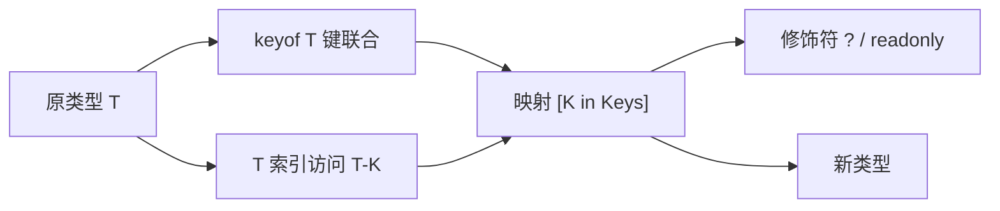
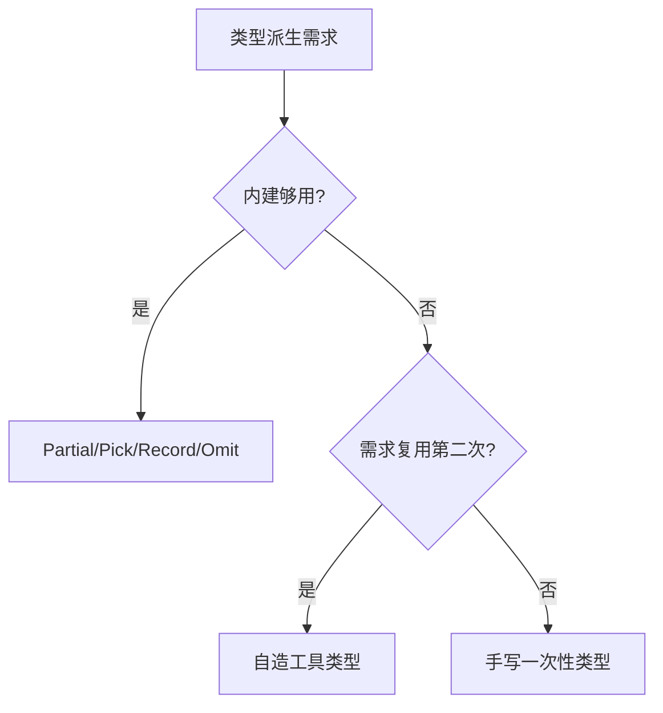

# 工具类型：Partial、Pick、Record 背后的类型编程

> `Partial<T>`、`Pick<T, K>`、`Record<K, V>` 不是内建魔法——它们全是用 TS 的两个语法原语（映射类型 + 索引访问）**写出来的普通类型**。理解了实现，工具类型就从「背 API」变成「会造轮子」。

## 一句话摘要

工具类型是**类型层面的函数**：输入一个类型、输出一个新类型。三大原语支撑全部工具类型——**映射类型**（`[K in keyof T]`：遍历键并改造）、**索引访问**（`T["a"]`：取类型的某个成员）、**条件类型**（`A extends B ? X : Y`：类型层 if）。`Partial<T>` 的全部实现就一行：`{ [K in keyof T]?: T[K] }`。

## 🎯 本文核心

**核心机制一句话**：映射类型把「对每个键做什么」表达成类型循环——工具类型 = 用 `keyof` 拿键、用映射遍历、用索引访问取值的类型级编程。

**机制链**：`keyof T`（取键联合）→ `[K in Keys]`（逐键映射）→ 修饰符（`?`/`readonly`）→ `T[K]`（取原类型）→ 新类型。



## 典型使用场景

```typescript
// 三个最常用工具类型的「实现」与「用途」
type MyPartial<T> = { [K in keyof T]?: T[K] };        // 全部可选——更新入参
type MyPick<T, K extends keyof T> = { [P in K]: T[P] }; // 挑键——视图模型
type MyRecord<K extends keyof any, V> = { [P in K]: V }; // 键值表——字典/枚举映射

// 组合：修饰符的增删（- 号移除）
type Required<T> = { [K in keyof T]-?: T[K] };          // 去掉可选
type Readonly<T> = { readonly [K in keyof T]: T[K] };   // 全部只读

// 实战：更新函数的入参类型——不用工具类型就得手写一遍全可选版本
function updateUser(id: number, patch: Partial<{ name: string; age: number }>) {}
```

**为什么这省了真代码**——没有映射类型的年代（或 Java 里），「User 的可选版」「User 的只读版」要手写 N 份并人工同步；类型编程让**派生类型与源类型永远一致**——改源类型，全部派生自动跟着变。这是类型系统从「标注」演进为「编程」的分水岭。

## 💡 实战提示

- 先 `keyof` 后索引访问的组合 `T[keyof T]` = 「值的联合类型」——取枚举对象所有值类型的最短写法，实战出镜率极高。
- 工具类型可以套娃：`Readonly<Partial<T>>`、`Record<keyof T, string[]>`——像函数组合一样从小工具拼大类型，不要一次写巨型映射。

## 与其他语言的区别（跨语言视角）

- 与 Java/Go 的区别：它们没有类型级编程——泛型只作用于「值的容器」，不能「遍历类型的键」；TS（及 Rust 的宏、Haskell 的类型族）把类型系统推进到图灵完备边缘；
- 与运行时反射的区别：Java 反射在运行时跑、有性能与不可静态检查的代价；TS 映射类型在**编译期完成且零运行时产物**——编译后的 JS 里没有任何工具类型的痕迹。



## 常见误区

- ❌「工具类型影响运行时性能」——类型全部在编译期擦除，运行时零成本；性能焦虑不适用；
- ❌「`[K in keyof T]` 和 for 循环一样能加逻辑」——映射里不能写语句，只能改修饰符与索引访问；复杂逻辑要靠条件类型（`K extends "id" ? never : K` 式过滤）；
- ❌「Partial 是深层的」——`Partial<T>` 只让第一层可选，嵌套对象内层照旧必填；深层可选要自写 DeepPartial（递归映射，类型编程进阶）；
- ❌「Record 的键可以是任意 string」——`Record<string, V>` 放弃了键检查；键集合有限时用 `Record<'a'|'b', V>` 或 `Record<keyof T, V>` 保留穷尽性。

## 源码级验证：类型是编译期产物

```bash
echo 'type A = Partial<{x: number}>; const a: A = {};' > t.ts
npx tsc --noEmit t.ts && echo 通过
cat t.js 2>/dev/null || echo "没有产物——类型已全部擦除"
# 把 Partial 定义抄进编辑器悬停：type MyPartial<T> = { [K in keyof T]?: T[K] }
# —— TypeScript 内置工具类型（lib.es5.d.ts）的实现与这一行完全一致，公开可查
```

## 你们可能会问

**Q1：工具类型在哪定义的，能看源码吗？**
在 TS 安装目录的 `lib.es5.d.ts`（Partial/Pick/Record 全部在内）——实现就是几十行映射类型，公开可读。读完你会发现「内建」与「自造」没有技术边界。

**Q2：keyof any 是什么鬼？**
`Record<K extends keyof any, V>` 里的 `keyof any` = `string | number | symbol`（任何合法键类型）——它是「合法键类型」的简写惯用法。

**Q3：什么时候该自己写工具类型？**
同一派生需求出现第二次时——第一次手写，第二次抽象成工具类型（与值代码的复用时机判断一致）。

## 开放问题

- 类型级图灵完备带来的「类型体操」与可读性的边界在哪？社区已出现「过度类型编程危害维护」的反思潮——复杂类型该不该写注释/单测（类型测试）仍是开放争论。

## 决策

**决策**：何时用内建工具类型——Partial/Pick/Record/Readonly/Omit 覆盖八成需求，先查后造；何时自造——派生需求复用第二次起。取舍：类型编程的表达力换来的可读性代价，用「命名 + 简单组合」控制——一个自造工具类型的实现超过 10 行就该反思设计。

## 自测三问

1. Partial 的一行实现怎么写？（`{ [K in keyof T]?: T[K] }`）
2. 映射类型的三大原语？（keyof 取键 / [K in] 映射 / T[K] 索引访问——外加条件类型做分支）
3. 为什么说工具类型零运行时成本？（类型编译期擦除，JS 产物无痕迹）

## 5W 速记卡

| 问题 | 答案 |
|---|---|
| What | 类型级函数：映射类型 + keyof + 索引访问 |
| Why | 派生类型与源类型永远一致，消灭手写同步 |
| 三件套 | Partial 全可选 / Pick 挑键 / Record 键值表 |
| 深浅 | Partial 只一层可选；深层需递归自造 |
| 边界 | 映射不能写语句；复杂分支靠条件类型 |

## 🎯 核心带走

**核心带走**：工具类型 = 映射类型类型级函数（keyof → [K in] → T[K]），派生与源永远一致。失效点——Partial 只一层、Record 任意键丢检查、映射内写不了语句。金句：**会背工具类型是用户，能写一行实现是作者——lib.es5.d.ts 里没有魔法。**

## 📌 数据与事实声明

- 内置工具类型实现（lib.es5.d.ts）为 TS 公开源码；映射/条件类型语义为语言规范；DeepPartial 需自造为公开社区共识。

## 📚 参考资料

- TypeScript 官方文档：Mapped Types / Keyof / Indexed Access
- type-challenges 仓库——类型编程的练习题库（公开）
