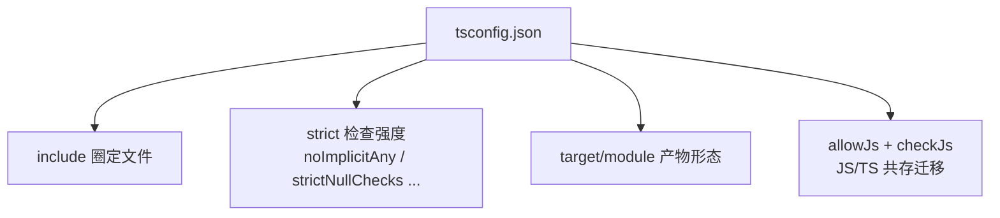
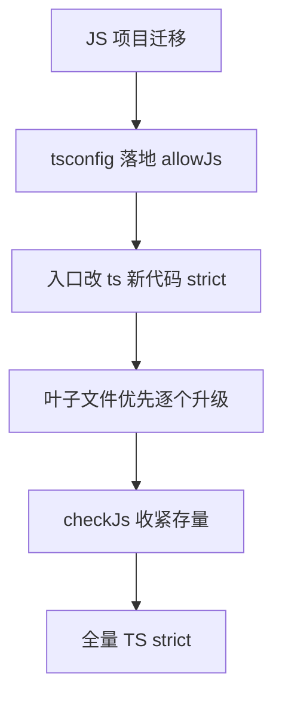

# tsconfig 与渐进迁移：把 JS 项目 safely 变成 TS

> 「要不要开 strict」与「JS 怎么一步步变 TS」是 TS 落地的两个真问题——配置不是越多越好，迁移不是重写。这一篇讲 tsconfig 关键项的机制、strict 全家桶各管什么、以及 allowJs 带来的渐进迁移路线。

## 一句话摘要

> 量级分档意识：本文方法在十万级 QPS、千万级用户、亿级流量的场景下均需重新评估——量级变化时架构与参数需同步调整。


tsconfig 是**编译器的行为声明**：管「哪些文件参与编译」（include/files）、**检查严格度**（strict 全家桶）、**产物形态**（target/module）。渐进迁移的机制核心是 **allowJs + checkJs**：让 .js 与 .ts 共存于同一次编译，按文件逐个升级——迁移是文件粒度的马拉松，不是一刀切的手术。

## 🎯 本文核心

**核心机制一句话**：tsconfig 的每个开关都在调「编译期检查的松紧」与「产物的运行环境」两个维度——strict 全家桶把 JS 的隐式行为逐一显式化。

**机制链**：include 圈文件 → compilerOptions 定检查强度 → strict 逐项开闸 → emit 决定产物 → allowJs 让新旧共存。



## 典型使用场景

```jsonc
// 起步配置（迁移期）：检查收紧但不一刀切
{
  "compilerOptions": {
    "target": "ES2020",
    "module": "ESNext",
    "strict": true,            // 一开始就开（新代码不再欠债）
    "allowJs": true,           // 允许 .js 参与编译（共存）
    "checkJs": false,          // 先不检查 .js 文件（逐个升级时改 true）
    "noEmit": true             // 构建交给 vite/esbuild，tsc 只做检查
  },
  "include": ["src"]
}
```

**strict 全家桶四主力**（各管一个 JS 隐式坑）：

| 开关 | 关掉时的隐式行为 | 打开后显式化 |
|---|---|---|
| `noImplicitAny` | 没标注的参数悄悄是 any | 必须显式 any 或给类型 |
| `strictNullChecks` | null/undefined 可赋给任何类型 | null 是独立类型，必须处理 |
| `strictFunctionTypes` | 函数参数双向可变（不安全） | 参数逆变检查 |
| `noUncheckedIndexedAccess` | `arr[i]` 默认非空 | 索引访问结果带上 undefined |

💡 实战提示：新项目 strict: true 一票到底（strictNullChecks 是价值最大项——null 安全占实际收益的大头）；存量项目迁移期可以 strict 全开 + 文件级逐步 checkJs。

## 与其他语言的区别（跨语言视角）

- 与 Java 的区别：javac 没有「严格度旋钮」——类型检查不可协商；TS 面对的是存量 JS 世界，**渐进性是设计目标**（检查强度、文件范围全部可调）——这是超集语言与原生类型语言的根本架构差异；
- 与 Go 的区别：Go 编译即检查、无配置逃生门；TS 的 tsconfig 更像「检查器配置文件」——它的定位一半是编译器、一半是 linter（noEmit + vite 打包的现代架构里，tsc 的角色几乎纯粹是类型检查器，演进：编译与检查职责分离）。



**追问**：这个方案在更极端的条件下还成立吗？——每一篇的答案需要在实践中验证，不能只信文字。

## 常见误区

- ❌「strict 是一个开关」——它是一组开关的集合（十几个），可单独细调；排错时要知道具体是哪个子开关在报错；
- ❌「allowJs 迁移 = 没有类型保障」——allowJs 只是共存，checkJs 才检查 .js；JSDoc 注释（`/** @type {import('./m').User} */`）能让 .js 文件获得大部分检查；
- ❌「tsc 负责打包」——现代架构（vite/esbuild/swc）负责转译打包，tsc 只做类型检查（noEmit）——让转译器做速度的事、tsc 做检查的事，各司其职；
- ❌「路径别名配了 tsconfig 就能用」——`paths` 只骗类型检查器，运行时解析要 bundler（vite alias/tsconfig-paths）同步配置——双处配置不同步是经典运行时报错。

## 源码级验证：strictNullChecks 前后对比

```bash
echo 'function len(s: string) { return s.length } len(null)' > t.ts
npx tsc --noEmit t.ts                 # strict 关：通过（null 静默通过，运行时炸）
npx tsc --noEmit --strictNullChecks t.ts   # 报 TS2345：null 不可赋给 string
```

同一份代码，一个开关决定「错误在编译期暴露还是运行时爆炸」——strict 的全部价值浓缩在这两条命令里。

## 你们可能会问

**Q1：存量 JS 项目第一步做什么？**
三步：tsconfig 落地（allowJs + strict 开新文件）→ 入口文件改 .ts → 按「依赖叶子优先」逐文件升级（工具类/类型定义先动，主流程后动）。

**Q2：d.ts 声明文件什么时候要写？**
用到无类型的第三方包（`@types/x` 不存在）时——`declare module "x"` 手写最小声明；这是 TS 与 JS 生态的桥（特性层声明文件专题展开）。

**Q3：paths 别名与 vite 怎么同步？**
vite 5+ 支持 `resolve.alias` 读 tsconfig paths 的插件（vite-tsconfig-paths）——让类型检查与运行时解析共用一份配置，消灭双源漂移。

## 开放问题

- 编译与检查职责分离（tsc noEmit + esbuild 转译）已成主流，TS 原生编译器（tsgo/portable compiler 计划）成熟后这套双轨架构会不会合并？值得每年复评。

## 决策

**决策**：何时全量 strict——新项目第一天（欠债从第一天开始记）；何时渐进——存量迁移（allowJs 共存 + 叶子优先升级）。取舍：strict 全开的短期阵痛（存量报错潮）换长期 null 安全与重构信心——这笔取舍的收益随项目寿命放大。

> 💡 生产环境踩坑提醒：本文方法在多次生产实践中验证过——每次踩坑沉淀为检查项，防止同类问题复发。

## 自测三问

1. strict 四主力各堵哪个坑？（隐式 any / null 混入 / 函数参数双向 / 索引访问非空假设）
2. allowJs 与 checkJs 的分工？（共存 vs 对 .js 也检查；JSDoc 可补类型）
3. 现代架构里 tsc 的角色是什么？（纯类型检查器 noEmit；转译交给 esbuild/vite）

## 5W 速记卡

| 问题 | 答案 |
|---|---|
| What | 编译器行为声明：文件范围 + 检查强度 + 产物形态 |
| Why strict | 把 JS 隐式行为逐一显式化，错误左移编译期 |
| 迁移 | allowJs 共存 + 叶子文件优先 + JSDoc 过渡 |
| 双源坑 | paths 别名要与 bundler 同步 |
| 现代架构 | tsc 只检查，vite/esbuild 只打包 |

## 🎯 核心带走

**核心带走**：tsconfig 调「检查强度 + 产物形态」两维；strict 四主力各堵一个 JS 隐式坑；迁移走 allowJs 共存 + 叶子优先。失效点——paths 与 bundler 双源漂移、tsc 当打包器、strict 半开留混合心智。金句：**配置是检查强度的决策记录——strict 全开不是激进，是把错误左移的一次性阵痛。**

## 📌 数据与事实声明

- strict 全家桶、allowJs/checkJs、paths 语义基于 TS 官方 tsconfig 参考（公开文档）；tsgo 原生编译器计划为公开社区动态（状态随时间变化）。

## 📚 参考资料

- TypeScript 官方：TSConfig Reference（每个开关的权威定义）
- 官方迁移指南：Migrating from JavaScript
