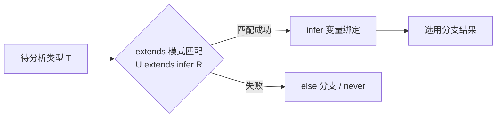
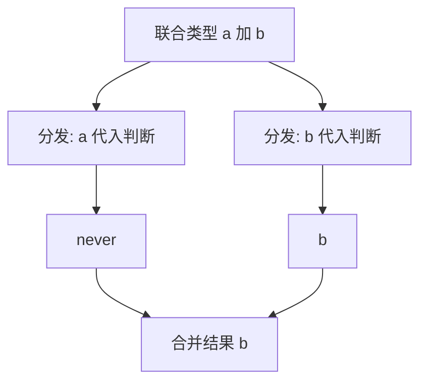

# 条件类型与 infer：类型层面的 if 与解构

> `T extends U ? X : Y` 是类型世界的 if，`infer R` 是类型世界的解构赋值——这两个原语加上递归，构成了 TS 类型编程的全部骨架。Exclude、ReturnType、Awaited 这些内建工具类型的实现只有一行，读懂它们，类型体操的大门就开了。

## 一句话摘要

> 量级分档意识：本文方法在十万级 QPS、千万级用户、亿级流量的场景下均需重新评估——量级变化时架构与参数需同步调整。


**条件类型**让类型做出分支决策（`A extends B ? X : Y`），**infer** 让条件分支里「解构出待推断的类型」（只能出现在 extends 右侧）。两者组合实现类型提取（`ReturnType`）、类型过滤（`Exclude`）、类型改写（`Awaited`）；配合映射类型的递归，可以表达任意深度的类型变换——类型系统由此图灵完备。

## 前置阅读

- 入门层篇 8《工具类型》：映射类型与 keyof（条件类型的姊妹原语）

## 🎯 本文核心

**核心机制一句话**：条件类型 = 类型层的分支（分发律让联合类型逐成员决策），infer = 分支中的模式捕获——两者把「类型的结构信息」提取出来重新组装。

**机制链**：`T extends U ? X : Y` → 若 U 含 infer 声明 → 对 T 做结构匹配 → 捕获 infer 变量 → 分支结果。这条链是类型编程的架构总线：所有派生类型工具的上下游都经过它。

## 上下游一分钟

条件类型在类型系统架构里的位置：映射类型（入门篇 8）管「对每个键做什么」，条件类型管「对每个类型做什么决策」——两者是类型编程的双引擎。向上它服务库作者（React 的 `ComponentProps`、axios 的响应类型推导都靠它），向下它依赖结构化类型系统（extends 是「形状兼容」判断而非名义继承）。模块边界清晰：**值逻辑写在函数里，类型逻辑写在条件类型里**——越界的类型体操就是架构债。

## 一、三分钟读懂条件类型

```typescript
// 基本形态：类型层的 if
type IsString<T> = T extends string ? true : false;
type A = IsString<"hi">;        // true
type B = IsString<42>;          // false

// 分发律：裸类型参数 + 联合类型 → 逐成员分发（最重要也最反直觉的规则）
type ToArray<T> = T extends any ? T[] : never;
type C = ToArray<string | number>;   // string[] | number[]（不是 (string|number)[]！）

// 抑制分发：用元组包住
type ToArrayNonDist<T> = [T] extends [any] ? T[] : never;
type D = ToArrayNonDist<string | number>;   // (string | number)[]
```

**分发律（distributive conditional types）**：当条件类型的「被检查方」是裸类型参数且传入联合类型时，联合被拆开逐个代入再合并结果。这是 Exclude 能工作的机制——`Exclude<"a"|"b", "a">` = `("a" extends "a" ? never : "a") | ("b" extends "a" ? never : "b")` = `never | "b"` = `"b"`。**追问：为什么设计成默认分发？**——联合类型的成员级变换是最高频需求（过滤/排除/映射），默认分发让 Exclude/Omit 类工具零成本；需要整体判断时用 `[T] extends [U]` 抑制——设计跟随高频场景。

## 二、infer：类型层面的解构

infer 在 extends 右侧声明「待推断变量」，匹配成功时被绑定：

```typescript
// 解构数组元素类型
type ElementOf<T> = T extends (infer E)[] ? E : never;
type E1 = ElementOf<string[]>;          // string

// 解构函数返回值——ReturnType 的完整实现
type MyReturnType<T> = T extends (...args: any[]) => infer R ? R : never;

// 解构 Promise 的包裹层（递归解多层）——Awaited 的核心思想
type MyAwaited<T> = T extends Promise<infer V> ? MyAwaited<V> : T;
type E2 = MyAwaited<Promise<Promise<string>>>;   // string

// 解构函数的第一个参数
type FirstArg<T> = T extends (first: infer F, ...rest: any[]) => any ? F : never;
```

**infer 的心智模型**：把 `extends` 右侧当「模式」，infer 变量是模式里的通配捕获——`(infer E)[]` 匹配「任何数组并捕获元素类型」，和值世界的解构 `const [first] = arr` 完全同构。**模式匹配能力即提取能力**：想提取什么，就在模式的那个位置放 infer。



## 三、内建工具类型的源码级解密

TS 安装目录 `lib.es5.d.ts` 里的原装实现（公开源码，逐条对照机制）：

```typescript
type Exclude<T, U> = T extends U ? never : T;          // 分发律过滤
type Extract<T, U> = T extends U ? T : never;          // 分发律提取
type NonNullable<T> = T extends null | undefined ? never : T;
type ReturnType<T extends (...args: any) => any> = T extends (...args: any) => infer R ? R : any;
type Parameters<T extends (...args: any) => any> = T extends (...args: infer P) => any ? P : never;
// lib.es2020 里的 Awaited 更复杂：处理 thenable 与递归，核心仍是 extends Promise<infer V> 循环
```

**读法示范**：`Parameters` 用 `(...args: infer P)` 一次性捕获「全部参数的元组类型」——infer 在休息参数位置捕获的是元组，这是模式匹配表达力的典型展示。**每个内建工具都是这两个原语的组合**——「内建」与「自造」之间没有技术边界，只有复用边界。

## 四、递归条件类型：深层的变换

映射类型 + 条件类型 + 递归引用 = 任意深度变换（DeepPartial 的经典实现）：

```typescript
type DeepPartial<T> = T extends object
  ? { [K in keyof T]?: DeepPartial<T[K]> }   // 递归：对象继续往深走
  : T;                                        // 原子类型直接返回
```

**递归的边界与代价**（机制层的诚实账本）：TS 编译器对递归深度有限制（栈溢出即报「Type instantiation is excessively deep」）；每个类型实例化都消耗编译时间——巨型递归类型让 IDE 悬停卡顿数秒。**类型也是要「跑」的程序**，它跑在编译器里：图灵完备的代价是可能不停机，编译器用深度上限兜底。

💡 实战提示：递归类型加「终止条件护栏」（如 `DeepPartial` 对数组/Map/Set 特判返回原类型），既控制编译时间又防语义意外。

## 事故推演：一个「聪明」的类型拖垮 IDE

真实形态的团队事故（行业化用）：有人写了 200 行的递归类型工具做「路由表到表单类型的全自动推导」，随路由增长，编辑器输入延迟从 50ms 涨到 3 秒，全团队开发体验崩坏——type check 成了 CPU 大户。复盘 Action：① 类型工具复杂度进评审（超过 20 行的泛型必须有注释与测试）；② 关键路径类型「编译期预算」监控（tsc --diagnostics 纳入 CI）；③ 把推导改为代码生成（build 时生成具体类型，运行零推导）——**类型编程的能力边界之外是代码生成**，知道何时退场比会写更重要。

## 与其他语言的区别（跨语言视角）

- **与 Java 泛型的区别**：Java 泛型擦除后运行时无类型、编译期也不可编程（没有类型级分支）；TS 的类型在编译期是一个可编程的解释器——两者根本不是一个复杂度层级；
- **与 Rust 的区别**：Rust 的 trait + 关联类型是「约束导向」的类型运算，TS 条件类型是「匹配导向」——Rust 问「你有什么能力」，TS 问「你长什么形状」，结构化 vs 名义的分野延伸到了类型编程层；
- **与 Haskell 类型族的区别**：类型族与条件类型在表达力上近似（都是类型级分支），TS 的优势是与 JS 生态零成本集成，Haskell 的优势是种类系统（kinds）更严谨——表达力的代价模型不同。



## 常见误区

- ❌「条件类型永远即时求值」——泛型位置的条件类型是**惰性**的（实例化才求值），非泛型位置立即求值——「为什么我的条件类型显示还未计算」的困惑根源；
- ❌「分发律总在生效」——只有「裸类型参数 + 联合」才分发；`[T] extends [U]` 抑制、never 在分发下直接整体消失（never 是所有联合的单元元）——三个例外记不全就写不对 Exclude 类工具；
- ❌「infer 可以出现在任意位置」——只能在 extends 右侧的「协变位置」自由使用；逆变位置（函数参数）的 infer 需要 hint（`infer F extends string`）或会推断出意外结果；
- ❌「递归类型想写多深写多深」——编译器深度上限 + 编译时间账单；超过 5 层递归的类型必须有复杂度评审（业内惯例）。

## 业内惯例与生产实践

- **惯例一**：自造条件类型必须带类型测试（`expectTypeOf` / `tsd`）——类型没有运行时报错，测试是唯一护栏；
- **惯例二**：导出的类型工具必须 JSDoc 注释（编辑器悬停即文档）——类型是 API 的一部分；
- **惯例三**：CI 跑 `tsc --diagnostics` 盯类型检查耗时趋势——类型复杂度回归像性能回归一样被监控（业内演进中的新惯例）。

## 你们可能会问

**Q1：条件类型和函数重载什么关系？**
同目的不同层——重载在「签名层」给多形态入口，条件类型在「类型层」根据输入类型派生输出；`ReturnType` 这类推导让很多手写重载变得不必要（类型跟实现自动一致）。

**Q2：追问——infer 推断出联合类型还是单一类型？**
同一模式变量在多个分发成员中被赋予不同值时，infer 结果是**协变位置合并为联合、逆变位置合并为交叉**——「infer 出联合」的意外多数源于忘了这一点。

**Q3：再追问——什么时候该放弃类型推导直接手写？**
推导产物不稳定（编译器版本升级改变推断）或推导成本高（大递归）时——手写具体类型 + 类型测试锁行为，可预测性优先于聪明。

## 开放问题

- 「默认分发」的规则争议多年（何时分发何时不分发的心智负担）——未来版本会不会提供显式分发语法？TS 类型系统的可用性演进值得持续跟踪。

## 决策

**决策**：何时用条件类型——库层 API 的类型派生（从配置推路由、从函数推导出返回）；何时手写具体类型——应用层内部、推导不稳定、编译预算紧张。怎么选的推荐：**先写死类型让功能跑通，复用第二次再抽象成条件类型**——类型编程的引入时机与值函数完全一致。

## 自测三问

1. 分发律什么时候触发、怎么抑制？（裸类型参数 + 联合；[T] extends [U] 抑制）
2. ReturnType 的实现怎么写？（`T extends (...args: any[]) => infer R ? R : any`）
3. DeepPartial 的三要素？（条件类型判 object + 映射类型遍历键 + 递归引用自身）

## 5W 速记卡

| 问题 | 答案 |
|---|---|
| What | 类型层 if（条件类型）+ 类型层解构（infer） |
| Why | 类型派生自动化：派生与源永不错位 |
| 关键规则 | 分发律（含三例外）、惰性求值、递归深度上限 |
| 配套 | 类型测试（tsd/expectTypeOf）是唯一护栏 |
| 边界 | 编译期预算有限；超 20 行泛型要评审 |

## 🎯 核心带走

**30 秒复述**：条件类型 = 类型层分支（分发律拆联合逐成员算），infer = 模式捕获（extends 右侧的通配符）；Exclude/ReturnType/Awaited 全是这两个原语的一行组合；递归条件类型可表达任意深度但受编译预算约束。**失效点**——分发律例外记不全、递归无终止护栏、为聪明而聪明。金句带走：

> **extends 是形状匹配，infer 是模式捕获——类型编程的全部直觉，就是「把解构的直觉搬进类型世界」。**

> **类型也是要跑的程序：它跑在编译器里，也有时间账单——会写递归类型是能力，知道何时不写是架构。**

## 📌 数据与事实声明

- 条件类型/分发律/infer/递归限制语义基于 TypeScript 官方文档与 lib.es5.d.ts 公开源码；编译器深度上限数值随版本变化（公开问题追踪）；事故叙事为行业典型案例化用。

## 📚 参考资料

- TypeScript 官方文档：Conditional Types / Type Inference（infer）
- type-challenges 仓库——条件类型与 infer 的系统练习题（公开）
- 《Effective TypeScript》第 5 章——类型推导的机制与陷阱
