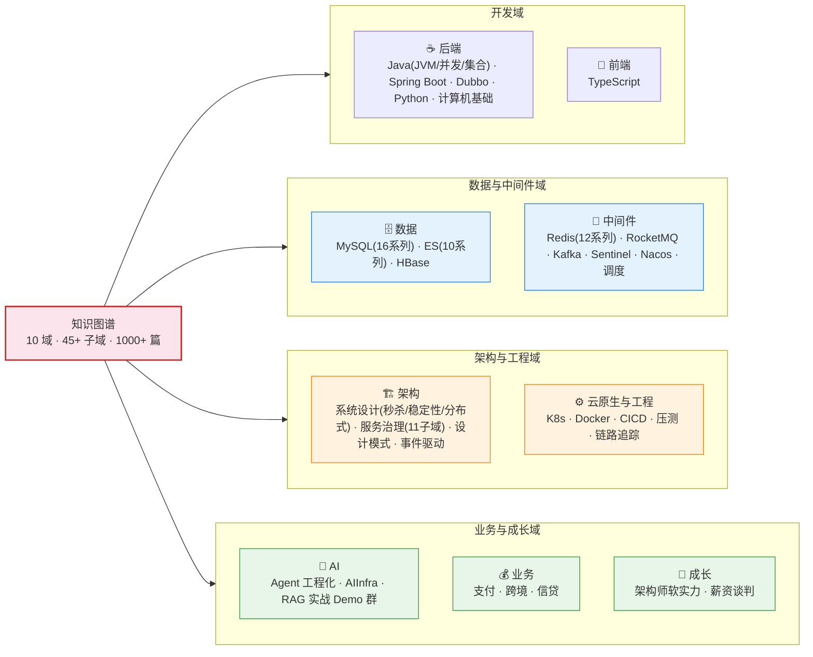

## 🎯 本文核心

**组织主线**：本站 = 十大技术域 × 四层深度（入门→特性→专题→整合）× 1000+ 篇——首页全景图给「域→子域→亮点」的骨架，PROGRESS 大纲给逐篇明细与分数，两者同源同步。

## 🗺 全仓目录全景

十个技术域、45+ 个子域、1000+ 篇文章的全景——每个域的深度以「层」计（入门层 → 特性层 → 专题层 → 整合层）：

**按域速览**（点击进域，域内再选层）：

| 域 | 子域 | 深度亮点 |
|---|---|---|
| [后端](/backend/java/use-java/) | Java 语言 · Spring Boot · Dubbo · MyBatis-Plus · Python · 计算机基础 | JVM 内存体系/类加载、并发五部曲、集合源码、Spring 入门 23 篇+事务源码 |
| [数据](/data/) | MySQL · Elasticsearch · HBase | MySQL 16 系列（内存/索引/MVCC/锁/日志/分片/备份恢复…）；ES 全链路（倒排/打分/聚合/集群） |
| [中间件](/middleware/redis/) | Redis · RocketMQ · Kafka · Sentinel · Nacos · 任务调度 | Redis 12 系列（线程模型/淘汰源码/分布式锁/一致性）；MQ 全家桶至源码级 |
| [架构](/architecture/system-design/) | 系统设计 · 服务治理(11 子域) · 设计模式 · 事件驱动 | 秒杀从零推演 7 篇、Raft/ZAB/TCC/限流源码、稳定性武器库 |
| [DevOps](/devops/kubernetes/) | K8s · Docker · CICD · Service Mesh | K8s 六大专题、镜像供应链安全、流水线密钥管理 |
| [AI](/ai/) | Agent 工程化 · AIInfra · RAG/Claude-CLI/风控 Agent Demo 群 | MCP 协议、编排引擎横评、Agent 治理 |
| [业务](/biz/) | 国内支付 · 跨境 · 信贷 | 从零设计支付系统、清结算体系 |
| [成长](/career/) | 架构师软实力 · 薪资谈判 | ADR 决策方法、技术选型方法论 |

> 数据域的「数据库体系全景图」（十大类 + 2026 趋势层）正在成文，落地后挂在本页与 [data 域入口](/data/)。

**这张图怎么用（三问导航）**：想系统学一个域 → 点域链接进「入门层」从第一篇读起；想解决具体问题 → 用 `⌘K` 搜索症状关键词直达深度篇；想查某个机制的正源 → 域内「特性层/专题层」的系列目录页有 ⚡速查卡。本图与 [PROGRESS 大纲](/about/progress)（全量篇目与分数）配合使用：图管全局结构，大纲管逐篇明细——图的层次关系与大纲的篇目清单互补，随每次批次更新同步演进（机制穿透：本站每篇文章落库前过六层 gate 校验，分数与缺口公开可查）。

## 知识图谱不是题库（十大类 + 2026 趋势层）正在成文，落地后挂在本页与 [data 域入口](/data/)。

## 一句话摘要

十大技术域、45+ 子域、1000+ 篇四层结构的长期知识库——图管全局结构（本页全景图），大纲管逐篇明细（PROGRESS），gate 管每篇质量（六层校验+分数公开）。

## 自测三问

1. 想系统学一个域，从哪进、按什么顺序读？（域 → 入门层 → 特性层 → 整合层）
2. 图和 PROGRESS 大纲的分工是什么？（图管结构、大纲管明细）
3. 每篇文章的质量由什么保证？（写前技能清单 + 六层 gate + 分数公开）
## 知识图谱不是题库

这里记录的是**长期值得保留的认知**：

- 读过的书、记住的核心观点与可执行行动
- 跨领域学习时沉淀的方法论与踩坑记录
- 让下次少走弯路的判断框架

仓库边界

- **本文档仓库**：放「为什么、怎么做、踩过什么坑」—— 这是知识本身
- **示例代码仓库**（待建）：放「完整可运行的项目」—— 文档里贴链接，文本更聚焦

文章里要演示代码时，会链接到示例代码仓库，**不把大段代码贴在文档里**。

## 使用方式

- 顶部胶囊：进入「总目录」按分类筛选文章
- 顶部搜索（`⌘ K`）：全文搜索（Pagefind 索引）
- 文章页右侧「本页目录」：自动生成章节锚点
- 文章底部「相关阅读」：基于标签推荐同类文章
- 内容取舍的跨期 Trade-off：广度（全景图/大纲）与深度（源码级特性层）分层存放——首页图给你地图，深度篇给你地基，两者按需取用，不为一致性牺牲层次
- 「在 GitHub 上编辑此页」：每篇文章 footer 有链接

## 三个阶段的学习路径

## 📌 数据与事实声明

- 全景图中篇数与系列数为 2026-09 成文时点统计（PROGRESS.md 同源），随批次持续更新
- 域链接为站内路由，结构变更以各域 index 为准

## 📚 参考资料

| 类型 | 标题 | 来源 |
|---|---|---|
| 站内 | 全量篇目与分数（PROGRESS） | /about/progress |
| 站内 | 各域入口 index | 顶部 features 卡片链接 |

## 贡献方式## 贡献方式

仓库公开，欢迎 fork 与讨论。

## 🎯 核心带走

- **核心一句话**：首页 = 全仓地图——全景图管结构、features 卡片管入口、PROGRESS 管明细
- **链条**：域 → 子域 → 层 → 篇；学习路径 = 入门层建立直觉 → 特性层源码深挖 → 整合层跨专题综合
- **失效点/边界**：篇数为成文时点统计，以 PROGRESS.md 实时数据为准
- **哪里会坏**：目录重构后若本图与实际不符，以各域 index 为准并回改本图
