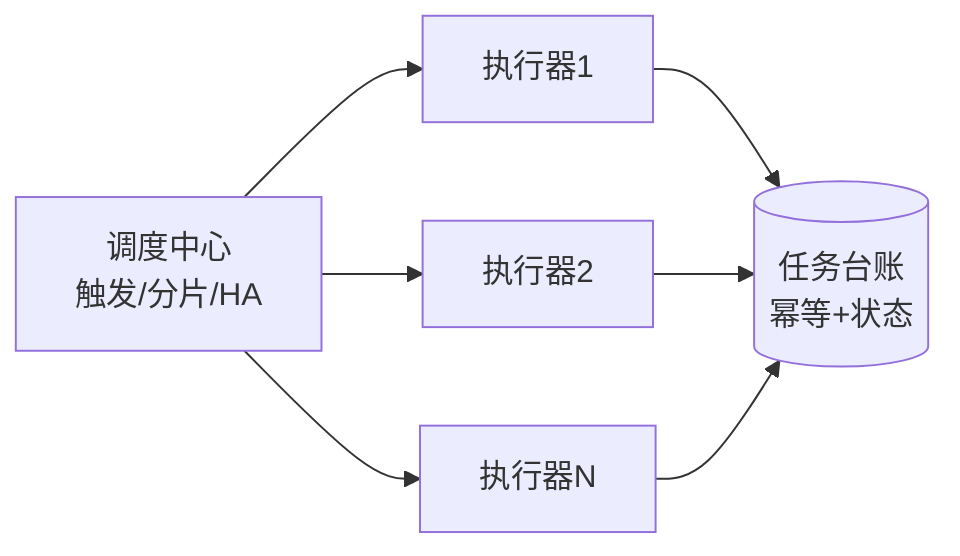
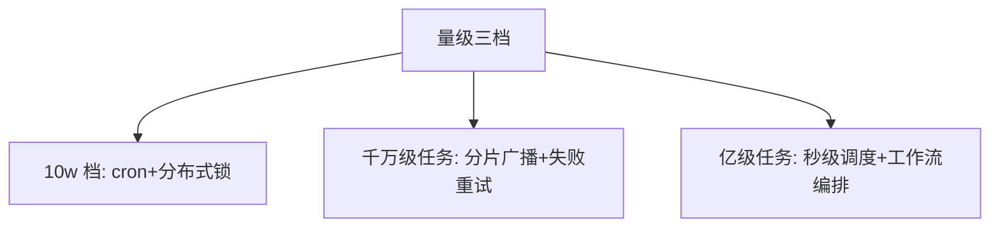

# 从零开始认识分布式任务调度系列导读

> 单机 cron 到分布式调度平台，跨过的不只是「多台机器」——分片、幂等、容错补偿、调度中心高可用，每一件都是分布式问题的调度域投影。

## 一句话摘要

分布式调度 = 调度中心（谁来触发）+ 执行分片（谁来干）+ 容错补偿（干砸了怎么办）三问题；选型主线是 xxl-job（简单可靠）与 PowerJob（秒级/工作流）的取舍。10w 档任务量 Spring Task+锁即可，千万级任务量需要分片广播与水平扩容。

## 篇目规划（L1-L4，ADR-0012 方向=子目录）

| 篇目/层 |
|---|
| L1 入门层（本层 8 篇，承接分类 index 清单） · cron 原理 / 分布式锁触发 / 分片广播 / 失败重试与幂等 / 调度中心 HA / 时间轮与延迟任务 / xxl-job 与 PowerJob 对比 / 方法论总结 |
| L2 特性层 · xxl-job 原理系列：调度心跳与注册 / 分片路由与故障转移 / 幂等与阻塞策略 |
| L3 专题层 · 调度亿级实战：海量任务的海量分片治理 / 调度延迟治理 |
| L4 整合层 · [从零实现分布式调度 Demo](../整合层/从零实现分布式调度/) |

**机制定位与取舍**：本方向的每个机制（原理与底层实现）都在篇目里锚定了位置——规划期的取舍是「机制原理优先于操作罗列」，代价是入门读者需要更多耐心，收益是后续每篇的参数与步骤都有原理可归因；架构上各层互为上下游，边界由「机制讲透」与「操作可执行」这条线划分。

## 演进视角

调度框架的演变：Quartz 集群（DB 锁）→ elastic-job（zk 协调）→ xxl-job（中心化简单可靠）→ PowerJob（秒级+工作流）——演变的主线是「调度中心越来越薄、执行侧越来越自治」；取舍（中心化的简单 vs 去中心的可靠）始终是调度架构的第一问。

## 📌 数据与事实声明

- 本文件为方向骨架规划（篇目标注 ⏳ 待写 / ✅ 已落地），依据 ADR-0012 工程级深度标准与 4 层架构规范；量级与参数数字均为行业认知量级，落篇时以实测替换。

## 📚 参考资料

- 本仓库 distributed-id 系列（任务单号）、K8s CronJob 篇（云原生调度对照）、xxl-job/PowerJob 官方文档。
