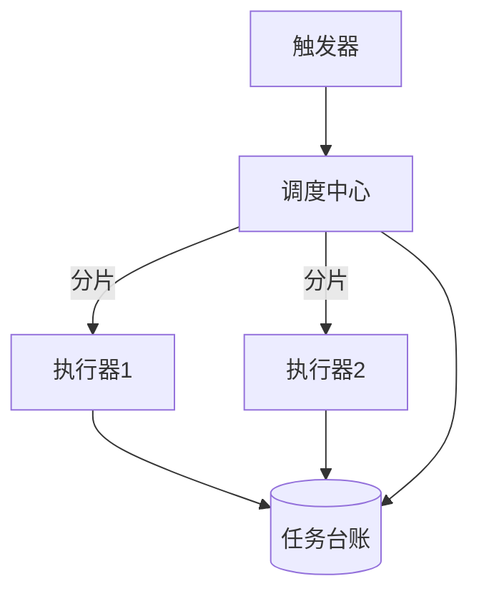

# 核心概念与架构心智模型

> 调度中心 / 执行器 / 任务台账 / 触发器——四个概念构成分布式调度的最小集合。

## 一句话摘要

> 调度中心 = 大脑（决策），执行器 = 手脚（执行），任务台账 = 记忆（状态），触发器 = 心脏（节拍）。

## 四组件心智模型

|| 组件 | 职责 | 宕机影响 |
|---|---|---|---|
| 调度中心 | 触发决策 / 分片 / 路由 | 全局停摆（单点） |
| 执行器 | 执行业务逻辑 | 部分任务丢失 |
| 任务台账 | 任务配置 + 执行记录 | 无法审计 + 无法恢复 |
| 触发器 | cron / API / 事件触发 | 不触发 = 无事发生 |

## 心智图

## 量级分档

- 10w 档：单机调度中心 + 单库台账够用
- 千万级：调度中心 HA + 分库分表台账
- 亿级：调度中心集群 + 分布式台账 + 事件驱动触发

## 常见误区

- ❌ 调度中心 = 执行器——调度中心只做决策，执行器只做执行，混用 = 单点瓶颈
- ❌ 任务台账 = 日志——台账要支持查询/重跑/补偿，不是只写日志

## 与相邻系列的关系

- **RocketMQ**：消息触发是事件驱动，cron 触发是时间驱动——两种触发器体系 tips 互指
- **K8s CronJob**：K8s 管的调度中心是轻量版——功能边界在 K8s 篇讲透