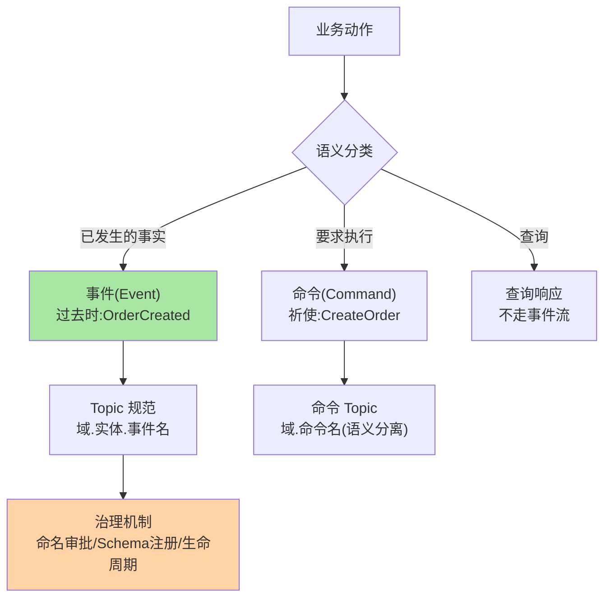
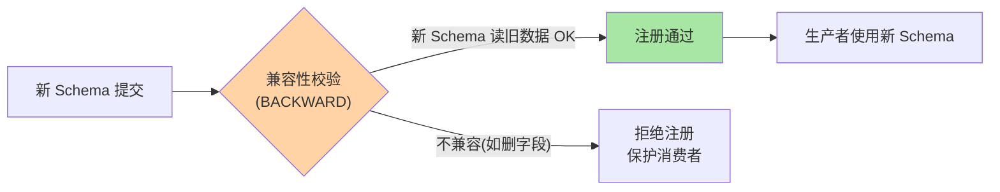

# 事件建模与 Topic 治理规范：消息驱动架构的地基

> topic 无序增长、事件无契约、消息无治理——消息驱动架构的腐烂从「地基」开始。这篇讲事件建模（事件 vs 命令 vs 查询的语义分类）、Topic 治理规范（命名/分区/保留策略的决策框架）、以及让规范活下来的治理机制。

> **本文核心**：事件的语义三分类——**事件**（「已发生的事实」，过去时命名，不可拒绝）、**命令**（「要求做某事」，祈使句命名，可拒绝）、**查询响应**（请求-响应，不在事件流中）——三类的混淆导致「事件流里塞命令」的语义腐化。**Topic 治理的决策框架**：命名规范（`域.实体.事件名` 三段式）、分区数（吞吐计算 + 消费并行度预留）、保留策略（按用途分：事件溯源永久、日志 7 天、CDC 按增量）。**机制链**：建模 → 命名 → 分区/保留决策 → 治理机制（审批/审计/生命周期）→ 持续运营。

## 一句话摘要

事件建模与 Topic 治理 = 语义三分类（事件/命令/查询）+ 四项决策框架（命名/分区/保留/Schema）+ 治理机制四件（审批/注册/生命周期/看板）。事件是「不可拒绝的事实」、命令是「可拒绝的请求」——语义分类决定架构形态；Topic 是「治理的边界」——命名/分区/保留/Schema 四项决策是地基。

## 一、为什么事件建模是地基

事件语义混乱的演化路径：事件流里混入命令（「请扣款」vs「已扣款」——消费者不知道该执行还是该感知）→ 同一事件多种命名（OrderCreated/order_created/ORDER_CREATE——消费者映射地狱）→ topic 无规范增长（三个月后没人知道 `t_xxx_v2_final` 是什么）——**地基不牢的消息驱动架构，越往上建越难拆**。

## 5W 速记卡

| 维度 | 一句话 |
|---|---|
| What | 事件语义分类 + Topic 治理框架 + 治理机制 |
| Why | 地基不牢（命名/建模/治理）的消息架构越建越难拆 |
| When | 事件驱动架构立项、Topic 治理专项、新团队接入 |
| Where | 治理平台 + Schema Registry + 代码规范 |
| How | 建模分类 → 命名规范 → 分区/保留决策 → 治理机制锁 |

## 二、事件建模与 Topic 治理全景

**事件 vs 命令的分界**：事件是「不可拒绝的事实」（发生就是发生了——消费者只能选择处理或不处理）；命令是「可拒绝的请求」（扣款命令可能因余额不足被拒）——**命令走独立 topic（点对点语义）**、事件走事件流（发布订阅语义）——两类混用是消息架构最常见的语义腐化。

Schema 兼容性的校验流程：

## 三、Topic 治理的决策框架

| 决策 | 框架 | 示例 |
|---|---|---|
| 命名 | `域.实体.事件名` 三段式 | `trade.order.OrderCreated` |
| 分区数 | 吞吐 ÷ 单分区容量 + 消费并行度预留 | 预估 10000 msg/s ÷ 2000/s/分区 = 5 + 余量 = 8 |
| 保留策略 | 按用途：事件溯源永久 / 日志 7 天 / CDC 增量 | `retention.ms=604800000`（7 天） |
| Schema | Schema Registry 注册 + 兼容性策略 | BACKWARD（向后兼容） |

**分区数的两难**：分区多消费并行度高但文件句柄/元数据开销大——**预留 2-3 倍**（当前消费并行度 × 2~3），扩容方向只加不减（分区减少会破坏 key 路由，互指顺序消息篇的扩分区问题）。

**量级演进视角**：十个 topic 靠口头约定即可；百个 topic 需要命名规范 + Schema Registry + 审批流程；千个 topic 必须治理平台（自助申请/自动校验/生命周期自动化/成本归因）——治理强度随 topic 量级升级，不要用千级流程管百级系统。

## 四、治理机制：让规范活下来

- **命名审批**：新 topic 走申请（名称/分区/保留/用途/负责人），审批通过自动创建（避免手工建——手工建的 topic 是治理盲区）
- **Schema Registry**：事件结构注册 + 兼容性校验（BACKWARD——新 schema 读旧数据兼容）——**事件契约的机器化门禁**
- **生命周期管理**：topic 下线走流程（先停生产 → 观察消费归零 → 删除）——「僵尸 topic」的清理机制
- **治理看板**：topic 总数/增长率/无 Schema 占比/无负责人占比——治理现状一目了然

**Trade-off 分析**：事件建模的核心取舍——Schema 严格度与发布灵活度（BACKWARD 限制删除换消费稳定，代价是字段演进必须「先加后删」两步走）；Topic 拆分粒度与消费成本（拆细粒度消费者灵活但连接/维护成本高）；保留策略长与短（保留长可回溯但磁盘成本高）。三项取舍的决策框架写在治理规范中，避免各团队拍脑袋。

## 五、典型场景与事故推演

**事故剧本（Schema 不兼容破坏消费）**：生产者在事件 payload 中删除了 `orderId` 字段（改为 `orderNo`）——消费者反序列化失败（字段映射断）→ 全量消费报错 → 数据管道中断。Schema Registry 未启用（自管 JSON 结构无校验）——**一次「顺手改字段」的兼容性事故**。修复：恢复字段 + 新增映射字段（双写过渡）→ 启用 Schema Registry BACKWARD 校验。**教训**：事件契约的变更需要兼容性门禁——Schema Registry 是机器化门禁的载体。

## 业内惯例

- **事件命名过去时**：OrderCreated 而非 CreateOrder——命名即语义文档
- **Schema Registry BACKWARD 兼容起步**：兼容模式先行，演进按需调整
- **Topic 命名三段式**：`域.实体.事件名`（`trade.order.OrderCreated`）——三段式是检索与权限的分界
- **3.x/4.x 视角**：KRaft 不改变 topic 治理语义；分层存储（4.x）增加「冷热分层策略」新决策维度

## 六、常见误区

- **「事件和命令是一回事」**：事件不可拒绝（事实），命令可拒绝（请求）——混用导致消费者行为混乱
- **分区数越多越好**：分区多并行度高但句柄/元数据/端到端延迟都增——按吞吐+并行度计算，不追求最大
- **Schema 放 Git 就够了**：Git 管版本但不做运行时校验——生产者绕过 Git 直接发不兼容消息时 Git 管不住
- **topic 建了不管**：僵尸 topic 占磁盘/增加元数据/误导消费者——生命周期管理是治理不可缺的一环

## 七、与相邻机制的关系

- 《深入理解事务与流处理系列》：事务在事件流上的应用（exactly-once 的事件处理）
- 治理域 config-center 系列：配置中心承载治理元数据（元数据的存储与下发互指）
- tips 互指：治理域 metadata-center 系列（元数据模型与治理集的通用框架）

## 你们可能会问

**Q1：一个大 topic 还是多个小 topic？**
按「消费模式与生命周期差异」拆——不同消费者/不同保留策略/不同 Schema 分开；同消费者的同类事件可合并——拆分的判据是消费模式差异不是事件种类差异。

**Q2：Schema Registry 和 Proto 文件什么关系？**
Proto 定义结构，Schema Registry 管注册与兼容性校验（运行时门禁）——Proto + Registry 组合是「建模 + 治理」的完整方案，缺 Registry 则兼容性无人把守。

**Q3：Topic 数量有上限吗？**
技术上限受分区总数限制（集群元数据/文件句柄）——治理上限远低于技术上限（topic 增长率是治理健康度的信号）——按治理评估不按技术极限。

## 八、自测三问

1. 事件三分类的语义分界与混用的后果？
2. Topic 治理的四项决策框架（命名/分区/保留/Schema）？
3. 「事件不可拒绝，命令可拒绝」的语义差异如何影响架构？

## 开放问题

- 事件标准化的行业推进（CloudEvents 等事件信封标准的普及）——跨组织事件互认的信封标准化是事件驱动生态的演进方向。
- 治理即代码（topic 生命周期以声明式配置管理、CI 校验命名与 Schema）是治理机制的平台化方向。

## 📎 核心带走

- **核心一句话**：事件建模与 Topic 治理 = 语义三分类（事件/命令/查询）+ 四项决策框架（命名/分区/保留/Schema）+ 四件治理机制（审批/注册/生命周期/看板）——地基决定上层
- **机制链**：建模分类 → 命名规范 → 分区/保留决策 → Schema Registry 注册 → 治理机制（审批/审计/生命周期）→ 持续运营
- **失效点/边界**：事件命令不混用；分区不追求最大；Schema Registry 是机器门禁不是文档

## 💡 实战提示

- 💡 保留键清单 + 命名三段式 + Schema Registry 三件套是元数据治理的最小起步
- 💡 Topic 治理看板（总量/增长率/无 Schema 占比）进治理大盘——治理现状的仪表盘
- 💡 决策口径：分区预留 2-3 倍消费并行度，只加不减——分区治理的方向纪律

## 📌 数据与事实声明

- 写于 2026-09-10，事件建模与治理框架为业界实践的归纳；Schema Registry 兼容模式为 Confluent 官方口径
- 事故推演为 Schema 不兼容的典型模式匿名化复述
- 免责：具体规范按团队消息架构评审

## 📚 参考资料

| 类型 | 标题 | 来源 |
|---|---|---|
| 官方文档 | Confluent Schema Registry | docs.confluent.io |
| 公开标准 | CloudEvents 事件信封标准 | cloudevents.io |
| 实践书 | 《实现领域驱动设计》（事件建模参照） | 公开出版 |
