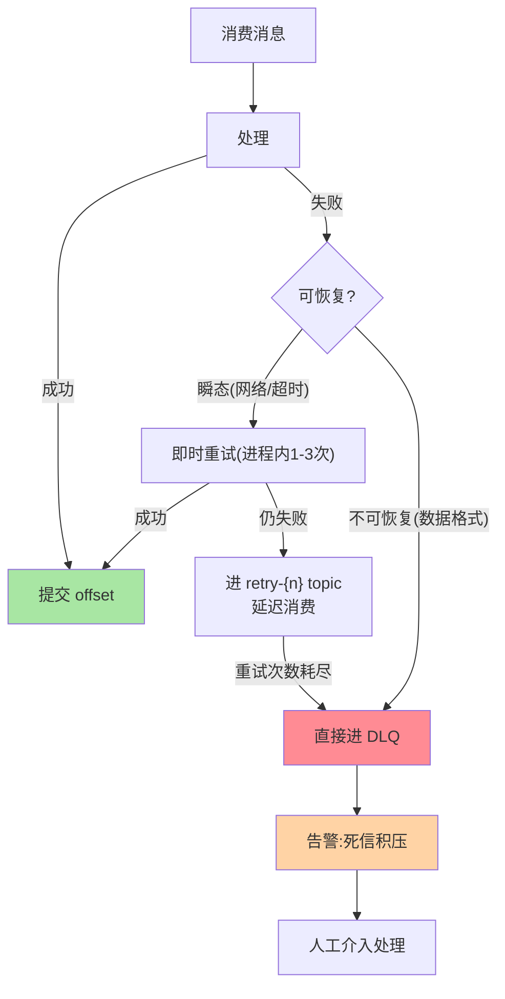
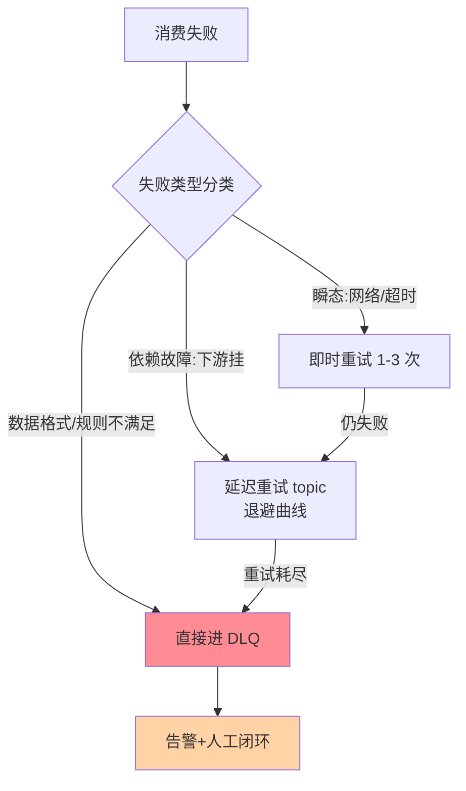

# 消息幂等、死信与重试治理：消费失败的完整处置

> 消费失败不是终局——**重试（可恢复）→ 死信（不可恢复）→ 人工介入（兜底）**是三层处置链。这篇把消费失败的完整处置体系讲成治理框架：重试策略、死信队列设计、以及让三条处置链不变成「黑洞」的治理机制。

> **本文核心**：三层处置链——**① 即时重试**（进程内重试：可恢复的瞬态错误——网络抖动/短暂不可用），**② 延迟重试**（重试 topic：消息进 retry-{n} 主题延迟消费——可恢复但需等待的依赖故障），**③ 死信队列**（DLQ：不可恢复错误——数据格式/业务规则不满足——进死信人工处理），**④ 兜底**（死信的监控告警与人工处理闭环）。**机制链**：消费失败 → 分类（可恢复？）→ 即时重试 → 延迟重试 topic → DLQ → 告警 + 人工。

## 一句话摘要

消费失败的处置 = 即时重试（瞬态错误）→ 延迟重试 topic（依赖故障）→ DLQ（不可恢复）→ 人工闭环。四层各有退出条件与监控指标；缺任何一层都是处置黑洞——重试无上限阻塞队列、DLQ 无处理等于高级丢弃、无死信等于静默丢失。

## 一、为什么需要三层处置链

单层处置的困境：只重试——不可恢复的错误无限重试（阻塞队列）；只死信——可恢复的瞬态错误也进死信（人工成本爆炸）。**分类处置**：可恢复的给重试机会（自动恢复），不可恢复的快速进死信（人工闭环），**每层都有退出条件与监控**——处置链的核心是「分类正确 + 层级退出条件明确」。

## 5W 速记卡

| 维度 | 一句话 |
|---|---|
| What | 即时重试→延迟重试 topic→DLQ→人工的四层处置链 |
| Why | 单层处置要么阻塞要么人工爆炸，分类处置才可持续 |
| When | 消费失败处理设计、死信积压治理 |
| Where | 消费者代码 + 重试 topic + DLQ topic + 告警 |
| How | 失败分类 → 逐层处置 → 每层退出条件与监控 |

## 二、三层处置链全景

**延迟重试的退避语义**：retry-0（1 分钟后）、retry-1（5 分钟后）、retry-2（30 分钟后）——逐级拉长给下游恢复时间；每级消费失败进下一级——**退避曲线与故障恢复周期匹配**（网络抖动 1 分钟恢复、服务重启 5 分钟、数据修复 30 分钟）。

三层处置链的决策流程：

## 三、死信队列的治理

死信不是「垃圾桶」是「待处理工作队列」——DLQ 的治理四件：

| 治理项 | 内容 |
|---|---|
| 告警 | DLQ 积压 > 阈值即告警（分优先级） |
| 归因 | 每条死信记录失败原因（分类统计——哪类失败最多） |
| 处理 | 人工修复数据后重新投递（修复消息或修数据后 replay） |
| 闭环 | 处理率统计（死信处理率 < 100% 是治理缺口） |

**死信的处理策略按失败类型**：数据格式错（人工修数据后重投）、业务规则不满足（确认业务语义后决定丢弃/重投/人工处理）、系统 Bug（修代码后全量重投）——**DLQ 的处理是「工单」不是「丢弃」**。

**量级演进视角**：单消费者百 QPS 即时重试够用；多消费者万 QPS 需要延迟重试 topic 分级 + 死信自动分类；十万 QPS 需要重试链路自动归因与自愈——处置链的自动化程度随消费量级升级。

## 四、事故推演：没有死信队列的三周

某服务消费失败直接跳过（无重试无死信）——三周后业务方反馈「有订单状态没更新」——排查发现当时下游数据库闪断导致部分消费失败被跳过（无重试直接 offset 提交），期间所有失败消息静默丢失。修复：补建 DLQ + 存量数据修复 + 重试链路建设。**教训**：消费失败的处理策略是「上线前设计」不是「出事后补建」——三层处置链的缺席等于给失败开无限跳过权。

## 业内惯例

- **重试 topic 命名规范**：`{原topic}-retry-{n}`——重试链路清晰可审计
- **DLQ 主题保留策略**：DLQ 的消息不过期（人工处理不丢）——保留策略与其他 topic 不同
- **3.x/4.x 视角**：Kafka 原生无 DLQ 概念（社区方案：Spring Kafka 的 DeadLetterPublishingRecoverer/KIP 提案在演进）；对比 RocketMQ 原生 DLQ（互指 RocketMQ 系列）

## 五、常见误区

- **DLQ 等于「丢弃队列」**：DLQ 是「待处理工作队列」——设了 DLQ 不处理等于设了高级黑洞
- **重试无上限**：无限重试 = 不可恢复错误阻塞队列（毒丸消息阻塞后续所有消息——**毒丸必须快速进 DLQ**）
- **重试 topic 忘了消费**：retry-{n} 建了但没配消费者——消息进去就永不出（静默黑洞）
- **失败原因不在消息里**：DLQ 消息没有失败原因元数据（异常类型/时间/原始 topic）——人工处理无从下手

## 六、与相邻机制的关系

- 《深入理解事务与流处理系列》篇 1：消费幂等（重试产生重复消费的兜底）
- 本目录篇 1：事件建模与 Schema（死信的归因分类依据）
- tips 互指：治理域容错系列篇 4（failback 与重放同源机制）；RocketMQ 死信机制对比（互指其系列）

## 你们可能会问

**Q1：重试几次合适？**
即时重试 1-3 次（快速恢复瞬态）+ 延迟重试 2-3 级（匹配依赖恢复周期）——总重试时长覆盖下游最大恢复时间，超过即进 DLQ。

**Q2：Spring Kafka 怎么实现？**
`DefaultErrorHandler` + `DeadLetterPublishingRecoverer`——重试策略（ExponentialBackOff）与死信发布组合配置；`RetryTopicConfiguration` 支持声明式重试 topic 链。

**Q3：死信消息的 offset 怎么处理？**
进 DLQ 后原 topic 的 offset 正常提交（DLQ 是「处理方式的改变」不是「处理失败」）——原消息的处置责任转移到 DLQ 的处理流程。

## 八、自测三问

1. 三层处置链各层的退出条件？
2. 毒丸消息为什么必须快速进 DLQ？
3. DLQ 消息需要携带什么元数据？

## 开放问题

- 重试与死信的声明式标准化（跨语言消费者的统一配置模型）在 Spring Kafka 之外的生态仍碎片化。
- 死信消息的 AI 归因（自动分析失败原因分类并推荐处理策略）是死信治理的智能化方向。

## 📎 核心带走

- **核心一句话**：消费失败处置 = 即时重试 → 延迟重试 topic → DLQ → 人工闭环——四层各有退出条件与监控，缺层即黑洞
- **机制链**：失败分类 → 瞬态重试 → 依赖故障延迟重试（退避曲线） → 不可恢复进 DLQ → 告警人工 → 处理率闭环
- **失效点/边界**：毒丸必须快速进 DLQ；DLQ 是工作队列不是垃圾桶；无重试链路的跳过是静默丢失

## 💡 实战提示

- 💡 三层处置链的代码模板（Spring Kafka DefaultErrorHandler 配置）进脚手架
- 💡 DLQ 积压/处理率/失败原因分布三指标进大盘——死信治理的仪表盘
- 💡 决策口径：失败分类的判断规则（可恢复/不可恢复）按业务异常类型定义——分类规则是处置链的灵魂
- 💡 处置自动化与人工可控的取舍：自动重试越多人工越少但误处理风险越高——重试层级数按错误恢复周期定，不无限自动化

## 📌 数据与事实声明

- 写于 2026-09-10，处置框架为 Kafka 消费治理的业界归纳（Spring Kafka 文档口径）；DLQ 为 RocketMQ/Spring Kafka 方案参照
- 事故推演为无死信队列的典型模式匿名化复述
- 免责：具体配置按消费语义与工具版本评审

## 📚 参考资料

| 类型 | 标题 | 来源 |
|---|---|---|
| 官方文档 | Spring Kafka Error Handling / Retry Topics | docs.spring.io |
| 关联系列 | 本仓库 RocketMQ 死信（对照）/ 容错篇 5（幂等互指） | docs/ |
| 实践书 | 《Kafka Streams 实战》（错误处理章） | 公开出版 |
