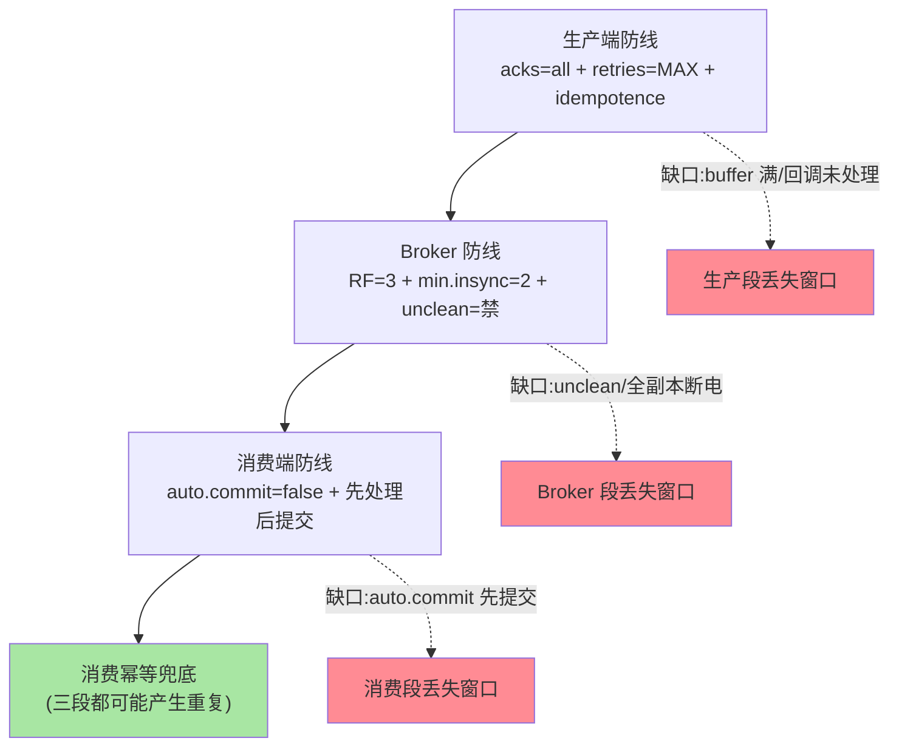
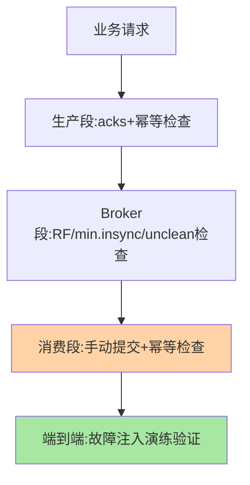

# 不丢消息三段配置全景：生产、Broker 与消费的全链防线

> 「消息不丢」不是单点配置，是**三段防线**的联动：生产端（acks+重试+幂等）、Broker（min.insync+副本）、消费端（手动提交+先处理后提交）。任何一段的默认值都可能丢——这篇把三段的全景配置、每段的丢失窗口与验收手段讲成一张防丢地图。

> **本文核心**：三段防线的机制与缺口——**生产段**（acks=all + retries=MAX + enable.idempotence=true：生产到 broker 的丢失窗口关闭，缺口是「重试成功但语义重复」）；**Broker 段**（replication.factor=3 + min.insync.replicas=2 + unclean.leader.election=false：单机故障不丢，缺口是「全副本机器同时断电」的极端窗口）；**消费段**（enable.auto.commit=false + 处理完成后手动提交：消费不丢的机制是「offset 提交晚于处理」，代价是「可能重复」（处理的幂等兜底），缺口是「offset 提交了但下游副作用没完成」的时序 Bug）。**机制链**：三段缺口互相独立——全链「不丢」= 三段同时配置正确 + 消费幂等兜底重复。

## 一句话摘要

三段配置的语义分工：生产段管「发出去的不丢」（producer 到 broker 的持久化确认）、Broker 段管「存着的在」（副本容错与 ISR 纪律）、消费段管「消费到的不丢」（先处理再提交 offset 的次序）——**「不丢」在每段都有不同的丢失窗口**（生产段的 buffer.memory 溢出、Broker 段的 unclean 选举、消费段的自动提交先于处理）——防线地图的价值就是让每个窗口显式化，逐一关闭。

## 一、边界：既有篇目讲过什么，本文讲什么

| 内容 | 已有篇目 | 本文 |
|---|---|---|
| acks/ISR/HW 机制 | 副本系列篇 1-2 | 不重复 |
| 幂等/事务/offset | 事务系列篇 1 | 不重复 |
| 三段防线的全景配置与丢失窗口 | 未讲 | **本文核心** |
| 防丢验收（故障演练） | 未讲 | **本文核心二** |

## 二、三段防线全景



**三段配置的完整清单**（生产基线）：

```text
生产端: acks=all / retries=MAX / enable.idempotence=true
        / delivery.timeout > linger+请求超时 / buffer.memory 监控
Broker:  replication.factor=3 / min.insync.replicas=2
        / unclean.leader.election.enable=false
消费端:  enable.auto.commit=false / 处理完成后手动提交
        / 消费幂等(去重表/状态机)兜底重复
```

全链不丢的检查漏斗：



## 三、各段的丢失窗口与关闭方法

| 段 | 丢失窗口 | 关闭方法 |
|---|---|---|
| 生产端 | buffer.memory 溢出（send 阻塞超时后丢）/ 回调异常未处理 | buffer 水位告警 + 回调统一处理（失败落补偿存储） |
| Broker | unclean 选举（ISR 全灭时非同步副本上位）/ 全副本机器同断电 | unclean=false + 副本跨机架/机房 |
| 消费端 | 自动提交先于处理完成（处理中挂了，offset 已提交）| auto.commit=false + 手动提交在处理成功后 |
| 全链残留 | 三段配置齐也可能「重复」消费/发送 | 幂等兜底（去重键/状态机）——不丢必伴重复，幂等收尾 |

**「不丢必伴重复」是机制性的**：不丢的代价是「不确定时重试/重放」——重放产生重复——**幂等消费不是可选项是必选项**（互指本系列事务篇 1 与治理域容错篇 5 的幂等绑定）。

## 四、源码与工具关键路径

```text
生产端证据: producer 回调(异常类型分层) / metrics(record-error-rate)
Broker 证据: UnderReplicatedPartitions(>0 即副本滞后) /
            UncleanLeaderElectionsPerSec(必须恒为 0)
消费端证据: consumer lag 曲线 + 提交频率(手动提交的节奏)
验收工具: 故障注入演练(kill broker/kill consumer/网络分区)
          → 验证三段各自的行为与全链不丢
```

**量级演进视角**：小流量三段基线配置即可；大流量（十万级 QPS）的可靠性配置要与分区分层联动（acks=all 的延迟靠分区并行消化）；多机房容灾再加复制拓扑维度——不丢的治理强度随流量与拓扑量级升级，检查表也要随之分级。

## 五、事故推演：三段防线各漏一段的三连击

某新服务上线即丢消息的三连复盘：① 生产端用默认（acks=1）——broker 切主时丢一批；② Broker 上线时图省事 RF=1——磁盘坏直接丢整分区；③ 消费端开了自动提交（默认 5 秒）——处理中崩溃的窗口重复/丢失随机出现。三段各漏一段，故障率叠加。修复后验收：三段配置基线检查进上线清单 + 故障演练（kill broker/kill consumer）各跑一轮。**教训**：不丢是「三段 AND」逻辑——任何一段的默认值都可能不满足业务语义，上线前逐段核对是纪律。

## 业内惯例

- **三段基线配置进脚手架/镜像默认**——「新服务上线配置核对表」的制度化
- **故障演练进验收**（kill broker、kill consumer、网络分区三类注入）——没演练过的不丢等于没验证
- **3.x/4.x 视角**：三段机制的参数名稳定（acks/unclean/min.insync 跨版本一致）；默认值演进方向是「更安全」（幂等默认开）——参数核对清单需要随版本复核

## 六、常见误区

- **「acks=all 就不丢」**：只是生产段不丢——broker 段（unclean/RF=1）与消费段（auto.commit）的丢失窗口独立存在，三段 AND 才是真不丢
- **「重复没关系」**：重复在支付/库存类语义下等于资损——「不丢」与「不重」要一起评估，幂等兜底不可省
- **只配 Broker 不管客户端**：Broker 段是平台配置（一次配好全集群），生产/消费段是应用配置（每个服务都要对）——「平台配好了应用就安全」是错觉
- **自动提交 + 手动处理以为兼容**：auto.commit=true 时提交节奏与处理进度脱钩——关闭自动提交是消费不丢的前提

## 七、与相邻机制的关系

- 本系列事务篇 1：幂等与事务的协议层（消费幂等的应用层互补）
- 《深入理解副本与一致性系列》：Broker 段防线的机制底座（ISR/min.insync/unclean 的语义）
- tips 互指：治理域容错篇 5（消费幂等的三层实现）；可靠性演进整合篇（全历程收束）

## 你们可能会问

**Q1：三段配置完还丢过一次，为什么？**
排查「极端窗口」：全副本机器同断电（数据中心级故障）、消费幂等键设计缺陷（重放没被识别）、或上游根本没有成功发送（业务侧 Bug 误判为 MQ 丢）——「丢」的判定要先排除「根本没发」。

**Q2：消费幂等的去重键怎么选？**
业务唯一键（订单号/事件 ID）优于 offset（offset 在重平衡后会变）——去重表/状态机的生命周期与业务对齐（互指容错篇 5 的幂等三问）。

**Q3：acks=all 的性能损失怎么补？**
发送侧攒批（linger+batch.size）摊薄同步成本 + 压缩降带宽（互指存储系列篇 2）——安全默认的性能损失靠批量化与压缩组合消化，不降安全等级。

## 八、自测三问

1. 三段防线各自的丢失窗口与关闭方法？
2. 「不丢必伴重复」的机制逻辑与幂等兜底的位置？
3. 验收的故障注入三类注入分别验证什么？

## 开放问题

- 「不丢」的端到端自动化验证（混沌注入 + 全链比对工具化）在头部团队工具化——防丢验收从人工演练向持续验证演进。
- 多集群/跨机房复制场景的端到端不丢语义（MirrorMaker 链路的丢失窗口）是复制拓扑的新课题。

## 📎 核心带走

- **核心一句话**：不丢 = 生产段（acks+幂等）× Broker 段（RF+min.insync+unclean）× 消费段（手动提交）三段 AND + 消费幂等兜底重复
- **机制链**：每段独立配置、独立丢失窗口——三段 AND 逻辑下任何一段默认值都可能破防线
- **失效点/边界**：重复是机制性代价必配幂等；平台配置不覆盖应用段；没演练等于没验证

## 💡 实战提示

- 💡 三段基线配置进上线核对表（逐项打勾），新服务上线即合规
- 💡 故障演练三类注入进验收流程——kill broker/consumer/网络分区
- 💡 决策口径：丢的代价分级——资金级三段全严+对账、运营级三段基线即可——按语义分级不搞一刀切
- 💡 可靠性与吞吐的取舍：三段全严的吞吐代价靠批量化/压缩/分区扩容消化——安全等级定好后用吞吐手段补性能

## 📌 数据与事实声明

- 写于 2026-09-10，机制与参数以 Kafka 4.x 为准（跨版本参数名稳定）；「变更类故障占大头」等归因口径为行业公开复盘归纳
- 事故推演为三段防线失效的典型模式匿名化复述
- 免责：具体配置按业务语义评审

## 📚 参考资料

| 类型 | 标题 | 来源 |
|---|---|---|
| 官方文档 | Kafka Configurations（Producer/Broker/Consumer） | kafka.apache.org |
| 关联系列 | 本仓库副本系列篇 1-2 / 事务系列篇 1（机制互指） | 本目录 |
| 实践书 | 《深入理解 Kafka》朱忠华（可靠性章） | 公开出版 |
