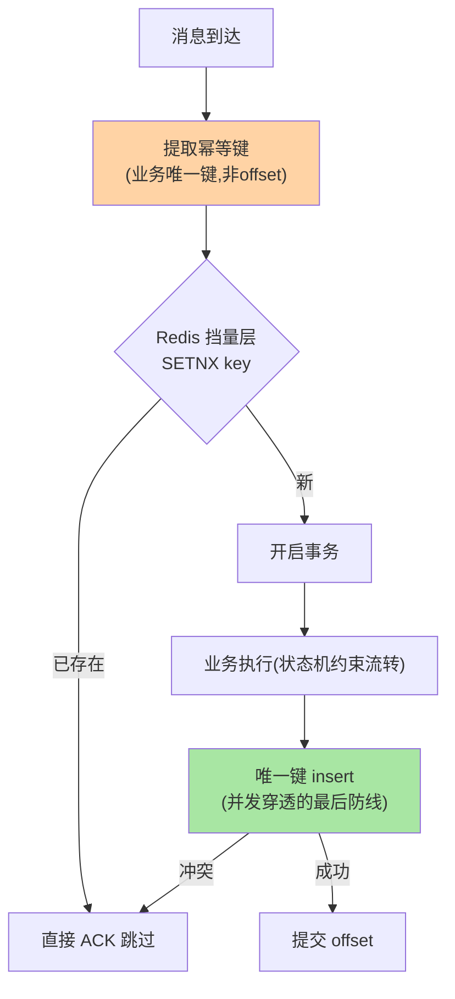
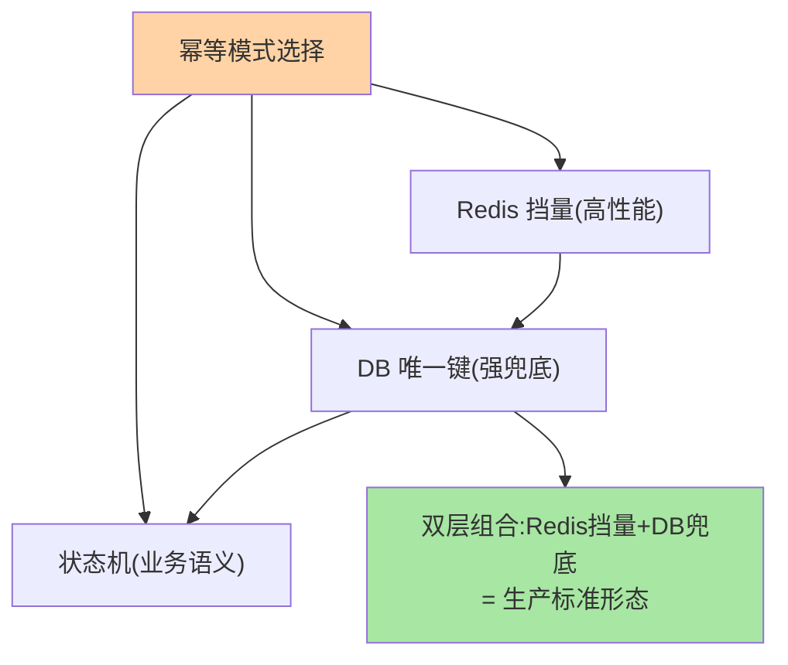

# 消费幂等落地：去重表、状态机与事务边界

> 「不丢必伴重复」——消费端的重复是机制性代价，幂等是唯一的收尾手段。这篇讲消费幂等的四种实现模式、并发下的去重竞态、以及「幂等键设计」这个真正的核心难点。

> **本文核心**：四种模式按强度排布——**数据库唯一键**（insert 冲突即重复，最强兜底）、**去重表**（独立表记录已处理键，事务内先查后插）、**状态机**（状态流转条件校验，幂等与业务语义合一）、**Redis 前置挡量**（高性能挡量但持久性弱，需数据库兜底）。**机制链**：消息到达 → 幂等键提取（业务唯一键）→ 去重检查（挡量层）→ 业务执行（状态机约束）→ 唯一键落库（兜底层）→ 提交 offset。

## 一句话摘要

幂等的真正难点不是「选哪种模式」而是**幂等键的设计**：键必须来自业务语义（订单号/事件 ID）且调用方重试时复用——offset 不行（重平衡漂移）、时间戳不行（每次不同）、自增 ID 不行（重试生成新的）。**三个关键决策**：① 键的生命周期（防重窗口与业务重复风险窗口对齐）；② 检查与执行的原子性（查完没插的竞态窗口——唯一键约束是并发安全的唯一解，先查后插必有竞态）；③ 失败后的处理语义（处理失败的消息是重试还是跳过——重试要求业务可重入，跳过要求可接受丢失）。**「Redis 挡量 + 数据库唯一键兜底」的双层组合**是生产标准形态——Redis 层挡住 99% 的重复请求，唯一键约束兜住并发与 Redis 故障的穿透。

## 一、边界：既有篇目讲过什么，本文讲什么

| 内容 | 已有篇目 | 本文 |
|---|---|---|
| 「不丢必伴重复」的机制 | 本目录篇 1 ✅ | 不重复 |
| 四种幂等模式与并发竞态 | 未讲 | **本文核心一** |
| 幂等键设计的三个决策 | 未讲 | **本文核心二** |
| 幂等的演练与验收 | 未讲 | **本文核心三** |

## 二、消费幂等全链路

**为什么 Redis 不能是唯一防线**：Redis 标记成功后业务执行失败 → 标记已在（但业务没完成）→ 重试消息被跳过 = 丢业务——所以 Redis 层的设计必须「业务成功后才确认标记」（或用带过期时间的预占语义 + 失败补偿删除）——**标记的生命周期与业务结果绑定**，这是挡量层的正确姿势；无论 Redis 怎么设计，数据库唯一键都是并发穿透的最后防线（两层互补而非互替）。

四种模式的选型漏斗：

**量级演进视角**：百 QPS 消费单层去重表够用；万 QPS 要 Redis 挡量层（数据库直抗去重查会拖垮主库）；十万 QPS 加本地缓存预检（进程内 LRU 先挡一层）——幂等架构随消费量级分层演进，每层的失效模式与穿透率要一并监控。

## 三、幂等键设计的三个决策

1. **键来源**：业务唯一键（订单号/事件ID/转账流水号）——来自消息体或上游传递，调用方重试时复用；❌ offset（重平衡漂移）、❌ 时间戳（每次不同）、❌ 自增（重试生成新的）
2. **生命周期**：防重窗口 = 业务重复风险窗口（支付防重可能要永久，营销防重 24h）——过期清理策略与窗口对齐
3. **失败语义**：业务执行失败后「标记回滚」允许重试，还是「标记保留」跳过——重试要求业务可重入（部分执行能恢复），跳过要求丢失可接受——**这个决策必须显式做出并写进设计文档**

## 四、典型场景与事故推演

**事故剧本（先查后插的竞态）**：消费服务用「先 SELECT 查是否处理过，没有则处理+INSERT 标记」——并发场景两条相同消息被两个消费线程同时处理（SELECT 都返回空，都执行业务）——双重扣款。修复：唯一键 insert（冲突即跳过）替代先查后插，或 SELECT FOR UPDATE——**「查-判-做」三步在并发下不原子，唯一键约束才是并发安全的**。业内口径：唯一约束兜底 + 状态机约束是幂等的最小完备组合。

## 业内惯例

- **幂等层代码模板化**（注解式 @Idempotent 或基类封装）——每个消费者自己实现是重复建设
- **幂等监控**（重复拦截率看板——拦截率突增可能是上游重试风暴或键设计缺陷）
- **3.x/4.x 视角**：Kafka 事务/idempotence 与消费幂等互补（互指事务篇 1）——Kafka 侧的幂等只管「写不重」，消费侧幂等管「处理不重」，两层都要

## 五、常见误区

- **「Kafka 只投递一次」**：Kafka 是 at-least-once（配合消费端正确配置）——exactly-once 是组合语义，普通消费必须自带幂等
- **去重表无过期清理**：表无限膨胀拖垮索引——防重窗口与清理任务配套
- **跳过失败消息无监控**：跳过率看板缺失 = 业务静默丢失无感知——跳过也必须有监控告警
- **幂等测试只测单线程**：竞态只在并发下出现——并发幂等测试（同键并发两条）是验收标配

## 六、与相邻机制的关系

- 本目录篇 1：三段防线的幂等兜底位（本篇是其展开）
- 治理域容错篇 5《重试与幂等》：幂等实现的通用机制（本篇是 Kafka 消费场景的应用）
- tips 互指：治理域 config-center 篇 8（唯一键约束的 MySQL 侧机制）

## 你们可能会问

**Q1：Redis 挡量层挂了怎么办？**
挡量层不可用时降级直走数据库唯一键（兜底层天然接管）——挡量层是性能优化不是正确性依赖，挂了只影响吞吐不影响正确性。

**Q2：批量消费（一批多条）怎么做幂等？**
批内逐条幂等（同一套键检查）+ 批级 offset 提交（全部处理完才提交）——部分失败的重试策略（整批重试需全键幂等，逐条重试需记录批内进度）。

**Q3：上游就是不给唯一键怎么办？**
内容哈希兜底（消息体 hash 作键——但内容变更会误判）+ 推动上游契约改造加唯一键——长期解是契约治理，短期哈希是止血。

## 七、自测三问

1. 四种幂等模式的强度排布与「双层组合」的逻辑？
2. 幂等键三决策（来源/生命周期/失败语义）为什么键来源最核心？
3. 「先查后插」的竞态机制与唯一键兜底的原理？

## 开放问题

- 幂等的声明式标准化（@Idempotent 注解 + 平台自动管理键与存储）在框架化演进——「幂等即配置」降低每个消费者的实现成本。
- 跨服务幂等（调用方-中间层-下游的幂等链）的统一键传递标准尚无行业共识。

## 📎 核心带走

- **核心一句话**：消费幂等 = 幂等键设计（业务唯一键）+ 双层防（Redis 挡量 + DB 唯一键兜底）+ 失败语义显式决策——幂等键是核心难点
- **机制链**：消息到达 → 键提取 → Redis 挡量 → 业务执行（状态机） → 唯一键落库兜底 → 提交 offset
- **失效点/边界**：offset/时间戳不能当键；Redis 非唯一防线；并发幂等测试是验收标配

## 💡 实战提示

- 💡 幂等层代码模板化进脚手架——新消费者不再自己实现
- 💡 并发幂等测试（同键并发）进验收流程——单线程测试是假验证
- 💡 决策口径：失败语义三选（重试/跳过/人工）必须显式决策并写进设计文档，不允许「默认行为」
- 💡 幂等粒度与实现成本的权衡：键粒度越细越精确但存储越大——粒度按业务重复风险窗口对齐，不为完备性买单

## 📌 数据与事实声明

- 写于 2026-09-10，四种模式为业界工程共识归纳；Kafka 语义（at-least-once/exactly-once）以官方文档为准
- 事故推演为并发竞态失效的典型模式匿名化复述
- 免责：具体模式按业务语义组合

## 📚 参考资料

| 类型 | 标题 | 来源 |
|---|---|---|
| 官方文档 | Kafka Consumer offset 语义 | kafka.apache.org |
| 关联系列 | 本目录篇 1 / 治理域容错篇 5 / 事务系列篇 1 | docs/ |
| 实践书 | 《数据密集型应用系统设计》（DDIA）exactly-once 章 | 公开出版 |
