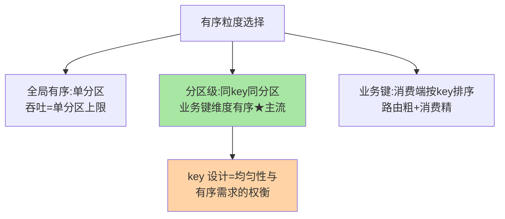

# 顺序消息与分区路由策略：有序性的粒度设计

> Kafka 只保证**分区内有序**——全局有序需要单分区（牺牲并行），局部有序需要「同 key 同分区」。这篇讲顺序的粒度设计（全局/分区/业务键三种粒度）、路由策略的选型、以及「顺序 + 吞吐」这对核心矛盾的解法。

> **本文核心**：三种有序粒度——**全局有序**（单分区，吞吐上限即单分区上限——几乎只在严格序列场景使用）、**分区级有序**（同 key hash 到同分区——业务键维度的有序，主流方案）、**业务键有序**（分区路由 + 消费端按业务键排序——路由粗糙但消费精确的混合）。**机制链**：消息 key → hash → 分区路由（同 key 同分区）→ 分区内 append 天然有序 → 消费者顺序消费 → **有序的每一个环节都不能断**（路由断则乱序、消费并行则乱序）。

## 一句话摘要

顺序的粒度设计三问：**① 有序的业务范围是什么**（全局序列 vs 按实体有序——订单按订单号有序即可，不需要全站消息全局有序——**多数业务要的是「键级有序」不是「全局有序」**，这一步认清就跳出了「单分区牺牲吞吐」的伪困境）；**② key 怎么设计**（hash 均匀性与业务键的张力——按用户 ID hash 均匀但热点用户倾斜；按业务实体 hash 精确但分布不可控——key 设计是均匀性与有序需求的权衡）；**③ 并行度怎么保**（同 key 同分区保证了键内有序但牺牲了键间并行——分区内多线程消费要按 key 分组排队（hash 线程池）——**分区级顺序 + 线程级并行的混合消费模型**是高吞吐顺序消费的标准解）。

## 一、边界：既有篇目讲过什么，本文讲什么

| 内容 | 已有篇目 | 本文 |
|---|---|---|
| key hash 路由 | 客户端系列篇 1 | 不重复 |
| 三种有序粒度与选型 | 未讲 | **本文核心一** |
| 顺序消费的消费端并行模型 | 未讲 | **本文核心二** |
| 热点 key 的倾斜与治理 | 未讲 | **本文核心三** |

## 二、三种有序粒度与选型

**选型口径**：全局有序——审计日志/状态机重放类（低吞吐可接受）；分区级——订单流/用户操作流（按实体键路由，绝大多数业务的答案）；业务键——跨实体聚合分析（消费端排序，接受窗口延迟）。

三种粒度的粒度-吞吐关系：

## 三、顺序消费的并行模型

分区级有序的消费端：**分区内的消息必须单线程顺序处理**——但多分区之间可以并行（分区数=并行度上限）。高吞吐的进阶：**分区内按业务键 hash 到消费线程**（分区内再分组，同 key 的消息仍串行、不同 key 并行——「两级 hash」模型：分区 hash 保全局路由、线程 hash 保键内串行）——**前提是消费线程间的执行顺序不影响正确性**（线程分组只保证同 key 串行，不保证跨 key 顺序——与业务语义核对）。

## 四、事故推演：一次「热点用户打爆分区」

某社交 feed 按用户 ID hash 路由——大 V 用户（百万粉丝）的操作量是普通用户千倍——其所在分区持续打满，其他分区空闲（**数据倾斜 → 流量倾斜**）。扩分区无效（同一 key 仍在同一分区）。修复：热点用户识别 + 热点 key 加盐（同一用户拆到多个子分区，消费端按时间戳排序恢复顺序）——**业务层感知拆分的顺序语义退化**。**教训**：key 设计要预演「热点分布」——社交/电商场景的用户行为天然长尾分布，均匀 hash ≠ 均匀流量。

## 业内惯例

- **key 设计预演流量分布**：上线前用历史数据模拟 hash 分布（最大分区/平均分区的比值是倾斜度指标）
- **顺序需求先收敛到「最小有序单元」**：从「全站有序」收敛到「实体有序」再收敛到「实体内操作序列」——粒度越窄并行度越高
- **3.x/4.x 视角**：KIP-794 的分区模型统一与粘性分区改进影响无 key 消息的路由——key 路由机制稳定；顺序语义的挑战在「消费端并行模型」的工程化

## 五、常见误区

- **「Kafka 保证全局有序」**：只保证分区内——全局有序需要单分区（并行度=1）——「默认就有序」是最危险的认知
- **增加分区不破坏已有 key 顺序**：会！扩分区后 hash 结果变化，同 key 可能换分区——key 与分区的映射在扩容窗口内不稳定（**扩分区前评估 key 路由的语义影响**，互指 LB 一致性哈希篇的少迁移思想）
- **消费端多线程直接消费就有序**：多线程无分组消费 = 乱序——同 key 必须同线程串行（hash 线程池或单线程消费）
- **重试破坏顺序**：失败重试的消息与后续消息乱序——严格顺序场景失败要阻塞后续（牺牲吞吐）或接受跳过（语义容忍），取舍要显式

## 六、与相邻机制的关系

- 《深入理解客户端系列》篇 1：Producer 的分区器与粘性批（本篇的路由上游）
- 《深入理解客户端系列》篇 2：消费端的并行度受分区数约束（本篇的下游）
- tips 互指：LB 一致性哈希篇（扩缩容少迁移的同构思想）；治理域容错篇 5（重试与顺序的取舍）

## 你们可能会问

**Q1：怎么在不扩分区的情况下提升顺序消费的吞吐？**
分区内的线程级 hash 并行（两级 hash 模型）——同 key 串行、跨 key 并行；或压缩单条处理时长（异步化非顺序依赖的操作）。

**Q2：按时间回溯消费会破坏顺序吗？**
不会——offset 回溯到历史位置后仍按分区顺序消费（分区顺序是物理的，与消费起点无关）——但「回溯点之后的已处理消息会重复消费」（幂等兜底不变）。

**Q3：顺序 + 事务可以叠加吗？**
可以——事务原子性（多篇区打包）与顺序性（单分区串行）正交；事务内写多分区时各分区的顺序独立维护——组合使用前核对两者的延迟代价叠加。

## 七、自测三问

1. 三种有序粒度与选型口径？「多数业务要的是键级有序」的推理？
2. 「两级 hash」消费模型的前提条件？
3. 热点 key 倾斜的成因与加盐拆分方案的语义退化？

## 开放问题

- 顺序消费的自适应并行（按 key 流量自动调节线程分组）是消费框架的演进方向——「热点发现→动态分组」的自动化程度在提升。
- 分区扩缩容的 key 映射稳定性（一致性哈希在 Kafka 分区的原生支持）是社区长线议题。

## 📎 核心带走

- **核心一句话**：顺序消息 = 粒度设计（全局/分区/业务键）+ 路由策略（key hash）+ 消费并行模型（两级 hash）——粒度越窄并行度越高
- **机制链**：业务键 → hash 路由同分区 → 分区内 append 有序 → 消费端按 key 分组串行 → 热点加盐拆分
- **失效点/边界**：扩分区破坏 key 映射；重试破坏顺序；消费多线程无分组必乱序

## 💡 实战提示

- 💡 上线前用历史数据预演 hash 分布（倾斜度 = 最大分区/平均分区）——key 设计的数据驱动验证
- 💡 顺序消费的「重试 vs 跳过」策略显式决策并写进消费配置——默认行为可能破坏顺序
- 💡 决策口径：粒度收敛优先——从全站有序收敛到最小有序单元，每收敛一级吞吐翻倍
- 💡 顺序保证与消费灵活性的取舍：严格串行保顺序但吞吐受限——粒度收敛是把「顺序约束的范围」缩到最小

## 📌 数据与事实声明

- 写于 2026-09-10，机制以 Kafka 4.x 为准（分区有序跨版本稳定；KIP-794 影响无 key 消息路由）；「大 V 千倍流量」为行业认知口径
- 事故推演为热点倾斜的典型模式匿名化复述
- 免责：具体粒度按业务语义评审

## 📚 参考资料

| 类型 | 标题 | 来源 |
|---|---|---|
| 官方文档 | Kafka Partition Ordering | kafka.apache.org |
| 公开提案 | KIP-794（分区模型统一） | kafka.apache.org |
| 关联系列 | 本仓库 LB 篇 4（一致性哈希互指）/ 客户端系列篇 1 | docs/ |
