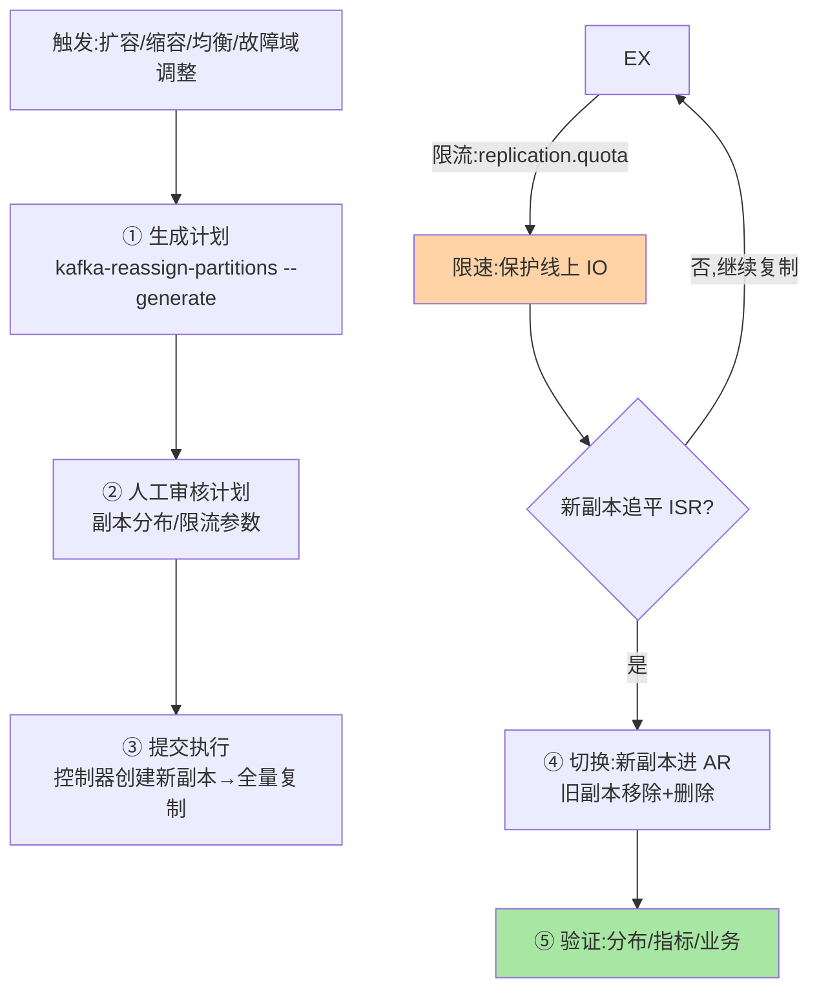

# 集群扩缩容与分区重分配：数据搬迁的工程学

> 新 broker 加入集群后「空的」——旧数据的分区不会自动迁移过来，需要**分区重分配**（reassignment）把副本搬过去。这篇讲 reassignment 的机制（副本的复制与截断）、限流（搬迁的 IO 保护）、与均衡策略——数据搬迁是把「双刃剑」的工程。

> **本文核心**：重分配 = **为新副本建新日志段 → 全量同步（类似副本追加） → 追平后切换（AR 替换）**。**机制链**：提交 reassignment 计划（JSON：分区的目标副本列表）→ 控制器创建新副本（各 broker 间复制数据）→ 追平后新副本进入 AR、旧副本移除 → 元数据更新。**限流**（replication.quota：搬迁 IO 受限——不限流会打满网卡与磁盘影响线上读写）。**缩容/均衡**：缩容是反向重分配（把下线节点的分区迁走）+ 节点退役；均衡是跨 broker 的分区分布调优（避免热点 broker）。

## 一句话摘要

重分配的两个机制要点：**搬迁是复制不是移动**（新副本从 leader 全量复制日志——与普通副本追加同机制但数据量更大——搬的是「分区全量历史数据」而非增量）；**限流是保护的必需**（不限流的搬迁会打满磁盘/网卡影响线上——`replication.quota.window.num` 限速参数把搬迁 IO 控制在线余量内）。**reassignment 的执行工具**：`kafka-reassign-partitions.sh` 生成计划 → 提交执行 → 验证完成——「计划生成→执行→验证」三步的自动化脚本化是工程纪律。

## 一、边界：既有篇目讲过什么，本文讲什么

| 内容 | 已有篇目 | 本文 |
|---|---|---|
| 副本追加与 ISR 机制 | 副本系列篇 1 ✅ | 不重复 |
| reassignment 的机制与限流 | 未讲 | **本文核心一** |
| 扩缩容/退役的流程 | 未讲 | **本文核心二** |
| 均衡策略 | 未讲 | **本文核心三** |

## 二、reassignment 的机制与流程全景

**限流的机制**：`replication.quota.window.num/size` 配合 leader/follower replication throttled rate——限速是全集群级别的（对所有 reassignment 流量），不是单分区粒度——**限速值 = 磁盘余量带宽 ÷ 并发搬迁分区数**，需要按磁盘能力计算。

## 三、扩容/缩容/退役的流程

| 操作 | 流程 | 特殊注意 |
|---|---|---|
| 扩容（加 broker） | 新 broker 加入 → reassignment 分配部分分区 → 限速搬迁 | 新节点无数据（全量复制成本最高） |
| 缩容（减 broker） | 该 broker 分区迁走 → 确认无分区 → 节点退役 | 迁走前确认分区不在该节点的 ISR 里也能服务 |
| 退役（永久下线） | 缩容流程 + 配置清理 + 监控移除 | 退役节点恢复上线不会自动回集群（需清理数据目录） |

**缩容的隐性风险**：如果该 broker 上的分区在 ISR 中（min.insync 依赖），搬迁完成前该分区可能暂时不满足 min.insync——**缩容顺序先迁走全部依赖再下线**，不能直接杀。

**量级演进视角**：小集群（<10 broker）手动 reassignment 足够；中等集群（10-100）需要限流计算脚本与计划评审流程；大规模（100+ broker，万级分区）的 reassignment 是高频操作——需要自动化平台（提交计划/自动限流/进度跟踪）而非命令行——运维工具化程度随集群量级升级。

## 四、典型场景与事故推演

**事故剧本（不限流搬迁打满磁盘）**：运维执行 reassignment 未设限流——新 broker 全速复制旧分区数据，磁盘带宽打满 → 同磁盘的线上读写 IO 饥饿 → 消费延迟飙升、生产端超时——搬迁本意是扩容减压，结果反而影响线上。修复：暂停重分配 → 配置限流 → 恢复执行。**教训**：reassignment 的 IO 影响与线上共存——**限流不是可选是必选**，限速值按磁盘余量计算而非拍脑袋。

## 业内惯例

- **reassignment 计划走评审**（副本分布是否合理/限流参数是否正确——计划的质量决定搬迁质量）
- **搬迁进度监控**（reassignment 的完成百分比 + 线上 IO 指标双曲线——搬迁正常 = 前者上升后者平稳）
- **3.x/4.x 视角**：reassignment 工具自 2.x 稳定；4.x 的 KRaft 控制器与自均衡（Self-Balancing Clusters，KIP-951 类提案）在演进——自动均衡逐步替代手动 reassignment

## 五、常见误区

- **「新 broker 自动均衡」**：Kafka 不会自动迁移数据到新节点（需要 reassignment）——「加了节点就有更多容量」需要手动搬
- **限流值越大越好**：限流是保护线上——限速值的取舍 = 搬迁时长与线上影响的权衡
- **缩容直接杀 broker**：该节点的分区需要先迁走——直接杀导致分区缺副本（甚至低于 min.insync 不可写）
- **均衡只看分区数量**：分区的流量不均匀（热点 topic 的分区）——均衡按「流量权重」不只按「分区数量」（高级均衡工具按流量计算）

## 六、与相邻机制的关系

- 《深入理解副本与一致性系列》篇 1：reassignment 的复制机制与普通副本追加同源
- 《深入理解KRaft 与控制器系列》篇 1：KRaft 时代 reassignment 的决策走元数据日志
- tips 互指：治理域 LB 一致性哈希篇（扩缩容少迁移的同构思想）；分库分表迁移篇（双写/搬迁的工程纪律同构）

## 你们可能会问

**Q1：搬迁完成怎么确认？**
`kafka-reassign-partitions --verify` 查看状态 + ISR 分布确认（新副本在 ISR 中）+ `UnderReplicatedPartitions` 回归 0——三重确认。

**Q2：reassignment 期间能正常读写吗？**
能——新副本复制不影响旧副本的服务（读仍走旧 leader）——但 IO 竞争真实存在（限流是保护，不是消除）。

**Q3：自均衡（Self-Balancing）什么时候可用？**
部分版本有实验性支持（自动检测不均并触发 reassignment）——自动均衡的阈值策略还在演进，当前主流仍以人工 reassignment + 评审为主。

## 七、自测三问

1. reassignment 的「复制不是移动」机制与限流的必要性？
2. 扩/缩/退役三种操作的流程差异与特殊注意？
3. 均衡策略为什么不能只看分区数量？

## 开放问题

- 自均衡集群（自动检测 + 自动 reassignment + 自动限流）是运维自动化方向——人从「执行搬迁」退到「审批搬迁」。
- 分层存储（tiered storage）改变「搬迁的数据量」（冷段在远端不需要搬）——reassignment 的成本模型在分层化后重构。

## 📎 核心带走

- **核心一句话**：reassignment = 复制而非移动 + 限流保护线上 + 计划/执行/验证三步——限流是必选不是可选
- **机制链**：生成计划 → 审核 → 提交 → 新副本全量复制（限速） → 追平切换 → 验证分布与指标
- **失效点/边界**：新节点不自动均衡；缩容先迁后杀；均衡看流量不只看分区数

## 💡 实战提示

- 💡 reassignment 三件套（计划评审/限流计算/验证脚本）进运维手册——搬迁从救火变流程
- 💡 搬迁双曲线监控（完成百分比 + 线上 IO）——两图正常才是搬迁健康
- 💡 决策口径：限速值 = 磁盘余量带宽 ÷ 并发搬迁分区数——计算后填入，不拍脑袋
- 💡 手动与自动化的权衡：自动均衡的效率与不可控风险的取舍——大规模集群自动化是刚需，中小规模手动+评审更可控

## 📌 数据与事实声明

- 写于 2026-09-10，机制以 Kafka 4.x 为准（reassignment 工具跨版本稳定；自均衡为演进提案口径）
- 事故推演为不限流搬迁的典型模式匿名化复述
- 免责：限流参数按磁盘实测

## 📚 参考资料

| 类型 | 标题 | 来源 |
|---|---|---|
| 官方文档 | Kafka Partition Reassignment | kafka.apache.org |
| 官方工具 | kafka-reassign-partitions.sh | Kafka 发行包 |
| 关联系列 | 本仓库治理域 LB 篇 4（一致性哈希互指）/ MySQL 迁移篇 3（工程纪律同构） | docs/ |
