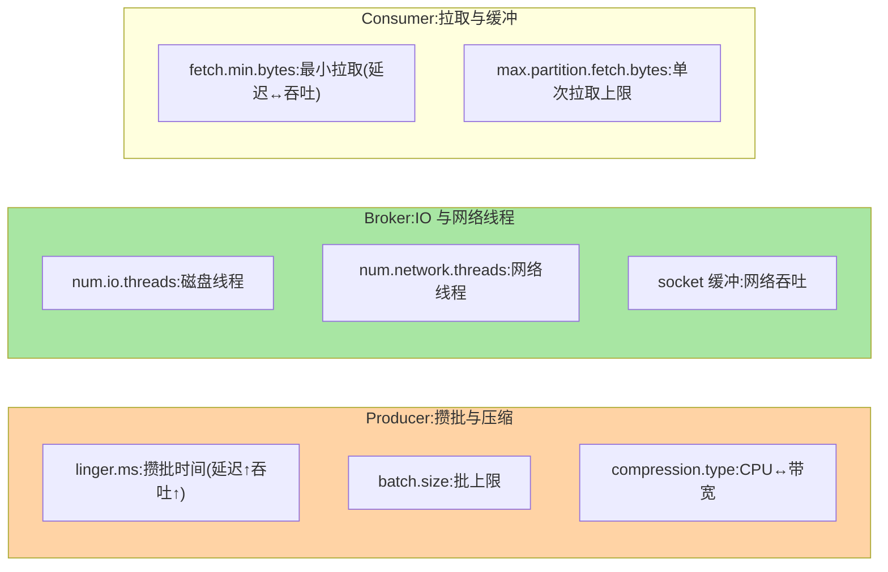
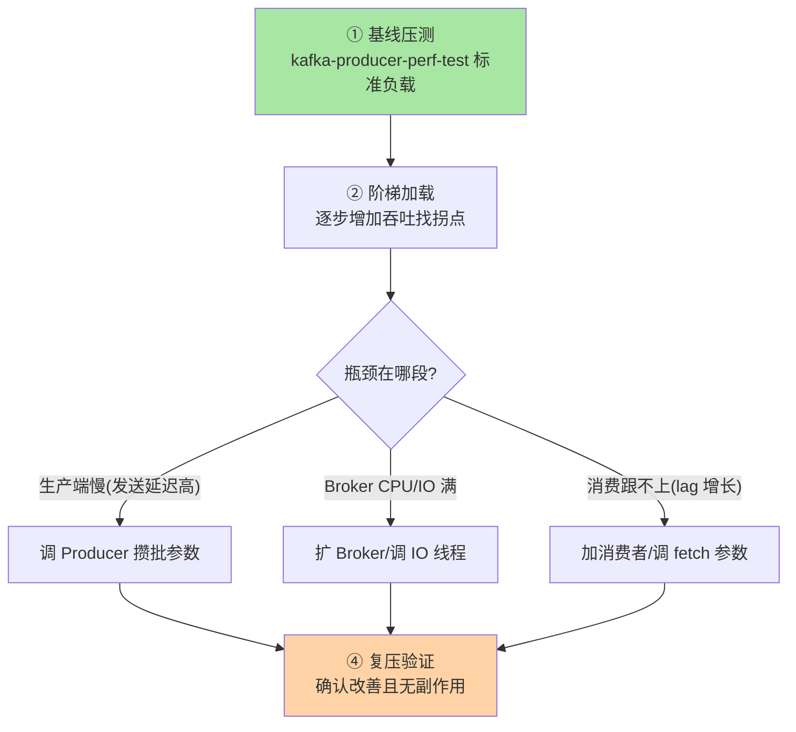

# 性能调优与压测方法：吞吐-延迟-稳定的三角

> Kafka 调优的本质是在**吞吐、延迟、稳定**三角中按业务优先级取舍——每一个参数的调整都是三角内的一次移动（提吞吐可能升延迟，压延迟可能降吞吐）。这篇给参数矩阵、压测方法与调优决策的完整框架。

> **本文核心**：调优参数矩阵按层组织——**Producer 层**（linger/batch/compression：延迟↔吞吐）、**Broker 层**（num.io.threads/网络线程/副本拉取线程：并发能力）、**Consumer 层**（fetch.min.bytes/max.partition.fetch.bytes：批量与内存）。**压测方法**：Kafka 自带 perf 工具（Producer/Consumer Performance）基线测试 → 逐步加载找拐点 → 按拐点归因调参——**先压测拿基线再调优**，调优的每一步用压测验证。

## 一句话摘要

调优的决策框架：**先定业务约束**（延迟 P99 < X ms？吞吐 > Y msg/s？），再**压测找瓶颈**（瓶颈在 Producer/Broker/Consumer/网络哪段），最后**按层调参**——每一层的关键参数 2-3 个（不是所有参数都要调），调一个压一轮验证——**「一次改一个参数、压一轮验证」是调优纪律**（多参数同改无法归因）。**延迟的三段分解**（生产端攒批延迟 → Broker 端处理延迟 → 消费端拉取延迟——三段各自可独立优化，端到端延迟是三段之和）——延迟调优先分段定位瓶颈段。

## 一、边界：既有篇目讲过什么，本文讲什么

| 内容 | 已有篇目 | 本文 |
|---|---|---|
| 页缓存/零拷贝/压缩机制 | 存储系列篇 2 ✅ | 不重复 |
| 参数矩阵与分段延迟 | 未讲 | **本文核心一** |
| 压测方法与基线 | 未讲 | **本文核心二** |
| 瓶颈归因 | 未讲 | **本文核心三** |

## 二、参数矩阵与延迟分段

**延迟的三段分解**：端到端 = 生产端攒批（linger.ms 决定下限）+ Broker 处理（IO 线程排队）+ 消费端拉取（fetch.min.bytes 决定等待）——**P99 排查先分三段计时**（生产端回调耗时/日志时间差/消费端拉取延迟），瓶颈段归因后调对应层的参数。

## 三、压测方法：基线、拐点与归因

**压测工具**：`kafka-producer-perf-test.sh`（生产吞吐/延迟分布）+ `kafka-consumer-perf-test.sh`（消费吞吐）——合成流量压测基线；**真实流量回放**（生产环境流量录制回放到预发——真实分布的检验，合成压测测不出「流量形态」的差异，互指网关选型篇的 POC 方法论）。

**量级演进视角**：千级 QPS 参数默认即够（调优是浪费）；万级需要分层调参 + 压测基线；十万级+ 需要专用压测平台 + 持续基准回归 + 容量预警——调优的工程化程度随流量量级升级，不要用十万级的流程管理千级的系统。

## 四、典型场景与事故推演

**事故剧本（调优调出反向效果）**：某团队为提升吞吐将 linger.ms 从 0 调到 50ms、batch.size 从 16KB 调到 1MB——吞吐提升了但 P99 延迟从 20ms 飙到 80ms（攒批等待叠加）——**没有先定延迟约束就调吞吐参数**。修复：回退参数 → 先定义 P99<50ms 的约束 → 在约束内逐步调吞吐参数 → 每步压测验证 P99 仍在约束内。**教训**：调优必须先定约束再调参——约束内的最优解才是解，无约束的最优是伪解。

## 业内惯例

- **调优流程纪律**：一次改一个参数 → 压测 → 对比 → 保留或回退——多参数同调无法归因
- **基线文档化**：调优前的压测报告（吞吐/延迟/资源）留档——调优效果用基线对比证明
- **3.x/4.x 视角**：参数名与机制跨版本稳定（3.x/4.x 调优知识通用）；KRaft 模式的 Broker 调优去掉 ZK 相关项；新参数（远程分层存储配置）是 4.x 增量

## 五、常见误区

- **所有参数都调**：核心可调参数 2-3 个/层——「参数矩阵全调」制造不可维护的配置组合
- **用默认参数上生产不做压测**：默认面向通用场景——大流量/延迟敏感场景必须压测校准
- **调优只看吞吐不看分布**：P99/P999 比平均更重要（用户感受的是尾部）——压测报告必须有分位数
- **Broker 参数全局一调**：不同 topic 的流量形态不同（大消息/小消息混合）——按 topic 覆盖配置（per-topic override）

## 六、与相邻机制的关系

- 《深入理解存储引擎系列》篇 2：页缓存/零拷贝/压缩的机制底座（本篇调优的对象）
- 《深入理解客户端系列》篇 1-2：Producer/Consumer 参数的机制出处（互指）
- tips 互指：治理域 config-center（阈值热调）；MySQL 性能调优篇（「先压测再调优」方法论同构）

## 你们可能会问

**Q1：num.io.threads 调多少？**
默认 8——按磁盘并行度（NVMe 多队列可调更高，HDD 不超过磁盘数）——IO 线程的瓶颈检测看磁盘利用率（`iostat` 的 %util），利用率不到 80% 才值得加线程。

**Q2：怎么定位延迟瓶颈在 Producer 还是 Consumer？**
生产端看回调时间（send 到 callback 的耗时），消费端看 poll 返回到处理的耗时——Broker 段看 request 处理时间指标——三段计时定位瓶颈段。

**Q3：Kafka 集群什么时候需要扩容？**
指标信号：磁盘利用率 > 70%、网络带宽 > 60%、IO 线程 CPU > 80%——扩容决策数据驱动（容量水位线告警，互指治理域扩缩容篇）。

## 七、自测三问

1. 三层的参数矩阵与延迟三段分解？
2. 压测的「基线-拐点-归因」三步与「一次改一个参数」纪律？
3. 压测合成流量 vs 真实流量回放的差异？

## 开放问题

- 参数调优的自动化（按 SLO 反推参数的自适应调优）在云产品中试点——「人工调优」向「声明约束自动满足」演进。
- 分层存储（4.x）引入新的调优维度（热层/冷层的参数分离）——调优矩阵需随新架构扩展。

## 📎 核心带走

- **核心一句话**：调优 = 先定约束（延迟/吞吐）→ 压测找瓶颈段 → 分层调参 → 一次一个参数压一轮验证——约束内的最优才是解
- **机制链**：业务约束 → 基线压测 → 阶梯加载找拐点 → 瓶颈段归因（Producer/Broker/Consumer） → 对应层调参 → 复压验证
- **失效点/边界**：多参数同调无法归因；P99 比均值重要；Broker 参数按 topic 覆盖（混合负载）

## 💡 实战提示

- 💡 调优报告模板：基线 → 改动 → 对比数据 → 结论/回退——调优的可追溯性
- 💡 核心可调参数只留 2-3 个/层进配置模板——参数矩阵精简即可维护
- 💡 决策口径：P99 优先于均值、约束先于调参——两个顺序纪律是调优的价值观

## 📌 数据与事实声明

- 写于 2026-09-10，参数以 Kafka 4.x 为准（跨版本稳定）；perf 工具为 Kafka 发行包自带
- 事故推演为调优反向效果的典型模式匿名化复述
- 免责：参数调优按业务压测校准

## 📚 参考资料

| 类型 | 标题 | 来源 |
|---|---|---|
| 官方工具 | kafka-producer-perf-test / kafka-consumer-perf-test | Kafka 发行包 |
| 官方文档 | Kafka Configurations（全参数） | kafka.apache.org |
| 实践书 | 《SRE：Google 运维解密》（压测方法论参照） | 公开出版 |
