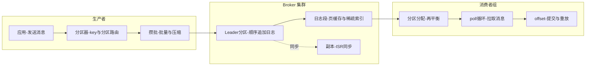
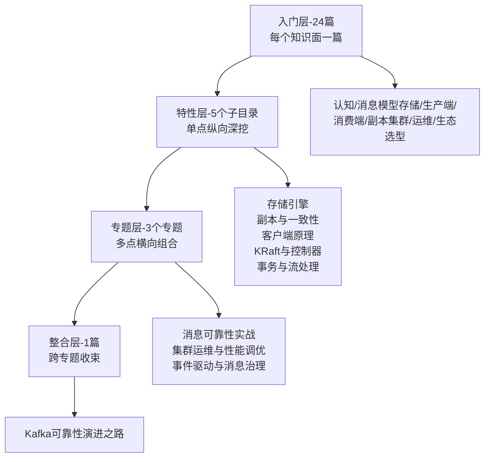

# Kafka 系列导读 · 从一条消息的一生认识 Kafka

> 📖 本系列共 24 篇（0_导读 + 1-23 正文），覆盖 Kafka 整个知识面：认知与生态、消息模型与存储、生产端、消费端、副本与集群、生产运维、生态与选型。
> 本篇是第 0 篇导读：先建立全局心智模型，再决定读哪条路。

## 一、为什么需要这套系列

Kafka 是后端绕不开的异步与事件流底座：削峰靠它、解耦靠它、日志采集靠它、事件驱动也靠它。但 Kafka 的知识散落在官方文档、博客、书里，常见两种极端：

- **碎片化学习**：今天看分区，明天看 ISR，各知识点之间没有连线，看一篇懂一篇，合起来还是不会排查「消息丢了」「消费积压」
- **一上来就啃源码**：直接读 Producer 发送器源码，没建立整体框架，读两章就放弃

这套系列的设计思路：**先主线后支线**。主线是「一条消息的一生」——从 Producer 发出到 Consumer 消费，把 Kafka 的存储与流转串起来；支线是挂在这条主线上的核心机制：分区、日志段、副本 ISR、消费者组、可靠性保证。主线通了，支线各自深挖时都知道「它在整条链路里处于什么位置」。

## 二、全局心智模型：一条消息的一生

一条消息的一生：

1. **生产者**：按 key 或分区策略路由到目标分区，攒批压缩后发送——分区是「顺序 + 并行」的平衡点
2. **Broker**：Leader 分区顺序追加到日志段（页缓存 + 顺序写是「为什么快」的地基），Follower 副本异步同步
3. **消费者组**：分区按消费者组分配，每个分区只被组内一个消费者消费，按 offset 拉取
4. **offset**：消费进度由消费者自己提交——offset 是「重放/回溯」的关键，也是「重复消费」的根源

> tips：(知识地图) 这条主线是整套 Kafka 知识的主干：分区/日志段/副本 ISR/消费者组/可靠性全部是挂在「一条消息的一生」上的支线——先主线后支线。Kafka 本质是「分布式日志」不是「消息队列」，这一点是后面所有机制的根。

## 三、系列导航表（24 篇）

| 序号 | 篇目 | 深度 | 一句话定位 | 对标书目 |
|---|---|---|---|---|
| 0 | 系列导读 | 全景 | 全局心智模型 + 阅读路径 | - |
| 1 | Kafka 是什么与生态全景 | 入门 | 事件流平台定位/与 MQ 差异/生态全景 | 官方文档 |
| 2 | 核心概念与快速上手 | 入门 | Topic/Partition/Offset/消费者组七概念串讲 | 权威指南 |
| 3 | Topic 与 Partition | 入门 | 分区模型/分区策略/分区数设计 | 权威指南 |
| 4 | 消息结构与序列化 | 入门 | Record 组成/序列化器/版本兼容 | 朱忠华 |
| 5 | 日志存储与文件结构 | 入门 | segment/稀疏索引/页缓存/零拷贝 | 权威指南 |
| 6 | 日志保留与清理 | 入门 | 时间大小保留/compaction/tombstone | 权威指南 |
| 7 | Producer 发送原理 | 入门 | 异步链路/攒批/缓冲参数 | 朱忠华 |
| 8 | 可靠性保证 | 入门 | acks/retries/min.insync/幂等 producer | 朱忠华 |
| 9 | 顺序性与事务 | 入门 | 单分区有序/key 路由/事务边界 | 朱忠华 |
| 10 | 消费模型与 Offset | 入门 | pull 模型/poll 循环/提交 | 朱忠华 |
| 11 | 消费者组与再平衡 | 入门 | 分区分配/再平衡触发与代价 | 朱忠华 |
| 12 | 消费可靠性 | 入门 | 三种语义/幂等消费/死信 | 朱忠华 |
| 13 | 副本机制与 ISR | 入门 | leader/follower/ISR/HW-LEO | 权威指南 |
| 14 | 故障与选举 | 入门 | 分区选举/leader epoch/丢数据场景 | 权威指南 |
| 15 | 集群架构与 KRaft | 入门 | controller/元数据/KRaft 演进 | 官方文档 |
| 16 | 集群规划与容量 | 入门 | broker 数/分区数/容量估算 | 胡夕 |
| 17 | 监控与排障 | 入门 | JMX/Lag/常见故障速查 | 胡夕 |
| 18 | 安全与多租户 | 入门 | SASL/SSL/ACL/配额 | 胡夕 |
| 19 | Kafka Connect | 入门 | 数据集成/连接器模型 | 官方文档 |
| 20 | Kafka Streams | 入门 | 流处理/KStream 与 KTable | 官方文档 |
| 21 | Schema Registry 与序列化治理 | 入门 | Avro/Schema 演进/兼容性 | 官方文档 |
| 22 | 消息中间件选型对比 | 入门 | Kafka vs RocketMQ 等五维对比 | 官方文档 |
| 23 | 版本演进与 KRaft 时代 | 入门 | 0.8→4.x 主线/KRaft 分水岭 | 官方文档 |

## 四、从点到面：四层进阶路径

入门层 24 篇把知识面铺全之后，真正的深度在后面三层——这也是本系列「从点到面」的设计：

| 层级 | 定位 | 规模 | 适合 |
|---|---|---|---|
| 入门层 | 点：每个知识面一篇，建立完整认知 | 24 篇 | 所有读者必读 |
| 特性层 | 点 × 深：一个点拆开挖透 | 5 个子目录 × 2-3 篇 | 按兴趣挑重点 |
| 专题层 | 面：多个点组合成主题 | 3 个专题 × 2-4 篇 | 解决实际问题 |
| 整合层 | 体系：整个知识体系收束 | 1 篇 | 面试/实战前收束 |

## 五、入门读者最容易踩的 3 个认知误区

### 误区 1：以为 Kafka 是「消息队列」

很多入门文章把 Kafka 当「高级版 RabbitMQ」，容易让人理解偏。实际上 Kafka 本质是**分布式日志（分布式事件流平台）**，不是传统 MQ：它把消息**顺序追加**到日志、按**保留策略**留存（不是消费即删）、支持**任意 offset 重放**。消息队列的「削峰解耦」只是它的一种用法，它更核心的能力是「可重放的日志 + 高吞吐 + 水平扩展」。知道这个本质，才能理解「为什么 Kafka 能回放历史消息」「为什么分区有序但全局无序」。

### 误区 2：以为 Kafka 能保证「全局有序」

新手常见预期：消息按发送顺序消费。但 Kafka 只保证**单分区有序**——一个分区内消息严格有序，跨分区天然无序（因为不同分区的写入/消费是并行的）。这是「顺序性」和「并行吞吐」之间的权衡：要严格全局有序，就得牺牲并行度（比如单分区）。理解「有序性是有代价的」，是正确设计分区和 key 路由的前提。

### 误区 3：以为「消费了就自动删掉」

「Kafka 消费完消息就没了」是常见误解。Kafka 的消息**按时间/大小保留策略**留存（默认 7 天），消费进度靠消费者自己提交的 **offset**，和消息是否被删完全无关。所以才能「重置 offset 重新消费」「多个消费者组各自独立消费同一份数据」。这个特性是「重放」「回溯」「多订阅者」的基础，但也带来了「重复消费」的问题（offset 提交和消息删除是两个独立的事）。

> tips：(三点区分) Kafka 是「分布式日志」不是「传统 MQ」；Kafka 是「单分区有序」不是「全局有序」；Kafka 按「保留策略删消息」不靠「消费即删」，offset 只是消费者自己的游标。这三个认知误区是新手最容易栽的，正文里每个都对应一篇讲透。

## 六、怎么读这套系列

- **零基础/刚入行**：从 0 按顺序读到 23，每天 1-2 篇，两周建立完整知识面
- **有 1-3 年经验**：快速扫入门层（每篇 10-15 分钟），重点读 5 日志存储、8 可靠性、13 副本 ISR、15 KRaft，然后进特性层挑感兴趣的子目录深挖
- **准备面试/实战**：读完入门层后直接进专题层（消息可靠性实战/集群运维）+ 整合层（可靠性演进之路），用实战场景把知识串起来

---

下一篇将讲 **1_Kafka 是什么与生态全景**：事件流平台定位、与消息队列的本质差异、Kafka 生态全景——待正文落盘后补链接。
