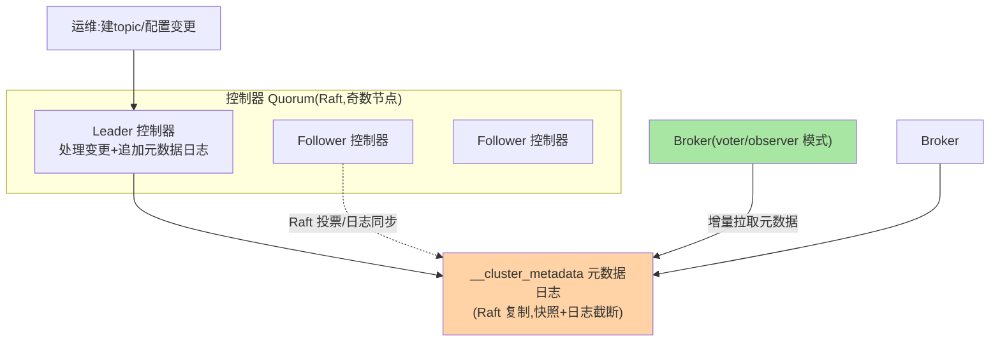
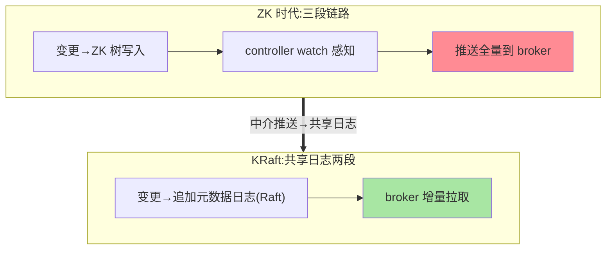

# KRaft 控制器与元数据 Quorum：告别 ZooKeeper 的元数据架构

> Kafka 2.8 用 KRaft（Kafka Raft）替换了 ZooKeeper——元数据管理从「外挂协调系统」变成「Kafka 自持的 Raft 日志」。这篇讲为什么换、新架构的组成（控制器 quorum/元数据日志/两种模式）、以及迁移的考量。

> **本文核心**：KRaft = **元数据本身成为一条 Raft 复制的 Kafka 日志**（__cluster_metadata 主题）——控制器 quorum（奇数节点）用 Raft 选主维护这条日志，全集群（broker 与控制器）从这条日志同步元数据视图。**机制链**：元数据变更（建 topic/配置变更）→ leader 控制器追加元数据日志 → Raft 多数派提交 → broker/observer 拉取应用到本地（最终一致的元数据视图）。

## 一句话摘要

为什么弃 ZK（公开的演进动机归纳）：**外部依赖的运维双系统**（ZK 集群独立运维、故障域叠加）、**元数据双写**（controller 先写 ZK 再推 broker 的窗口不一致）、**扩展瓶颈**（元数据量增长时 ZK watch 风暴与 controller 全量推送）——KRaft 的解法：元数据进 Kafka 自己的日志（**自证其身**：Kafka 最擅长的复制日志承载元数据）、Raft 多数派选主（替换 ZK 的协调职责）、增量拉取（broker 按进度拉元数据日志，替换全量推送）。**两种部署模式**：combined（控制器与 broker 同进程，小集群）与 separated（独立控制器节点，生产推荐）——**元数据管理的架构从「外挂」到「内生」的代际演进**。

## 一、边界：入门层讲过什么，本文讲什么

| 内容 | 入门层 | 本文 |
|---|---|---|
| KRaft 是替代 ZK 的机制 | ✅ 讲过 | 不重复 |
| 元数据日志与 quorum 机制 | 未讲 | **本文核心一** |
| 两种部署模式与容量 | 未讲 | **本文核心二** |
| ZK 迁移路径 | 未讲 | 篇 2 展开 |

## 二、KRaft 架构全景



**架构分层的演进本质**：ZK 时代的 controller 是「watch ZK + 推送 broker」的中介（三段链路）；KRaft 时代 leader 控制器直接写元数据日志、broker 直接拉日志（两段链路，中介的推送职责被日志的拉取模型替代）——**「推送中介」变「共享日志」**，与「配置中心推拉结合」的演进逻辑同构（互指治理域 config-center 篇 4）。

ZK 时代与 KRaft 时代的链路对比：



## 三、元数据日志与 Raft 语义

**元数据日志的形态**：普通 Kafka 日志的变体——Raft 协议管理（leader 选举/日志复制/快照截断）、记录元数据记录（topic/分区/配置/节点注册）、offset 即元数据代际（broker 的元数据进度按 offset 追踪）。**Raft 语义要点**：多数派提交（quorum 3 容 1、5 容 2）、term 防旧 leader（与数据面 epoch 的机制同族，互指副本系列篇 1 的对账逻辑——**共识机制的跨面复用**）；**快照与日志截断**（元数据快照后旧日志删除——元数据日志不无限增长）。**broker 的元数据视图**：voter（参与选主的 broker，过渡期）与 observer（纯拉取，常态）——broker 最终一致地跟随元数据日志（毫秒级延迟的「读到最新配置」）。

## 四、两种部署模式与容量规划

| 模式 | 形态 | 适用 |
|---|---|---|
| combined | 控制器与 broker 同进程（process.roles=broker,controller） | 开发/小集群（3 节点起步） |
| separated | 独立控制器节点 | 生产推荐（控制器资源隔离/故障域独立） |

**控制器数量**：3 或 5（奇数，容 1/2 故障）——**元数据容错等级**与数据副本等级解耦（数据 3 副本容 1、控制器 3 节点容 1——两个容错面独立规划）；**控制器规格**：元数据负载是低频写入（变更事件）+ 全员拉取（broker 数 × 拉取频率）——CPU/内存轻量、磁盘小（快照+短日志），与 broker 大不相同——**分离部署避免元数据面与数据面抢资源**。

## 五、源码关键路径（4.x 口径）

```text
kraft 模块:
 ├─ RaftLog/RaftState(Raft 选主与日志复制,元数据日志本体)
 ├─ KRaftControllerServer(leader 控制器:变更处理+日志追加)
 ├─ ControllerApis(控制器 RPC:CreateTopics 等写入元数据日志)
 └─ MetadataCache(broker/observer 本地元数据视图,按 offset 应用)
元数据快照: 定期快照+日志截断(防元数据日志无限增长)
ISR 决策: AlterPartition(leader 上报→控制器决策,互指副本系列篇1 的决策上收)
```

## 六、典型场景

- **控制器 leader 切换**：leader 控制器宕 → Raft 多数派选出新 leader（秒级）→ 元数据日志继续（已提交的变更不丢）——控制面的高可用与数据面 failover 相互独立（数据面分区 leader 切换不受控制器切换影响（本地决策），需要控制器介入的场景（分区 reassignment）短暂等待）
- **元数据视图不一致排查**：broker 的 MetadataCache 进度（offset）落后——看 broker 拉取延迟（网络/负载），4.x 的元数据传播监控指标
- **集群扩容控制器**（3→5）：滚动加节点（Raft 成员变更）——按元数据容错需求升级，与数据扩容解耦

## 业内惯例

- **生产 separated 模式 + 3 控制器起步**：5 控制器留给超大规模（broker 数百+）——元数据面的容量按「broker 数 × 元数据变更频率」评估
- **4.x 起步即 KRaft**（ZK 模式在 4.0 移除）：新集群没有理由走 ZK——KRaft 是唯一主线
- **元数据监控三件**：quorum 存活/leader 任期变化率/broker 元数据同步延迟——控制面的健康心电图

## 七、常见误区

- **「KRaft 只是换了 ZK 的皮」**：架构代际差——元数据的「单一 Raft 日志事实源」替换了「ZK 树+controller 推送」的双段链路——运维形态（无 ZK 依赖）与一致性模型（日志序）都不同
- **控制器越多越好**：Raft 写入成本随 quorum 数增（多数派确认）——元数据写入低频所以影响小，但 5+ 节点无收益（容 2 已够绝大多数）
- **元数据日志会撑爆磁盘**：快照+截断机制保证（活跃日志在快照后清理）——磁盘占用是快照级不是日志全量
- **combined 模式上生产**：控制器与 broker 抢资源/共故障域——combined 是开发便利不是生产形态

## 八、与相邻机制的关系

- 本系列篇 2《ZooKeeper 到 KRaft 迁移》：存量集群的迁移路径在那篇
- 《深入理解副本与一致性系列》：数据面副本（ISR/epoch）与控制面 Raft 的机制同族对照
- tips 互指：治理域 service-discovery 篇 7（共识选主的通用机制）；Nacos JRaft（同源 Raft 的组件实践，互指其特性层）

## 你们可能会问

**Q1：KRaft 的 Raft 和数据副本的 ISR 有什么不同？**
目标负载不同——元数据是低频写+强一致诉求（Raft 多数派提交、term 严格序）；数据是高频写+吞吐优先（ISR 的灵活同步+HW 可见性）——**同一屋檐下的两套复制协议，各配各的负载**。

**Q2：控制器挂了数据面会停吗？**
不会——分区 leader 选举与读写是 broker 本地决策（ISR 机制）；控制器影响的是元数据变更（建 topic/重分配）与需要仲裁的场景——**控制面不可用 ≠ 数据面停摆**（架构解耦的设计红利）。

**Q3：元数据变更多久对 broker 可见？**
日志提交后 broker 拉取（毫秒到秒级最终一致）——比 ZK 时代的 watch 推送模型延迟略高但一致性强（严格日志序）——「建完 topic 立刻生产」的代码要容忍这个窗口（重试或等待元数据传播）。

## 九、自测三问

1. 弃 ZK 的三个动机与「共享日志替换推送中介」的架构演进？
2. 元数据日志的 Raft 语义（多数派/term/快照）？
3. 两种部署模式与容错规划（控制面/数据面解耦）？

## 开放问题

- 元数据的增量同步与快照管理的持续优化（超大规模集群的元数据传播效率）是 KRaft 演进的主战场。
- 「Kafka as self-contained system」的路线（无外检依赖的完整自治）让 Kafka 向「一体化数据平台」演进——KRaft 是这个方向的奠基件。

## 📎 核心带走

- **核心一句话**：KRaft = 元数据进 Kafka 自己的 Raft 日志（__cluster_metadata）+ 控制器 quorum 共识 + broker 增量拉取——从外挂协调到内生日志的代际演进
- **机制链**：变更 → leader 控制器追加元数据日志 → Raft 多数派提交 → broker/observer 增量拉取应用 → 本地元数据视图最终一致
- **失效点/边界**：控制面停 ≠ 数据面停；元数据可见有毫秒级窗口；combined 不上生产

## 💡 实战提示

- 💡 separated + 3 控制器 + 独立故障域是生产基线——控制面容量按 broker 数评估
- 💡 元数据同步延迟指标进大盘（broker 落后量）——元数据传播阻塞的先兆
- 💡 决策口径：控制面容错（3/5）与数据面副本（ISR 配置）独立规划，别互相绑架
- 💡 一致性与运维复杂度的取舍：Raft 多数派换来元数据强一致与免 ZK 运维——部署模式的演进把这笔账越算越划算

## 📌 数据与事实声明

- 写于 2026-09-10，机制以 Kafka 4.x 为准（KRaft 生产可用自 3.3、4.0 移除 ZK 模式为官方口径）；演进动机为官方提案与博客的归纳
- 免责：源码细节以 apache/kafka 当前主线为准

## 📚 参考资料

| 类型 | 标题 | 来源 |
|---|---|---|
| 官方源码 | apache/kafka（raft 模块/KRaftControllerServer） | github.com/apache/kafka |
| 官方文档 | KRaft Design（公开设计文档） | kafka.apache.org/raft |
| 公开提案 | KIP-500（KRaft 提案）/ KIP-631（控制器模式） | kafka.apache.org |
