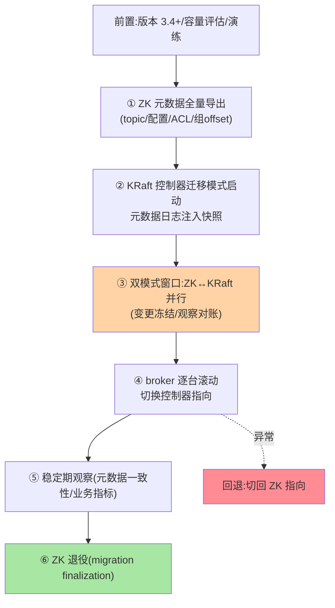
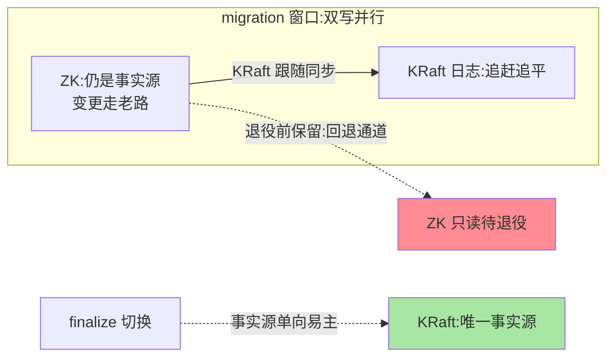

# ZooKeeper 到 KRaft 迁移：存量集群的换心手术

> 4.0 移除 ZK 模式——存量 ZK 集群的 KRaft 迁移从「可选项」变「必答题」。这篇讲迁移的机制路径（官方迁移工具的双写/切换流程）、风险点与演练清单——一次「运行中换协调系统」的手术方案。

> **本文核心**：迁移 = **ZK 元数据全量导出 → 注入新 KRaft 控制器（bootstrap）→ 双模式运行（migration 阶段 ZK 与 KRaft 并存）→ 流量切换（controller 切到 KRaft）→ ZK 下线**。**机制链**：工具导出（topic/配置/ACL 全量）→ KRaft 控制器以迁移模式启动（元数据日志追平 ZK 状态）→ broker 逐台切换控制器指向 → 稳定期观察 → ZK 退役。

## 一句话摘要

迁移的三个机制要点：**全量快照注入**（ZK 的元数据树导出为元数据日志的初始快照——历史元数据（topic/分区/配置/ACL/消费组 offset）一个不漏，**消费组 offset 的迁移完整性**是最易漏的验收项）；**双模式窗口**（migration 状态下 KRaft 控制器与 ZK 并行——窗口内元数据变更经 ZK 同步到 KRaft 日志，为回退保留通道——**双写换轨的通用模式**，与 MySQL 双写迁移同构，互指其分库分表篇 3）；**broker 逐台换指向**（滚动配置 controller.quorum.voters——每台 broker 从「连 ZK」换到「连 KRaft」——滚动期间新旧混合运行）。**风险三角**：版本门槛（迁移要求 3.4+ 的演进版本）、窗口内变更控制（迁移窗口冻结非必要元数据变更）、回退预案（切回 ZK 的通道在退役前保留）。

## 一、边界：既有篇目讲过什么，本文讲什么

| 内容 | 已有篇目 | 本文 |
|---|---|---|
| KRaft 架构与原理 | 篇 1 ✅ | 不重复 |
| 迁移流程与双模式机制 | 未讲 | **本文核心一** |
| 风险点与演练清单 | 未讲 | **本文核心二** |
| 退役与收尾 | 未讲 | **本文核心三** |

## 二、迁移流程全景



**双模式窗口的机制细节**：KRaft 控制器在 migration 状态下监听 ZK 变更并写入自己的元数据日志（追赶与跟随）——窗口期的「事实源」仍是 ZK（业务变更走老路、KRaft 跟随）——**切换那一刻**（finalize）事实源易主（变更走 KRaft 日志）——事实源的单向切换是手术刀口，窗口内的一致性对账（元数据比对工具）是术前检查。

双模式窗口的事实源切换：



## 三、风险点与演练清单

| 风险 | 机制 | 缓解 |
|---|---|---|
| 消费组 offset 丢失 | 迁移导出漏项/组进度在窗口内变化 | 迁移前记录组清单、切后按组核对 lag |
| 迁移窗口的元数据变更 | 双模式窗口内建 topic/配置变更（双写复杂） | 窗口冻结非必要变更（变更管理公告） |
| broker 滚动期间的可用性 | 逐台重启（滚动重启的标准窗口） | 低峰滚动 + 客户端重试就绪（互指容错篇） |
| 版本/配置不兼容 | 3.4 前版本、安全配置差异 | 前置版本审计 + 预发全流程演练 |
| 回退失败 | 窗口超时/ZK 状态漂移 | 回退通道保留至 finalize 后、演练回退 |

**演练清单**（生产迁移前必过的四项）：预发集群全流程走通（含回退）、元数据全量比对通过（导出 vs 注入）、滚动窗口的写入/消费压测、finalize 后 48 小时观察指标基线。

## 四、源码与工具关键路径

```text
迁移工具: kafka-storage.sh format(--enable-zk-migration 起步)与
         KafkaZkMigrationTool(ZK 元数据导出注入)
双模式: ZkMigrationControllerState(控制器迁移状态机:
         PRE_MIGRATION→MIGRATION→POST_MIGRATION)
       ZkMetadataLoader(ZK 变更→元数据日志的跟随写入)
切换/退役: migration finalize 工具调用(AbortMigration/完成退役)
       broker 侧 config: zookeeper.connect ↔ controller.quorum.voters 滚动互换
```

**阅读建议**：迁移状态机（PRE/MIGRATION/POST 三态）是全部行为的钥匙——每个阶段「谁是事实源、变更走哪条路」按状态机读，比按时间线读清晰。

## 五、典型场景与事故推演

**事故剧本（迁移后组 offset 异常）**：某集群迁移完成当夜，三个消费组从「最早 offset」重新开始消费（大量重复处理）。归因：迁移导出时这三个组正处于 rebalance 中（成员变化中），组的 offset 提交时序踩在导出快照的边界——快照里的组 offset 是旧值，finalize 后新提交按旧基准覆盖。修复：业务侧幂等兜底 + 按日志核对重置组 offset。**教训**：迁移导出时机要避开消费组的活跃窗口（低峰且组稳定时快照）+ 切换后组 lag 巡检进迁移验收清单——**迁移验收不只看元数据量，要看运行时语义（组的消费进度）**。

## 业内惯例

- **迁移窗口冻结元数据变更**（变更管理公告 + 工具护栏）——双写窗口的变更复杂度不值得冒
- **组 offset 与 ACL 是验收重点**（topic/配置的对账直观，组进度与权限的漂移隐蔽）——迁移验收清单的显式两项
- **演练回退与演练迁移同权重**——回退通道没演练过的迁移方案不完整
- **3.x/4.x 视角**：官方迁移工具自 3.4+ 提供演进（KIP-866 系列）——按当前版本的官方迁移文档执行（工具细节随小版本迭代）

## 五、常见误区

- **「迁移只是换配置」**：全量元数据注入 + 双模式窗口 + 滚动切换的完整工程——按发布级（不是配置级）管理变更
- **「ZK 可以先下」**：finalize 前的 ZK 是回退通道——退役在观察期之后不是之前
- **迁移窗口建新 topic**：双写窗口的元数据变更复杂度（事实源切换语义）——冻结纪律的红线项
- **「工具跑完就成功」**：工具完成 ≠ 语义验收（组进度/ACL/业务指标）——验收清单比工具成功更重要

## 六、你们可能会问

**Q1：迁移期间能正常读写吗？**
能——数据面（读写）在滚动重启的标准窗口外不受影响；受影响的是元数据操作（建 topic 类）与滚动中的单台重启——**数据面与控制面的解耦红利**（互指 KRaft 篇 1）。

**Q2：迁移要多久？**
机制时长短（导出注入分钟级 + 滚动按 broker 数）——但全流程（演练/窗口冻结/观察期）按周规划——**工程的时长在流程不在机制**。

**Q3：什么时候必须迁？**
4.0 起 ZK 模式移除（升级路径必经）；3.x 的 ZK 集群在升级 4.x 时完成迁移——**跟随版本升级节奏，不独立立项**（除非提前享受 KRaft 红利）。

## 七、自测三问

1. 迁移六步与「事实源单向切换」的机制？
2. 双模式窗口的变更冻结为什么是红线？
3. 迁移验收的运行时语义项（组 offset/ACL）怎么核对？

## 开放问题

- 迁移工具的自动化程度持续提升（一站式与校验内建）——但「组进度类运行时语义」的验收自动化仍是各家要自建的工程。
- 跨大版本升级路径（ZK 3.x → KRaft 4.x 的组合升级）与迁移顺序的最优编排是存量集群的普遍工程题。

## 📎 核心带走

- **核心一句话**：ZK→KRaft 迁移 = 全量注入 + 双模式窗口（事实源单向切换）+ 滚动换指向 + 观察后退役——按发布级工程管理，回退通道演练与运行时语义验收是两条命
- **机制链**：导出 → 迁移模式启动（日志追平）→ 双模式（冻结变更）→ 滚动切换 → 稳定观察 → finalize 退役 ZK
- **失效点/边界**：组 offset 迁移完整性；窗口内变更冻结；ZK 退役在观察后

## 💡 实战提示

- 💡 迁移验收清单显式含「组 lag 巡检 + ACL 抽查」——元数据量对账外的运行时语义项
- 💡 导出时机选低峰 + 消费组稳定窗口——组 rebalance 活跃期快照是事故剧本的根因
- 💡 决策口径：迁移随版本升级走（3.x→4.x 必经），提前独立迁移的收益（运维简化）对冲不了独立变更风险——迁移时机的取舍由版本节奏而非架构偏好定
- 💡 双写换轨与一刀切的权衡：双模式窗口增加复杂度但保回退通道——协调系统切换这类「心脏手术」永远留退路

## 📌 数据与事实声明

- 写于 2026-09-10，迁移流程以官方迁移文档（KIP-866 系列，3.4+ 演进）为口径；事故推演为迁移验收盲区的典型模式匿名化复述
- 免责：按迁移时点的官方文档执行（工具细节随版本迭代）

## 📚 参考资料

| 类型 | 标题 | 来源 |
|---|---|---|
| 官方文档 | ZK to KRaft Migration（官方操作指南） | kafka.apache.org |
| 公开提案 | KIP-866（迁移演进系列） | kafka.apache.org |
| 关联系列 | 本系列篇 1（KRaft 架构）/ 治理域容错篇（滚动窗口） | 本目录 |
