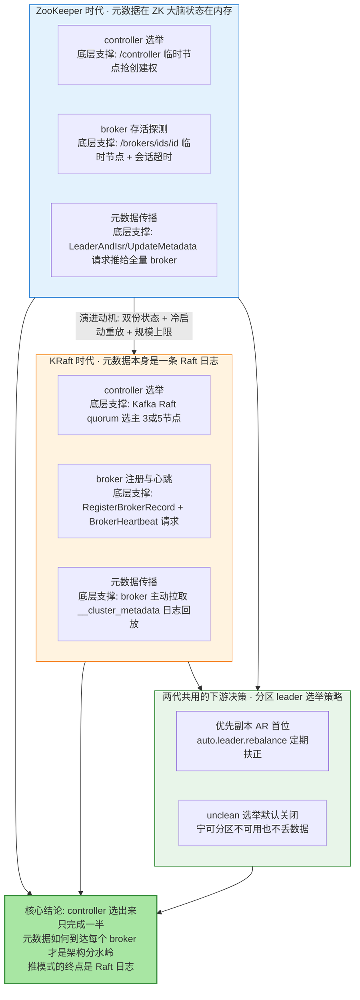
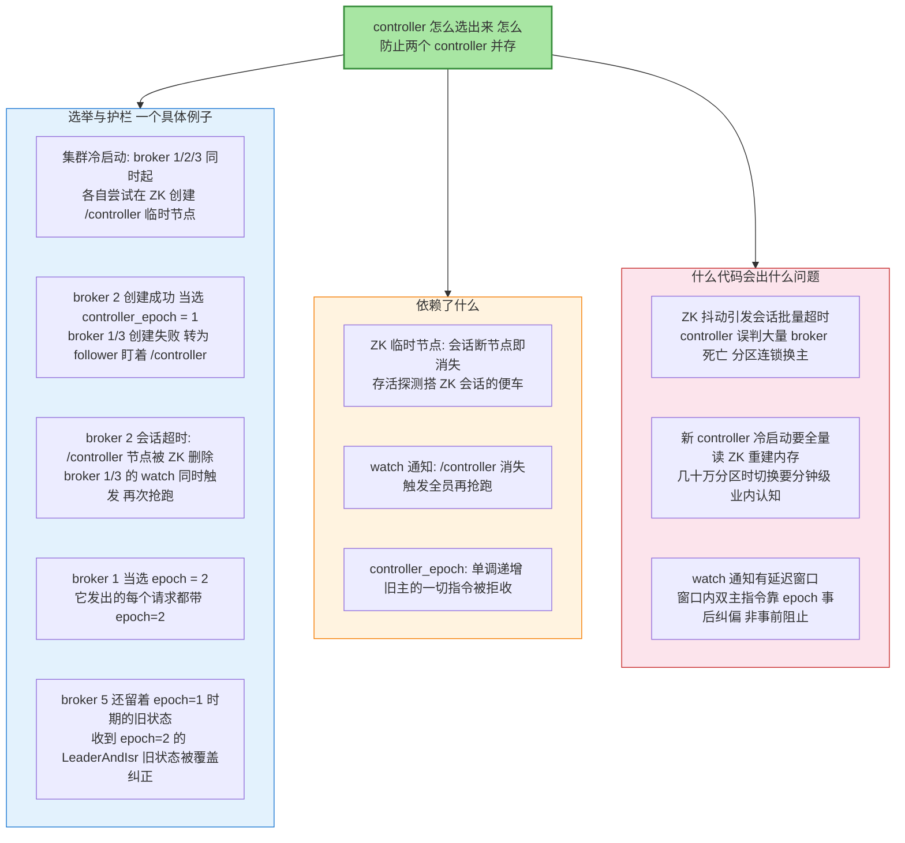
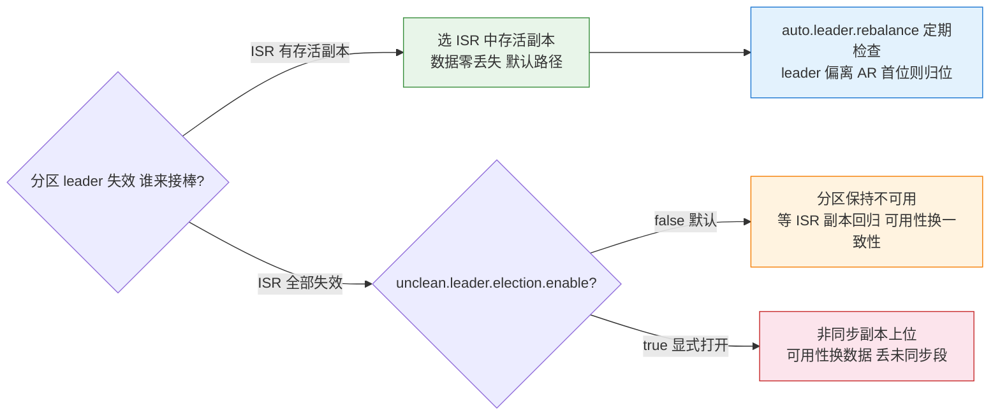
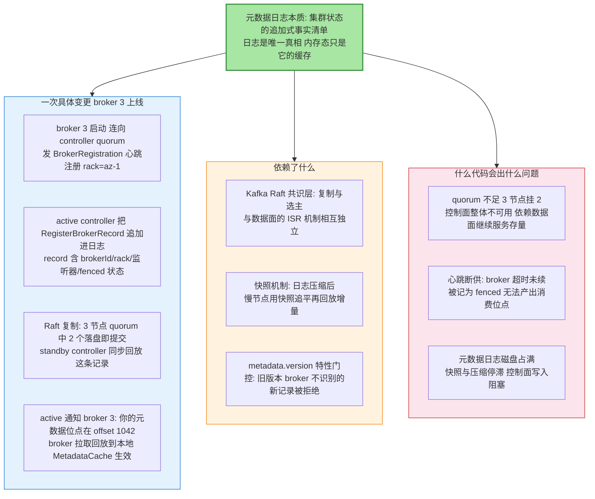

# Controller 与 KRaft 元数据演进：从临时节点抢跑到元数据日志

> 先看图，再看字——这张图就是全文：Kafka 的「集群大脑」在两个时代的形态、各自靠什么机制选出 controller 与分区 leader、KRaft 为什么要用 Raft 日志重写元数据层。

## 一图看懂：控制器与元数据的两代架构

**读图三步**：蓝（ZK 时代）与橙（KRaft 时代）两行对齐着看——同样的三件事（选 controller、探活 broker、传播元数据），实现机制完全不同；绿是两代共用的分区 leader 选举策略（这部分逻辑与存储后端无关）；底部结论点出本文的主线：**从「ZK 存状态 + 内存算状态 + 请求推状态」到「元数据即日志、日志即真相」**。

## 🎯 本文核心

Kafka 的控制面演进围绕一个矛盾展开：**元数据必须一致，但「存一份、算一份、发一份」天然会不一致**。ZK 时代的解法是三层拼装——controller 用临时节点抢跑选出、broker 存活靠 ZK 会话、选出的结果由 controller 主动推请求给全量 broker——代价是元数据同时活在 ZK、controller 内存和每个 broker 的缓存里，controller 故障切换要全量重放、集群规模被元数据同步拖住上限。KRaft 的解法是把元数据本身变成一条 Raft 日志（`__cluster_metadata`）：所有变更（broker 注册、topic 增删、分区配置）都是追加的记录，controller 由 quorum 选主，broker 主动拉日志回放——**状态只有一份权威载体（日志），任何人重启都靠回放日志恢复，不需要向任何人「同步状态」。**

机制链一句话：**变更 → 追加为元数据记录 → Raft 复制到 controller quorum → active controller 应用并服务 → broker 心跳 + 拉取回放 → 本地 MetadataCache 生效**。

## 一句话摘要

ZK 模式：第一个在 `/controller` 临时节点上创建成功的 broker 当 controller，`/controller_epoch` 单调递增隔离旧主，分区 leader 默认选存活副本列表首位、unclean 选举默认关闭防丢数据；KRaft：把元数据做成 Raft 日志（RegisterBrokerRecord/TopicRecord/PartitionRecord 等记录追加进 `__cluster_metadata`），3 或 5 个 controller 组成 quorum 选主、standby 靠回放日志热备，broker 用心跳注册并被 active controller 通知拉取元数据——从「三处状态拼一致」变成「一条日志定真相」。

## 5W 速记卡

| 维度 | 一句话 |
|---|---|
| What | 集群控制面的两代实现：ZK 临时节点抢跑 vs Raft 日志 quorum，外加共用的分区 leader 选举策略 |
| Why | 元数据的存储方式决定了故障切换速度、集群规模上限与运维复杂度 |
| When | 选 controller 在集群启动/旧主失效时；选分区 leader 在副本失效/扩缩容/重平衡时 |
| Where | ZK 节点 /controller 与 /controller_epoch；KRaft 的 __cluster_metadata 日志与 quorum 状态机 |
| How | 运维看 kafka-metadata-quorum describe 与 controllerEpoch，读 ZK 时代遗留用 zookeeper-shell |

## 一、ZooKeeper 时代：临时节点抢跑与 epoch 护栏

**关键路径（源码级）**：选举入口在 `KafkaController` 的 `elect`——启动或 /controller 消失时经 `ZookeeperClientCreator` 注册会话，抢建 `/controller` 临时节点；写入内容含 brokerId 与时间戳。旧主隔离靠 `controllerEpoch`（ZK 上的 `/controller_epoch` 持久节点，每次当选自增）；broker 收到 `LeaderAndIsrRequest` 时校验 epoch，携带更旧 epoch 的 controller 指令被直接拒绝——**epoch 是「事后纠偏」机制，不是「事前互斥」锁**：双主窗口存在于 watch 传播的延迟里，靠 epoch 让旧主的指令天然失效。controller 对全量 broker 的元数据推送走 `ControllerChannelManager`（LeaderAndIsr / UpdateMetadata / StopReplica 三类请求），broker 的元数据缓存在 `MetadataCache`。

## 二、分区 leader 选举策略：controller 的日常决策

controller 最重要的日常职责是「每个分区的 leader 是谁」。策略分两层：

**优先副本选举（preferred leader election）**：分配分区时副本列表（AR）的第一位是优先 leader——故障恢复后 leader 应当归位到它，避免副本流量长期偏斜。`auto.leader.rebalance.enable=true`（默认开）让 controller 周期检查「非优先副本在位」的比例并自动触发归位（公开口径：默认负载阈值 10%）。

**失效 leader 选举**：leader 所在 broker 下线时，controller 从 ISR（同步副本集合）里选下一个存活副本——**ISR 里的数据是有保障的**；当 ISR 全部失效时，`unclean.leader.election.enable`（默认 false）决定是否允许非同步副本上位：开了，分区恢复可用但**丢掉未同步的数据**；不开，分区保持不可用直到原 ISR 副本回归。

**设计思想**：默认值的选择暴露了 Kafka 的立场——**一致性优先于可用性**。unclean 选举默认关着，因为「分区暂时不可写」通常是局部的、可等待的，而「数据悄悄丢一段」是静默的、不可逆的；真要开（日志类可容忍丢段的业务），也应按 topic 粒度显式打开并知晓代价，而不是集群级一键放开。

## 三、KRaft：为什么要把元数据做成 Raft 日志

### 组件四要素图：__cluster_metadata 元数据日志

**动机逐条对账（为什么不用 ZK 的三个为什么）**：

- **为什么不再用 ZK 存元数据**——ZK 模式下元数据有三份活体：ZK 里的持久数据、controller 重放出的内存态、每个 broker 的 MetadataCache，三者靠 watch + 推请求对齐，任何一处滞后就是元数据不一致的温床；日志模式只有一份事实（日志本身），其余全是缓存，缓存错了回放就能修。
- **为什么 controller 切换快了**——ZK 模式新主冷启动要全量读 ZK 重建内存态（业内认知：几十万分区时达分钟级）；KRaft 的 standby 一直在回放同一条日志，切换时只需从「几乎最新」继续，无需重建。
- **为什么规模上限高了**——ZK 模式的元数据推送（全量 broker 的 LeaderAndIsr/UpdateMetadata）随分区数与 broker 数相乘膨胀，社区公开口径 ZK 模式在几十万分区量级遇阻、KRaft 目标是单集群支持数百万分区。

**关键路径（源码级）**：`QuorumController` 是事件驱动的状态机——所有变更先经 Raft 层（`KafkaRaftManager`）提交进 `__cluster_metadata`，提交后按序应用（写 `ReplicationControlManager` / `ConfigurationControlManager` 等内存视图并生成对 broker 的响应）；standby controller 同样回放日志但不对外服务。broker 侧 `BrokerServer` 启动时向 active controller 注册并持续心跳（`BrokerHeartbeatRequest`，携带当前元数据位点），被标记 fenced 的 broker 不参与生产消费的数据完整性承诺。4.0 起 ZooKeeper 已被完全移除（公开口径），元数据读写只走 quorum。

## 四、事故复盘（匿名化叙事）

**复盘一：ZK 会话风暴引发的分区连环换主。**现象：某日志采集平台凌晨出现整集群生产延迟尖峰，Kafka 未重启、流量平稳。**排查**：controller 日志里短时间内批量打印 broker 会话超时与新 leader 选举；对齐时间轴，ZK 集群恰在同时段因快照与 GC 停顿出现秒级不可用——大量 broker 的 ZK 会话被误超时，controller 按「broker 死亡」处理，成百上千分区连续换 leader。**复盘**：为 ZK 集群单独规划资源与告警、调大 Kafka 侧 broker 会话与重试容忍、控制面故障演练常态化。教训一句话：**ZK 模式里控制面的可用性被锚定在 ZK 上——ZK 抖一下，分区跟着抖一串。**

**复盘二：unclean 选举被集群级打开后的静默丢数。**现象：某监控指标平台的消费者发现部分分区的历史数据「缺一段」，无任何报错。**排查**：比对生产位点与消费位点确认确实缺失；回查 broker 配置，发现 `unclean.leader.election.enable` 曾为解一次可用性故障被集群级打开且未回收——那段时间几台磁盘故障的 broker 触发了非同步副本上位。**复盘**：按 topic 粒度只为可容忍丢段的指标类 topic 打开、对 leader 切换与 ISR 收缩事件建立审计告警。教训一句话：**unclean 选举的代价是静默的，它的开关必须有审批与过期机制。**

## 五、追问链：质疑者三连

**追问一：KRaft 的 Raft 和数据面的 ISR 复制是同一套吗？**不是，而且这个区分至关重要。元数据日志的复制走 Kafka Raft 共识层（多数派提交、自动选主）；数据分区的复制走 ISR 机制（leader 追踪同步副本、生产端按 acks 约定确认）。两者独立运行——**元数据面的 quorum 挂了，数据面的存量生产消费可以继续**，只是变更类操作（建 topic、扩副本）不可用。

**再追问：既然 KRaft 这么好，为什么演进花了那么多个大版本？**因为元数据层是全系统耦合最深的模块：社区选择「双模式共存 + 灰度迁移」而非一刀切换底座——3.x 先让 KRaft 与 ZK 模式并行可用，再提供 ZK 到 KRaft 的迁移路径（本系列第 2 篇专讲迁移），最后 4.0 才彻底移除 ZK。控制面替换的要义是「随时可回退」，一次到位的勇气换不来灰度的安全。

**打破砂锅：broker 心跳断了就会被踢出集群吗？和 ZK 会话超时有什么区别？**行为不同。ZK 会话超时直接等价于「broker 死亡」，controller 立即为其上所有分区换主——误判的代价是大规模换主；KRaft 模式 broker 心跳断供的默认后果是**被标记 fenced**（ fencing 只剥夺它产出新数据的资格与状态权威性），主挂判定与分区换主有独立的节奏与防护，误判面显著收窄（具体超时阈值以版本配置为准）。这是「心跳语义分层」的设计：注册失效不直接等于数据失效。

## 六、不同量级的思考：约束来源决定解法

- **十万级消息量（单集群小规模）**：约束来源是元数据变更频率低、分区数少——ZK 模式的推送与冷启动成本都还在舒适区；这一档的核心问题是「模式与版本是否被官方支持」，而不是「规模上限」；思考方式是**跟随驱动**——直接用发行版默认模式（4.x 起即 KRaft），不做额外架构动作。
- **百万级消息量（单集群分区持续增长）**：约束来源是元数据规模——分区数上涨让控制面事件量与元数据日志量同步上涨；这一档的核心问题是「控制面还剩多少余量」，而不是「数据面吞吐还能不能加」；思考方式是**余量驱动**——分区总数进容量评审、quorum 复制位点差监控、元数据变更（建 topic/扩分区）窗口化管理。
- **千万级消息量（中型集群大分区数）**：约束来源是分区规模开始触碰 ZK 模式推送与重放的成本曲线；这一档的核心问题是「控制面事件风暴下的切换时长」，而不是「日常元数据读写是否顺畅」；思考方式是**容量驱动**——分区数规划、controller/quorum 节点独立部署、元数据事件量监控。
- **亿级消息量（超大规模多集群）**：约束来源是控制面单集群极限与多集群治理——元数据日志的规模管理、跨集群的故障域隔离成为主导；这一档的核心问题是「控制面能不能按故障域单元化」，而不是「单集群再大一点」；思考方式是**单元驱动**——按业务线/地域拆集群，quorum 节点物理隔离，元数据审计与配置漂移检测全局化。

思考方式总结：十万级靠「跟随默认」，百万级靠「看住余量」，千万级靠「容量规划」，亿级靠「单元化治理」——约束从版本支持迁移到切换时长再迁移到故障域，解法跟着约束来源走。

**自下而上与触发升级**：三个实测值定档——集群分区总数（逼近几十万就该重新评估模式与容量）、controller 切换实测时长（分钟级是 ZK 模式冷启动的典型症状）、元数据变更事件速率（变更风暴前要先扩控制面）。触发升级的信号：分区规模的增长计划、控制面事件告警的频率上升、多集群运维脚本开始失控——任一出现，思考方式随档升级。

## 七、业内惯例与生产实践

- **模式选择**：新集群直接 KRaft（4.x 唯一模式）；存量 ZK 集群按官方迁移路径分批升级（迁移细节见本系列第 2 篇）。
- **quorum 部署**：controller 节点 3 或 5 个（奇数），与大流量 broker 物理隔离部署是公开口径的通行做法；quorum 节点磁盘单独保障——元数据日志写满会阻塞控制面。
- **观测入口**：`kafka-metadata-quorum.sh --describe` 看 quorum 状态与复制位点；KRaft 时代的元数据检视用 `kafka-metadata-shell.sh` 直接读 `__cluster_metadata`；ZK 时代遗留排查用 `zookeeper-shell` 读 `/controller` 与 `/controller_epoch`。
- **unclean 纪律**：集群级保持默认 false；确需按 topic 打开的，必须登记原因与复审时间——把它当「数据丢失授权书」管理而不是普通参数。
- **反模式**：controller 与 broker 混部在同样的高负载机器上、心跳超时阈值随手调大掩盖网络问题、元数据变更（建 topic/扩分区）无审批流。

## 💡 实战提示

- 💡 排查控制面问题先分代：看集群是 ZK 模式还是 KRaft——ZK 模式查 /controller 与会话，KRaft 查 quorum describe 的 leader 与 lag，两套入口别混用
- 💡 `unclean.leader.election.enable` 是一致性开关不是可用性开关：打开前先回答「这个 topic 丢一段数据的业务代价是什么」
- 💡 controller 切换时长是最诚实的控制面健康指标：从秒级涨到分钟级，说明元数据规模或 quorum 复制已经积重
- 💡 KRaft 下 quorum 节点的磁盘监控单独建告警：元数据日志膨胀的后果是整个控制面停摆，比数据面磁盘满更隐蔽
- 💡 优先副本归位（auto leader rebalance）默认开着，但扩缩容后要人工触发一轮 PreferredLeaderElection 检查流量是否真回到设计分布

## 开放问题

- KRaft 单集群元数据规模的实际工程上限（记录数与回放时长的量化关系）随版本演进，公开基准有限，大规模前需自行压测
- 元数据面与数据面心跳语义的进一步统一（fenced 状态的自动化恢复策略）在社区仍是活跃讨论方向

## 你们可能会问

**Q1：KRaft 模式下还需要装 ZooKeeper 吗？**
不需要。4.x 起 ZooKeeper 已被完全移除（公开口径），3.x 只是过渡期双模式共存。元数据存储、controller 选举、broker 注册全部由 quorum + 元数据日志承担——运维上少了一套 ZK 集群的部署、监控与容量规划，这也是 KRaft 迁移最直接的收益。

**Q2：controller 挂了期间，生产者还能写数据吗？**
分两种情况。常规的运维操作（建删 topic、改配置）不可用；但**存量分区的生产消费可以继续**——数据面的 leader 与 ISR 信息已经缓存在 broker 本地，不依赖 controller 实时在线。只有 leader 所在 broker 恰好也失效时，分区才要等新 controller 产生后才能完成换主。这也是控制面与数据面分离的核心价值。

**Q3：为什么分区 leader 默认不选「数据最新的副本」而选「ISR 里的」？**
ISR 的定义就是「跟得上 leader 的副本」，ISR 内选举数据不丢；而「数据最新」在 ISR 全灭的场景下等价于「允许非同步副本上位」——那就是 unclean 选举的范畴，默认关闭。两个概念不要混：ISR 内选谁（策略问题）与 ISR 外能不能选（一致性问题）是两道闸门。

**Q4：元数据日志会不会无限增长？**
不会。Raft 日志有快照与压缩机制（KIP-630 方向）：状态可以被序列化为快照，快照之前的日志段可回收；慢节点先用快照追平再回放增量。但快照与压缩本身需要磁盘与 IO 预算——quorum 节点磁盘满会让这个机制停摆，所以元数据日志的磁盘监控是独立告警项。

## 什么时候用 / 不用

- ✅ **新集群直接上 KRaft**：4.x 唯一模式，无历史包袱时没有理由回头
- ✅ **存量 ZK 集群按官方路径迁移**：迁移工具与双模式过渡已成熟（本系列第 2 篇）
- ✅ **quorum 独立部署 3 或 5 节点**：控制面与数据面物理隔离，故障域不共享
- ❌ 不在 unclean 选举上做集群级妥协——按 topic 显式授权，让丢数据的决定留下痕迹
- ❌ 不混部 controller 与重负载 broker——控制面的延迟抖动会放大成全集群元数据事件风暴
- ❌ 不用「重启 controller」当万金油——先看 quorum describe 的复制位点，重启掩盖不了日志回放积压的根因

## Trade-off：两代架构各在花什么钱

ZK 模式花的钱在**一致性协调**：三处状态靠 watch 与推送对齐，钱花在「保持一致」的过程里——冷启动重放、双主纠偏、会话风暴，都是协调成本；它买到的是成熟稳定与多年运维经验。KRaft 把这笔钱换了个花法：**为「日志即真相」支付共识成本**——quorum 部署、元数据日志的磁盘与复制开销、新栈的运维学习曲线；买到的是快速切换、更高规模上限与一套运维面。选型的实质不是「谁更先进」，而是**你愿不愿意用共识的确定性成本，置换掉协调的过程性成本**——规模越大、变更越频繁，后者的账越算越亏；小集群上两者差异几乎不可感，跟着版本默认走即可。

## 🎯 核心带走

- **一图一句**：ZK 时代「ZK 存状态 + 内存算状态 + 请求推状态」，KRaft 时代「元数据即日志、日志即真相」——控制面演进的全部主线
- **ZK 三件套**：/controller 临时节点抢跑、/controller_epoch 单调递增防旧主、watch 传播窗口靠 epoch 事后纠偏
- **选举两道闸**：ISR 内选谁（策略）与 unclean 选举（一致性授权，默认 false）是两个独立决策，混谈必踩坑
- **KRaft 三问答案**：不用 ZK 是为消灭三份状态、切换快是因 standby 热回放、规模上限高是因推送变拉取
- **心跳语义分层**：KRaft 心跳断供先 fenced 再谈换主，注册失效不直接等于数据失效——误判面比 ZK 会话超时窄
- **量级主线**：跟随驱动 → 余量驱动 → 容量驱动 → 单元驱动，约束从版本支持迁移到切换时长再迁移到故障域隔离

## 📌 数据与事实声明

- 写于 2026-09-24（特性层新增，KRaft 与控制器系列第 3 篇）；机制描述以 Apache Kafka 官方文档与 KIP-595/KIP-631/KIP-630 公开设计文档、GitHub apache/kafka 源码公开内容为基准
- 「ZK 模式几十万分区遇阻、KRaft 目标数百万分区、controller 冷启动分钟级」等为社区公开口径与业内认知，非实测数据
- 参数默认值（unclean.leader.election.enable=false、auto.leader.rebalance.enable=true 等）以所用版本官方文档为准，版本间可能调整
- 事故复盘为公开技术社区高频案例模式的匿名化复述，不含任何真实系统、公司与内部代号

## 📚 参考资料

| 类型 | 标题 | 来源 |
|---|---|---|
| 官方文档 | KRaft design（KIP-633/KIP-631/KIP-595/KIP-630） | cwiki.apache.org/confluence（KAFKA KIP 列表） |
| 官方文档 | Kafka ZooKeeper to KRaft Migration | kafka.apache.org/documentation |
| 源码 | QuorumController / KafkaRaftManager / KafkaController（ZK 时代） | github.com/apache/kafka |
| 系列内 | 本系列第 1 篇：KRaft 控制器与元数据 Quorum | 本系列 |
| 系列内 | 本系列第 2 篇：ZooKeeper 到 KRaft 迁移 | 本系列 |
