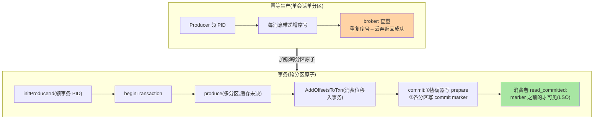
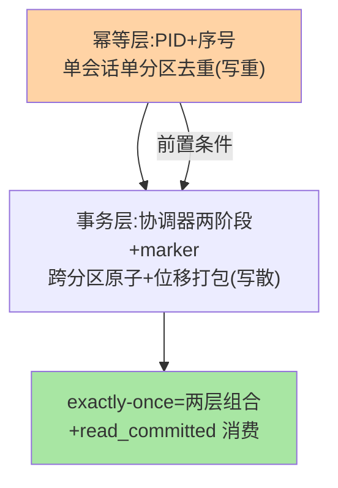

# 幂等生产与事务协议：从 PID 到跨分区原子

> 「重试不重复（幂等）、读-处理-写的原子（事务）」——Kafka 的两层数据正确性机制。这篇拆：**幂等生产**（PID+序号的去重）、**事务协议**（事务协调器+两阶段提交+LSO 可见性）、**read_committed 语义**——把 exactly-once 的机制账算清。

> **本文核心**：两层递进——**幂等生产**（单分区会话内去重：broker 按 `<PID, 分区, 序号>` 检查重复——解决「重试导致的重复」）；**事务**（跨分区原子：produce 请求 + offset 提交打包进一个事务，事务协调器两阶段（prepare/commit marker）保证「全可见或全不可见」）。**机制链**：initProducerId（领 PID）→ beginTxn → 发送（带序号/事务标记）→ AddOffsetsToTxn（消费位移入事务）→ EndTxn（两阶段 marker 写入）→ 消费者按 isolation.level 过滤（read_committed 只读已提交）。

## 一句话摘要

两层的边界账：**幂等的保障范围**——单 producer 会话 + 单分区（PID 是会话身份，重启换 PID 后旧序号作废——broker 内存去重窗口有限）——「重试不重复」成立、「跨会话不重复」不成立（要跨会话用事务或业务幂等键）；**事务的原子范围**——多个分区写入 + 消费组 offset 提交的打包原子（consume-transform-produce 的闭环——读到哪、处理了什么、写出什么三位一体提交）——marker（控制消息）是原子性的载体：commit marker 之前的消息「已提交」、abort marker 标记的「丢弃」——**消费端的 read_committed 按 marker 过滤**（LSO——Last Stable Offset：首个未决事务之前的边界——有长事务时 LSO 停滞，消费滞后——**事务的代价是可见性延迟**）。

## 一、边界：既有篇目讲过什么，本文讲什么

| 内容 | 已有篇目 | 本文 |
|---|---|---|
| exactly-once 的现象与配置 | 入门层（可靠性篇） | 不重复 |
| 幂等的 PID+序号机制 | 提了一句 | **本文核心一** |
| 事务两阶段与 marker | 未讲 | **本文核心二** |
| LSO 与 read_committed 的代价 | 未讲 | **本文核心三** |

## 二、两层机制全景



**两层的包含关系**：事务开启隐含幂等（enable.idempotence 是事务的前置）——幂等解决「写重」，事务解决「写散」（多写不原子）——**重复与原子是两个正交问题，两层各管一个**。

幂等与事务的两层正交：



## 三、事务两阶段的细节

**协调器侧**（TransactionCoordinator）：EndTxn(commit) 时先在事务日志分区写 PREPARE_COMMIT（持久化意图——挂了也能恢复继续）——**意图先行**的 WAL 思想（与 MySQL 两阶段的 redo prepare 同构，互指其日志系列篇 2）；**数据侧**：向事务涉及的每个分区追加 control marker（COMMIT 记录）——marker 到达后该分区的事务消息对 read_committed 可见；**完成**：协调器写 COMPLETE（事务日志推进）。**abort 路径**同理（ABORT marker——消费端丢弃该事务消息）。**超时与悬挂**：transaction.timeout.ms 内未提交——协调器主动 abort（防悬挂事务堵 LSO）；**僵尸生产者**（旧会话的事务 PID 复用冲突）——epoch 校验拒绝旧会话（与 leader epoch 同族的纪元防旧，互指副本系列篇 1）。

## 四、LSO 与 read_committed 的代价

消费者 read_committed 只能读到 **LSO**（最后稳定 offset——所有已开启事务都完结的位置）——**长事务 = LSO 停滞 = 消费阻塞**（即使无关分区的事务也会拖住同分区的可见性）。**代价管理**：事务时长控制（transaction.timeout 的默认收敛方向）、事务内消息批量化（减少事务频率）、监控 LSO 与 HW 的间距（事务可见延迟的指标）。**设计要点**：事务的正确性代价是延迟——「事务粒度」的正确设计（多大一批进一个事务）是吞吐与延迟的第一权衡。

## 五、源码关键路径（4.x 口径）

```text
clients: TransactionManager(事务状态机:状态转换/序号管理)
        → AddPartitionsToTxn/EndTxn 等 RPC 编排
server: TransactionCoordinator(事务日志分区的事务状态管理)
        → TransactionStateManager(状态机+超时 abort)
marker: ControlBatch(控制消息——与数据消息同日志形态的特殊批次)
消费端: CompletedFetch 按 isolation.level 过滤(read_uncommitted 直读 HW/
        read_committed 按 LSO+marker 过滤)
KRaft 时代: 事务协调器逻辑迁入新协调器实现(机制语义不变)
```

## 六、典型场景

- **consume-transform-produce 闭环**：读 topic A → 处理 → 写 topic B + 提交 A 的 offset——三步一个事务（挂了重启：offset 未提交 → 重读 → 重写（幂等/事务去重）——**端到端 exactly-once 的 Kafka 原生方案**）；对比外部系统的「读 A → 写库 → 提交 offset」的跨系统一致（要本地消息表类方案，互指 MQ 事务消息系列）
- **事务超时频发排查**：业务处理慢于 transaction.timeout（默认 60s）——超时被协调器 abort（数据「消失」的假象）——处理时长与超时的等式校验
- **消费滞后但 HW 在动**：read_committed 下 LSO 被 open transaction 卡住——查在途事务时长分布（不是消费能力问题）

## 业内惯例

- **事务粒度按「延迟预算 + 处理时长」设计**：单事务消息数与处理时长的反比权衡——大批低频事务（吞吐）vs 小批高频（延迟）——按业务语义（转账级原子 vs 流处理微批）
- **transaction.timeout 与业务超时联动**（业务最长处理时间的余量）——超时配置小于处理时长 = 必然 abort 的自设陷阱
- **read_committed 的 LSO 延迟监控**（与 HW 的间距）——事务体系健康的第一指标
- **3.x/4.x 视角**：事务协议自 0.11 稳定；演进在性能（事务 marker 的批量优化）与新协调器实现——协议语义保值

## 七、常见误区

- **「幂等 = exactly-once」**：幂等只管「重试不重」——跨会话（重启）、跨分区原子、消费端的重复（再平衡重拉）都不在幂等范围——exactly-once 是「幂等 + 事务 + read_committed」的组合语义
- **事务里做外部副作用**（调 HTTP/写库）——事务只覆盖 Kafka 内部（分区写+位移）——外部副作用要业务幂等或 saga 类方案（互指治理域容错篇）——**事务的原子边界是 Kafka 内**
- **read_committed 性能差就退 uncommitted**：可见性语义的降级（能读到被 abort 的消息）——按业务语义选隔离级别（与数据库隔离级别的选型逻辑同族）
- **长事务没事**：LSO 停滞影响的是同分区全体消费者——一个长事务的公共代价

## 八、与相邻机制的关系

- 本系列篇 2《KStream 与状态存储》：流处理的 exactly-once 在事务之上的封装在那篇
- 《深入理解副本系列》篇 2（HW）：LSO 在 HW 之上的第二层可见性账本（HW 管同步、LSO 管事务）
- tips 互指：治理域容错幂等篇（业务幂等的通用层）；RocketMQ 事务消息的对比（互指其特性层）

## 你们可能会问

**Q1：为什么消费位移要进事务？**
consume-transform-produce 的原子闭环——位移不进事务时：写 B 成功、位移提交失败 → 重启重读 A（重复处理）；位移进事务：写 B 与位移同进退——**三位一体的原子**是端到端 exactly-once 的机制核心。

**Q2：事务的 marker 写在哪个分区？**
数据分区自身（COMMIT/ABORT 控制消息内嵌）——消费端按 marker 过滤本分区消息；事务日志（__transaction_state）存事务状态（协调器的账本）——**两类日志各管各的**（数据可见性 vs 事务状态机）。

**Q3：exactly-once 的性能代价多大？**
公开基准的量级方向：事务路径吞吐有可观折损（marker 与两阶段的额外 IO）——按业务需要选（金融流处理必须、普通管道 at-least-once + 幂等消费已够）——**语义按业务选，不为高级感买单**。

## 九、自测三问

1. 幂等的保障边界（会话/分区/序号窗口）与跨会话的处理？
2. 事务两阶段的流程与 marker 的可见性语义？
3. LSO 的机制与长事务的公共代价？

## 开放问题

- 事务与新组协议（KIP-848）的协同演进（消费位移的事务集成在新协议下的形态）在持续迭代。
- 流处理的增量检查点（changelog 与事务的对齐优化）是 Streams 侧的长线演进。

## 📎 核心带走

- **核心一句话**：幂等（PID+序号的单会话去重）与事务（协调器两阶段+marker 的跨分区原子+位移打包）是两层正交正确性——exactly-once = 组合语义，代价是 LSO 可见延迟
- **机制链**：initProducerId → begin → produce（序号/未决缓存）→ 位移入事务 → EndTxn 两阶段 marker → read_committed 按 LSO 过滤
- **失效点/边界**：幂等不跨会话；事务原子边界在 Kafka 内；长事务拖 LSO 全体

## 💡 实战提示

- 💡 事务三配置等式进模板：处理时长 < transaction.timeout < 业务容忍延迟——三个数联动校验
- 💡 LSO-HW 间距监控进大盘（事务健康第一指标）
- 💡 决策口径：exactly-once 按业务语义选（金融流处理 vs 普通管道 at-least-once+幂等）——不为高级感付性能税
- 💡 架构边界的取舍：事务原子边界在 Kafka 内——外部副作用的引入要评估一致性方案的连锁成本（互指治理域容错篇的幂等体系）

## 📌 数据与事实声明

- 写于 2026-09-10，机制以 Kafka 4.x 为主线（事务自 0.11、协议语义跨版本稳定；默认值以官方文档为准）
- 免责：性能代价按公开基准量级方向，具体以业务实测为准

## 📚 参考资料

| 类型 | 标题 | 来源 |
|---|---|---|
| 官方源码 | apache/kafka（clients: TransactionManager / server: TransactionCoordinator） | github.com/apache/kafka |
| 官方文档 | Kafka Transactions / Idempotent Producer | kafka.apache.org |
| 公开提案 | KIP-98（事务设计） | kafka.apache.org |
