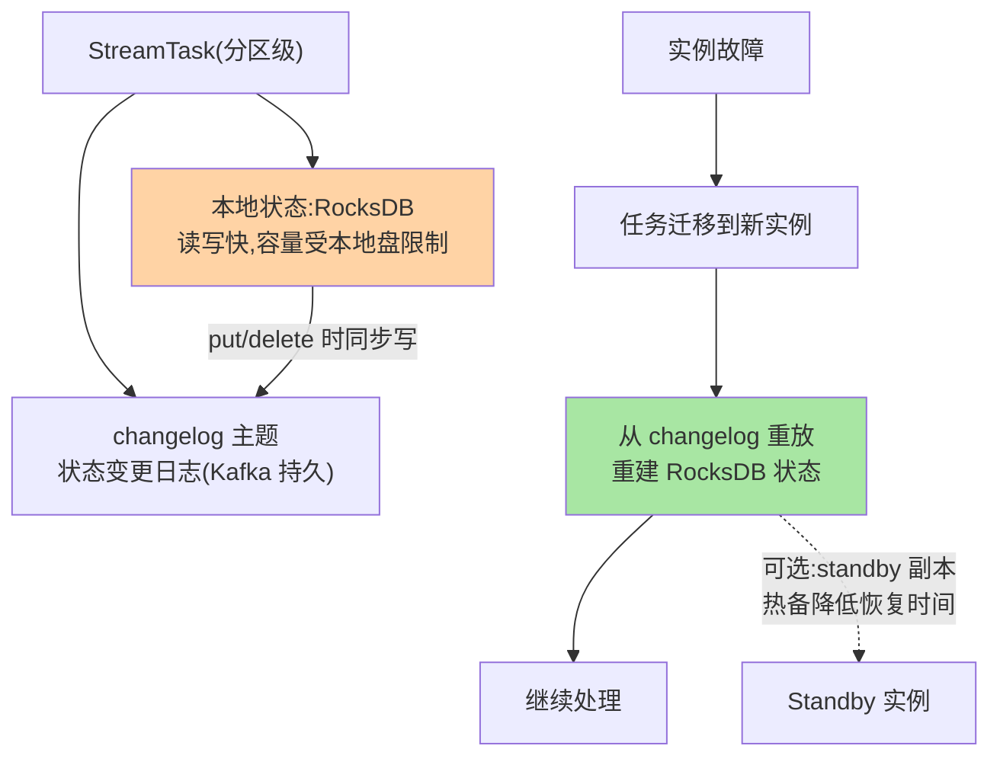
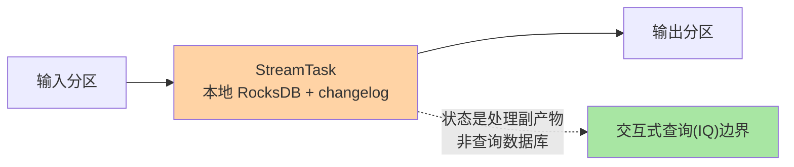

# KStream 与状态存储：流处理的状态管理

> 无状态的处理（过滤/转换）谁都能做——流处理的核心难题是**状态**（计数、窗口、join 都要记住历史）。Kafka Streams 的解法：**状态存储本地化（RocksDB）+ changelog 主题（容错恢复）+ 处理保证（exactly-once）**。这篇拆 Streams 的状态模型与容错机制。

> **本文核心**：Streams 的三层结构——**状态存储**（RocksDB 本地 + changelog 主题双写——本地读写快、changelog 保容错）、**容错恢复**（实例挂 → 任务迁移到其他实例 → 从 changelog 重建状态）、**处理保证**（exactly-once v2：事务包裹「输入消费+状态变更+输出+changelog+offset」全链）。**机制链**：任务（分区级）→ StreamTask（本地状态 + changelog 写入）→ commit 事务提交 → 故障 → 新实例从 changelog 恢复状态继续。

## 一句话摘要

Streams 的核心设计判断：**状态本地化 + 日志化容错**——把状态放本地 RocksDB（读写快、免网络往返），同时把状态的变更历史写进 Kafka changelog 主题（实例挂了换个实例从 changelog 重放重建状态）——**「本地性能 + 远端持久」的两层设计**，与「读写分离缓存 + 审计日志」的思想同构。exactly-once v2 把「消费输入 → 状态变更 → changelog → 输出 → offset 提交」五步包进一个 Kafka 事务——流处理端到端的原子的载体。**任务与分区的对齐**：Streams 的并行单位是任务（按分区划分）——输入分区的数量决定并行度上限（与消费组的分区约束同源）。

## 一、边界：既有篇目讲过什么，本文讲什么

| 内容 | 已有篇目 | 本文 |
|---|---|---|
| 事务协议与幂等 | 本系列篇 1 ✅ | 不重复 |
| 状态存储的双层结构与容错 | 未讲 | **本文核心一** |
| exactly-once v2 的语义 | 提了一句 | **本文核心二** |
| 窗口与 join 的状态形态 | 未讲 | **本文核心三** |

## 二、状态存储的双层结构



**changelog 的恢复权衡**：重放 changelog 的耗时 = 状态规模 × 重放速率——大状态的恢复时间长（分钟级），缓解是 **standby 副本**（另一个实例维护状态的热备副本——故障时切换 standby，恢复时间从分钟降到秒，代价是双倍状态存储）——**恢复时间与资源成本的取舍**是 Streams 部署的核心权衡。

Streams 与外部系统的分层定位：



## 三、exactly-once v2：全链事务的封装

EOS v2 的机制：**commit 间隔**（commit.interval.ms，默认 100ms）内，一个事务包裹——输入分区的消费位置 + 状态变更（changelog）+ 输出分区的写入——全部在一个 Kafka 事务里提交。故障时：未提交事务被 abort——输入位置回滚 → 重放 → 重处理（幂等语义由事务保证）——**流处理的 exactly-once 落在「事务包裹的全链」**。v2 相对 v1 的改进：生产者实例复用（v1 每任务一个 producer，v2 共享线程的 producer——减少开销）。取舍：exactly-once(at_least_once 默认) 的性能折损（事务开销）——按业务语义选（与篇 1 的决策口径同源）。

## 四、窗口与 join 的状态形态

| 形态 | 状态内容 | 保留与治理 |
|---|---|---|
| 聚合（count/sum） | 分组键 → 聚合值 | 窗口结束过期 / session gap 关闭 |
| 窗口聚合 | 键+窗口 → 值（grace 期乱序容纳） | retention 过期清理 |
| join（stream-stream） | 右流缓冲窗口 | join 窗口过期——窗口内的乱序才能 join 上 |

**窗口的 grace 期**是正确性关键：事件时间乱序到达——grace 期内的迟到数据仍纳入窗口，过期后窗口定稿（迟到数据丢弃或旁路）——**窗口正确性 = 时间语义（event-time）+ 水位推进 + grace 期**三件联动。

## 五、源码关键路径（4.x 口径）

```text
streams 模块:
 ├─ StreamTask(任务:输入分区+状态+changelog 写入)
 │   └─ ProcessorStateManager(状态管理:RocksDB store + changelog 对齐)
 ├─ StreamThread(线程:任务调度/commit 事务包裹 EOS)
 │   └─ commit() → 事务包裹(offset+changelog+output)
 ├─ 抑制/水位: StreamTask 的 punctuate 与水位推进(watermark)
故障恢复: changelog 主题的 restore 消费者(StandbyTask/恢复任务)
```

## 六、典型场景

- **状态恢复慢**：大状态的 changelog 重放耗时——standby 副本 / 增大恢复并行（restore.consumer 的批量）/ 状态瘦身（窗口 retention 收紧）
- **流-流 join 不命中**：join 窗口外的迟到事件（grace 期不足）——事件时间与水位推进的配置核对，不是 join 逻辑错误
- **状态膨胀**：session 窗口的 gap 设置过大（长期不关闭）——窗口 retention 与 gap 的定期审计

## 业内惯例

- **standby 副本按 SLA 配置**：分钟级恢复可接受就不配 standby（省资源）；秒级恢复 SLA 配 standby
- **状态规模监控**（RocksDB 大小 / changelog lag 进大盘）——状态膨胀是流处理 OOM 的前兆（互指排障篇 OOM 类型学）
- **3.x/4.x 视角**：EOS v2（3.0+ 默认处理保证提升）、状态存储仍 RocksDB（官方在演进嵌入式存储抽象）——Streams 语义稳定、性能持续

## 七、常见误区

- **「KStream 是数据库」**：状态是处理副产物（容错恢复用），不是可查询的数据服务——交互式查询（IQ）有专门的语义边界（一致性/路由）
- **「换实例状态就丢」**：changelog 机制保状态可重建——丢的是「恢复时间」，不是「状态本身」
- **exactly-once 当默认**：默认 at_least_once——EOS 是业务语义选择（性能代价），不是免费午餐
- **窗口 grace 无限大求稳**：grace 越大状态越大、窗口定稿越晚——按乱序容忍度定，不无限求稳

## 八、与相邻机制的关系

- 本系列篇 1：EOS 的事务协议底座（本篇是它在 Streams 的封装应用）
- 《深入理解存储引擎系列》：changelog 主题的存储形态（互指）
- tips 互指：治理域 stability 追踪篇（流处理链路的观测）；Flink 对比的知识关联（本仓库未铺 Flink，开放领域）

## 你们可能会问

**Q1：RocksDB 状态太大放不下怎么办？**
窗口/键空间收敛（业务层）+ tiered（RocksDB 本身分层冷热）+ changelog 恢复本质不变——再大就说明该用外部状态存储（Flink+StateBackend 类形态），Streams 的甜区是中小状态。

**Q2：Streams 和 Flink 怎么选？**
轻量嵌入（随应用部署、Kafka 原生语义、无额外集群）选 Streams；重型流计算（大状态/复杂窗口/事件时间语义完备）选 Flink——按状态规模与团队栈权衡（互指分布式系统设计的方法论）。

**Q3：交互式查询（IQ）的一致性？**
IQ 读的是「本实例的本地状态」（可能是陈旧的——未 commit 的变更不可见）——一致性敏感查询走「路由 + 等待 commit」或降级容忍——IQ 的语义边界要按查询场景评估。

## 九、自测三问

1. 状态双层（RocksDB+changelog）的分工与恢复流程？
2. EOS v2 事务包裹的五步全链是哪些？
3. 窗口正确性的三件联动（event-time/水位/grace）？

## 开放问题

- 嵌入式状态存储的抽象演进（RocksDB 替代选项）与 IQ 的一致性模型强化是 Streams 的两条产品线。
- 与 Flink 的能力边界（轻量嵌入 vs 重型计算）随两者演进持续移动。

## 📎 核心带走

- **核心一句话**：KStreams = 状态本地化（RocksDB）+ 日志化容错（changelog）+ EOS 事务封装——本地性能与远端持久的两层设计
- **机制链**：任务按分区 → 状态读写本地 + changelog 同步 → commit 事务包裹全链 → 故障迁移 → changelog 重放恢复
- **失效点/边界**：状态是副产物不是数据库；EOS 有性能代价；grace 期是正确性关键

## 💡 实战提示

- 💡 状态规模 + changelog lag 进监控大盘——流处理 OOM 的前兆位
- 💡 standby 按 SLA 配置——恢复时间与资源成本的取舍写进部署决策
- 💡 决策口径：EOS/ALO 按业务语义；窗口 grace 按乱序容忍实测——两个取舍都不要拍脑袋
- 💡 Streams 与 Flink 的取舍：状态规模与团队栈权衡——轻量嵌入选 Streams，重型计算选 Flink，不追「全能」

## 📌 数据与事实声明

- 写于 2026-09-10，机制以 Kafka 4.x Streams 为准（EOS v2 自 2.6+、RocksDB 为默认状态存储官方口径）
- 免责：源码细节以 apache/kafka 当前主线为准

## 📚 参考资料

| 类型 | 标题 | 来源 |
|---|---|---|
| 官方源码 | apache/kafka（streams 模块） | github.com/apache/kafka |
| 官方文档 | Kafka Streams Developer Guide | kafka.apache.org |
| 实践书 | 《Kafka Streams 实战》 | 公开出版 |
