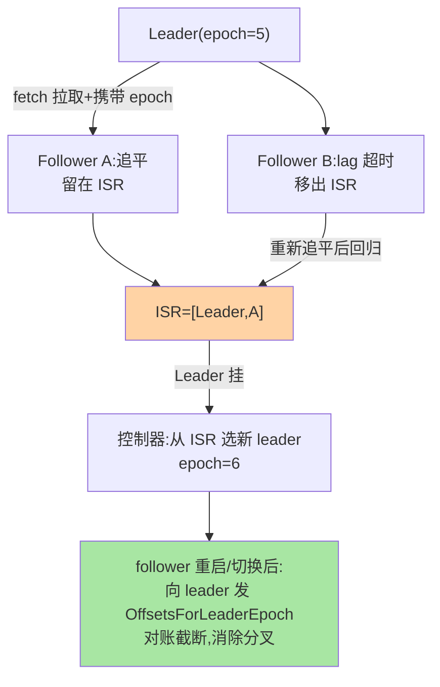

# ISR 机制与 Leader Epoch：副本同步的账本

> 分区的每个副本怎么保持一致？入门层的答案停在「ISR 同步副本集合」——本篇拆账本的两页：**ISR 的进出机制**（落后多少算落后）与 **Leader Epoch**（用「纪元账本」替代「高水位截断」修复的数据不一致）。

> **本文核心**：ISR = **leader 视角的「跟得上」名单**（replica.lag.time.max.ms 内追平的副本在列、超时出局；控制器按 ISR 选新 leader）。Leader Epoch = **每个 leader 任期的递增编号 + 副本的 epoch 追随机制**——修复了纯 HW 截断的两类脑裂不一致（副本重启后数据回退/分叉）。**机制链**：follower 拉取 leader → 追平入 ISR / 超时出 ISR → leader 挂 → 控制器从 ISR 选新 leader（epoch+1）→ follower 按 epoch 对账截断。

## 一句话摘要

两个机制的演进关系：**ISR 定「谁能当 leader」**（可用性保障——不在 ISR 的副本数据落后，当选会丢已提交消息）；**Leader Epoch 定「追谁、追到哪」**（一致性保障——0.11 之前用 HW 做同步截断，两类故障场景（leader 频繁切换、follower 重启）下 HW 的滞后性造成副本间数据回退与分叉，epoch 的「每次任期确认 offset」修复为follower 重启后先向 leader 对账「我这个 epoch 该截断到哪」——**从「盲信水位」到「按任期对账」的机制演进**）。

## 一、边界：入门层讲过什么，本文讲什么

| 内容 | 入门层 | 本文 |
|---|---|---|
| 副本/ISR 的概念与 acks 的关系 | ✅ 讲过 | 不重复 |
| ISR 进出的判定机制 | 提了一句 | **本文核心一** |
| Leader Epoch 的对账与截断 | 未讲 | **本文核心二** |
| unclean 选举的取舍 | ✅ 讲过（可靠性篇） | 不重复 |

## 二、ISR 与 Leader Epoch 协作全景



**ISR 判定的机制要点**：滞后判定从「条数」（replica.lag.max.messages，已废弃）演进为「时间」（replica.lag.time.max.ms 默认 30 秒（新版默认收紧到 10 秒）没追平 = 出局）——**条数判定在流量突增时误踢（正常副本只是消息大）、流量低谷时误留（真落后但没新消息）**，时间判定表达「持续追不上」的真实语义——这个参数演进是「判定语义准确性」的经典案例。

epoch 对账的修复流程：


## 三、Leader Epoch：账本怎么修分叉

**纯 HW 截断的两类不一致剧本**（历史机制，理解它才懂 epoch 的价值）：

剧本一（重启回退）：follower B 重启——HW 是「全体副本同步到的最小 offset」，B 重启时本地 HW=5，截断到 5；但这期间 ISR 其他副本已推进到 10 且 leader 已换——**B 按旧 HW 截断丢了本地实际有的 5-10 数据**（已提交消息丢失）。剧本二（分叉）：两副本各自按不同 HW 截断后成为不同时期的 leader——**同 offset 位置的消息不一致**（需要全力比对才能发现的最恶性问题）。

**Epoch 对账的修法**：follower 每次成为 follower 或重启后，第一步**不发数据请求，先发 OffsetsForLeaderEpoch**——「我的 epoch=5 的 end offset 是多少」→ leader 回答「epoch 5 到 7，7 的起点是 X」→ follower 发现本地超过 X 的数据是「旧任期的残留」→ **按 leader 账本精确截断到 X**——**以 leader 的完整账本（epoch→offset 映射，存于 leader-epoch-checkpoint 文件）为唯一事实源**，替换盲信本地 HW。

## 四、源码关键路径（4.x 口径）

```text
ISR 维护: Partition.scala(控制器时代的演进:ISR 变更经 AlterPartition
          由 KRaft controller 推进——KRaft 把 ISR 决策权上收控制器,互指 KRaft 系列)
Epoch 账本: LeaderEpochFileCache(每副本本地 leader-epoch-checkpoint)
对账协议: OffsetsForLeaderEpoch ApiKeys(KRPC)
          → follower 截断 truncateToEnd/truncateFullyAndStartAt
HW 推进: 与 epoch 协同(HW 仍是消费可见性边界,epoch 管副本间一致性)
```

**架构演进视角**：ISR 的决策权从「leader 自己收缩/扩张」（ZK 时代）演进到「leader 上报、KRaft 控制器决策」（控制器统一裁决降低 leader 切换期的 ISR 抖动）——**决策上收**是这个机制在 4.x 时代的最大变化。

## 五、典型场景

- **ISR 频繁收缩排查**：follower 所在机房的磁盘/网络抖动（拉取延迟 → 超时出局 → 追平回归）——isr-shrinks 指标突增是副本健康的第一信号
- **unclean.leader.election 的启用评估**：ISR 全灭时允许非 ISR 副本当 leader（可用性优先，丢已提交消息）——金融场景禁用（一致性优先），日志场景可评估——**取舍挂在业务语义上**（互指可靠性专题）
- **副本迁移/扩容期间的一致性**：新副本从零追赶（先 epoch 对账确认从 0 开始，再全量拉取）——迁移期 ISR 收缩是预期行为不是故障

## 业内惯例

- **replica.lag.time.max.ms 按负载实测定**（默认 10-30 秒区间）：流量突增场景的误踢（出 ISR 又秒回）→ 适当放宽；真落后场景要的是告警不是放宽
- **isr-shrinks/expands 进监控大盘**：抖动模式（频繁进出）指向底层资源问题（磁盘/GC/网络），不是参数问题
- **3.x/4.x 视角**：epoch 机制自 0.11 起稳定；KRaft 时代 ISR 决策上收控制器（架构变化，语义不变）；这套知识保值度高

## 六、常见误区

- **「ISR 里的副本数据完全一致」**：ISR 是「追平过」的判定（时间窗语义）——瞬间的滞后存在，已提交语义由 acks=all+min.insync 保证（写入时刻的 ISR 快照），不是 ISR 的静态性质
- **HW 没用了**：HW 仍是「消费可见性边界」（消费者最多读到 HW）——epoch 替代的是「副本截断的依据」，两者分工（可见性 vs 一致性对账）
- **min.insync.replicas=副本数**：全量同步要求下任何一个副本抖动都写入失败——可用性骤降；常用 副本数=3 + min.insync=2（容忍一台故障仍可写）
- **follower 出 ISR = 故障**：流量突增/均衡动作的正常抖动——看模式（进出频率）不看单次事件

## 七、与相邻机制的关系

- 本系列篇 2《HW 与一致性语义》：消费可见性与已提交语义在那篇展开
- 《深入理解KRaft与控制器系列》：ISR 决策上收控制器的新架构
- tips 互指：可靠性专题（acks 与 ISR 的配合）；Redis 主从复制的账本对照（互指其复制篇）

## 你们可能会问

**Q1：为什么 KRaft 把 ISR 决策上收控制器？**
Leader 单点决策在 leader 切换瞬间有 ISR 真相的分叉风险（新旧 leader 各持一份 ISR 视图）——控制器统一账本消除分叉源，代价是 ISR 变更的一次额外 RPC——**一致性优先于延迟**的架构决策。

**Q2：epoch 文件损坏怎么办？**
checkpoint 是可重建的缓存（真相在 leader 的账本与日志本身）——follower 对账以 leader 回答为准，本地文件损坏只影响对账速度不影响正确性。

**Q3：副本追平的速度由什么决定？**
拉取线程的批次与对端读吞吐（页缓存命中，互指存储系列篇 2）——追平慢的排查路径：磁盘 IO → 网络 → fetch 配置，多数是底层资源而非 Kafka 参数。

## 九、自测三问

1. ISR 判定从条数到时间参数的演进逻辑？
2. 纯 HW 截断的两类不一致剧本与 epoch 对账的修法？
3. KRaft 时代 ISR 决策权的变化与理由？

## 开放问题

- ISR 语义在 tiered storage 与弹性副本（目录级副本迁移）形态下的演化——副本的「追平」定义可能分层化（本地热层 + 远端冷层的不同步语义）。
- Raft 化（KRaft 的元数据副本用 Raft）与数据副本的 ISR 机制并存——数据面是否最终也向 Raft 语义收敛是远期观察项。

## 📎 核心带走

- **核心一句话**：ISR 定「谁能当选」（时间语义的追平判定），Leader Epoch 定「按任期对账截断」（修复 HW 截断的数据回退/分叉）——可用性与一致性的两页账本
- **机制链**：follower 拉取 → 追平入 ISR/超时出局 → leader 挂 → 控制器从 ISR 选新（epoch+1）→ follower 先对账再截断再追
- **失效点/边界**：ISR 是动态判定非静态一致；min.insync 不设满额；抖动看模式不看单次

## 💡 实战提示

- 💡 isr-shrinks/expands 曲线的「抖动模式」进大盘——副本层健康的第一信号
- 💡 min.insync=2 + acks=all + unclean 禁用是数据安全线的标准三件配置
- 💡 决策口径：可用性 vs 一致性的取舍（unclean 开关）挂业务语义评审，不搞全站一刀切

## 📌 数据与事实声明

- 写于 2026-09-10，机制以 Kafka 4.x（KRaft）为准；epoch 机制自 0.11 引入、lag.time 默认值随版本演进口径以官方文档为准
- 免责：源码细节以 apache/kafka 当前主线为准

## 📚 参考资料

| 类型 | 标题 | 来源 |
|---|---|---|
| 官方源码 | apache/kafka（Partition/LeaderEpochFileCache） | github.com/apache/kafka |
| 官方文档 | Kafka Replication 设计文档（epoch 提案公开） | kafka.apache.org |
| 原理书 | 《深入理解 Kafka》朱忠华（副本机制章） | 公开出版 |
