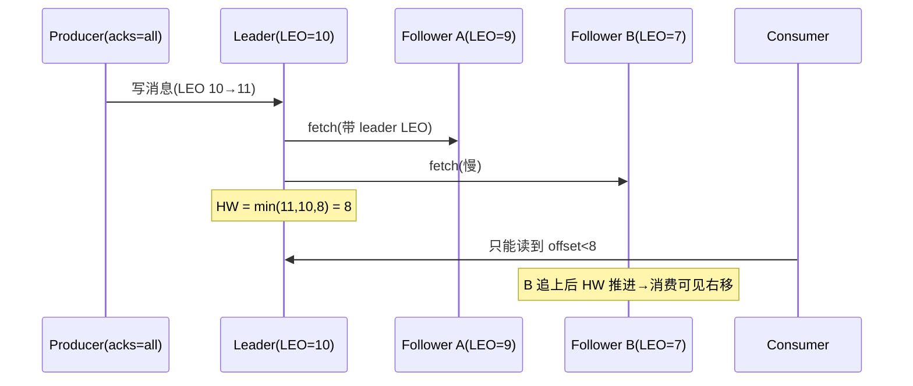
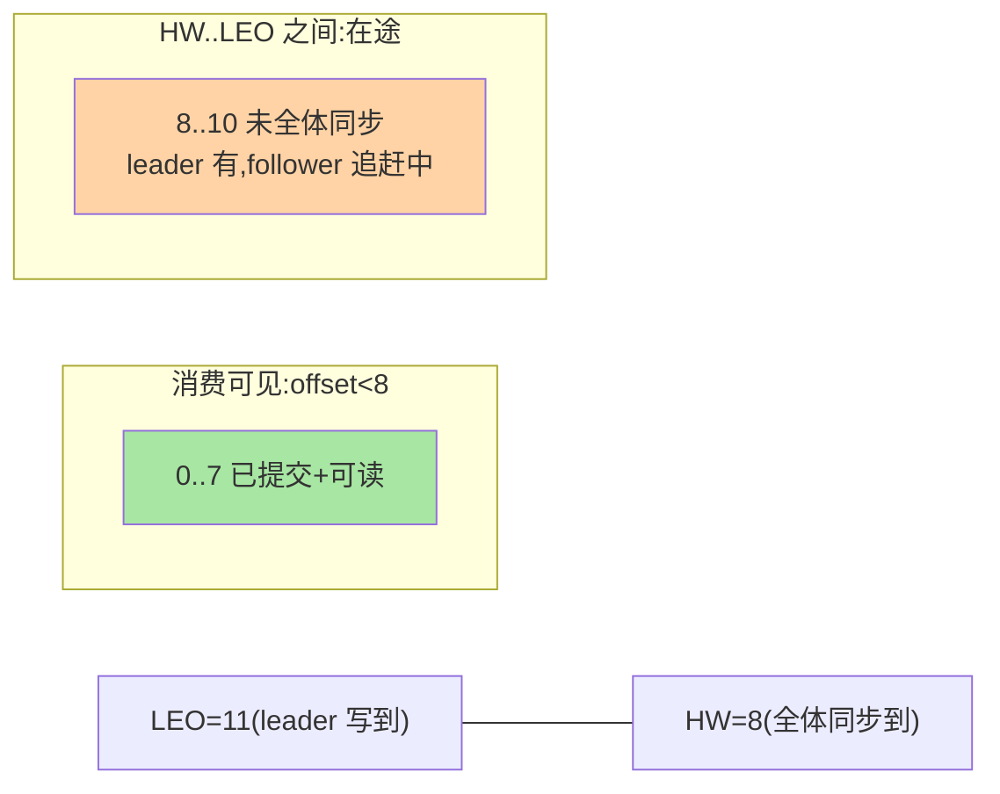

# HW 与一致性语义：已提交、消费可见与丢失窗口

> 「这条消息算发出去了吗」「消费者能读到哪」「什么情况下会丢」——三个问题的答案都绕不开 **HW（High Watermark，高水位）**与它身后的 LEO。这篇把 Kafka 的一致性语义账本算清：已提交的边界、可见性的边界、丢失的窗口。

> **本文核心**：**LEO（Log End Offset）**是每个副本「日志写到哪」的自私账；**HW 是 ISR 全体的最小 LEO**——「全体都到了的位置」。**机制链**：producer acks=all → 消息进 leader LEO → follower 拉取推进各自 LEO → leader 计算 HW = min(ISR LEO) → HW 之前的消息「已提交+消费可见」→ HW 推进延迟 = 一致性的代价窗口。

## 一句话摘要

三层语义的边界账：**「已提交」**（committed）= producer 视角——acks=all 时 ISR 全体持久（各自页缓存）才算成功（min.insync 不满足直接报错——宁可拒写不可写丢）；**「消费可见」**= consumer 视角——只能读到 HW（读到「全体未同步」的消息会破坏一致性，若 leader 换人这些消息可能被截断——**消费可见性以一致性换安全**）；**「丢失窗口」**= 极端场景账——unclean 选举（非 ISR 上位丢已提交）、ISR 全灭（可用性死局）、页缓存断电（副本冗余兜底的极限）——每个窗口对应一个配置开关，**语义边界由配置组合声明**。与篇 1 的分工：epoch 管副本间对账，HW 管对外可见性——两页账本合起来是完整的一致性模型。

## 一、边界：既有篇目讲过什么，本文讲什么

| 内容 | 已有篇目 | 本文 |
|---|---|---|
| acks 语义与 ISR 概念 | 入门层 + 本系列篇 1 | 不重复 |
| epoch 对账截断 | 篇 1 ✅ | 不重复 |
| HW 的推进机制与消费可见性 | 未讲 | **本文核心一** |
| 已提交/可见/丢失的三层语义账 | 未讲 | **本文核心二** |
| 一致性语义的配置组合表 | 未讲 | **本文核心三** |

## 二、LEO 与 HW 的推进全景



**HW 推进的架构语义**：消费可见性被最慢的 ISR 副本拖住——**一个慢副本拖慢全体消费进度**（不是只拖 acks=all 的写）；这是「一致性对可用性的税」——慢副本的处理（出 ISR）同时解放读写两条路径。**follower 的 LEO 上报**：fetch 请求携带（follower 拉到哪），leader 按全体上报算 HW——HW 的计算在 leader、消费经 leader（或读副本 follower 时也按 HW 过滤——follower 消费的一致性同样受保护）。

三层语义的边界示意：



## 三、三层语义账与配置组合表

| 配置组合 | 已提交语义 | 丢失窗口 | 适用 |
|---|---|---|---|
| acks=all + min.insync=2 + unclean=禁 | ISR 多数持久才成功 | 仅多机同断电级故障域叠加 | 数据安全线（计费/交易日志） |
| acks=all + min.insync=1 | 只要求 leader 在 ISR | leader 单机断电窗口（页缓存丢） | 允许极小概率丢的日志 |
| acks=1 | leader 持久即成功 | leader 挂 + 副本未拉到 = 丢 | 高吞吐容忍丢失（埋点类） |
| acks=0 | 发出即成功 | 网络丢即丢 | 采样监控类 |

**语义边界的决策口径**：先问业务「丢一条的代价」（资金级 → 第一行；运营日志 → 第二行以下）——配置组合是业务语义的声明，不是技术偏好。

## 四、源码关键路径（4.x 口径）

```text
HW 更新: Partition.maybeIncrementLeaderHW(leader 侧,fetch 上报触发)
         → 延迟操作 DelayedProduce(acks=all 的完成判定=HW 越过消息 offset)
消费可见: UnifiedLog.read(读请求带 maxOffset=HW 截断)
follower 读: FollowerFetcher 按本副本已知 HW 过滤(读副本的一致性保护)
KRaft 时代: HW/LEO 机制不变;ISR 上报走 AlterPartition(决策上收,篇1)
```

## 五、典型场景

- **「写入成功但消费不到」**：写入成功（acks=1，leader 持久）≠ 消费可见（等 HW）——慢副本场景写读体验不一致的机制根源；排查看 ISR 滞后分布
- **消费 lag 与 HW 的区分**：consumer lag（消费进度 vs HW）是消费侧指标；HW 推进慢是副本侧问题——lag 高先分「HW 没动」（副本侧）还是「HW 动了没消费」（消费侧），两类归因路径完全不同
- **读副本（follower fetch）的一致性**：消费者从 follower 读时按 follower 本地 HW 截断——跨机房读副本的可见性延迟 = 主从复制的消费版语义（与 MySQL 主从读扩散同构，互指其复制系列）

## 业内惯例

- **acks=all 是新集群默认**（吞吐损失用批量化摊薄——发送侧攒批让每批的同步成本占比下降）
- **「写入成功 = 可见」的预期管理**：监控里区分写入延迟（acks 路径）与可见延迟（HW 推进）——两个指标两个责任方（producer 配置 vs 副本健康）
- **3.x/4.x 视角**：HW/LEO 机制跨版本稳定；KRaft 改决策链路不改语义——一致性语义知识保值度极高

## 六、常见误区

- **「acks=1 更快所以默认」**：快是丢消息换的——历史默认（acks=1）已在 3.x 演进中让位于安全默认方向；新集群按语义选不按旧默认抄
- **HW 是消费进度**：HW 是「全体同步位置」（一致性边界）；消费进度是 consumer group 的 offset——两个账本别混（lag 的分母是 HW 不是 LEO，正是为了消费语义的安全）
- **「min.insync=2 表示两副本集群」**：min.insync 是「写入时 ISR 至少要有几个」——三副本配 2（容忍一台故障），两副本配 2（一台都不能挂，可用性极脆）
- **epoch 替代了 HW**：分工不是替代——epoch 管副本间对账（篇 1），HW 管对外可见性；两者在「follower 重启截断」协作（对账定截断点，HW 定可见线）

## 七、与相邻机制的关系

- 本系列篇 1（ISR/epoch）：本篇是其「对外语义」侧的展开
- 《深入理解事务与流处理系列》：事务的 read_committed 隔离在 HW 之上再加一层（LSO——last stable offset）——事务可见性的账本在那篇
- tips 互指：可靠性专题（不丢三层防线）；MySQL 的主从可见性对照

## 你们可能会问

**Q1：为什么消费者不能读 HW 之后的消息（明明 leader 上有）？**
HW 后的消息未全体同步——若 leader 换人、新 leader 没有这段，消费者就读到了「将被截断的消息」（幻读）——可见性截断是给消费一致性的保险，代价是可见延迟。

**Q2：lag 的分母为什么用 HW 不用 LEO？**
消费语义的公平线——用 LEO 会把「副本同步慢」算成「消费者落后」（消费组的假故障告警）——监控口径的语义准确性。

**Q3：leader 切换瞬间消费者会怎样？**
消费 offset 是持久的（group 提交）——切 leader 后从已提交 offset 继续读新 leader 的数据（epoch 对账已保证新 leader 数据与旧的一致基底）——消费者感知的是短暂不可用与重试，不是数据错乱。

## 九、自测三问

1. HW 的计算公式与「慢副本拖住全体」的机制？
2. 三层语义（已提交/可见/丢失窗口）各自的边界定义？
3. 配置组合表的安全梯度与决策口径？

## 开放问题

- 弹性/分层副本形态下「全体同步」的定义重写（本地层与远端层的 HW 语义分离）是 tiered storage 演进的一致性新题。
- 跨集群复制（MirrorMaker 2 类）的 HW 语义是「目标集群自己的」——端到端的跨集群已提交语义尚无标准表达。

## 📎 核心带走

- **核心一句话**：LEO 是自私账、HW 是全体最小账——已提交（ISR 持久）、可见（读到 HW）、丢失窗口（配置组合声明）三层语义一个账本算清
- **机制链**：写进 leader LEO → follower 上报 → leader 算 HW → acks=all 等 HW 越过 → 消费按 HW 截断
- **失效点/边界**：写成功 ≠ 立即可见；min.insync 不设满额；lag 分母是 HW

## 💡 实战提示

- 💡 写入延迟与可见延迟分两个指标两个告警——责任方不同（配置 vs 副本健康）
- 💡 配置组合表贴值班手册：事故时按表核对当前组合处于哪条安全线
- 💡 决策口径：按「丢一条的代价」选行，吞吐诉求用攒批消化而非降 acks

## 📌 数据与事实声明

- 写于 2026-09-10，机制以 Kafka 4.x 为准（HW/LEO 跨版本稳定；acks 默认值演进以官方文档为准）
- 免责：配置选择按业务语义评审

## 📚 参考资料

| 类型 | 标题 | 来源 |
|---|---|---|
| 官方源码 | apache/kafka（Partition/DelayedProduce） | github.com/apache/kafka |
| 官方文档 | Kafka Replication / Producer acks | kafka.apache.org |
| 原理书 | 《深入理解 Kafka》朱忠华（高水位章） | 公开出版 |
