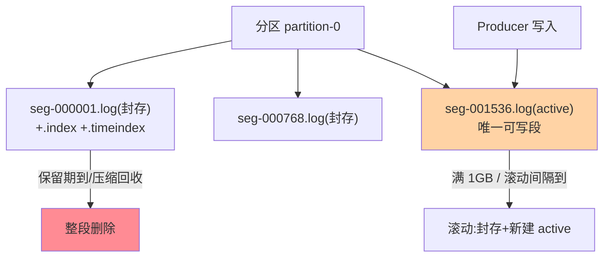
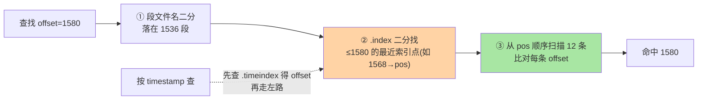

# Log Segment 与索引结构：Kafka 存储的物理形态

> 入门层讲过「Kafka 的日志是顺序追加」——本篇下到磁盘层：**分区由若干 Log Segment 文件组成，每段配 .index/.timeindex 两级稀疏索引**。「消息怎么定位」「索引为什么是稀疏的」「段滚动的条件」这些存储侧问题的答案全在这套结构里。

> **本文核心**：分区存储 = **Segment 分段（active 段追加、满 1GB（默认）滚动封存）+ 稀疏索引（每 4KB 日志建一个索引点）+ 顺序 IO（天然页缓存友好）**。**机制链**：写入 → active segment 追加 → 定位消息时（offset 查 .index / timestamp 查 .timeindex）二分找索引点 → 顺序扫描段内少量消息 → 命中。

## 一句话摘要

三个结构要件的设计逻辑：**分段**（日志不可能一个文件无限长——滚动限制单文件大小、封存段不可变（可被消费者与压缩任务并发读）、过期删除以段为单位（整文件删除远快于逐条清理））；**稀疏索引**（不是每条消息都建索引——每写入 index.interval.bytes（默认 4KB）才记一个索引点，索引量从「每消息」降到「每 4KB」，内存可控的代价是索引点之后最多线性扫描 4KB 的消息）；**二级索引**（.index 管 offset→物理位置、.timeindex 管 timestamp→offset——按时间查找的入口）。**这套结构是 Kafka 磁盘性能的根源**：追加写、顺序读、稀疏索引全部服务「磁盘的最优访问模式」。

## 一、边界：入门层讲过什么，本文讲什么

| 内容 | 入门层 | 本文 |
|---|---|---|
| 顺序写、页缓存的高性能直觉 | ✅ 讲过 | 不重复 |
| Segment 结构与滚动条件 | 提了一句 | **本文核心一** |
| 稀疏索引的定位流程 | 未讲 | **本文核心二** |
| 压缩与保留策略的存储侧实现 | 提了一句 | 留篇 2 |

## 二、分区存储的物理全景

**段文件名即基准 offset**（000001536.log 表示本段首消息 offset=1536）——offset 查找的第一步就是**按文件名二分定位段**（纯内存操作，文件名列表在目录加载时入页缓存）。**滚动条件**三个（任一满足）：段大小达 segment.bytes（默认 1GB）、段年龄达 segment.ms（默认 7 天）、active 段的 index 文件写满——滚动太频繁（段多文件句柄多）与太稀疏（删除粒度粗、定位扫描长）的平衡由这三个参数表达。

## 三、稀疏索引的定位流程

**稀疏的取舍账**：全量索引（每条消息一个索引点）查找零扫描但索引内存 = 消息数 × 索引项大小（亿级消息 = GB 级索引）；4KB 间隔的稀疏索引把索引量砍三个数量级，代价是每次查找最多扫 4KB（约几十条消息，顺序内存读微秒级）——**用可控的小扫描换内存的数量级下降**，这是存储引擎索引的经典权衡（与 MySQL B+ 树的「页级定位+页内扫描」同构，互指 MySQL 索引系列篇 1）。

**timeindex 的中转语义**：按时间查找是两跳（timestamp → timeindex 得 offset → 走 offset 路径）——为什么时间不直接映射物理位置？因为 offset 是日志的唯一序（消息在段内的物理形态围绕 offset 组织），时间只是辅助视图——**单一主键原则的存储设计**。

## 四、源码关键路径

以 Kafka 4.x（KRaft 时代主线，存储层与 3.x 一脉相承）为准：

- 段管理：`LogSegment` / `UnifiedLog`（core 包）——`roll()` 滚动（active 封存 + 新段创建 + 索引文件预分配 `max-index-size` 空间）
- 追加：`LogSegment.append()`——追加到 .log、必要时写索引点（`appendMaxOffset` 判断 4KB 间隔）、
- 查找：`LogSegment.translateOffset()`——索引二分（`AbstractIndex.lookup()` mmap 的二分查找）+ 段内扫描（`LogSearch.searchForOffset`）
- 索引 mmap：索引文件内存映射（`MappedByteBuffer`）——索引查找不发生系统调用

阅读建议：带一条「写入→按 offset 消费」的消息走 `append → roll → translateOffset` 三函数——存储引擎的骨架即这三点一线。

## 五、典型场景

- **消息查找慢排查**：定位扫描超长（索引间隔被调大过 / 消息平均体积极小导致 4KB 内消息数巨大）——`index.interval.bytes` 的调优要在「索引内存」与「扫描长度」间按消息体量实测
- **段滚动风暴**：低流量但 segment.ms 配置过短（每分钟滚一段）——海量小段拖垮文件句柄与索引加载——段滚动参数按流量形态配
- **按时间消费（时间戳回溯）**：consumer 的 offsetForTimes 走 timeindex 两跳路径——timeindex 缺失段（老版本升级遗留）退化到全段扫描

## 业内惯例

- **segment.bytes 保持默认 1GB 起步**：大段利于吞吐（滚动少）、小段利删除粒度——按保留策略与磁盘形态权衡，无特殊诉求不动
- **索引内存预算进容量规划**：稀疏索引内存 = 日志总量 / 4KB × 索引项大小——大分区集群的索引内存是隐藏成本项
- **3.x/4.x 视角**：存储结构自 0.8 时代稳定至今（KRaft 改的是元数据管理不是日志形态）——**存储层知识的跨版本保值度是 Kafka 全家桶里最高的**；4.x 的演进在 tiered storage（分层存储，冷段外移对象存储）——本地段结构不变、冷热分层在段粒度发生

## 六、常见误区

- **「Kafka 每条消息都有索引」**：稀疏索引——索引点之后有最多 4KB 的线性扫描， misconceptions 常导致「为什么索引没直接命中」的误判
- **段越小越好（删除及时）**：海量小段的文件句柄/目录项/索引加载开销远超删除粒度收益——删除粒度靠保留策略配置而非无限细分段
- **「删除消息是逐条清理」**：保留期删除以段为单位（整文件删除）——「保留 1 小时」的实际粒度是「最老段整体删」（log.retention.check.interval.ms 周期触发）——精确到条的清理是 compaction（篇 2）
- **timeindex 可有可无**：按时间回溯（回填消费、断点续传按时间）依赖它——没有 timeindex 的段时间查找退化为全段扫描

## 七、与相邻机制的关系

- 本系列篇 2《页缓存、零拷贝与压缩》：存储高性能的另外三件套在那篇
- 《深入理解副本与一致性系列》：段的物理形态是副本复制的传输单元（互指）
- tips 互指：MySQL 索引系列的「页定位+页内扫描」同构设计；RocketMQ CommitLog 的对比在 RocketMQ 特性层

## 你们可能会问

**Q1：为什么索引不用 B+ 树之类的复杂结构？**
工作负载决定的——查找模式是「append + 按 offset 顺序读」，不是随机点查；稀疏索引的二分 + 顺序扫已覆盖，复杂结构引入写放大与维护成本——**数据结构服从访问模式**（与 Redis 跳表 vs B+ 树的介质论证同源，互指 Redis 系列）。

**Q2：active 段能被删除吗？**
不能——active 段是写入目标，删除保留策略只针对封存段；保留期短于段滚动周期时，实际保留时长会被段滚动拉长（最老封存段才是删除边界）。

**Q3：索引损坏怎么办？**
索引可重建（.log 是真相源）——kafka-run-class 的 IndexRebuild 类工具从日志重建索引——这也是「索引稀疏化」的底气：索引只是加速层不是事实层。

## 八、自测三问

1. 段滚动的三个条件与「段文件名即基准 offset」的作用？
2. 稀疏索引的定位三步与 4KB 间隔的取舍账？
3. 按时间查找为什么是两跳？

## 开放问题

- Tiered storage 普及后，本地段只留热数据、冷段在对象存储——索引结构是否分化为「本地热索引 + 远端冷索引」，社区在演进中。
- PMem/新存储介质对「段大小/索引间隔」的最优值重定价——存储参数的调优基线随硬件演进。

## 📎 核心带走

- **核心一句话**：分区 = Segment 分段（滚动封存）+ 稀疏索引（4KB 间隔）+ 顺序 IO——磁盘最优访问模式的结构化表达
- **机制链**：写入 active 段 → 滚动封存 → 查找按段名二分 → 索引点二分 → 段内小扫描 → 命中；时间查找两跳
- **失效点/边界**：索引稀疏必有扫描；保留删除以段为单位；active 段不可删

## 💡 实战提示

- 💡 段参数（1GB/7天）默认起步，按「段数 × 句柄」「索引内存」两项监控校准
- 💡 按时间回溯场景确认 timeindex 存在（老段升级遗留是盲区）
- 💡 决策口径：索引间隔调大前先算扫描长度（4KB÷平均消息大小=扫描条数），超百条就别调

## 📌 数据与事实声明

- 写于 2026-09-10，结构描述以 Kafka 4.x 主线为准（默认参数 segment.bytes=1GB、index.interval.bytes=4096 为官方口径）；存储结构跨 3.x/4.x 稳定
- 免责：源码细节以 apache/kafka 当前主线为准

## 📚 参考资料

| 类型 | 标题 | 来源 |
|---|---|---|
| 官方源码 | apache/kafka（core: LogSegment/AbstractIndex） | github.com/apache/kafka |
| 官方文档 | Kafka Operations（log segment 配置） | kafka.apache.org |
| 原理书 | 《深入理解 Kafka：核心设计与实践原理》朱忠华（存储章） | 公开出版 |
