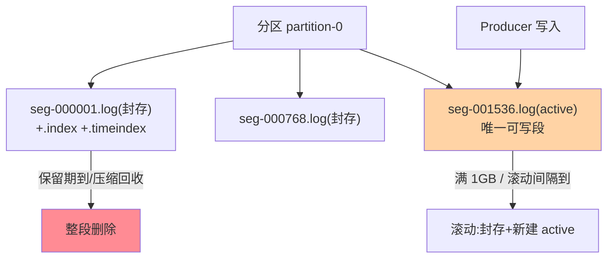
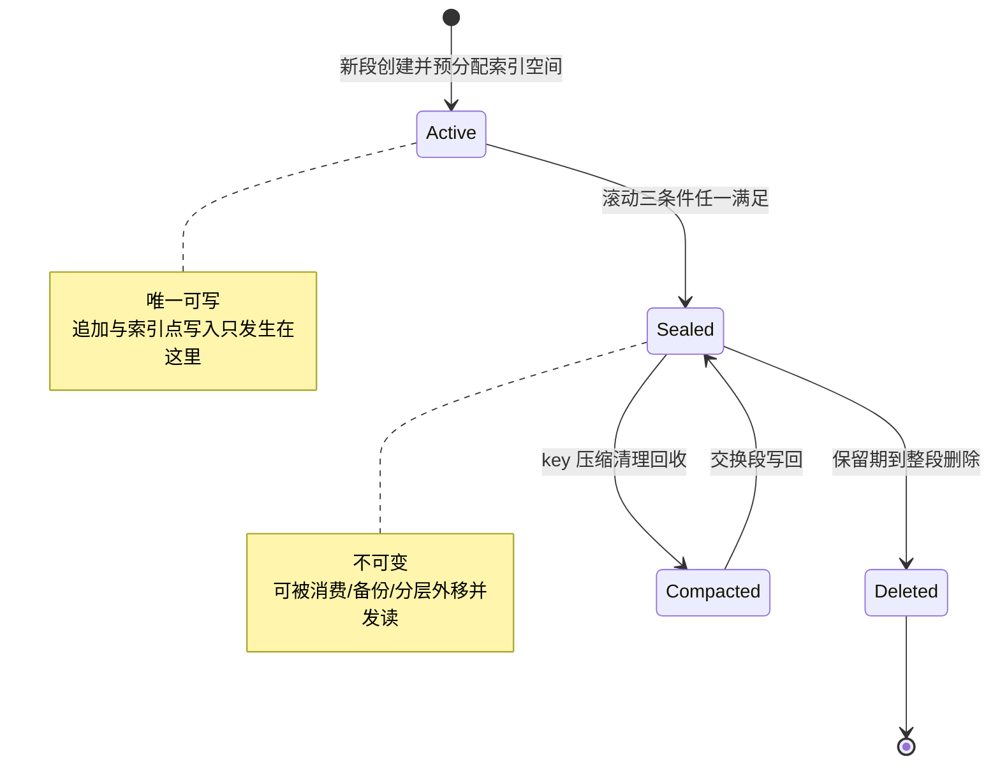
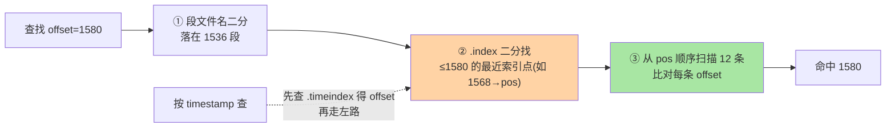

# Log Segment 与索引结构：Kafka 存储的物理形态

> 入门层讲过「Kafka 的日志是顺序追加」——本篇下到磁盘层：**分区由若干 Log Segment 文件组成，每段配 .index/.timeindex 两级稀疏索引**。「消息怎么定位」「索引为什么是稀疏的」「段滚动的条件」这些存储侧问题的答案全在这套结构里。

> **本文核心**：分区存储 = **Segment 分段（active 段追加、满 1GB（默认）滚动封存）+ 稀疏索引（每 4KB 日志建一个索引点）+ 顺序 IO（天然页缓存友好）**。**机制链**：写入 → active segment 追加 → 定位消息时（offset 查 .index / timestamp 查 .timeindex）二分找索引点 → 顺序扫描段内少量消息 → 命中。

## 一句话摘要

三个结构要件的设计逻辑：**分段**（日志不可能一个文件无限长——滚动限制单文件大小、封存段不可变（可被消费者与压缩任务并发读）、过期删除以段为单位（整文件删除远快于逐条清理））；**稀疏索引**（不是每条消息都建索引——每写入 index.interval.bytes（默认 4KB）才记一个索引点，索引量从「每消息」降到「每 4KB」，内存可控的代价是索引点之后最多线性扫描 4KB 的消息）；**二级索引**（.index 管 offset→物理位置、.timeindex 管 timestamp→offset——按时间查找的入口）。**这套结构是 Kafka 磁盘性能的根源**：追加写、顺序读、稀疏索引全部服务「磁盘的最优访问模式」。

## 一、边界：入门层讲过什么，本文讲什么

| 内容 | 入门层 | 本文 |
|---|---|---|
| 顺序写、页缓存的高性能直觉 | ✅ 讲过 | 不重复 |
| Segment 结构与滚动条件 | 提了一句 | **本文核心一** |
| 稀疏索引的定位流程 | 未讲 | **本文核心二** |
| 压缩与保留策略的存储侧实现 | 提了一句 | 留篇 2 |

## 二、分区存储的物理全景

**段文件名即基准 offset**（000001536.log 表示本段首消息 offset=1536）——offset 查找的第一步就是**按文件名二分定位段**（纯内存操作，文件名列表在目录加载时入页缓存）。**滚动条件**三个（任一满足）：段大小达 segment.bytes（默认 1GB）、段年龄达 segment.ms（默认 7 天）、active 段的 index 文件写满——滚动太频繁（段多文件句柄多）与太稀疏（删除粒度粗、定位扫描长）的平衡由这三个参数表达。

段的完整生命周期是一个状态机，两个迁移点分别对应「写入权的转移」与「存储空间的回收」：

**状态机的设计思想**：把「可变」压缩到最小范围（只有 active 段可写），其余全部不可变——不可变意味着无锁并发读、操作系统页缓存友好、删除与压缩都可以按整文件操作。这是存储引擎里「用不可变换并发安全」的经典路线：与其给可变结构加锁，不如让结构不可变（与 LSM-Tree 的 memtable→SSTable 翻转同构，互指数据存储系列的 LSM 篇）。

### 追问链：滚动参数为什么是这三个值

质疑者的三连追问，把参数从「背默认值」推进到「理解默认值」：

- **追问一：segment.bytes 为什么默认 1GB（业内认知的量级）？** 段太碎（比如 100MB）→ 单分区段数量翻十倍，文件句柄、目录项、索引加载的常数开销乘上去；段太大（比如 10GB）→ 删除粒度太粗（保留期删除以段为单位，最老段不滚出去就删不掉）、副本迁移与分层外移的传输单元也跟着变大。1GB 是「句柄开销可忽略 × 删除延迟可接受」的工程折中——不是推导值，是公开口径里多年生产验证的舒服区间。
- **再追问：那低流量分区怎么办（写不满 1GB，段一直不滚）？** 所以有第二个条件 segment.ms（默认 7 天）——时间兜底保证「再冷的分区，段也会按时封存」，保留删除的边界不至无限后移。两个条件是「或」的关系：谁先到谁触发。
- **打破砂锅：index 文件写满为什么也能触发滚动？** 索引文件在段创建时按 max.index.size 预分配（mmap 需要固定长度映射）——索引写满说明按当前间隔已攒够索引点，与其动态扩容映射区（触发 remap 与地址变化），不如顺势滚段（新段新索引）——**把索引容量问题转化为段滚动问题**，一套机制两用。

这套追问的收束点：三个滚动条件不是三个独立开关，而是「大小 × 时间 × 索引容量」对同一个状态迁移的三种触发视角——理解了这一点，调参时就不会只盯一个维度。

## 三、稀疏索引的定位流程

**稀疏的取舍账**：全量索引（每条消息一个索引点）查找零扫描但索引内存 = 消息数 × 索引项大小（亿级消息 = GB 级索引）；4KB 间隔的稀疏索引把索引量砍三个数量级，代价是每次查找最多扫 4KB（约几十条消息，顺序内存读微秒级）——**用可控的小扫描换内存的数量级下降**，这是存储引擎索引的经典权衡（与 MySQL B+ 树的「页级定位+页内扫描」同构，互指 MySQL 索引系列篇 1）。

**timeindex 的中转语义**：按时间查找是两跳（timestamp → timeindex 得 offset → 走 offset 路径）——为什么时间不直接映射物理位置？因为 offset 是日志的唯一序（消息在段内的物理形态围绕 offset 组织），时间只是辅助视图——**单一主键原则的存储设计**。

### 追问链：稀疏索引的三层穿透

- **追问一：为什么不用全量索引（每条一个索引点，查找零扫描）？** 索引是常驻内存的数据结构——每消息一个索引点意味着索引体积与消息量线性同步增长，10w 级消息量的分区无所谓，亿级消息量的分区索引就吃掉 GB 级内存；而扫描的代价被页缓存兜住（4KB 顺序读在内存里是微秒级）——**两边的代价不对称，稀疏化是必然选择**。
- **再追问：为什么不是 B+ 树这类「正经」索引结构？** 访问模式决定数据结构——日志的读模式是「给定 offset 顺序拉一批」，不是随机点查；B+ 树为随机点查优化（多路平衡、节点分裂），带来写放大与页管理复杂度，而顺序追加的日志场景这些成本全是白付的。稀疏索引的二分查找（mmap 区上纯内存二分）+ 段内小扫描已经把两类查询都覆盖——**不为用不上的能力付架构成本**，这是这套设计最值得带走的设计思想。
- **打破砂锅：索引点之间消息体差异巨大怎么办（4KB 内可能 1 条大消息也可能几百条小消息）？** interval 的语义是「日志字节数」不是「消息条数」——大消息场景扫描条数自然少、小消息场景自然多。所以业内惯例是按业务消息的平均体量反推间隔：小消息（几百字节）场景保持默认 4KB；大消息（几十 KB）场景调大间隔收益有限（一条消息就超间隔），小消息洪峰场景才需要警惕「扫描条数爆炸」——间隔的调优依据是消息体量分布，不是拍脑袋。

## 四、源码关键路径

以 Kafka 4.x（KRaft 时代主线，存储层与 3.x 一脉相承）为准：

- 段管理：`LogSegment` / `UnifiedLog`（core 包）——`roll()` 滚动（active 封存 + 新段创建 + 索引文件预分配 `max-index-size` 空间）
- 追加：`LogSegment.append()`——追加到 .log、必要时写索引点（`appendMaxOffset` 判断 4KB 间隔）
- 查找：`LogSegment.translateOffset()`——索引二分（`AbstractIndex.lookup()` mmap 的二分查找）+ 段内扫描（`LogSearch.searchForOffset`）
- 索引 mmap：索引文件内存映射（`MappedByteBuffer`）——索引查找不发生系统调用；索引项 8B offset 相对值 + 4B 物理位置（相对段内偏移），单项 12B——紧凑到「百万索引点也只有十几 MB」的量级（业内认知）

阅读建议：带一条「写入→按 offset 消费」的消息走 `append → roll → translateOffset` 三函数——存储引擎的骨架即这三点一线。**模块边界**也在这条链上天然清晰：`UnifiedLog` 管分区级状态（段集合、LEO、滚动决策），`LogSegment` 管单段内的物理读写，`AbstractIndex` 管索引映射——三层各管一段，上下游关系单向（上层调下层，下层不感知上层），这正是「按物理形态切模块」而非「按功能切模块」的架构示范。

## 五、两次排查复盘（匿名化实践叙事）

**复盘一：消费 lag 突增，元凶是被人调大的索引间隔。** 某内容平台的消息集群（业内公开分享中的常见形态）曾出现单分区消费滞后持续增长：排查时发现该分区消息体积极小（平均 200 字节左右），而 `index.interval.bytes` 此前被调大到 64KB——4KB 间隔下扫描条数约几十条，64KB 间隔下同样体积能堆三百多条小消息，每次定位的线性扫描从微秒级劣化到肉眼可见。复盘结论落成一条纪律：**调索引间隔前先算「间隔 ÷ 平均消息大小 = 最大扫描条数」，超过百条就不许调**。根因不是参数本身，是调参时只看了「省索引内存」没算「扫描代价」——半个 Trade-off 决策。

**复盘二：低流量集群文件句柄耗尽，段滚动时间配太短。** 另一次故障复盘：某业务的监控告警集群（写入量很低）出现 broker 文件句柄耗尽、新段无法创建——排查发现 `segment.ms` 被按「尽快删除」的意图配成了 10 分钟，结果每个分区每小时滚 6 个段，几万个分区积累下海量小段：句柄、索引 mmap、目录项全线告急。复盘的机制结论：**段滚动是删除粒度的前提而不是删除本身**——想让过期数据快点走，配的是保留策略与检查间隔（retention.check.interval.ms），不是把段切碎；小段的常数开销在分区数放大后是灾难。这两次复盘指向同一条底层原理：**段大小是全局常数开销与局部操作粒度的交换点，动它之前必须把分区数这个乘数算进去**。

## 业内惯例

- **segment.bytes 保持默认 1GB 起步**：大段利于吞吐（滚动少）、小段利删除粒度——按保留策略与磁盘形态权衡，无特殊诉求不动
- **索引内存预算进容量规划**：稀疏索引内存 = 日志总量 / 4KB × 索引项大小（12B）——大分区集群的索引内存是隐藏成本项
- **3.x/4.x 视角**：存储结构自 0.8 时代稳定至今（KRaft 改的是元数据管理不是日志形态）——**存储层知识的跨版本保值度是 Kafka 全家桶里最高的**；4.x 的演进在 tiered storage（分层存储，冷段外移对象存储）——本地段结构不变、冷热分层在段粒度发生
- **段删除与异步删除**：删除标记后走 `.deleted` 后缀异步清理（不是同步 unlink）——排查「磁盘没降」时先确认异步删除线程是否被堆积阻塞，再怀疑保留配置

## 六、常见误区

- **「Kafka 每条消息都有索引」**：稀疏索引——索引点之后有最多 4KB 的线性扫描，这个误区常导致「为什么索引没直接命中」的误判
- **段越小越好（删除及时）**：海量小段的文件句柄/目录项/索引加载开销远超删除粒度收益——删除粒度靠保留策略配置而非无限细分段
- **「删除消息是逐条清理」**：保留期删除以段为单位（整文件删除）——「保留 1 小时」的实际粒度是「最老段整体删」（log.retention.check.interval.ms 周期触发）——精确到条的清理是 compaction（篇 2）
- **timeindex 可有可无**：按时间回溯（回填消费、断点续传按时间）依赖它——没有 timeindex 的段时间查找退化为全段扫描
- **「active 段不占保留额度」**：active 段不参与保留删除，但它的体积计入磁盘占用——写入速率 × 滚动周期就是 active 段的最大体积，磁盘容量规划要把这一份算进去

## 七、与相邻机制的关系

- 本系列篇 2《页缓存、零拷贝与压缩》：存储高性能的另外三件套在那篇
- 《深入理解副本与一致性系列》：段的物理形态是副本复制的传输单元（互指）
- tips 互指：MySQL 索引系列的「页定位+页内扫描」同构设计；RocketMQ CommitLog 的对比在 RocketMQ 特性层
- **上下游一分钟**：上游是 Producer 的批量写入（active 段的追加节奏由客户端攒批决定）；下游是 Consumer 的 Fetch（定位三步走就是消费路径的第一站）；旁路是副本同步线程（fetcher 按段粒度拉取传输）——存储结构是三股流的物理交汇点

## 你们可能会问

**Q1：为什么索引不用 B+ 树之类的复杂结构？**
工作负载决定的——查找模式是「append + 按 offset 顺序读」，不是随机点查；稀疏索引的二分 + 顺序扫已覆盖，复杂结构引入写放大与维护成本——**数据结构服从访问模式**（与 Redis 跳表 vs B+ 树的介质论证同源，互指 Redis 系列）。

**Q2：active 段能被删除吗？**
不能——active 段是写入目标，删除保留策略只针对封存段；保留期短于段滚动周期时，实际保留时长会被段滚动拉长（最老封存段才是删除边界）。这也是复盘二里「想快点删就把段切小」的误区来源——正确的发力点是保留检查间隔，不是段大小。

**Q3：索引损坏怎么办？**
索引可重建（.log 是真相源）——kafka-run-class 的 IndexRebuild 类工具从日志重建索引——这也是「索引稀疏化」的底气：索引只是加速层不是事实层。生产环境见到「索引校验失败」的启动日志，优先走重建而不是带病运行。

**Q4：为什么不选「每个分区一个巨型文件 + 哈希索引」的方案？**
两个硬伤：其一，单文件无法按段删除（保留过期只能打洞或整理，产生碎片与写放大）；其二，巨型文件的 mmap 与句柄管理复杂度随时间无限增长。分段把「无限增长的日志」切成「有限大小的段集合」，删除、迁移、分层、压缩全部获得天然的批处理单元——**为什么不选单文件方案的最终答案：所有存储侧的批操作都以段为单位**。

## 什么时候用/不用：段参数调整的决策边界

- **什么时候用（可以调）**：消息体量分布极端（平均 < 300B 或 > 64KB，业内认知的经验分界）时，按「间隔 ÷ 平均消息大小」重算索引间隔；保留期极短（小时级）且删除及时性敏感时，可下调 segment.ms（但别低于小时级）
- **什么时候不用（不要动）**：默认参数已满足时不动——1GB/7 天是公开口径里验证最充分的组合；没有监控数据（段数量、句柄数、索引内存、扫描延迟）支撑时不调——这套参数的每个改动都要有对应指标的基线与对照
- **明确推荐**：先监控后调参——把「每分区段数」「索引 mmap 总量」「定位扫描 P99」三项放进存储大盘，让数据告诉你哪里真的紧

## 不同量级的思考：架构约束驱动解法

同一个段与索引结构，在不同消息量级下被逼出的问题完全不同——量级变了，核心问题就换了：

- **十万级（日消息量 10w，单分区日志日增 MB 级）**：约束来源是「滚动周期远长于保留期」——这一档的核心问题是过期数据能不能按时删掉，而不是索引性能够不够。思考方式是配置驱动：时间兜底（segment.ms）比大小触发更起作用，保留检查间隔才是关键参数。
- **百万级（日消息量百万，单分区日志日增 GB 级）**：约束来源是「段数量 × 常数开销开始显形」——这一档的核心问题是段粒度的常数成本（句柄/mmap/目录项）有没有失控，而不是单段读写速度。思考方式是预算驱动：句柄数与索引内存进容量表，滚动参数按「日增字节数 ÷ 目标段大小」反推。
- **千万级（日消息量千万，分区数也在膨胀）**：约束来源是「索引与文件元数据总量逼近内存预算」——这一档的核心问题是内存里装得下多少索引与段元数据，而不是磁盘吞吐。思考方式是分级驱动：热点分区与冷分区差异化配置，冷分区靠时间滚动、热分区靠大小滚动。
- **亿级（日消息量亿级，集群级问题）**：约束来源是「单机容量天花板与故障恢复时间」——这一档的核心问题是段的物理分布怎么支撑扩缩容与迁移，而不是参数怎么调。思考方式是架构驱动：tiered storage 把冷段外移对象存储，本地只留热层，段粒度成为冷热分层的传输单元——量级把「调参数」的问题升级成「换架构」的问题。

自下而上收束：每一档的解法都不是上一档的参数微调，而是约束易主后的重新决策——10w 靠默认参数，百万级靠预算表，千万级靠分级，亿级靠分层架构。触发升级的信号也很明确：当某个档位的「核心问题」开始频繁出现在告警里，就是向上一档思考方式迁移的时机。

## 八、自测三问

1. 段滚动的三个条件与「段文件名即基准 offset」的作用？
2. 稀疏索引的定位三步与 4KB 间隔的取舍账？
3. 按时间查找为什么是两跳？

## 开放问题

- Tiered storage 普及后，本地段只留热数据、冷段在对象存储——索引结构是否分化为「本地热索引 + 远端冷索引」，社区在演进中。
- PMem/新存储介质对「段大小/索引间隔」的最优值重定价——存储参数的调优基线随硬件演进。

## 5W 速记卡

| 维度 | 一句话 |
|---|---|
| What | 分区 = 段文件集合（.log + .index + .timeindex），active 段唯一可写 |
| Why | 无限日志不可管理——分段给删除/迁移/压缩提供批处理单元，稀疏索引给定位省内存 |
| When | 消息定位、保留删除、磁盘容量与句柄规划、冷热分层——全在段粒度发生 |
| Who | 写入线程写 active 段；消费/副本/分层线程读封存段；保留线程删过期段 |
| How | 定位三步：段名二分 → 索引二分 → 段内小扫描；时间查找先经 timeindex 转一跳 |

## 📎 核心带走

- **核心一句话**：分区 = Segment 分段（滚动封存）+ 稀疏索引（4KB 间隔）+ 顺序 IO——磁盘最优访问模式的结构化表达
- **机制链**：写入 active 段 → 滚动封存 → 查找按段名二分 → 索引点二分 → 段内小扫描 → 命中；时间查找两跳
- **失效点/边界**：索引稀疏必有扫描；保留删除以段为单位；active 段不可删

## 💡 实战提示

- 💡 段参数（1GB/7天）默认起步，按「段数 × 句柄」「索引内存」两项监控校准
- 💡 按时间回溯场景确认 timeindex 存在（老段升级遗留是盲区）
- 💡 决策口径：索引间隔调大前先算扫描长度（4KB÷平均消息大小=扫描条数），超百条就别调
- 💡 磁盘「只涨不降」的排查入口：先看最老封存段的删除标记与异步删除进度，再查保留配置——顺序反了容易白调参数

## 📌 数据与事实声明

- 写于 2026-09-10，2026-09-17 扩写修订；结构描述以 Kafka 4.x 主线为准（默认参数 segment.bytes=1GB、index.interval.bytes=4096 为官方口径）；存储结构跨 3.x/4.x 稳定
- 文中量级数字（1GB/4KB/12B 索引项）为公开口径与业内认知；两次排查复盘为业内常见故障形态的匿名化综合叙事，不指向任何具体公司
- 免责：源码细节以 apache/kafka 当前主线为准

## 📚 参考资料

| 类型 | 标题 | 来源 |
|---|---|---|
| 官方源码 | apache/kafka（core: LogSegment/AbstractIndex） | github.com/apache/kafka |
| 官方文档 | Kafka Operations（log segment 配置） | kafka.apache.org |
| 原理书 | 《深入理解 Kafka：核心设计与实践原理》朱忠华（存储章） | 公开出版 |
