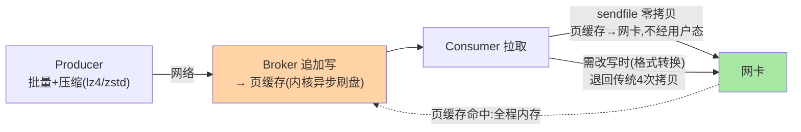
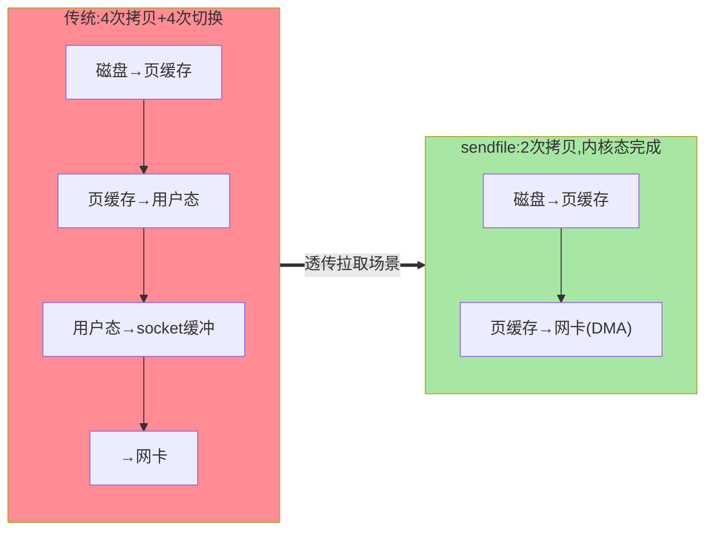

# 页缓存、零拷贝与压缩：存储高性能的三件套

> 「Kafka 为什么快」的答案在入门层给过直觉（顺序写）——本篇把剩下三件拆透：**页缓存**（读写都先走内存）、**零拷贝**（消费路径的 sendfile）、**压缩**（批级压缩怎么省网络与磁盘）——三件的协作才是吞吐天花板的来源。

> **本文核心**：三件套各管一段——**页缓存**管「热数据在内存」（读命中页缓存零磁盘 IO、写先入页缓存由内核异步刷盘）、**零拷贝**管「日志文件到网卡的搬运路径」（sendfile 消除 kernel↔user 的两次拷贝与上下文切换）、**压缩**管「批量传输与存储的体积」（Producer 压缩、Broker 透传保留、Consumer 解压）。**机制链**：Producer 批量压缩发送 → Broker 追加写（页缓存）→ Consumer 拉取 → sendfile 直达网卡（页缓存命中时全程零用户态拷贝）。

## 一句话摘要

三件的设计演进取舍：**页缓存信任内核**（Kafka 自己不做缓存层——「不重复造缓存」让同一份页缓存供写路径与读路径复用，代价是依赖 OS 的刷盘策略：断电丢页缓存数据（acks=all + 副本同步兜底数据安全，而非 fsync 兜底）；**零拷贝只服务拉取路径**（sendfile 要求「数据不改写」——消费直传成立；但 Broker 端要改数据的场景（格式转换/事务标记）零拷贝失效退回传统路径——「零拷贝的前提是不碰数据」）；**压缩在批粒度**（压缩单位是 Producer batch——批越大压缩率越高，与延迟的权衡（linger.ms 攒批）互指客户端系列篇 1）。**三件是一套组合拳**：单看任何一件都觉得平常，组合起来支撑百万级分区消息的吞吐。

## 一、边界：入门层讲过什么，本文讲什么

| 内容 | 入门层 | 本文 |
|---|---|---|
| 「顺序写+页缓存所以快」的直觉 | ✅ 讲过 | 不重复 |
| 页缓存与数据安全的取舍 | 未讲 | **本文核心一** |
| 零拷贝的路径与失效条件 | 未讲 | **本文核心二** |
| 压缩算法选择与批粒度 | 提了一句 | **本文核心三** |

## 二、三件套的协作全景

**架构分层认知**：页缓存是「存储层与 OS 的协作」（上下游模块边界在内核态）、零拷贝是「读路径的快通道」、压缩是「传输与存储的体积经济学」——三件作用在不同层，替换任何一件（比如自建缓存层）整个架构的均衡就破。

传统路径 vs 零拷贝的拷贝次数对比：

## 三、页缓存：数据安全的取舍账

Kafka 不 fsync 每条消息（默认 log.flush.interval.messages 为 Long.MAX——刷盘交给内核）——**性能取舍**：fsync 每条 = 吞吐崩塌；不 fsync = 断电丢页缓存。**数据安全的兜底转移**：从「单机刷盘」转移到「多副本同步」（acks=all + min.insync.replicas≥2：消息在多台机器的页缓存里各有一份，单机断电不丢——多副本的冗余替代 fsync 的持久化）。这是与 MySQL（redo log 每事务 fsync，互指 MySQL 日志系列篇 1 的双 1）的路线分歧：**数据库单条价值高走同步刷盘、消息队列批量流走副本冗余**——两种数据形态对应两种持久化架构。

## 四、零拷贝：快通道与失效条件

传统读路径四次拷贝（磁盘→页缓存→用户态→socket 缓冲→网卡）+ 四次上下文切换；**sendfile 两次**（磁盘→页缓存→网卡 DMA，内核态完成）——大消息高吞吐场景 CPU 占用与延迟的质变。**失效条件**（数据必须过用户态改写）：Broker 真正的消息格式转换（老版本客户端升级期）、**事务消息的 control marker 追加**不影响（marker 独立记录）、consumer 侧 max.bytes 裁剪需改写时——「零拷贝要求字节流透传」是硬约束。**源码口径**（4.x）：`FileRecords.writeTo()` 内部按条件走 `transferTo`（sendfile 封装）或用户态回退路径。

## 五、压缩：批粒度的经济学

| 算法 | 压缩比 | CPU | 适用 |
|---|---|---|---|
| gzip | 高 | 高 | 带宽极贵、CPU 富余 |
| snappy | 中 | 低 | 均衡默认的历史选择 |
| lz4 | 中 | **最低** | 吞吐优先（当前主流） |
| zstd | 高 | 中低 | **新默认候选**（3.x+ 推荐） |

压缩单位是 **Producer 的 batch**（攒批→整批压缩→一条压缩消息发送）——**批大小与压缩率正相关**（linger.ms 越大批越大压缩率越高，但延迟上升）——压缩参数不是孤立选择，与客户端攒批参数（互指客户端系列）联动配置。Broker 保留压缩态存储（不解压）——**端到端压缩**（Producer 压一次、Broker 不动、Consumer 解一次）。Broker 侧的 destination 压缩（broker 端 recompress，配置不匹配时）是浪费路径——保持 Producer/Broker 配置一致是纪律。

## 六、典型场景

- **消费 CPU 高排查**：sendfile 失效（客户端老版本/需改写路径）退回用户态拷贝——升级客户端版本对齐、确认拉取路径无转换
- **磁盘 IO 高排查**：消费超过页缓存容量（冷读穿透磁盘）——热数据集 > 页缓存大小的场景要评估内存配置或接受磁盘读（顺序读依然可观）
- **带宽成本优化**：lz4→zstd 的演进（压缩比提升 30%+ 量级的公开基准方向、CPU 开销可接受）——大批量传输场景的降本项

## 业内惯例

- **不调 log.flush 参数**（默认交给内核 + 副本兜底）——手工 fsync 配置是历史遗留误区，改了反而伤吞吐
- **compression.type=zstd（新集群）/lz4（存量）**：算法演进方向 zstd（3.x+ 的官方推荐路线），存量按灰度切换
- **页缓存容量规划**：热数据集（最近消费窗口的数据量）为基准，不是总磁盘量——消费滞后大时页缓存命中率是容量告警信号
- **3.x/4.x 视角**：三件套机制自 0.x 稳定；zstd 是 2.1+ 的演进增量；tiered storage（4.x）后「页缓存只管热层」——三件套的适用边界在分层化

## 七、常见误区

- **「Kafka 快因为顺序写」只对了一半**：顺序写是必要条件，页缓存命中率（读）与零拷贝（传输）同样是充分件——冷读场景 Kafka 的读性能会向磁盘顺序读回归
- **「零拷贝 everywhere」**：只服务透传拉取；一切需要 Broker 改写消息的演进（格式升级、裁剪）都退回慢路径——性能基线要按最差路径评估
- **压缩配在 Broker**：Broker 压缩是「解压再压」的浪费路径（除非 destination 不匹配）——压缩的正确位置是 Producer
- **拿 MySQL 的 fsync 直觉要求 Kafka**：两种数据形态两种持久化哲学（副本冗余 vs 同步刷盘）——用数据库的 RPO 直觉审消息队列会得出错误结论

## 八、与相邻机制的关系

- 本系列篇 1：段结构是三件套的载体（零拷贝的对象就是段文件）
- 《深入理解客户端原理系列》篇 1：攒批参数与压缩的联动在那篇
- tips 互指：MySQL redo 的 fsync 路线对照（日志系列）；RocketMQ 的存储对照（其特性层）

## 你们可能会问

**Q1：页缓存和 Kafka 自己的缓存是什么关系？**
Kafka 没有自建缓存层（曾有消息缓存演进史，最终架构收敛到「信任页缓存」）——一层缓存两层用（写缓冲+读缓存），避免双缓存的一致性与内存翻倍——「不重复造轮子」的存储架构演进结论。

**Q2：acks=all 就不丢了吗（页缓存角度）？**
多副本各持一份页缓存——同时多机断电才丢（概率极低的故障域叠加）；要再压一层可用 unclean 配置禁止 + min.insync.replicas——**丢失概率的工程化压缩**而非绝对零（与 Redis AOF everysec 的择车哲学同源，互指 Redis 持久化篇）。

**Q3：压缩批与消费幂等的关系？**
压缩是传输与存储优化，不影响消息语义（解压后逐条投递）——幂等与事务在协议层（互指事务与流处理系列），与压缩正交。

## 九、自测三问

1. 页缓存的数据安全取舍（副本替代 fsync）的逻辑？
2. 零拷贝的路径与三个失效条件？
3. 压缩为什么在批粒度？与攒批参数怎么联动？

## 开放问题

- 分层存储时代「页缓存只管热层」的容量模型重建——冷热分层后页缓存命中率的目标值与监控口径需重新定义。
- 硬件压缩卸载（网卡/存储引擎的压缩 offload）若成熟，「CPU 换带宽」的压缩经济学被重写。

## 📎 核心带走

- **核心一句话**：存储高性能 = 页缓存（读写复用内核缓存）+ 零拷贝（透传拉取的快通道）+ 批级压缩（端到端体积经济学）——三件各管一段、组合成吞吐天花板
- **机制链**：Producer 攒批压缩 → Broker 追加页缓存（内核刷盘+副本兜底安全）→ Consumer 拉取 sendfile 直达网卡
- **失效点/边界**：零拷贝要求透传；fsync 手工配置是误区；页缓存按热数据集规划

## 💡 实战提示

- 💡 页缓存命中率与热数据集监控进容量大盘——消费滞后引发的冷读是性能滑坡前兆
- 💡 压缩算法演进路径 lz4→zstd 按公开基准灰度验证再切
- 💡 决策口径：数据安全靠副本配置（acks/min.insync），不靠 flush 参数——review 见到 flush 调优一律质疑

## 📌 数据与事实声明

- 写于 2026-09-10，机制以 Kafka 4.x 主线为准（zstd 自 2.1+、sendfile 路径跨版本稳定）；压缩比对比为公开基准的量级方向
- 免责：算法选择按业务实测

## 📚 参考资料

| 类型 | 标题 | 来源 |
|---|---|---|
| 官方源码 | apache/kafka（FileRecords/transferTo 路径） | github.com/apache/kafka |
| 官方文档 | Kafka Producer Configurations（compression.type） | kafka.apache.org |
| 原理书 | 《深入理解 Kafka》朱忠华（高性能章） | 公开出版 |
